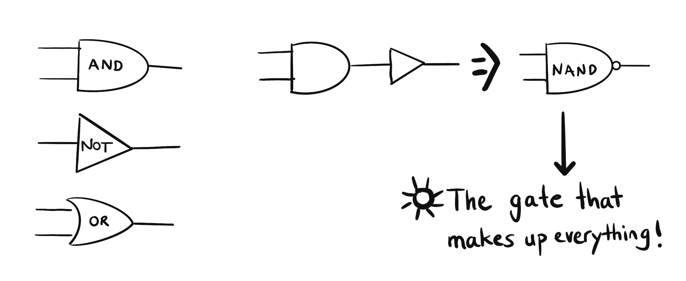

**Binary and bit**

When I started to get interested in programming, I realized that I didn't know much about how computers work. I could use a computer efficiently, but I had no idea how it did all the things it did.

Along the way, I realized that computer science is a world of abstractions. And by this I mean if you know how to write code in a high-level language, most of the time you don't need to worry about how the computer does things - and this is the beauty of abstraction. If it is done well, you don't need to worry about anything other than the thing you are supposed to worry about.

I keep learning programming, and there is so much to learn. My curiosity about how computers work never diminished. So I decided to learn- bit by bit, as much as I could understand.

So let's start with bits.

Think of a basic light switch. It is either on or off, right? If there is electricity in the wires, you can say it is on, if there is no electricity in the wires, it is off. This is like this regardless of the result - indeed, there might be no lightbulb connected to the wire, but it will still be on and off. This two version of states (on/off, yes/no) is called **binary.** Binary can be shown with numbers as well, like 0 and 1.

A computer is composed of tiny wires (a lot of them in fact!), and there is either electricity passing through them or not. This single, tiny on or off data is called a **bit.** Modern computers mostly work with sets of 8 bits, which is also referred to as a **byte.** And computers in the most basic sense, work with A LOT of these wires connected in ways that make sense.

**What the heck is a NAND Gate?**

In order to understand what a NAND gate is, we need to understand the gate concept first.

You can think of **a gate** as a switch that takes 2 bits of data (let's call them inputs from now on) and spits out one bit of data, depending on the received inputs. The word "gate" which we use in our daily lives is something that allows vehicles/people to pass from one place to another when it's open or block the passage if it's closed. Gates in computers don't exactly work that way. Each gate has its own connection to electricity and it takes 2 electrical inputs, but rather than letting one of the inputs pass or not, they 'decide' to produce electricity as an output or not, depending on their logic.

Now imagine you enter a room. There is a light that is off, but when you look at the switch, something feels wrong. You stare for several seconds, and you realize that the switch is not only 2 parts, but also both of them are on the "on" position. So in normal circumstances, the lightbulb should be shining bright, but it is not. This puzzles you, so you get close to the switch and start playing with it. Now you observe - and this is weird - but the light is only off when both of the switches are in on position, otherwise the light is always on. What the hell is wrong with this room?

Welcome to the NAND gate. NAND gate specifically creates an output of 0 only if both of its inputs are 1. Otherwise, it creates an output of 1.

**Some Other Gates**

Why did we start with the NAND gate?

Well apparently NAND gate is easy and cheap to make, and it is "functionally complete". This means any other logic can be implemented by combining a bunch of NAND gates.

For example, let's tie the two inputs of a NAND gate together. Whatever the inputs are, they will always be the same. Remember the NAND light switch? Now either both of the switches are on, and therefore the lightbulb will be off. Or, both of the switches are off, and the lightbulb will be on. So whatever the inputs are, the output is exactly the opposite. We just created a **NOT gate**!

For another example, let's turn back to our imaginary room. As we turn off the first lightbulb (NAND switch!) we walk frustrated to the other side of the room, and there we find another light switch which also has 2 parts. We don't see which lightbulb it's connected to, as no lightbulbs are on. (Thank god this room has a window so we can see around!) But the switch is weird again, one part of it is on, and the other part of it is off. So we start playing with it, we realize the lightbulb it's connected to is only on when both of the parts are on, otherwise it is always off. Now, this pisses you off. The other switch was exactly the opposite of this! Who the hell made this room? You really need to have a talk with your landlord.

But here we are, and welcome to the **AND gate**! An AND gate specifically creates an output of 1 only if both of its inputs are 1. Otherwise, it creates an output of 0. Basically what you do is, take a simple NAND gate and add a NOT gate to its tail.

I have written about NAND gate, NOT gate and AND gate, but there are many more gates inside of our computers. (OR gate, XOR gate, NOR gate, and many more, and all can be built from NAND gates!) As they implement logic, and a computer is a logical creature, we call these building blocks **logic gates.**

**Resources**

1. Wikipedia- [NAND Gate](https://en.wikipedia.org/wiki/NAND_gate), [NOT Gate](<https://en.wikipedia.org/wiki/Inverter_(logic_gate)>), [AND Gate](https://en.wikipedia.org/wiki/AND_gate)
2. ["From Nand to Tetris" Part1 & Part2](https://www.nand2tetris.org/) by Hebrew University of Jerusalem
3. [The Elements of Computing Systems: Building a Modern Computer from First Principles](https://www.goodreads.com/book/show/910789.The_Elements_of_Computing_Systems) by Noam Nisan, Shimon Schocken
4. ["Computer Science" channel](https://www.youtube.com/c/KevinDrumm/videos) by Kevin Drumm
5. [But How Do It Know](http://www.buthowdoitknow.com/index.html) by J. Clark Scott
