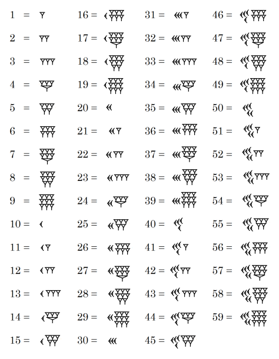
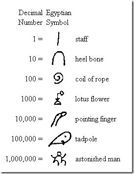
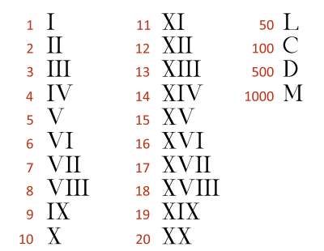
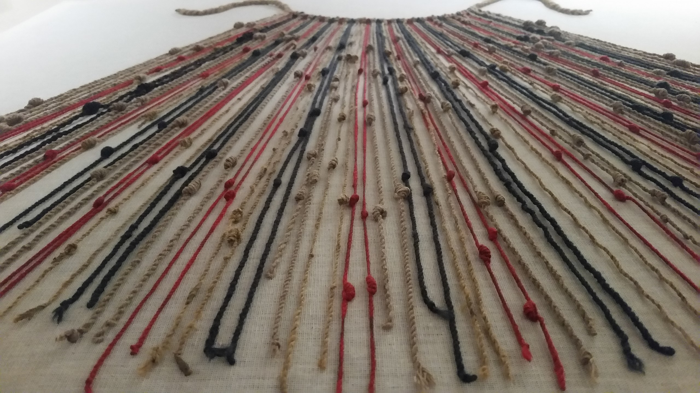
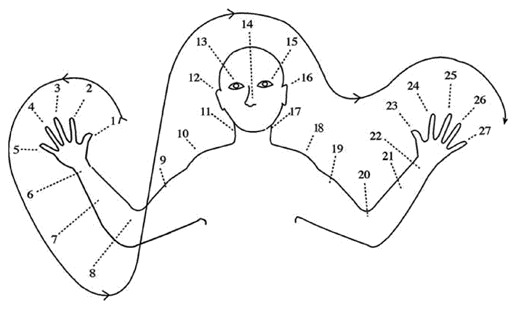

#### Tally Marks

Counting stuff is as ancient as we are. Around 30,000 years ago, even without a written language, our ancestors were counting stuff by bending their fingers, or pointing out to stones, or making marks with sharp stuff on bones which we now call the **[tally marks](https://en.wikipedia.org/wiki/Tally_marks)** (also called hash marks.) Clusters of five strokes made it more legible, and different groups of people all around the world invented the tally system in slightly different ways, but always with the same logic- clustering 5 strokes in an order.

The **[written language](http://www.pbs.org/opb/historydetectives/feature/the-written-word/)** came later than the spoken language, when humans began to build more permanent social groups and start to grow their own food. I guess at some point somebody thought writing numbers with tally marks took very, very long when the numbers get bigger, and it was cumbersome for the person who was reading it as well. So at some point, humans decided to use symbols to indicate certain numbers, and these symbols are called **[the numerals.](https://en.wikipedia.org/wiki/Numeral_system)**

Some experiments and observations show that animals also seem to have a good number sense. For example in the insect world, mother wasp lays her eggs in individual cells and provides every cell with a certain amount of caterpillars for her hatchlings. Some subspecies of wasps provide 5 for each, another one provides 12, and another one does 24, but they always provide the same number of caterpillars for each egg. Another subspecies (the solitary wasp in the [genus Eumenes](<https://en.wikipedia.org/wiki/Eumenes_(wasp)>) provides five caterpillars if the hatchling is going to be a male, and ten caterpillars for a female (unequal for a good reason: males tend to be smaller than females). Humans share this innate sense of numbers with other animals. Human children under 18 months are sensitive to small changes in small quantities (values up to 3 or 4). If you are interested in how the numerical sense develops in human children I suggest you read **[this](http://alumni.media.mit.edu/~stefanm/society/som_final.html)** article.

Various number systems were invented throughout human history, but 4 main ones were used by the biggest ancient human civilizations: the Babylonian numerals, the Egyptian numerals, the Roman numerals, and the Mayan numerals.

#### Ancient Babylonian numerals

The Babylonian numeral system is the first known [positional numeral system](https://en.wikipedia.org/wiki/Positional_notation), which means a value of a digit depends on the position of the digit.

This is what the ancient Babylonian numeral system looked like:

The ancient [Babylonian counting system](https://en.wikipedia.org/wiki/Babylonian_cuneiform_numerals) (appeared around 2000 BC) was base-60. Today we use a base-10 system. This means that with each digit to the left, the number's place value is increased 10 fold. So when we ask for 7532 carrots in base-10, it actually means 7 \* 1000 + 5 \* 100 + 3 \* 10 + 2 \* 1 carrots. The same number in the Babylonian system would be 2 5 32 (2 \* 3600 + 5 \* 60 + 32 \* 1). 7532 in base-10 is equal to 2 5 32 in base-60.

Ancient Babylonians affected the world in many ways. Did you ever wonder why there are 60 seconds in a minute, 60 minutes in an hour, and 24 hours in a day? Or why there are 360 degrees in a full circle? These are all echoes of this base-60 numeral system that ancient Babylonians used.

#### Ancient Egyptian numerals

The [ancient Egyptian counting system](https://en.wikipedia.org/wiki/Egyptian_numerals) (appeared around 3000 BC) used objects from everyday life to symbolize numbers and used base-10. A rod meant 1, a cattle hobble was 10, a coiled rope was 100, a lotus flower was 1000. They didn't have the concept of positional notation.

This is what the ancient Egyptian numeral system looked like:

Ancient Egyptians also had a symbol for zero, but as their system is not positional, it was mainly used to indicate the base level of the structures they were building (like pyramids!).

#### Ancient Roman numerals

[Ancient Romans](https://en.wikipedia.org/wiki/Ancient_Rome) invented [their own numerals](https://en.wikipedia.org/wiki/Roman_numerals). These numerals were widely used in Europe until the more efficient Arabic numerals took their place. Romans used selected letters from the Latin alphabet to indicate certain numbers. For example "I" was one, "V" was 5, "X" was 10, "L" was 50, "C" was a hundred, "D" was five hundred and "M" was one thousand. Every other number was constructed from these 7 numerals. They also invented a method, when you write multiple symbols, you take the biggest symbol, and if there is a symbol on their left, you subtract them (like IV, which is 4), if there is a symbol on their right side you add them (like VII, which is 7). So Roman numerals didn't have positional notation, this numeral system also lacked zero, but had a verbal equivalent, which was "nulla" (meant none).

This is what the ancient Roman numeral system looked like:

###### Image Credit: https://www.unrv.com/culture/roman-numerals.php

To give some examples, the number 37 in base-10 is represented as XXXVII (XXX + VII) in Roman numerals. The number 247 is represented with CCXLVII (CC + XL + VII).

We still see Roman numerals around, in the clock face of [Big Ben](https://en.wikipedia.org/wiki/Big_Ben), or at the backside of the coins as the regnal numbers of kings and queens, or in movie sequels.

### Civilizations of Central and South America

Central and South America (which is now Mexico, Belize, Guatemala, Honduras, El Salvador, Nicaragua, and Costa Rica, Ecuador, Chile) was home to 3 major ancient civilizations: The [Mayans](https://en.wikipedia.org/wiki/Maya_civilization), the [Aztecs](https://en.wikipedia.org/wiki/Aztecs) and the [Incas](https://en.wikipedia.org/wiki/Inca_Empire).

The Mayans were not a unified society but a combination of twenty culturally similar, independent states. They had a writing system, which enabled them to build a highly developed society, built beautiful cities and temples using stones and metals, observed the skies and made themselves a calendar, was occupied with mathematics, astronomy, art, architecture, and had a political, military and religious order. Unfortunately, one of the materials they used for their writings was tree barks, and much of it was destroyed by the tropical climate. Most of the other cultural remnants were destroyed in the 1500s by the Spanish conquerors. (In fact, all three ancient civilizations of America shared the same fate. They suffered from the attacks of Spanish conquerors and were devastated by the spread of smallpox.)

#### Ancient Mayan numerals

The Mayan number system dates back to the 4th century, and it had a base of 20. The theory is that as Mayans lived in a hotter climate, and for this reason, shoes were worn rarely, and the total number of fingers and toes around all the time was mostly 20. Mayans used two symbols to write their numbers: a dot (.) represented the single units (one through four) and a dash (-) represented five. These symbols when used together to write the numbers resemble an abacus, so it is speculated that Mayans might have used an abacus. [An abacus](https://en.wikipedia.org/wiki/Abacus) is a counting frame that consists of rows and movable beads connected to those rows. Its origin is unknown, as it was used in slightly different designs throughout the world. Nowadays it is used as a tool to teach children mathematics.

The Mayan's were also the first to symbolize the concept of nothing (or zero). The most commonly used symbol for zero was a shell.

###### This is how Mayans showed small numbers.

###### Image Credit: http://www.math.wichita.edu/history/topics/num-sys.html#mayan

The Mayans wrote their numbers vertically, with the lowest denomination at the bottom. The numbers also hold positional value, meaning the number at the bottom was multiplied with 20⁰, the second row from the bottom was multiplied with 20¹ (20), third with 20² (400), fourth with 20³ (8,000), fifth with 20⁴ (160,000).

Mayans used a base-18 system when making their calendar. They must have figured out that the Earth was spinning around one time around the sun in 365 days because they made their calendar exactly 365 days long. Each month had 20 days and there were 18 months in a year (20 \* 18 = 360), and the 19th month of the year was just 5 days long (360 + 5 = 365), and those 5 days were believed to be filled with bad luck, misfortune, and danger. We still use a manipulated version of the 365-day calendar Mayans invented.

#### Ancient Inca Counting System: Quipu

Incans were a highly advanced civilization that built huge cities, developed road systems, did trading, created jewelry from gold, became skillful potters, wowen beautiful fabrics, and treated their citizens fairly. What makes it even more impressive is that they did all of this without a written language.

How did they track important information? They did this using a tool made of knotted strings called a **[quipu](https://en.wikipedia.org/wiki/Quipu)**. The men in charge of maintaining the quipu were known as the "keeper of the quipu." The fate of oral traditions and cultures are all the same, some of it is forgotten and only can be speculated. It is speculated that a quipu was used to keep records of the number of things. Another mystery about the quipu is, we can only guess the base they used. It seems like the Incans used a base-10 system.

Quipu was made by thinner strings that were looped around a larger cord. Now, Quipu meant "knot" in the ancient Inca language, and that is a very appropriate name for this tool because the numbers were indicated by knots of colored threads that were tied around the thinner strings. Where the knots were placed mattered, because that's how the value was indicated. The knots that were closer to the larger cord indicated bigger values. The way the knots were tied, or the varying colors of the strings might have meanings but as they didn't have a written language, we're unable to understand it.

###### This is what an Inca quipu looked like.

###### Image Credit: By Pi3.124 - Own work, CC BY-SA 4.0, https://commons.wikimedia.org/w/index.php?curid=69539294

#### Papua New Guinea- Oksapmin Counting System

Another society in the Oksapmin area of Papua New Guinea created a counting system (and [a language](https://en.wikipedia.org/wiki/Oksapmin_language)!) where numerical representations were mapped on body parts. Their numerical system initially didn't include arithmetic functions, but after they began trading they also incorporated an arithmetic system into their counting system.

###### Image Credit: https://www.researchgate.net/publication/274496244_Approaches_to_Reduction_in_Treatments_of_Culture-Cognition_Relations_Affordances_and_Limitations

Here is a video of a woman displaying the Oksapmin counting system:

### Numbers in computer science

When we first learned to count as humanity, we used fingers for counting, and each finger represented a single unit. We named this system "unary". (un- comes from Latin and indicates one.)

A computer stores data in "binary", a system in which there are only two digits, 0 and 1 (and what a surprise, "bi" means two in Latin). Binary is also known as the "base-2" number system. These binary digits are known as 'bits'(**bi**nary digi**ts**).

At some point in human history, we created numerals between 0 and 9, and began to use a base-10 system (which is also called "the decimal system", also known as the "denary"). This number system is quite intuitive as we have 10 fingers ourselves. Both decimal and binary systems are positional number systems, meaning every digit has a positional value.

Now, imagine a bizarre animal with eight fingers on each hand, with preferably two hands in total. (Now I'm really curious about what you've imagined. But let's keep on keeping on.) This animal is also smart, and it wants to count the bizarre alien fruit it's going to eat because it's probably counting calories. So it looks at its 16 fingers and says "hey, I'm going to utilize these fingers when I'm counting stuff from now on". Our bizarre animal is now counting in hexadecimal, which is also known as base-16 (oh, Latin again. Hexa is 6 and deca is 10, so it's 10+6 system). The hexadecimal system uses our normal 10 digits (0 to 9) and also the first 6 letters of the English alphabet (A to F). The hexadecimal system is also a positional number system.

**Conversion Example:**

Let's convert 986 in base-10 to base-16 and base-2 together.

When we are calculating 986 in base 10, we actually do this pretty much subconsciously:
(9 \* 100) + (8 \* 10) + (6 \* 1)

When you change the positional values to the power of 2's instead of 10's, your place values become ...2¹⁰(1024), 2⁹(512), 2⁸(256), 2⁷(128), 2⁶(64), 2⁵(32), 2⁴(16), 2³(8), 2²(4), 2¹(2), 2⁰(1) You start converting with the biggest possible place value you can use and work downstream from there.

So 986 in base-10 becomes this in base-2: (1 \* 512) + (1 \* 256) + (1 \* 128) + (1 \* 64) + (0 \* 32) + (1 \* 16) + (1 \* 8) + (0 \* 4) + (1 \* 2) + (0 \* 1), which is **1111011010**.

It is the same with hexadecimal, just the place values change (..., 16³(4096), 16²(256), 16¹(16), 16⁰(1)).

So 986 in base-10 becomes this in base-16: (3 _ 256) + (13(D) \* 16) + (10(A) _ 1), which is **3DA**.

#### Resources:

1. [Numerical Mechanisms and Children’s Concept of Numbers](http://alumni.media.mit.edu/~stefanm/society/som_final_natalia_aggelos_stefan.pdf)- Natalia Marmasse, Aggelos Bletsas, Stefan Marti
2. Geary, D.C. (1994). Children’ s Mathematical Development: Research and Practical Applications. Washington, DC: American Psychological Association.
3. Ifrah, Georges. From One to Zero: A Universal History of Numbers. New York: Viking Penguin, Inc., 1985.
4. Ortenzi, E. C. (1964). Numbers in ancient times. Portland, ME: J. Weston Walch.
5. Wikipedia- [Abacus](https://en.wikipedia.org/wiki/Abacus), [Quipu](https://en.wikipedia.org/wiki/Quipu), [Tally marks](https://en.wikipedia.org/wiki/Tally_marks), [Numeral system](https://en.wikipedia.org/wiki/Numeral_system), [Positional notation](https://en.wikipedia.org/wiki/Positional_notation), [Babylonian counting system](https://en.wikipedia.org/wiki/Babylonian_cuneiform_numerals), [Egyptian counting system](https://en.wikipedia.org/wiki/Egyptian_numerals), [Roman numerals](https://en.wikipedia.org/wiki/Roman_numerals), [Maya Civilization](https://en.wikipedia.org/wiki/Maya_civilization), [Aztecs](https://en.wikipedia.org/wiki/Aztecs), [Inca Empire](https://en.wikipedia.org/wiki/Inca_Empire)
6. [But How Do It Know](http://www.buthowdoitknow.com/index.html) by J. Clark Scott
7. math.wichita.edu- [history](http://www.math.wichita.edu/history/topic-tree.html)
8. [Cultural Development of Mathematical Ideas: Papua New Guinea Studies](https://culturecognition.com/) by Geoffrey Saxe
