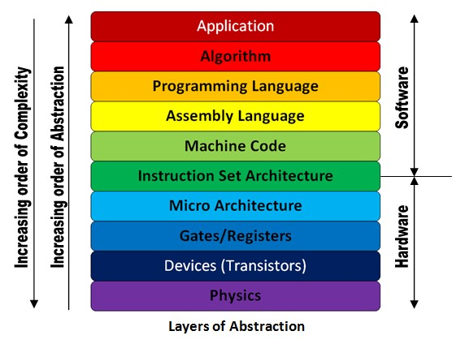

I began to think every article here will start with these sentences: Everything inside computers is made of bits, and bits can only be 0's and 1's. So this means everything inside computers is 0's and 1's.

Many of the tasks humans do daily require a functionality called **[working memory](https://en.wikipedia.org/wiki/Working_memory)** (aka "short-term memory" or "immediate memory"). Working memory is the involuntary act of keeping information about a small amount of recently happened things or recent information very close, just in case you need them. Think of it like this: You might be watercoloring, and the closest stuff next to you will be your brushes, your paint, your canvas, a cup of water. The other stuff you need to do welding, gardening, or programming would not be in your close vicinity. This is the logical thing to do if you don't want to spill a cup of water on your laptop, and your brain keeps recent stuff closer to you without you noticing it. The stuff you keep in working memory is more available than things you keep in your long-term memory, therefore can be reached faster.

Working memory became a point of interest after an article published in 1956 by George A. Miller: [The magical number seven plus or minus two: Some limits on our capacity for processing information.](https://pdfs.semanticscholar.org/4023/ae0ba18eed43a97e8b8c9c8fcc9a671b7aa3.pdf) This article suggested that our capacity for working memory is limited to only 7 units, plus or minus two (as the name of the article suggests anyway). But to make our life simple, let's go with 7 for the rest of this article.

Why did I mention working memory? Because dear human, everything inside the computer is bits. A computer can only understand bits. And you can only keep a very tiny amount of them in your working memory. A single letter, in the best-case scenario, is encoded with 8 bits, which means eight 0's and 1's. Guess what? You have already exceeded your working memory limits by keeping a single letter in your working memory. Try keeping a random phone number in your memory. It's hard to do it and to commit it to long term memory, you need to repeat it for some time.

Don't you worry, I have some better news. The article said 7 "units", but that doesn't mean these units have to be numerals. They can be words or even longer phrases that make sense to you. The same article offered the concept of "chunks", and a "chunk" was defined as a unit of information that consists of whatever that makes sense to a specific human. So now, if you try to keep "red, flag, butterfly, circle, ship, cornbread, get this party started" in your mind, and repeat them 5 minutes later, you'll most probably be able to. By using chunks, you have kept 58 bytes of information in your working memory, congrats!

So what this means is, the human mind needs something verbal, something that makes sense to it, to make the most of its working memory. Then maybe we can translate the human language into the computer language.

Now, let's add the terminology to the story we just wrote. The computer language is called ["the machine code"](https://en.wikipedia.org/wiki/Machine_code), the act of translating human language to the machine code is called ["compilation"](https://en.wikipedia.org/wiki/Compilation), the code that does compilation is called ["a compiler"](https://en.wikipedia.org/wiki/Compiler). The human-compatible language is called ["a programming language"](https://en.wikipedia.org/wiki/Programming_language). The programming language is ["an abstraction"](<https://en.wikipedia.org/wiki/Abstraction_(computer_science)>) on top of the machine code. The machine code itself can make a computer work on its own, but a code in a programming language has to be converted to machine code for it to work. This means for the programming language to do what it's supposed to do, the compiler has to do its job perfectly. So an abstracted technology depends on all the technologies below it.

How a tool does something is called ["implementation"](https://en.wikipedia.org/wiki/Implementation). For example, how a compiler compiles a piece of code can be called implementation. A person who is writing a piece of code in a programming language doesn't have to worry about how the compiler will compile it. A programmer can only concentrate on the task that they are supposed to do.

All these abstraction layers are modules that are independent of each other. Good [modular design](https://en.wikipedia.org/wiki/Modular_design) makes it possible to work on individual modules independently, without worrying about the rest of the system. This is a great thing, you can 'separate concerns', once something is implemented, you don't need to worry about how. You only worry about how to use it. This lets you build a complex system with simple layers, only worrying about one thing at a time.

Now, let's see all of the layers on top of each other:

**1. Application:** (e.g. Photoshop) The software that you use. For example, when you're using photoshop, you don't care how the crop button works. The only thing you worry about is how to crop your picture.

**2. Programming Language:** (e.g. JavaScript, Java, C) The language that is highly abstracted and is easier for humans to use.

**3. Assembly language:** This is the language hardware understands, but still human readable.

**4. Machine Language:** Binary code, all the stuff that's translated into 0's and 1's.

**5. Hardware Architecture:** Pieces that are put together in logical ways to make a machine understand the machine language.

**6. Logic gates:** Circuits that takes binary inputs and spits out binary outputs according to the received inputs.

**7. Transistors:** Logic gates are built out of transistors. You can think of a transistor as a remote-controlled switch.

**8. Quantum Physics:** Transistors are built upon quantum physics, the behavior of subatomic particles are what make transistors do what they do.

This is a schematic version of the layers:

###### Image courtesy: http://theembeddedguy.com/2016/05/15/layers-of-abstraction/

I am making a tiny but important note here. Although the idea of "working memory is limited" is still accepted as a concept, the limit of it is still argued by scientists. In 2001, Nelson Cowan published [an article](https://www.researchgate.net/publication/11830840_The_Magical_Number_4_in_Short-Term_Memory_A_Reconsideration_of_Mental_Storage_Capacity) suggesting the limit was narrower than 7 and he found out another magical number: 4. [Another article](https://www.semanticscholar.org/paper/Chunks-in-expert-memory%3A-Evidence-for-the-magical-%E2%80%A6-Gobet-Clarkson/7a1afc70878db47c13cd76dbf2aa3bb6f3b96b9c) published in 2004 by F. Gobet et al. suggested that it was limited to 2. A common clinical test to measure cognitive impairment and dementia screening that's called the [Mini–Mental State Examination (MMSE)](https://en.wikipedia.org/wiki/Mini%E2%80%93Mental_State_Examination) measures the impairment of working memory by using 3 as the limit. If you are interested in how MMSE is done, you can check these 2 resources which show the [questions that are asked](http://www.fammed.usouthal.edu/Guides&JobAids/Geriatric/MMSE.pdf) and [how they are interpreted](https://www.ncbi.nlm.nih.gov/projects/gap/cgi-bin/GetPdf.cgi?id=phd001525.1#:~:text=The%20Mini%2DMental%20State%20Exam,1.).

Another tiny but important note, compilers are very intricate and complicated programs that can do many things. Their main purpose is to translate a high-level language to low-level machine code in an optimized way, but they do so much more. They read and analyze the entire program and detect errors, produce clear and meaningful diagnostics for the programmer. They are great tools that enable us to write code efficiently.

#### Resources:

1. Wikipedia - [Working Memory](https://en.wikipedia.org/wiki/Working_memory), [Machine Code](https://en.wikipedia.org/wiki/Machine_code), [Compilation](https://en.wikipedia.org/wiki/Compilation), [Compiler](https://en.wikipedia.org/wiki/Compiler), [Programming language](https://en.wikipedia.org/wiki/Programming_language), [Abstraction](<https://en.wikipedia.org/wiki/Abstraction_(computer_science)>), [Implementation](https://en.wikipedia.org/wiki/Implementation), [Modular design](https://en.wikipedia.org/wiki/Modular_design)
2. ["From Nand to Tetris" Part1 & Part2](https://www.nand2tetris.org/) by Hebrew University of Jerusalem
3. [The Elements of Computing Systems: Building a Modern Computer from First Principles](https://www.goodreads.com/book/show/910789.The_Elements_of_Computing_Systems) by Noam Nisan, Shimon Schocken
4. [The magical number seven plus or minus two: Some limits on our capacity for processing information](https://pdfs.semanticscholar.org/4023/ae0ba18eed43a97e8b8c9c8fcc9a671b7aa3.pdf) by George A. Miller, 1956
5. [The Magical Number 4 in Short-Term Memory: A Reconsideration of Mental Storage Capacity](https://www.researchgate.net/publication/11830840_The_Magical_Number_4_in_Short-Term_Memory_A_Reconsideration_of_Mental_Storage_Capacity) by Nelson Cowan, 2001
6. [Chunks in expert memory: Evidence for the magical number four … or is it two?](https://www.semanticscholar.org/paper/Chunks-in-expert-memory%3A-Evidence-for-the-magical-%E2%80%A6-Gobet-Clarkson/7a1afc70878db47c13cd76dbf2aa3bb6f3b96b9c) by F. Gobet, G. Clarkson, 2004
7. [Neuroscience: Exploring the Brain](https://www.goodreads.com/book/show/52796769-neuroscience) by Mark F. Bear, Barry W. Connors, Michael A. Paradiso
