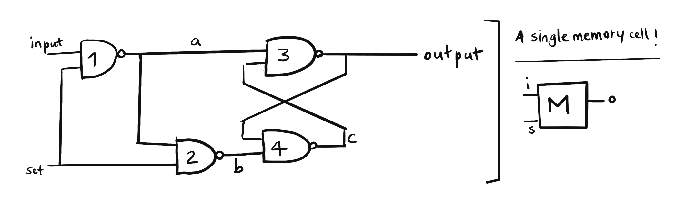

#### What is memory?

Let's start with a simple question: What is your name?

I'm pretty sure that question instantly popped an answer in your mind. (And if you don't know your name, it's time to see a neurologist.) Your name is one of the first things you've learned (whoa!) as you were born to this world. But what does learning mean?

Learning can be defined as the acquisition of new knowledge (or a new skill), but retaining that information (stored, and retrieved when necessary) is what is called the **[memory](https://en.wikipedia.org/wiki/Memory)**.

You've probably heard some stuff about **[computer memory](https://en.wikipedia.org/wiki/Computer_memory)** before. You can write some text into a file, save it, close your computer, come back, open that file, and what you wrote will still be there. You remembering your name and the computer remembering some text you wrote is a skill that you share.

Magic? Nope.

Let's start with the computer's memory.

#### The smallest unit of computer memory: Memory Cell

Since anything and everything inside a computer is bits, the computer can only remember if a bit was 0 or 1. And retaining those bits are done with special wiring of four [NAND gates](https://en.wikipedia.org/wiki/NAND_gate).

The following diagram holds a single memory cell, by that I mean the gate diagram that holds a single bit:

The memory cell has 2 inputs and a single output. One of the inputs is labeled as "set" (will also be referred to as "s"), which will decide if we are going to set the memory or not.

Remember, the NAND gate specifically creates an output of 0 only if both of its inputs are 1. Otherwise, it creates an output of 1.

There are four possible scenarios for this memory cell (s:1 i:0, s:1 i:1, s:0 i:0, s:0 i:1) and we'll look at them one by one.

We start with this condition: set 1 and input 0. In this case, "a" wire will be 1, and the "b" wire will be 0. Since the "b" wire is 0, the "c" wire will be "1", regardless of the other input, that will make the final output 0.

Secondly, we'll look at this condition: set 1 and input 1. This time "a" wire will be 0, "b" wire will be 1, and as "a" is 0, regardless of the other input, gate 3 will have the output of 1.

Our first deduction from these results is, when set is 1, the output will be the same as the input.

Now, let's continue where we left off and this time turn set off (set 0). The input was 1, and let's keep it 1. As set is 0, both "a" and "b" wires will be 1, regardless of the input. (We kept the input 1 but it doesn't matter. We can open it and close it as we wish, when set is 0 nothing in the circuit depends on the input.) Now as both gates 3 and 4 have their one input as 1, the output only depends on one thing: the previous output. In our case, the previous output was 1, so the "c" wire will be 0, and therefore the output will still be 1. If the input was 0 before we turn off set (make set 0), then the same output would be 0.

In a nutshell, if the set is on (1), the output of this diagram will be whatever input is. If the set is turned off (0), the output will be whatever the input was when set was turned off.

And this is how a computer "remembers" a single bit. Isn't that impressive?

#### Cellular memory

Humans store different kinds of information, such as facts, events, skills, habits, emotional memory, and muscle memory. The human brain encodes data that you use every day in your life, consciously, or subconsciously. But this is not the kind of memory that we are going to talk about in this section. We are going to talk about something called **cellular memory.**

_Cellular memory can be defined as a cell's sustained response to any type of stimulus._

All cells have some sort of a huge manual, with the title: "How to human". This special book is what we call the **[DNA](https://en.wikipedia.org/wiki/DNA).** The book is kept in a special room called **[the nucleus](https://en.wikipedia.org/wiki/Cell_nucleus)** so only some selected few can get in and read the book. And when they need to build something, anything in fact, they go on and check the book on how to do that. The manual never leaves this room, only some copies of some parts do. If something needs to be done, that section of the book is opened, copied on a piece of paper, the book is closed and secured, and only the piece of paper leaves the room. The piece of paper is called a **[messenger RNA](https://en.wikipedia.org/wiki/Messenger_RNA)**, and the process of copying the information is called **[transcription](https://en.wikipedia.org/wiki/Eukaryotic_transcription)**.

This special book defines how to do anything and everything that makes a human. But not all of this book makes sense, actually more than half of it is gibberish. It is useful to confuse intruders that may try to corrupt the book though. Aliens outside might shoot their book-corrupting, DNA-breaking lasers, but as more than half of it is gibberish, the data inside that is so precious to us has a small chance of being corrupted.

Around the special room where we call the nucleus, there is a whole house. Something different is done in each room of this house, and one room is responsible for reading the messenger RNA and building whatever's written on it. This process is called **[translation](<https://en.wikipedia.org/wiki/Translation_(biology)>)**.

Cells sense their environment by the structures on their surface that are called **[receptors](https://en.wikipedia.org/wiki/Cell_surface_receptor)**. There are receptors inside of the cell too. There are many types of receptors, all of them serve one purpose: to understand what the hell is going on outside.

Now, life is what we do and how we react to the stimulus we receive. This is what life is about to our cells as well.

I am going to give two examples of how a given cell remembers something. The first one will be an example of what we can call short-term memory because for some time a stimulus will cause a response, but after a while, that response will diminish if the stimulus is not continued.

The second example is more of a long term memory, in which a repeated stimulus will cause a permanent effect in a cell.

So here is the first example:

1. Human is cutting onions. Onions are very vengeful creatures, and when they are cut, they release a gas called **[propanethial S-oxide](https://en.wikipedia.org/wiki/Syn-Propanethial-S-oxide)**, which reaches the human's eyes, gets mixed with water, and forms sulphuric acid. The human starts crying but must cut the onions because the pan is on the stove and is ready to cook stuff. The human is in a hurry and cuts her hand.

   The human washes her hand and applies moderate pressure on the cut with a clean cloth. Now, let's see what invisible things happen after that.

   First, the bleeding must be stopped. The relevant cells called "platelets" stick around the wound and stop the bleeding. When the bleeding stops, other relevant cells come around to wound and they assess the situation, these are called **the inflammatory cells**. The assessing cells produce tiny little paper planes with different colors, which are called "cytokines". Each color of paper plane goes around to inform a different type of cell. Each cell has a role in the repairing process.

   Until the cut is healed, each cell continues doing the work they do. If their job is to prevent a potential bacterial invasion, they kill every bacteria that is not supposed to be there. If their job is to remove the unwanted material from the tissue, or if they need to divide and replace the cells in that area, they do that. When the wound is healed and there is no threat, the inflammatory cells stop sending paper planes around and leave the area.

   Many books are opened, a lot of things are synthesized, some things are modified and the cut is repaired at the end. Everyone goes back to their daily lives and nothing is permanently changed.

2. Human cuts hand way too often. Psychologically traumatized by the effects of onions in her life, she starts consuming alcohol, occasionally.

   Chronic consumption of ethanol results in the increased production of tiny ninja molecules that are called **[miRNAs (microRNA)](https://en.wikipedia.org/wiki/MicroRNA)**. These miRNAs can go in and out of the special room (the nucleus) without getting too much attention. Each type of miRNA has a special power, they can change the number of copies of something that are sent outside of the room.

   Now, there is another concept that I have to talk about here. Although each cell has the same book, they are slightly different from each other. Each cell lives in a different environment, and they have their own things to do so they use the different chapters of the book more frequently than others, and they ignore chapters unrelated to them. Each chapter is marked with something that either says "will be used more frequently" or "will be used less frequently". These bookmarks are called **[epigenetic markers](https://en.wikipedia.org/wiki/Epigenetics)**, and they can be changed by external factors such as the human's diet, stress, and nutrition, also they can affect the bookmarks that will be passed on the next generations. Unfortunately, you are what you eat, and what your mother ate.

   Check out this impressive [image](https://www.nature.com/articles/pr2007128/figures/1) of _genetically identical_ mice with epigenetic change on a single gene. Isn't that impressive? That's how important epigenetic changes are.

   Back to our onion-hating, alcoholic human. Although she is not aware of it much, the gene expression in her liver is changing as she consumes more and more alcohol. The levels of certain miRNAs are increasing, and these ninjas go into the special room without being noticed and play with the bookmarks. The miRNAs that ethanol induce increase the amount of fat the liver accumulates. And if the human keeps consuming ethanol, it will suffer from cirrhosis and even hepatic cancer.

   And this is one example of how long-term memory works for a single cell.

Long story short, if onions make you sad, don't eat them. You absolutely don't have to. And stop eating sh\*t starting from today. You know better now.

#### Resources:

1. Wikipedia- [Memory](https://en.wikipedia.org/wiki/Memory), [Computer memory](https://en.wikipedia.org/wiki/Computer_memory), [NAND gates](https://en.wikipedia.org/wiki/NAND_gate), [DNA](https://en.wikipedia.org/wiki/DNA), [Cell nucleus](https://en.wikipedia.org/wiki/Cell_nucleus), [messenger RNA](https://en.wikipedia.org/wiki/Messenger_RNA), [transcription](https://en.wikipedia.org/wiki/Eukaryotic_transcription), [translation](<https://en.wikipedia.org/wiki/Translation_(biology)>), [receptors](https://en.wikipedia.org/wiki/Cell_surface_receptor), [epigenetics](https://en.wikipedia.org/wiki/Epigeneticsrg/wiki/Cell_surface_receptor), [propanethial S-oxide](https://en.wikipedia.org/wiki/Syn-Propanethial-S-oxide), [Inflammation](https://en.wikipedia.org/wiki/Inflammation), [microRNA](https://en.wikipedia.org/wiki/MicroRNA)
2. [But How Do It Know](http://www.buthowdoitknow.com/index.html) by J. Clark Scott
3. Martin, P., & Leibovich, S. J. (2005). [Inflammatory cells during wound repair: the good, the bad and the ugly.](https://pubmed.ncbi.nlm.nih.gov/16202600/) Trends in Cell Biology, 15(11), 599–607. doi:10.1016/j.tcb.2005.09.002
4. Dolinoy, D., Das, R., Weidman, J. et al. [Metastable Epialleles, Imprinting, and the Fetal Origins of Adult Diseases.](https://www.nature.com/articles/pr2007128) Pediatr Res 61, 30–37 (2007). https://doi.org/10.1203/pdr.0b013e31804575f7
5. Shah JM, Omar E, Pai DR, Sood S. [Cellular events and biomarkers of wound healing.](https://www.ncbi.nlm.nih.gov/pmc/articles/PMC3495371/) Indian J Plast Surg. 2012;45(2):220-228. doi:10.4103/0970-0358.101282
6. [National Human Genome Research Institute](https://www.genome.gov/About-Genomics/Introduction-to-Genomics)
7. Burrill DR, Silver PA. [Making cellular memories.](https://www.ncbi.nlm.nih.gov/pmc/articles/PMC2882105/) Cell. 2010;140(1):13-18. doi:10.1016/j.cell.2009.12.034
8. Shukla SD, Lim RW. [Epigenetic effects of ethanol on the liver and gastrointestinal system.](https://www.ncbi.nlm.nih.gov/pmc/articles/PMC3860425/) Alcohol Res. 2013;35(1):47-55.
