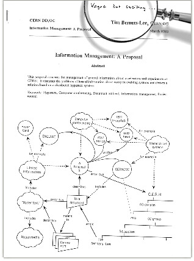

I bet you have a computer, a smartphone, or a tablet that's connected to the internet. How do I know? I know it because that's how you are reading this piece of text that I wrote on my computer. So you and I, we are sharing information somehow. This article will exactly be about this: our connection to each other.

We have to understand some other stuff before we get to the internet and the world wide web though. I must warn you that this is an information-intensive article, so wear your seatbelts. Let's start.

#### Computer Networks

Think of a single computer, that is connected to electricity and nothing else. This is called **a stand-alone computer**. A standalone computer is a computer that is not connected to any other computer. It might have some peripheral devices attached to it (printer, keyboard, mouse, etc.), but it can't communicate with any other computer. It literally stands alone.

When two or more computers are connected, they become a **[computer network](https://en.wikipedia.org/wiki/Computer_network)**. The connection is generally provided by a cable or radio waves. So you and I are part of a network.

The networks differ according to the area they cover. For example in a **[Local Area Network (LAN)](https://en.wikipedia.org/wiki/Local_area_network)** computers are physically close to each other, they are in the same office building, school, or university campus. Only devices that are allowed to use this network can use this network.

In a **[Wide Area Network (WAN)](https://en.wikipedia.org/wiki/Wide_area_network)** computers can be physically away from each other. A WAN covers a wider area, an entire city, a country, or even the whole world. A WAN simply connects LANs. The internet is a worldwide public WAN. Signals in this network can be encrypted, but it is still less secure than a LAN. WANs also require more specialized devices and data has to travel for long distances, so WANs are more expensive to build.

**[Wi-Fi (Wireless Fidelity) network](https://en.wikipedia.org/wiki/Wireless_network)** uses radio waves instead of cables. Wi-Fi Network can also be referred to as **[WLAN](https://en.wikipedia.org/wiki/Wireless_LAN)**, which stands for "Wireless Local Area Network."

The most powerful computers in the networks are **[servers](<https://en.wikipedia.org/wiki/Server_(computing)>)**. A server is a computer that provides data to other computers, it is like a library that is open 24/7.

Now, we should talk about **[Heinrich Hertz](https://en.wikipedia.org/wiki/Heinrich_Hertz)**, a German scientist from the 1800s that studied electricity that was going on and off very quickly, therefore creating electromagnetic waves. Sometime after his death, scientists decided to use his name to describe how fast the electricity was turned on and off in a second. For example, 1 Hz meant there was 1 cycle happening in 1 second (on and off). 500 Hz meant 500 cycles were happening in 1 second. So to make it more simple, we can say Hz is a unit for defining frequency.

So any device that works with electromagnetic waves work with the same principles, your car's stereo, your microwave, walky-talkies you might or might not have, your cellphone, and of course, Wi-Fi. So how do they not interfere with each other? The answer is: different devices use different bandwidths. For example, your car stereo receives frequencies in Kilohertz and Megahertz range, and your Wi-Fi router transmits and receives data in the Gigahertz range (2.4Ghz and 5Ghz). And if any of these remote-controlled devices receive and transmit data in the same bandwidth, they can interfere with each other. For example, the Wi-Fi router uses the same range as a microwave. Microwaves are enclosed with metal so that they keep all the precious electromagnetic waves that are supposed to transfer their energy to your food inside, but if they are old or faulty, they might leak some of the electromagnetic waves. Then those leaking electromagnetic waves might interfere with the Wi-Fi signals, especially if they are positioned close to each other. This is why some people get slower internet when they're making popcorn.

A small note: radio waves are non-ionizing radiation, which means they don't carry a lot of energy and therefore they are harmless to humans.

All WiFi signals (in both directions) go through the same place to reach a wider network, and that place is called the **[Wireless Access Point (WAP)](https://en.wikipedia.org/wiki/Wireless_access_point)**. Wi-Fi signals are broadcast on the air and basically, any device that can pick them up can also read them, if the information is not encrypted.

#### Network Hardware

What does it take for a computer to connect to a network? Think of a desktop computer where you have a port on the back that you can plug your network cable into. Inside this port, there is a special electronic device called the **[Network Interface Card (NIC)](https://en.wikipedia.org/wiki/Network_interface_controller).** NIC is responsible for both transmitting and receiving signals. Every NIC has a unique address that's assigned to them by their manufacturer (it's hardcoded and it cannot be changed), which is called **[MAC address (media access control address)](https://en.wikipedia.org/wiki/MAC_address).** Any electronic device that can connect to a network has to have its own network interface card with a unique address because devices in a network identify each other with this unique MAC address.

Now think of your smartphone. It can connect to a WiFi network without you connecting a cable to it. Your phone also has a special NIC (remember, for a device to have the ability to connect to a network, it has to have a network interface card.). This special NIC uses radio signals to receive and transmit data. The range of a wireless NIC is somewhere around 20-50 meters and as Wi-Fi is radio waves, the range also depends on the obstacles along the way.

#### Ethernet

Ethernet is a system that enables the data exchange between devices that are connected to the same network. Almost every computer network uses ethernet.

Data is broken up and packaged into small pieces by the sending computer, and these little packages are called **frames.** Think of it like this, you bought a huge cupboard from IKEA and was too big to carry assembled and in one piece, so IKEA decided to sell it disassembled. They stuck the parts of the cupboard into smaller packages that can be carried by one or two people. Each package in this case is a frame and it consists of some wooden planks and nails. In data transmission, each frame consists of binary code (bits, 1's and 0's. Voltage on a cable is 1, the absence of voltage on a cable is 0). The network interface card of the sending computer is responsible for generating the rapid pulses of electricity that make up the data in each frame.

There are 2 very important pieces of information that a frame has to contain, one is the source MAC address, and the second one is the destination MAC address. Let's go back to the cupboard analogy. You want that cupboard in your house, right? So you have to give them your unique home address. And if you want to recognize the packages, you have to know where the packages are coming from as well (Well I suppose you can recognize them, but the address sure helps.). And if a package opens on the way and items inside arrive one by one, you might lose them, or even might not know where they come from or what they belong to until you start reassembling the cupboard. So carrying these packages intact is also a must.

When a frame that contains data is being sent, it is being broadcasted in the whole network, so this means everyone can see the frame, but only the intended recipient with the right MAC address chooses not to ignore it. Also, even if they stole the frames, the ethernet frames are encrypted, so they will most probably not be able to read it. Each frame must be transmitted without interruption, so only one computer at a time can transmit a frame on the same cable. If more than one computer attempts to transmit a frame at the same time, it is called **data collision** and the transmission attempt of every frame that was sent in that time period will fail. Each computer that is attempting to send data will wait for a random time (fragments of a second!) until it can try to transmit again.

In a Wi-Fi network, as all data has to flow through a Wireless Access Point, the sender device has to make his intention known by the WAP first. If nothing else is being transmitted at that time, the WAP will give out a signal to the transmitting device saying that it can continue. Every intention goes through the WAP and WAP coordinates and direct frames with an order, avoiding collisions.

How about your neighbors' Wi-Fi? Why does or doesn't it interfere with yours?

Normally each WAP operates within its own radio frequency range. When it sets itself up, it will choose a channel that seems quiet enough at the time, and your wireless devices will tune into this frequency, like listening to a radio station. A modern WAP can choose between 23 possible non-overlapping channels. So if the neighbor's WiFi is operating in a different frequency range, there will be no overlaps so there will be no collisions.

#### Network Protocols

There are also a set of rules that govern the way data is packaged, transmitted, and received. This is called a **[network protocol](https://en.wikipedia.org/wiki/Communication_protocol)**. Only devices that share a common protocol can communicate with each other. If we go back to our cupboard analogy, there are a set of rules that says which parts of the cupboard go to which package and in which order they are put in that package. A couch, a cupboard, a library, a table, each one has another set of rules as it's being disassembled and packaged. They all have their manual and only if you have that manual you can understand how to reassemble the item. There are many different types of network protocols available, but **[TCP/IP (Transmission Control Protocol/Internet Protocol)](https://en.wikipedia.org/wiki/Internet_protocol_suite)** is the most commonly known one because it is the one being used by the internet. This is not a single protocol but a group of protocols.

The computer that is sending the data is responsible for breaking the data into frames. Each frame has a sequence number so that it can be reassembled correctly at the recipient (frames don't always use the same route, they use the best route available at that moment, and they might reach the recipient in a different order than transmission order). The sender computer also has to calculate something called a check sequence and add it as a final sequence of the frame. A check sequence is created by using an algorithm on the data, and the receiving computer also creates a check sequence using the same algorithm and compares two sequences. If they are not the same, it means the data in the package is corrupted and is requested again. All these steps (disassembling, reassembling, check sequence creation, crosschecking) are done by using Transmission Control Protocol (TCP). TCP is all about ensuring the integrity of the data. Internet Protocol (IP) adds address information to each package (IP address of the sender and the recipient). IP addresses also include information about the sender and recipient whereabouts, and this information is used by the routers. For the packages to be sent to the correct machines, every computer using the TCP/IP protocol must have an IP address that is unique on the network.

#### Some other protocols in the TCP/IP suite

**[HTTP Protocol:](https://en.wikipedia.org/wiki/Hypertext_Transfer_Protocol)** HTTP (HyperText Transfer Protocol) is used to deliver webpages to your browser over the World Wide Web (We will look at www in one of the following subtitles).

**[FTP Protocol:](https://en.wikipedia.org/wiki/File_Transfer_Protocol)** FTP (File Transfer Protocol) is used for transferring files from one computer to another.

**[SMTP Protocol:](https://en.wikipedia.org/wiki/Simple_Mail_Transfer_Protocol)** SMTP (Simple Mail Transfer Protocol) is used for emails that are sent between mail servers.

**[POP Protocol:](https://en.wikipedia.org/wiki/Post_Office_Protocol)** POP (Post Office Protocol) is used when you retrieve an email from a mail server so you can work with them on a PC based application such as Microsoft Outlook.

**[IMAP Protocol:](https://en.wikipedia.org/wiki/Internet_Message_Access_Protocol)** IMAP (Internet Message Access Protocol) allows you to work with mail live on the server using webmail systems such as Hotmail or Gmail.

**[VoIP Protocol:](https://en.wikipedia.org/wiki/Voice_over_IP)** VoIP (Voice over Internet Protocol) is specifically used for transferring voice and video data over the internet, allowing for telephone-like conversations. VoIP is not a single program, but a cluster of programs.

**[TCP Protocol:](https://en.wikipedia.org/wiki/Transmission_Control_Protocol)** TCP (Transmission Control Protocol) is used for disassembling the data into frames and reassembling them back together, while also checking data corruption.

**[UDP Protocol:](https://en.wikipedia.org/wiki/User_Datagram_Protocol)** UDP (User Datagram Protocol) is a lightweight alternative to TCP. It's much less reliable when compared to TCP because it skips all error checking processes, but this also makes UDP much faster. That's why UDP is more suitable for applications where the quality of transmission isn't a big issue (such as live video streaming and online games.)

**[IP:](https://en.wikipedia.org/wiki/Internet_Protocol)** IP (Internet Protocol) We'll talk about this in the next subtitle.

**[ICMP Protocol:](https://en.wikipedia.org/wiki/Internet_Control_Message_Protocol)** ICMP (Internet Control Message Protocol) is used by routers to exchange status information and error messages.

**[ARP Protocol:](https://en.wikipedia.org/wiki/Address_Resolution_Protocol)** ARP (Address Resolution Protocol) lets a device find a MAC address that belongs to another device if the IP address is known. (IP address can only take a package so far.)

꩜ There are other packages in the TCP/IP suite but these are the most commonly used ones.

**IP address**

An **[Internet Protocol address (IP address)](https://en.wikipedia.org/wiki/IP_address)** is a number that is assigned to each device, and every device that connects to the internet has to have one. (Or how will we know where the frames are supposed to go?)

An IP address is a 32-bit number (IPv4), but for the humans to understand it better, it is visually divided into groups of 8 bits with a dot (11000000.10101000.00000001.00001111). Then each 8-bit section is written in base 10 (192.168.1.15).

IPv4 has a serious limitation: as it is only 32 bits, there can only be around 4 billion unique IP addresses that are available. For this reason, DHCP and proxy servers allow IP addresses to be issued only when necessary, and also to be reused and shared. Gradually we are switching into 128-bit IP addresses which are also known as IPv6. For readability, an IPv6 IP address is written as 8 groups of 4 hexadecimal digits that are separated by colons.

#### DNS (Domain Name System)

**URL (Uniform Resource Locator)**

What you see in the address bar of your browser is known as **[URL (Uniform Resource Locator)](https://en.wikipedia.org/wiki/URL)**. Each part of the URL has a special purpose.

Let's dissect a URL together.

Made-up URL: http://www.kawaiicompany.com/furniture/indoor.php?sku=123&lang=en&sect=wood

- The first part of the URL states the network protocol being used to transmit the data packages. (http:// or https://) In https, data packages are encrypted.

- Next part is called the domain name. (www.kawaiicompany.com, in this case.) A domain name is what people type into their browser address bar to visit your website.

  - Domain name has 3 parts:
    - The hostname (_www_ -> this is the server that is hosting the website, by convention, it is www for a website, but it can be FTP for a file server or mail for a mail server.)
    - domain (in this case: _kawaiicompany_, the name of the company/organization the website belongs to.)
    - TLD (top-level domain - in this case it is _com_, this tells us the nature of the company the website belongs to. For a commercial organization it will be .com, for a non-profit organization it will be .org or for an education-related website it will be .edu)

- Next part is the folder that contains the webpage file you are trying to reach, within the web service folder structure (in this case, it is _furniture_. There can be levels of folders separated by slashes.)
- Following part will be the file name of the webpage you are looking at (in this case it is _indoor.php_)
- Final part (what is after the question mark) holds the query parameters.

:wavy_dash: For your web browser to make a connection to the website, it needs its IP address. IP addresses are not easy to remember for humans, and that's where DNS comes into play.

**Let's go through everything that happens when you are trying to view a website:**

1. You request a website by either typing a particular domain into the address bar or clicking to a hyperlink. The computer you are using is called **[the client](<https://en.wikipedia.org/wiki/Client_(computing)>).**
2. The client keeps the IP addresses of recently viewed websites in its memory (this is called **[caching](<https://en.wikipedia.org/wiki/Cache_(computing)>)**). So the first thing your computer does is to check if the address you requested has an IP address in the memory of your computer. If there is an IP address matching that website in its cache, it uses that IP address.
3. If your computer doesn't know the IP address of that website, it needs to consult a DNS server. For a regular home user, everything goes through the **[Internet Service Provider](https://en.wikipedia.org/wiki/Internet_service_provider)** (ISPs are companies you pay to serve you internet service, in US it can be AT&T or Comcast, in UK it can be BT or TalkTalk). So your request will first reach the ISP server, and the ISP server will consult its own DNS server. If this server has the matching IP address, it will pass it to the client. The client will cache this IP address 24 to 48 hours and now can directly request data from the website via the ISP server.
4. If the ISP's DNS server doesn't have the matching IP address it will query it from a Root Name Server (which is actually a huge database.)

   Information about Root Name Servers: Although there are over 750 physical root name servers throughout the world, you can only reach those from 13 unique IP addresses. The root name server stores information about more than a thousand top-level domains (TLDs). These top-level domain serves are looked after by the **[Internet Corporation for Assigned Names and Numbers (ICANN)](https://en.wikipedia.org/wiki/ICANN)**. This is the organization you contact if you require a new hostname and you usually do this by a web hosting service provider (like GoDaddy, HostGator, Hostwinds, etc.). The original and most well known TLDs include .com, .org, .net, .edu, .mil, .gov. Country TDL's were added later (like .us, .uk), including many others like .biz, .me, .computer, .dev, .cool etc.

5. Root Name Server will send a response back to ISP's DNS server, referring to the relevant TLD server (if the website ends with .com, it will refer to .com server) that includes this server's IP address.
6. ISP's DNS server will send another request for the IP address, this time to the relevant TLD server. Each TLD server holds information about another group of servers known as **Authoritative Name Server**s and there are thousands of these. Each Authoritative Name Server maintains a database of hostnames and matching IP addresses.
7. TLD server responds with the list of IP addresses that belong to Authoritative Name Servers that might have the information the ISP's server needs.
8. ISP's server chooses an Authoritative Name Server IP randomly from the list and asks if they know the IP address to the requested website. It does this until it finds the information it needs.
9. The IP address of the website reaches the ISP's server which is passed to the client.
10. Now the client can reach the IP address of the requested website via the ISP. This request is delivered via what's called the **internet backbone**. This literally is the backbone of the internet, which is the main underground cables. The internet is made of huge sprawling masses of wires connecting all of the world's internet users.

You can view the world's underground internet wires from [this link](https://www.submarinecablemap.com/)!

This seems very overwhelming, right?

But this whole process works faster than it seems. The new IP also gets added to ISP's DNS server and cached for future reference. The client computer also caches the IP address for that hostname (for a shorter time).

So this is how the internet works.

#### The World Wide Web

The **[World Wide Web](https://en.wikipedia.org/wiki/World_Wide_Web)** (**the Web** for short), is not the same thing as the internet. The internet existed before the Web, it is mainly the infrastructure that made the Web possible.

The Web was born out of a difficulty: **[Tim Berners-Lee](https://en.wikipedia.org/wiki/Tim_Berners-Lee)**, an English scientist who was working in **[CERN](https://en.wikipedia.org/wiki/CERN)** was frustrated with finding information stored on different computers. In 1989, both hypertext technology and the internet backbone already existed. This meant that the computers were already connected, and a way to link documents to a text was also possible, but sharing data using hypertext and the internet connection was not something that was done. Berners-Lee imagined the web and wrote a project proposal in 1989. This is the original proposal:

_Image Credit: https://webfoundation.org/about/vision/history-of-the-web/_

In 1990, Berners-Lee wrote all the tools necessary for the Web, the world's first web server, and also the first web browser. A **[hypertext](https://en.wikipedia.org/wiki/Hypertext)** is a text that references to a **[hyperlink](https://en.wikipedia.org/wiki/Hyperlink)**, and hyperlinks are links that connect different documents together. Hyperlinks are generally activated by a single mouse click. Berners-Lee used Hypertext Markup Language (HTML) to create web pages, which we still use today.

In 1991, the Web was made public. The creators of the Web fought to make underlying code available for everybody, on a royalty-free basis. This sparked a global wave of creativity and innovation, and the Web became a central piece of the **[Information Age](https://en.wikipedia.org/wiki/Information_Age)**, as information became more and more available, everywhere.

#### Starlink: What is it?

**[Starlink](https://en.wikipedia.org/wiki/Starlink)** is a satellite-based internet access provider that is currently being constructed by **[SpaceX](https://en.wikipedia.org/wiki/SpaceX)**. It is planned as thousands of little satellites positioned in the [Low Earth Orbit(LEO)](https://en.wikipedia.org/wiki/Low_Earth_orbit), blanketing the Earth. (Most of the man-made objects in the outer space are in LEO, but there are satellites in Medium Earth Orbit and High Earth Orbit as well.)

We've all been there: we traveled somewhere and visited a place where we had no internet connection. As a part of a generation that grew up with the internet, that almost feels impossible to me. But there is a reason why there is no internet access everywhere: building an underground fiberoptic cable system and maintaining it is expensive.

Starlink has a great purpose, to provide almost everywhere on Earth with high-speed, low-latency, and affordable internet access. So if Starlink is successful, even the areas on Earth that are not within the reach of the fiberoptic internet backbone will have the access to the internet network. Although the fiberoptic backbone is very fast, the data has to travel a very long way and that causes some delays. Starlink also aims to solve the long-distance lag problem we currently have.

Of course, there are some challenges they face, as it is the same with every innovative idea ever. One of the challenges is the potential space debris (thousands of satellites will be operating and there will be failed ones as well). There is already some amount of debris that exits in the lower earth orbit, so collisions will be a problem as well. They do expect that failed satellites will de-orbit themselves without propulsion in 5 years, but still, collisions are an issue to be solved. There is also the light pollution problem, as each satellite is reflecting the light and therefore very much visible from Earth, and creates signal pollution.

This is the signal pollution in a 333-second exposure image taken from the Blanco four-meter telescope at the Cerro Tololo Inter-American Observatory (the streaks are Starlink satellites):

_Image Credit: By NSF’s National Optical-Infrared Astronomy Research Laboratory/CTIO/AURA/DELVE - https://nationalastro.org/news/starlink-satellites-imaged-from-ctio/, CC BY 4.0, https://commons.wikimedia.org/w/index.php?curid=89537986_

Starlink is also working on anti-reflective coating and experimental sunshade to reduce the brightness of the satellites.

There will also be some problems related to governments after the initial scientific problems are solved. China, Iran, Syria, Vietnam, Russia, India, and Turkey control significant portions of the internet for their populations. We don't know how they will adapt to Starlink. But we'll hopefully see.

**Resources**

1. Wikipedia- [Computer Network](https://en.wikipedia.org/wiki/Computer_network), [Local Area Network (LAN)](https://en.wikipedia.org/wiki/Local_area_network), [Wide Area Network (WAN)](https://en.wikipedia.org/wiki/Wide_area_network), [Wi-Fi (Wireless Fidelity) network](https://en.wikipedia.org/wiki/Wireless_network), [WLAN](https://en.wikipedia.org/wiki/Wireless_LAN), [server](<https://en.wikipedia.org/wiki/Server_(computing)>), [Heinrich Hertz](https://en.wikipedia.org/wiki/Heinrich_Hertz), and many more.
2. https://webfoundation.org/about/vision/history-of-the-web/
3. https://www.starlink.com/
4. https://www.thespacereview.com/article/3849/1
5. ["Computer Science" channel](https://www.youtube.com/c/KevinDrumm/videos) by Kevin Drumm
