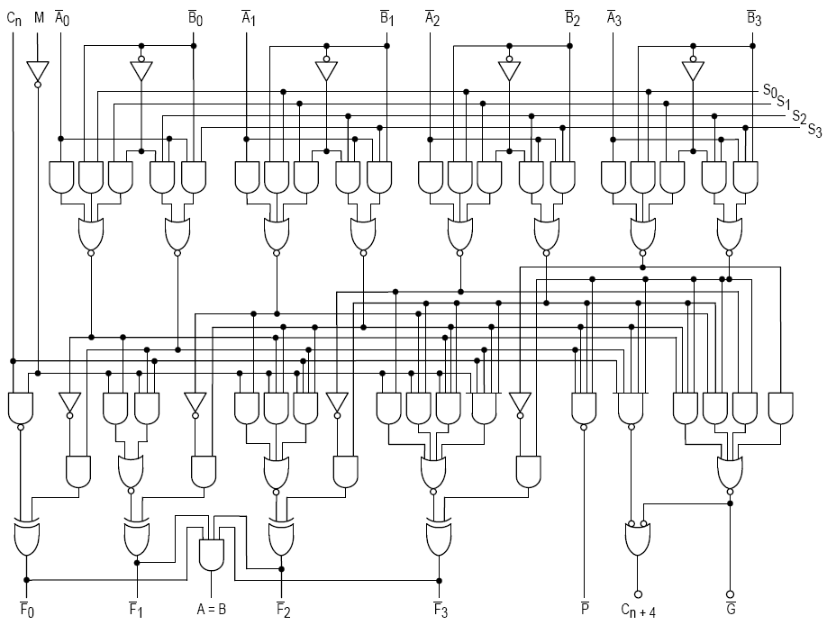
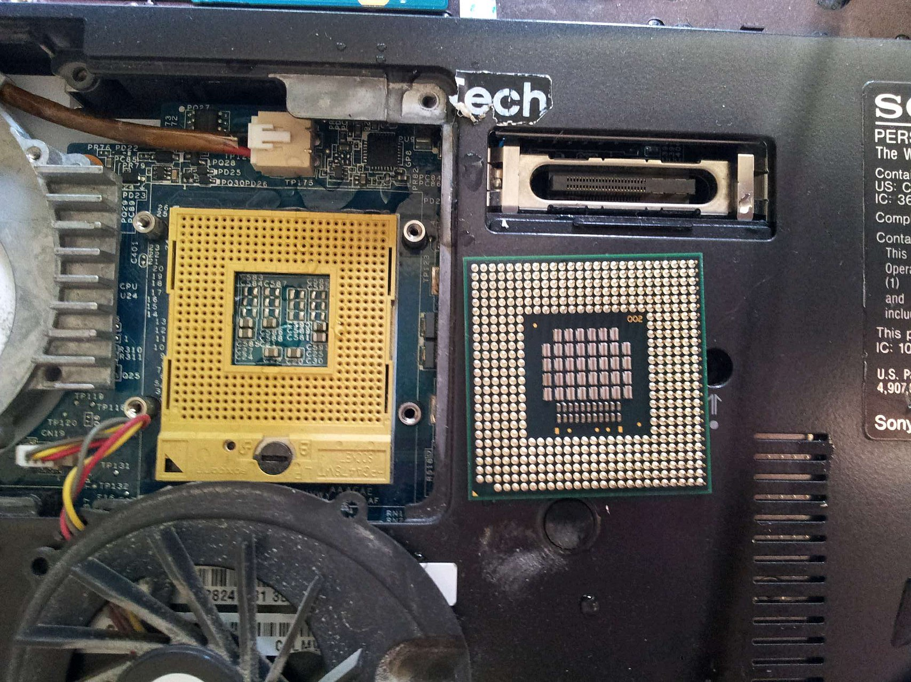
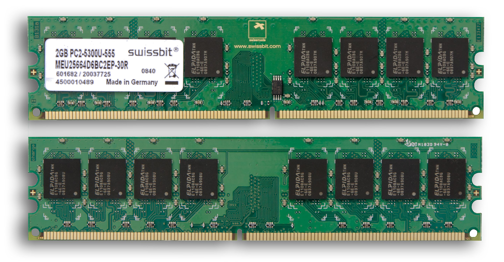
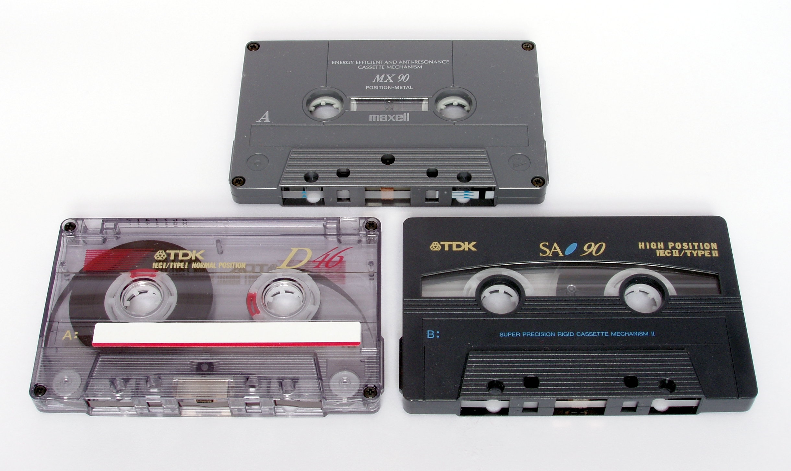
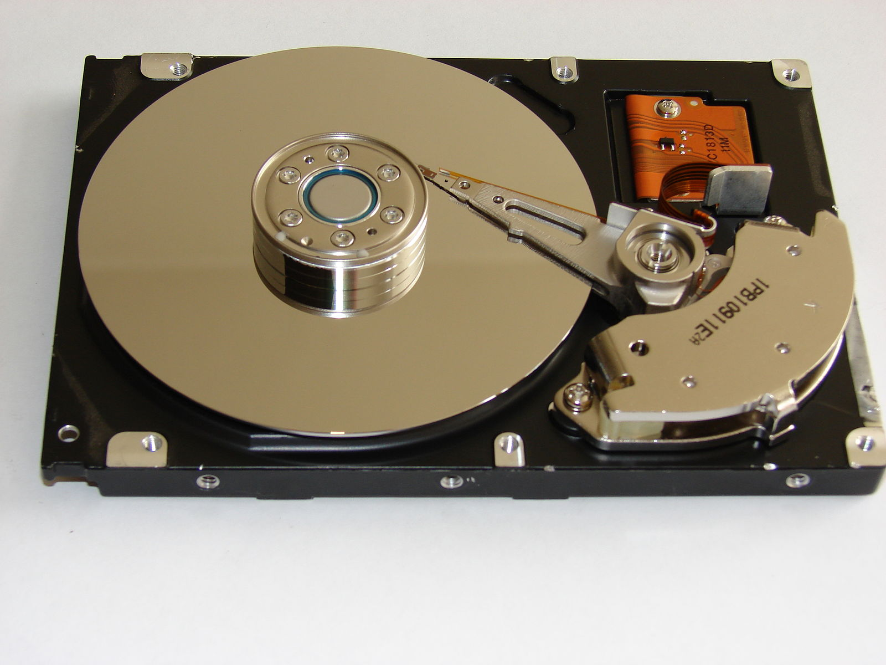

This article aims to explain what [Arithmetic Logic Unit (ALU)](https://en.wikipedia.org/wiki/Arithmetic_logic_unit), [Central Processing Unit (CPU)](https://en.wikipedia.org/wiki/Central_processing_unit), [Random Access Memory (RAM)](https://en.wikipedia.org/wiki/Random-access_memory), [Read-Only Memory (ROM)](https://en.wikipedia.org/wiki/Read-only_memory) and the [hard disk](https://en.wikipedia.org/wiki/Hard_disk_drive) are, in a very simple manner. If you have heard some of these terms before and you don't understand what they are, then you are in luck. This article is for you.

These are the electrical circuits that many of the electronic devices we use daily have, but we rarely know what they do, let alone how they work.

The story starts with tiny cables that carry electricity. It has two states it can be in, either there is electricity on a wire, or there is not. We can call these states on/off, 1/0, white/black, yes/no, or James/Emma. What we call them doesn't matter, not actually, but they are more commonly called 1 and 0. Each 1 or 0 is called a "bit".

Now, a bit can only hold a single piece of information, it can be an answer to a yes/no question. Think of it as a sign on your hand, with 2 sides, on one side there is "yes", on the other side there is "no". For example, if somebody asks you "have you eaten lunch?", you can answer with a bit. If you have eaten your lunch, you can show the side with 1, if you haven't, you can show 0. In this case, you got away with your tiny bit.

But what if you are being asked something else, like your name? You have a single bit, how are you going to answer the question?

Here comes the concept of "byte". A byte is 8 bits (0's or 1's) stuck together. As a bit can either be 1 or 0, there is 2⁸ possible information it can hold! Thankfully somebody encoded the alphabet already, so each letter has a byte representing it. And your parents wrote down the bytes that encode your name to a paper and you always carry it in your pocket. This has been your name since the day you were born, your manufacturers have given it to you.

Now, what if you were asked how many calories you would get from 3 fried eggs. Gosh, now you have to take the calorie of one single egg, multiply it by 3, keep the result of the multiplication and add the calories of the added oil, keep the final result somewhere. Cumbersome, right?

### ALU and CPU

#### Arithmetic Logic Unit (ALU)

There are tiny circuits made from basic logic gates that do certain operations. Simplified version: You have input wires, and you have an output wire. These circuits are wires that are connected in such ways that they create a certain output. With the same inputs they always create the same output, they are consistent and reliable. All the basic operations (the building blocks of bigger operations) have individual circuits. If we go back to the fried eggs example, two main arithmetic operations will lead you to your final answer: addition and multiplication.

If you combine all the wires that do basic arithmetic operations that a computer can do on a single chip, it becomes an [Arithmetic Logic Unit](https://en.wikipedia.org/wiki/Arithmetic_logic_unit). Now you can combine simple operations to find answers to life's complicated problems.

###### This is how the circuitry of a simple four-bit ALU looks like on the logic gate level. Don't be scared, some very cool people are working on this stuff and making sure everything works just fine.

###### Image Credit: CC BY-SA 3.0, https://commons.wikimedia.org/w/index.php?curid=168473

#### Central Processing Unit (CPU)

CPU is the part that executes the instructions of a program.

CPU has 3 important parts:

1. ALU that does the arithmetic and logic operations
2. Control Unit
3. Registers

We have talked about ALU, but what the heck are the other two? Well, the control unit is the part that says, "multiply this with that and then add this to the result of that". Which means it controls which operations are going to be done in which order.

Registers are byte-sized memory cells, which contain the results of different operations. Back to the fried egg example, you need to multiply the calories of a single egg with 3, then add the calorie of the oil to get to the final amount of calories. To do that, you need to store the result of the multiplication first, so you dump that value to a register, and for the final addition you take that value as an input.

Now, if you have ever bought a laptop by yourself in the last 5 years, you have probably seen 2/4/6/8-core processors. The processor is the name of the chip that is responsible for executing instructions, but it can contain multiple CPU's, that are called "cores". So If you are working with a 6-core processor, this means your processor has 6 CPU's, which means you can calculate the calorie amounts of 6 dishes at the same time.

###### This is what a real-life CPU looks like when it is removed from the motherboard (right side). The socket is on the left side.

###### Image Credit: https://en.wikipedia.org/wiki/Central_processing_unit#/media/File:Laptop-intel-core2duo-t5500.jpg

### Computer Memory Basics

Let's define RAM, ROM, and hard disc first, and then talk about why we need all these different ways of keeping data.

#### Random Access Memory (RAM)

Random Access Memory is a collection of registers. It is also called by other names, such as "read-write memory", or "primary memory". When we are running a program, CPU requires certain data to run it properly and this is where that data is kept. It is volatile (temporary), meaning the data will get lost when the power is off.

###### This is what a real-life RAM looks like.

###### Image Credit: By An-d - Own work, CC BY-SA 3.0, https://commons.wikimedia.org/w/index.php?curid=27224495

#### Read-Only Memory (ROM)

ROM stores crucial information that is essential for the computer to work properly, such as a program essential to boot the computer. It is nonvolatile (permanent), meaning the data kept in ROM is not lost when the power source is gone. The data ROM holds is either unchangeable or requires a special operation to change.

#### Hard disk

Hard disks were invented around the 1950s and their working principles are very similar to a cassette tape. Both use the same magnetic recording techniques to store and retrieve digital data, as well as other older technologies such as CDs, VCRs, floppy disks.

Let's start with a cassette tape and then compare it to hard disks.

If you look inside a cassette tape, you'll see a very simple device. There is a looong piece of tape (in fact, for a recording that's 90 minutes long, the tape is 443 feet -135 meters- long), there are 2 rollers that help you roll that long tape, two halves of the plastic outer shell to keep everything together, and a small felt pad that acts as a backstop for the playback head.

###### If you're fairly new to earth, here is what a cassette tape looks like. Also, go check out the birds, they are very cool, and your children may not see most of them.

###### Image Credit: CC BY-SA 3.0, https://commons.wikimedia.org/w/index.php?curid=256864

When we dissect this long tape, we can see that it's a thin plastic coated with ferric oxide (Fe₂O₃) powder that was mixed with a binder for it to attach to the plastic base. (Yes it is like iron oxide but slightly different, as iron oxide is FeO.) Ferric oxide is a ferromagnetic material, if you expose it to a magnetic field it will be permanently magnetized by the magnetic field. Still, you can erase the tape, or make a recording top of it, so it is pretty much reusable. To record audio, you use something called "a tape recorder" which is a simple device that has a very tiny, rounded electromagnet that applies magnetic flux to the ferric oxide on the tape. It also has an iron core wrapped with a wire, and this is where the audio signal is sent to create the magnetic field. And when you are playing a recorded tape, the motion of the tape creates a varying magnetic field that becomes a signal in the coil, and this signal is amplified for the speakers.

Now we can go back to the hard disk. In a hard disk, the material used for the magnetic recording is not a plastic tape, but an aluminum or glass disk. The information encoded in a hard disk takes a much smaller space when compared to a cassette tape, this allows storing a lot more information in a smaller space. The read/write head of the hard disk never touches the disk (in a cassette, the head touches the tape directly), but mainly flies over it, and it moves way faster. Moreover, the aluminum/glass disk stands on top of a platter that can spin, so the information can be accessed a lot faster.

###### This is a hard disk with its cover removed.

###### Image Credit: https://commons.wikimedia.org/wiki/File:01b-hard-drive-cover-removed.JPG

###### **Important Note: Don't do this to your working hard disks, removing their cover destroys them.** If you already have one that's broken and not working, you can go for it.

### How everything works together

Now that we know what these things are and what they are responsible for, let's try to understand how they work together.

You need your CPU to do the simple tasks you need. To do that, CPU needs to use some memory, but it if it constantly reached out to permanent storage for every bit of information, it would be a slow process. So to make it faster, people who designed computers made temporary storage areas like RAM and caches. They are positioned closer to the CPU and it is faster to retrieve information from them.

###### This is a memory pyramid diagram. The higher you go in the pyramid, the smaller the amount of data you can keep. For example, CPU Register is the smallest, and Level 1 of the cache is smaller than Level 2. And many computers today have a Level 3 cache, which is bigger than Level 2.

###### Image Credit: Jeff Tyson "How Computer Memory Works" 23 August 2000. HowStuffWorks.com. <https://computer.howstuffworks.com/computer-memory.htm>

Let's go through what happens when you open your computer:

1. You turn your computer on.
2. After you turn your computer on, the computer loads data from ROM, and tests all the major components of the computer to determine if they are working properly.
3. The computer loads the basic input/output system (BIOS) from ROM. This system performs the low-level routines of different hardware (keyboard, screen, ports, hard disks, etc.), which means it kind of makes them ready to perform their jobs.
4. The computer loads the operating system (OS) from the hard drive into the RAM. As long as the computer is on, critical functions of the operating system stay copied in the RAM so that CPU will have fast access to those.
5. When any application is opened, the essential parts of it are also copied to RAM. Non-essential features are loaded when they are needed. (As you might be using some features of a software but not others, and RAM is a limited resource.)
6. When you save the file you're working on, and close the application, the file is written to the specified storage device. Also, as the application is no longer in use, it is purged from RAM. (Again, RAM is a limited resource, so it must make room for the new data.)
7. Every time a file is loaded or an application is opened, the essential parts of it are copied into RAM. RAM is the temporary memory that is always in touch with the CPU. When the CPU needs something, it first checks level 1 cache, if it's not there, it checks level 2 cache, after that level 3 cache, and if it's not in the cache, it checks RAM. If an application is working with a file, it also is copied to RAM, then after CPU works on it and makes the changes the user wants, it is re-written to RAM. Shuffling data between CPU and RAM can happen million times in a second!
8. If data gets purged from RAM before it is encoded in permanent storage (like a hard disk), it will get lost, as nothing in RAM is permanent.

**Note:** You can see a "virtual memory" section under RAM in the pyramid. **[Virtual memory](https://en.wikipedia.org/wiki/Virtual_memory)** is a method that is used for adding memory to RAM beyond its capacity, as it is limited and expensive memory space. As a CPU can access one memory place at a time, most of the RAM is unused, so if you locate the spaces that have been unused for some time and move them to hard disk temporarily, there will be some space left in your RAM for acute usage. And as hard disk space is cheaper when compared to RAM, it is a cheaper method of expanding your RAM, without physically doing it.

### Comparison: Human Memory vs. Computer Memory

The simplest unit of human memory is the specialized cells that are called **[neurons](https://en.wikipedia.org/wiki/Neuron)**. A human brain contains about one billion neurons. The most amazing thing about neurons is their ability to connect. Each neuron makes about 1,000 connections to other neurons. These connection points are named **[synapses](https://en.wikipedia.org/wiki/Synapse)**. Synapses are very diverse, each of them is quite different from one another.

**[Synaptic plasticity](https://en.wikipedia.org/wiki/Synaptic_plasticity)** is how the neurons adapt to new information, their ability to modify their connections, and re-wire themselves. An analogy I like for explaining synaptic plasticity is the forest trail analogy. The more people walk from a certain path, the more it becomes easier to walk. Others that are going to pass from that area will most definitely use the easier one (heck, there might be more snakes and ticks at the areas that people don't walk), and as more and more people will use it, it will become more of a trail. This is also how synaptic plasticity works, "neurons that fire together, wire together". The more you visit a certain memory, the harder it will be to forget.

Humans have many types of memories, just like computers- but actually pretty different. Human memories can be classified into two big groups: **[Declarative](https://en.wikipedia.org/wiki/Explicit_memory)** and **[Procedural](https://en.wikipedia.org/wiki/Implicit_memory)** (also called non-declarative). The memories of facts and events are classified under declarative memory. Any question you ask your friend that starts with "oh do you remember the day we" fall under this category. Anything other than facts and events, such as skills and habits (walking down the stairs, riding a bicycle, etc.), muscle memory (you know how much power is enough when lifting a cup of water without even thinking about it, how awesome is that?) and emotional memory falls under procedural memory. Procedural memory is hard to forget, and mostly you don't even remember learning these. Declarative memory, on the other hand, is very easy to forget and you have to fight to keep them. There is no clear limit to the number of declarative memories a brain can store because the brain doesn't work like electric circuits. A neuron makes many synapses and can be fired on multiple occasions.

Now, from our daily experiences of being a human, we know that some memories do last longer than the others. We can classify our declarative memories (memories of facts and events) as **[short-term](https://en.wikipedia.org/wiki/Short-term_memory)** and **[long-term](https://en.wikipedia.org/wiki/Long-term_memory)** memories. Short-term memories are vulnerable in terms of being corrupted, as they can be erased by head trauma or **[electroconvulsive therapy](https://en.wikipedia.org/wiki/Electroconvulsive_therapy)** (shortened as ECT, which is some sort of a restart procedure for neurons, mainly used in psychiatric diseases). Short-term memories that go through a procedure called **[consolidation](https://en.wikipedia.org/wiki/Memory_consolidation)** become long-term memories. Memory consolidation happens with revisiting that memory again and again, so the related neurons will fire and the synapses in between have structural changes that make them easier to get fired. Long-term memories are harder to destroy, but still possible. Illnesses such as brain tumors, severe epileptic seizures, strokes, brain infections, drug and alcohol misuse, etc. might corrupt long-term memories.

Now you have seen how the human brain stores anything. Very organic, very unpredictable.

Computer memory, on the other hand, consists of volatile, short-term-like memory (like RAM), and non-volatile long-term-like memory (like a hard disk). Computer memory doesn't have an equivalent of declarative and non-declarative memory as it lacks the muscles and emotional structures, so we can say it only has a declarative memory. The memory of a computer is also addressable, if you know where you store a data (hopefully you do), you can go exactly to that spot and read it over and over again. (You don't know the exact spot where a human brain stores something, modern neuroscience only knows the area the memory is probably stored in). Computer memory is also very dependable, if you don't explicitly change the data there (except for the physical injuries to the circuits of course), it won't easily be corrupted. A human memory, on the other hand, can be altered every time that it is remembered, as you remember the last version of the memory you told, but not the original one. Human memory of an event can grow less precise with each retrieval, even to the point where it is completely false. If you're intrested in this subject, check out [this](https://www.jneurosci.org/content/32/35/12144) article.

So, you should stop bullying yourself when you can't remember stuff. You're not a computer, you are a human, and everything is fine. That's how we operate. And we still rock.

#### Resources:

1. Wikipedia - [Hard disk](https://en.wikipedia.org/wiki/Hard_disk_drive), [Casette Tape](https://en.wikipedia.org/wiki/Cassette_tape), [RAM](https://en.wikipedia.org/wiki/Random-access_memory), [ROM](https://en.wikipedia.org/wiki/Read-only_memory), [CPU](https://en.wikipedia.org/wiki/Central_processing_unit), [ALU](https://en.wikipedia.org/wiki/Arithmetic_logic_unit), [Virtual memory](https://en.wikipedia.org/wiki/Virtual_memory), [neuron](https://en.wikipedia.org/wiki/Neuron), [synapse](https://en.wikipedia.org/wiki/Synapse), [Synaptic plasticity](https://en.wikipedia.org/wiki/Synaptic_plasticity), [Declarative](https://en.wikipedia.org/wiki/Explicit_memory), [Procedural](https://en.wikipedia.org/wiki/Implicit_memory), [Short-term memory](https://en.wikipedia.org/wiki/Short-term_memory), [Long-term memory](https://en.wikipedia.org/wiki/Long-term_memory), [ECT](https://en.wikipedia.org/wiki/Electroconvulsive_therapy), [memory consolidation](https://en.wikipedia.org/wiki/Memory_consolidation)
2. [But How Do It Know](http://www.buthowdoitknow.com/index.html) by J. Clark Scott
3. Jeff Tyson "How Computer Memory Works",
   HowStuffWorks.com. <https://computer.howstuffworks.com/computer-memory.htm>
4. [From Nand to Tetris" Part1 & Part2](https://www.nand2tetris.org/) by Hebrew University of Jerusalem
5. Bear, M. F., Connors, B. W., & Paradiso, M. A. (2016). [Neuroscience: exploring the brain. Fourth edition.](https://www.amazon.com/Neuroscience-Exploring-Mark-F-Bear/dp/0781778174) Philadelphia: Wolters Kluwer.
6. [Neural Correlates of Reactivation and Retrieval-Induced Distortion.](https://www.jneurosci.org/content/32/35/12144) Donna J. Bridge, Ken A. Paller, Journal of Neuroscience 29 August 2012, 32 (35) 12144-12151; DOI: 10.1523/JNEUROSCI.1378-12.2012
7. Mayford M, Siegelbaum SA, Kandel ER. [Synapses and memory storage.](https://www.ncbi.nlm.nih.gov/pmc/articles/PMC3367555/) Cold Spring Harb Perspect Biol. 2012;4(6):a005751. Published 2012 Jun 1. doi:10.1101/cshperspect.a005751
8. Kennedy MB. [Synaptic Signaling in Learning and Memory.](https://www.ncbi.nlm.nih.gov/pmc/articles/PMC4743082/) Cold Spring Harb Perspect Biol. 2013;8(2):a016824. Published 2013 Dec 30. doi:10.1101/cshperspect.a016824
