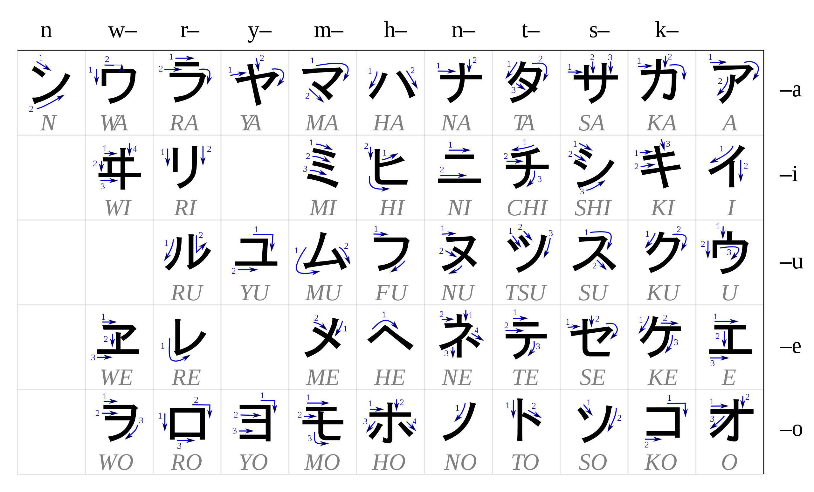

In the quarantine period of 2020, I got the chance to start learning something I wanted to learn for such a long time. I started learning Japanese. The delicate culture and the intricate but beautiful mythology of Japan never ceased to impress me since I was a teenager.

When you're learning Japanese, (especially if you're learning how to write) you face a very different kind of problem. Japanese writing system uses symbols to indicate the sounds (or syllables, you could say). The term "kana" is mainly used for indicating "hiragana" and "kanji", which are the two systems used for symbolizing the sounds in Japanese. "Kanji" on the other hand, are Chinese characters that indicate words, not sounds. Latin alphabet can also be used to write Japanese, which is called "Romaji". And all four of these systems (Hiragana, Katakana, Kanji, Romaji) are actively used in Japan.

Now, as you can see this is a problem that makes it hard to learn Japanese, not just for us the "gaijin" (foreigners), but for Japanese people too. This article is my attempt of understanding how it became the way it is, by tracing the historical timeline.

**The history of Kanji, Hiragana and Katakana**

Before the 5th century, Japan had no written language. China, on the other hand, was using a script that consisted of many symbols that indicated words. The Kanji system in China was invented by a legendary historian named Cangjie, and I am emphasizing the word legendary here because according to the legend the dude had four eyes and when he invented these characters, the deities and ghosts cried and the sky rained millet. Believe it if you must.

_Portrait of Cangjie showing his four eyes. If you are interested, read more from [here.](https://en.wikipedia.org/wiki/Cangjie)_

Another theory of how kanji was born is ancient Chinese people who wanted to ask questions to the heavens made a ritual of burning turtle shells or animal bones and looking at the cracks that formed after, trying to find some sort of meaning in them. At some point, they started to connect those shapes to items and use them as symbols to indicate those items. They even replicated those symbols onto not-burnt turtle shells (maybe these were some sort of prayers, sent to Gods). Whatever the reason was, there they are, we have found a lot of oracle bones with scripts on them from that era.

_Chinese inscription on an oracle bone. Image by Dr. Meierhofer [CC BY-SA 3.0], via Wikimedia Commons. If you are interested, read more from [here.](https://en.wikipedia.org/wiki/Oracle_bone_script)_

_As you can see, this turtle is not impressed. [Click](https://unsplash.com/photos/L-2p8fapOA8) for the original picture._

After the rise of Confucianism, which is a system of thought, a philosophy, a way of life that originates from China, it propagated to the Korean peninsula and spread to Japan. As the Japanese didn't have a written language and they wanted to understand Buddhist scriptures written in Chinese as well, they adopted the Chinese writing system. This became a problem because the Japanese have different sounds. The whole Japanese language consists of only 105 sounds. Chinese on the other hand has a much complicated phonetic system with a larger inventory of sounds.

Japanese sound units are called **[mora](<https://en.wikipedia.org/wiki/Mora_(linguistics)>)**, it is very similar to a "syllable" but slightly different. A mora is a single unit of sound that also determines the syllable weight (or stress). For example, a long vowel (such as ou, ei) is counted as one syllable, but two moras. So a syllable can be monomoraic (contains one mora) or bimoraic (contains two moras). For example, a **[haiku](https://en.wikipedia.org/wiki/Haiku)**, which is a short form of poetry originated from Japan, follows the pattern of 5 moras/7 moras/5 moras.

When the Japanese used Chinese characters to write Japanese words, they dismissed the meanings of them and used characters to represent similar sounds. People were free to choose whichever character they want to represent the sounds (there wasn't a standard), and this ended with a single sound being represented by many characters.

In the 10th and 11th centuries, two other writing systems emerged.
**[Katakana](https://en.wikipedia.org/wiki/Katakana)** was developed by monks, scholars and government officials, and was a system of shorthand notations of the pronunciations of unfamiliar Chinese characters. The people who developed this system were mostly men, and people who read the shorthand notations were also men, so Katakana is also called "man's hand". Katakana characters consist of short, straight strokes with sharp corners. In the same period, women courtiers and writers also began to make shorthand notations, but their's were more cursive when compared to the sharp nature of katakana. This writing system was **[Hiragana](https://en.wikipedia.org/wiki/Hiragana)**, which was also called "woman's hand" since it was developed and used mainly by women. And of course, neither katakana nor hiragana had standardized shapes.

In the 1900s government decided to finally standardize Katakana and Hiragana, the shape of every symbol was determined and a set of 46 symbols were chosen for Hiragana, and another set of 46 symbols were chosen for Katakana. Although Hiragana and Katakana are both capable of representing all Japanese sounds equally efficiently, Katakana is used for foreign words and names, and Hiragana is used for words with Japanese origin.

This is the katakana chart:

_Image Credit: By User:Pmx - Based upon Image:Table katakana.jpg, CC BY-SA 3.0, https://commons.wikimedia.org/w/index.php?curid=1713700_

This is the hiragana chart:

_Image Credit: By User:Pmx - Based upon Image:Table hiragana.jpgOriginal autor : Karine WIDMER. ( http://www.escale-japon.com )From :_ http://www.escale-japon.com/cours/table_katakana.jpg_ http://www.escale-japon.com/cours/table_hiragana.jpg, CC BY-SA 3.0, https://commons.wikimedia.org/w/index.php?curid=1710234_

So how exactly the Chinese characters were assimilated into the Japanese language? This is an example I borrow from [this](https://www.japanpitt.pitt.edu/essays-and-articles/language/japanese-writing-system-i) article, and it is one of the examples I like the most. This Chinese character 山 means "mountain" in Chinese and pronounced as "shan". When this character was brought into Japanese, it still meant "mountain", but the pronunciation was a little bit altered and was made "san" which was easier for Japanese people to say. That's awesome, but there was still a word for a mountain in the Japanese language, which was "yama". Now, the character 山 had two pronunciations both with a meaning of "mountain", one with a Japanese, and another one with a Chinese origin. The Japanese pronunciation was called **[Kun'yomi](<https://en.wikipedia.org/wiki/Kanji#Kun'yomi_(native_reading)>)**, and the Chinese pronunciation was called **[On'yomi](<https://en.wikipedia.org/wiki/Kanji#On'yomi_(Sino-Japanese_reading)>)**. This is the case with most kanji (they have two readings), and the pronunciation to choose depends on how the word is used. Most of the time, if there is some Hiragana attached to the end of the Kanji, it is pronounced with Kun'yomi, and if it is used as a single character, it is pronounced with On'yomi.

Although this is generally true, the same kanji may be read in different ways depending on the context in which it appears. For example, the character 生 in Chinese means "life" and it is read as "sheng". However when it was brought into Japanese, it was applied to many words with different pronunciations, such as 生かす /i-kasu/ 'let live', 生う /o-u/ 'grow', 生える /ha-eru/ 'grow', 生む /u-mu/ 'give birth', 生まれる /u-mareru/ 'be born'. It is pretty crazy, the 生 character can be read as i, o, ha, u in kun'yomi. On'yomi reading of the same character is either sei or shō.

Now I hear you saying, we got that there were on'yomi and kun'yomi, but why the heck are there two different on'yomi readings? Well, as the Chinese emperors and dynasties changed during the centuries, the Chinese language also changed. So there are Wu, Han, and Tang pronunciations of the same characters in Chinese. So this means, for some characters, there are multiple On'yomi and Kun'yomi readings.

_Image Credit: https://knowyourmeme.com/_

There are tens of thousands of characters that can be learned, and they are probably not easy to learn for Japanese people as well. After World War 2, the Japanese Ministry of Education declared a standardized list of secondary school-level kanji, which consisted of 1,850 characters, which was called **[the tōyō kanji](https://en.wikipedia.org/wiki/T%C5%8Dy%C5%8D_kanji)**. In 1981, the list was replaced with another list that was called **[the jōyō kanji](https://en.wikipedia.org/wiki/J%C5%8Dy%C5%8D_kanji).** In 2010, that list was expanded to 2,136 characters. You can see the full list of jōyō kanji from [here](https://en.wikipedia.org/wiki/List_of_j%C5%8Dy%C5%8D_kanji). Although it is not a comprehensive list for every character that is used daily, many people say that you'll get by just fine by learning the jōyō kanji. It is more of a literacy baseline for people who completed compulsory education in Japan, and a permitted list of characters and their pronunciations to use in official government documents. 1,026 of the jōyō kanji is taught in primary school (grades 1 to 6), 1,110 additional kanji is taught in secondary school (Grades 7 to 12).

Japanese is predominantly written starting from the right top corner of the page with each line written vertically. There is also another way of writing which is identical to English starting from the top left corner, with each line written horizontally.

Cool, huh?

**Resources:**

1. [Tofugu](https://www.tofugu.com/)
2. Wikipedia- [Cangjie](https://en.wikipedia.org/wiki/Cangjie), [Mora](<https://en.wikipedia.org/wiki/Mora_(linguistics)>), [Haiku](https://en.wikipedia.org/wiki/Haiku), [Katakana](https://en.wikipedia.org/wiki/Katakana), [Hiragana](https://en.wikipedia.org/wiki/Hiragana), [Kun'yomi](<https://en.wikipedia.org/wiki/Kanji#Kun'yomi_(native_reading)>), [On'yomi](<https://en.wikipedia.org/wiki/Kanji#On'yomi_(Sino-Japanese_reading)>), [The tōyō kanji](https://en.wikipedia.org/wiki/T%C5%8Dy%C5%8D_kanji), [The jōyō kanji](https://en.wikipedia.org/wiki/J%C5%8Dy%C5%8D_kanji)
3. [A History of the Japanese Language](https://www.goodreads.com/book/show/7204987-a-history-of-the-japanese-language)- Bjarke Frellesvig
4. [Japanese Writing System I](https://www.japanpitt.pitt.edu/essays-and-articles/language/japanese-writing-system-i)- Hiroshi Nara
5. [The Languages of Japan.](https://www.goodreads.com/book/show/906912.The_Languages_of_Japan) Cambridge University Press. 1990.- Masayoshi, Shibatani.
