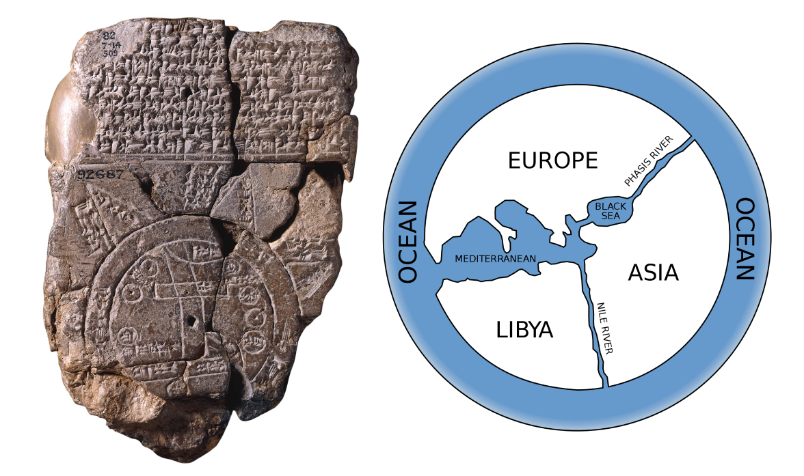
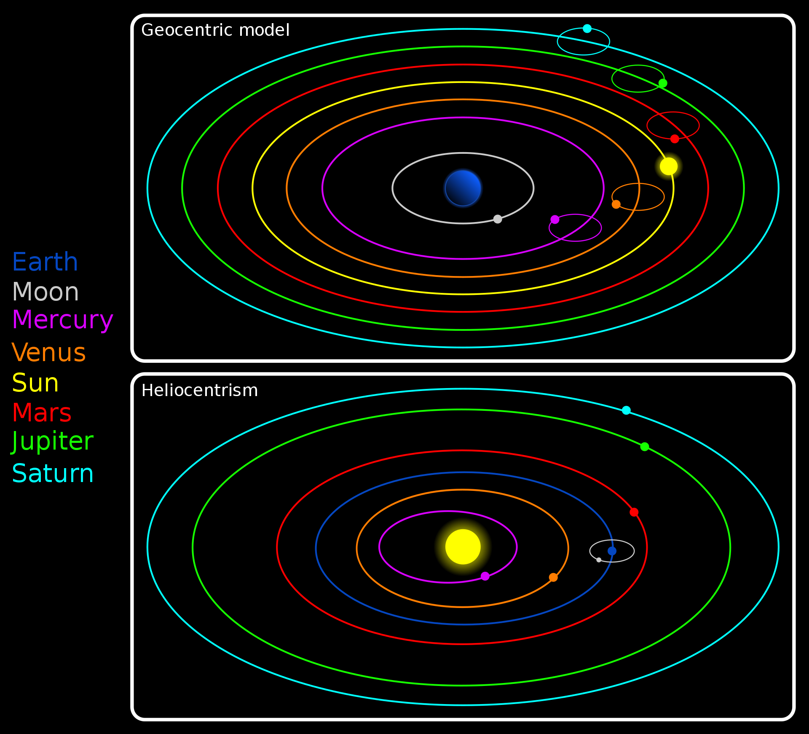
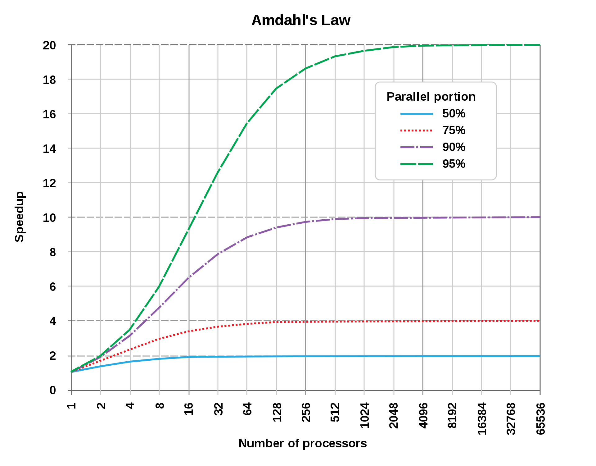

A **[paradigm](https://en.wikipedia.org/wiki/Paradigm)** is a thought pattern, a way of thinking, a way of looking at something.

For instance, the ancient Egyptians and civilizations living in Mesopotamia believed the Earth was shaped like a disk. This was called the [flat Earth model](https://en.wikipedia.org/wiki/Flat_Earth).



###### **On the left side, [Imago Mundi](https://en.wikipedia.org/wiki/Babylonian_Map_of_the_World), Babylonian map (the oldest known world map), 6th century BC Babylonia. Image Credit: British Museum.** Object Number: 92687., Public domain, via Wikimedia Commons

###### **On the right side, possible rendering of [Anaximander](https://en.wikipedia.org/wiki/Anaximander)'s (a pre-Socratic Greek philosopher) lost world map.** Image Credit: User:Bibi Saint-Pol, Public domain, via Wikimedia Commons

After the flat Earth model came the **[geocentric model](https://en.wikipedia.org/wiki/Geocentric_model)**, which accepted the Earth as a sphere, but claimed the Earth was at the center of the universe and other celestial bodies like the Sun and the Moon revolved around the Earth.

Around the 1500s, [Nicolaus Copernicus](https://en.wikipedia.org/wiki/Nicolaus_Copernicus) observed the sky with his naked eyes and discovered the Sun was the center and the other celestial bodies such as Earth itself revolved around it. He did not have the tools to prove he was right, but the idea was put out there. And you know how dangerously beautiful ideas are, they are tiny seeds that have the potential to change the world. In the 1600s another great scientist named [Galileo Galilei](https://en.wikipedia.org/wiki/Galileo_Galilei) built a tool to observe the movements of the celestial bodies which we call a [telescope](https://en.wikipedia.org/wiki/Telescope) and he came to the same conclusion as Copernicus, but this time with data in his hands. This idea of the sun being the center and other planets were revolving around it was called the **[heliocentric model](https://en.wikipedia.org/wiki/Heliocentrism)**.



###### **A hypothetical geocentric model of the Solar System (upper panel) in comparison to the heliocentric model (lower panel).**

###### Image Credit: Original image by Niko LangSVG version by User:Booyabazooka, CC BY-SA 2.5 <https://creativecommons.org/licenses/by-sa/2.5>, via Wikimedia Commons

Unfortunately, the world at that time did not treat them well - Copernicus died shortly after he published his theory, but after publishing his data, Galileo was charged with heresy and faced Roman inquisition by the Catholic church. Although it took some time and a lot of suffering of some great scientists, they did something amazing, they opened up a new era and created a new way of thinking. Rather than accepting whatever was in the ancient texts and Bible, they gathered data by observing and studying nature, forming hypotheses, designing and performing experiments to test these hypotheses, and drawing conclusions from the results. The scientific revolution. Their work resulted in what we can call a **[paradigm shift](https://en.wikipedia.org/wiki/Paradigm_shift)**: _It changed one way of thinking to another._

In computer science, the term **[programming paradigm](https://en.wikipedia.org/wiki/Programming_paradigm)** refers to the ways of programming. It is not as strict as the scientific revolution, it is programmers choosing a way of doing things.

All programming languages need to follow a strategy when they are implemented. Not all programming languages are created the same way (if they were, we wouldn't need so many of them anyway). Each language has its own limitations. So how the language is built is extremely important when it comes to paradigms it can use. For example, if a class concept doesn't exist in a language, you won't be able to use Object Oriented Programming (OOP) paradigm with it.

Most programming paradigms can be classified under two main titles: **imperative** and **declarative**. Let's check them out.

---

**Note:** There are **multi-paradigm languages** (languages that allow the usage of multiple paradigms) or languages that strictly enforce a single paradigm. For example, JavaScript is a multi-paradigm language, as it allows the programmer to choose between declarative, functional, and object-oriented, and even a mixture of those. Java, on the other hand, strictly uses the object-oriented programming paradigm.

---

### Imperative programming paradigm:

The word **imperative** comes from the Latin word "imperare", which means "to give orders, command". (The word "emperor" also comes from the same root.)

In an imperative programming paradigm, you have to tell the computer what to do and how to do it step by step. The order of your commands also matters.

To make an analogy, when imperative cooks a burger, you have to give it a strict recipe. The recipe has to tell it how it's going to cut the onions, how to make the patty, at which temperature to cook those, how to prepare the buns, how to assemble the burger, and how to present it on a plate. In the end, it will create a burger just like you wanted it to.

We will talk about some paradigms that embrace the imperative approach, such as **procedural programming**, **object-oriented programming**, and **parallel processing**.

#### ⁂ Procedural programming paradigm:

In procedural programming, you divide the instructions into procedures. Sounds simple. But what is a procedure?

**A procedure** is an independent piece of code that fulfills some small task. The developer accomplishes a bigger task by invoking several procedures in order. A procedure can also be referred to as a function, subroutine, routine, method, or subprogram in different programming languages, but the idea of it is the same.

Here's an example JavaScript dummy code:

```javascript
const button = document.querySelector("button")

const caramelizeOnions = () => {
  // caramelize onions
}

const preparePatties = () => {
  // assemble and cook burger patties
}

const toastBuns = () => {
  // toast buns
}

const assembleBurger = () => {
  caramelizeOnions()
  preparePatties()
  toastBuns()
  // assemble prepared onions, patties and buns to look like a burger
}

button.addEventListener("click", assembleBurger)
```

Some languages that support the procedural programming paradigm are C, C++, Fortran, COBOL.

#### ⁂ Object-oriented programming paradigm:

In object-oriented programming (OOP), you organize all of your code in classes and objects.

**A class** is code defining a blueprint of an object. **An object** is an entity from the real world (it can be something you can touch, like a bird or a car or it can be something more abstract like a dental appointment, a restaurant booking) and the human mind can relate to it easily. Either way, an object is something you want to store and process some data about. A class, on the other hand, is a code that defines a type of object. An object can have properties (attributes) and methods (behaviors, things that can be done by an object or to an object).

The process of creating an object instance from a class is called **instantiation**, you can instantiate multiple objects of the same type from a particular class. (An object is an instance of a class. You can create multiple instances of a class.) When an object instance is created from a class, the class' constructor function runs first to create the instance.

_**The 4 main concepts of OOP are abstraction, encapsulation, inheritance, polymorphism.**_

**a. Abstraction:**

Abstraction means to simplify reality, to create a simple model of a somewhat complex thing. For example, you can create a Cat class, and add some properties and methods to that class that you find relevant. You will put properties and methods that you will use in your application, but let's be honest- there is way more data and functionalities of a real cat than the ones you put there! But you abstracted the cat for your application's needs.

**b. Encapsulation:**

Encapsulation is the idea that the data inside an object should not be directly exposed. Instead, programmers who want to achieve a certain result are coaxed into proper usage by invoking certain methods that exist only for this reason (rather than accessing the data directly).

**c. Inheritance:**

JavaScript is a prototype-based language. The inherited class will appear as a prototype object inside the child class. The parent class that is inherited can also have a prototype, and so on. This is called the **prototype chain**. An object that is created without using inheritance will have the prototype of [Object](https://developer.mozilla.org/en-US/docs/Web/JavaScript/Reference/Global_Objects/Object), which gives access to all object methods. The methods and properties of the parent class are not copied to the children objects, it just takes note of the prototype class, and if the browser cannot find a method in the child object, it will and check its prototype object. If it is not there as well, it will go one step higher in the prototype chain until it can find it, or until it reaches the Object prototype. (If it's nowhere to be found, it will let you know.) Inheritance helps code reuse.

**d. Polymorphism:**

[Polymorphism](https://en.wiktionary.org/wiki/polymorphism) is a combination of two Greek words that mean **many** (poly) and **shape** (morphism). It is used for stuff that can exist in many forms.

In computer science, [polymorphism](https://en.wikipedia.org/wiki/Polymorphism_%28computer_science%29) is the act of redefining a method inside a child class, to make a shared functionality more personalized for each child class. The method the parent has kind of becomes like a default one.

When a method is called, the browser has to find the definition of that method, and it goes checks the class that is used to instantiate that object first. Only if the method is not defined in that class, it will proceed and check the prototype of that class.

Some languages that support the object-oriented paradigm are Python, Ruby, Java, JavaScript, C++.

#### ⁂ Parallel processing approach:

[Parallel processing](https://en.wikipedia.org/wiki/Parallel_computing) means dividing program instructions among multiple processors.

The motto is [divide and conquer](https://en.wikipedia.org/wiki/Divide_and_rule). Take a big problem, cut it into smaller pieces, and assign each small part to somebody. A parallel processing system allows multiple processors to run a program to do something in much less time. Think of the burger again, if someone prepares the patties, another one prepares the onions and another one prepares the buns, you'll be done in no time!

The parallel processing approach is mainly about speed. The theoretical speed of the total task is limited by the parts that cannot be parallelized. If you have 20 hours of work, but 1 hour of it is not possible to parallelize, then the overall theoretical time of finishing the total task would be 1 hour (assuming you can finish the remaining parallelized parts in 1 hour as well). There is a formula that can calculate the theoretical speedup of a program with parallel computing that is called [Amdahl's law](https://en.wikipedia.org/wiki/Amdahl%27s_law).



###### **A graphical representation of Amdahl's law.** This law is used to predict the potential speedup of a program with parallelization. The speedup is limited by how much of the program can be parallelized. For example, if 95% of the program can be parallelized, the theoretical maximum speedup using parallel computing would be 20×, no matter how many processors are used. If 90% of the program can be parallelized, the theoretical maximum speedup using parallel computing would be 10×.

###### Image Credit: Daniels220 at English Wikipedia, CC BY-SA 3.0 <https://creativecommons.org/licenses/by-sa/3.0>, via Wikimedia Commons

Of course, you can only use it if you have a multi-core processor or multiple CPUs. So your hardware and software must be compatible.

Some languages that support the Parallel processing approach are C, C++, C#, Python.

### Declarative programming paradigm:

The word **declarative** comes from the Latin word "declarare", which means "to make visible, to clarify".

In a declarative programming paradigm, you tell the computer what to do, but you don't explain it step by step. How to do it is up to the compiler.

If we go back to our cooking analogy, when declarative cooks a burger, you only give it the onions, buns, beef, cheese, and other ingredients and say "I want a burger". In the end, it will present you with a burger. You won't know or care how the onions were cut, at which temperature the patty was cooked. It will decide those parameters by itself.

We will talk about some paradigms that embrace the declarative approach, such as the **logic programming paradigm**, **functional programming paradigm**, and **database processing approach**.

#### ⁂ Logic programming paradigm:

This way of programming is based on logic as the name indicates, so let's define logic first.

There was a man in ancient Greece with the name of **[Aristotle](https://en.wikipedia.org/wiki/Aristotle)**, who was interested in how to think more sensibly. He described a way of thinking that involved taking two pieces of facts and from those, deducing a third fact that made sense. He called this **[logic](https://en.wikipedia.org/wiki/Logic)**.

Let's give a simple example:

- Fact 1: Yuki is older than Mora.

- Fact 2: Carrie is older than Yuki.

- Deduction: Mora is younger than Carrie.

In computer science, [logic programming](https://en.wikipedia.org/wiki/Logic_programming) is a programming style that is based on logical expressions. Languages that support logic programming mainly work with true or false statements. You define the facts that are true first, which will be the program's knowledge base. Then you make the queries, and the program itself returns you a deducible solution if there is one.

Some languages that support the logic programming paradigm are Prolog, Absys, Datalog, ASP (answer set programming), ALF (algebraic logic functional programming language), Alice, Ciao.

#### ⁂ Functional programming paradigm:

[Functional programming paradigm](https://en.wikipedia.org/wiki/Functional_programming) is a language-independent paradigm, and the key principle of this paradigm is handling everything by executing a series of short and simple functions.

In this paradigm, all written code is within a function, all variables are scoped inside a function, functions do not modify or be modified by any value outside of their block scopes. They always produce the same output when given the same input, so they are reliable. Functions are reusable, arguably more legible, unit testing and debugging are easier.

Let's compare these two code snippets to understand the concept better:

**Snippet 1:**

```javascript
const numArr = [1, 2, 3, 4, 5, 6, 7, 8, 9, 10]
let result = 0
for (let i = 0; i < numArr.length; i++) {
  if (numArr[i] % 2 === 0) {
    result += 1
  }
}
console.log(result)
```

**Snippet 2:**

```javascript
const result = [1, 2, 3, 4, 5, 6, 7, 8, 9, 10].filter(n => n % 2 === 0).length
console.log(result)
```

Snippets 1 and 2 do the same job. They both return the number of even numbers in a given number array. Snippet 1 does it in an imperative way (loop through every number, check if it's even, do something if it is), and Snippet 2 does it by using a [higher-order function](https://eloquentjavascript.net/05_higher_order.html) (in more of a functional programming way). Higher-order functions are functions that either take another function as an argument or return a function. The built-in `forEach` method for arrays is a good example of a higher-order function.

Some languages that support the functional programming paradigm are Haskell, Scala, Clojure, Elixir, F#, Racket, JavaScript.

#### ⁂ Database/Data-driven programming:

[Database/Data-driven programming](https://en.wikipedia.org/wiki/Data-driven_programming) is a programming style that separates the data and the application logic, and rather than hardcoding everything, the user interface is created according to the data that's provided. The data is not merely a state of an object, but it controls the data flow throughout the program. The primary concern in data-driven programming is writing as little hardcode as possible. You can read the data from a database or an outsourced file, or provide the data yourself inside your code.

Let's create two very simple code snippets, one with a non-data-driven and one with a data-driven approach to make the concept clearer:

**Snippet 1: (non-data-driven)**

```javascript
const returnAppropriateTitle = handle => {
  if (handle === "sociology") {
    return "Human Ecology"
  } else if (handle === "history") {
    return "The History of the World"
  } else if (handle === "literature") {
    return "English Literature"
  }
}

const printAllTitles = (...args) => {
  args.map(arg => console.log(returnAppropriateTitle(arg)))
}

printAllTitles("sociology", "history", "literature")
```

**Snippet 2: (data-driven)**

```javascript
const sections = [
  { handle: "sociology", title: "Human Ecology" },
  { handle: "history", title: "The History of the World" },
  { handle: "literature", title: "English Literature" },
]

sections.map(item => console.log(item.title))
```

Both snippets do the same thing: they print a title according to a given title. The data-driven approach is free from redundancy, easy to debug, read and manage, even by a non-developer person. The program logic is completely separated from the data.

If you're using a relational database, a programming language like SQL can be used to access or manipulate data.

### The End

This article is a very simplified version of the real thing, and there is a lot more to this subject. Just looking at [this Wikipedia article](https://en.wikipedia.org/wiki/Programming_paradigm) makes me sweat bullets. If you're interested in these, go dive into them. You do you.

**Resources**

1. Wikipedia
2. [Eloquent JavaScript](https://eloquentjavascript.net/)
3. [Introduction to Data Driven Programming](https://effective-programmer.com/2018/05/27/introduction-to-data-driven-programming/) by Naveed Khan
4. [Chapter 9- Data-Driven Programming](https://homepage.cs.uri.edu/~thenry/resources/unix_art/ch09s01.html), [The Art of Unix Programming](http://www.catb.org/~esr/writings/taoup/html/) by Eric Steven Raymond
