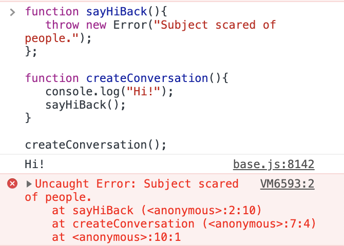
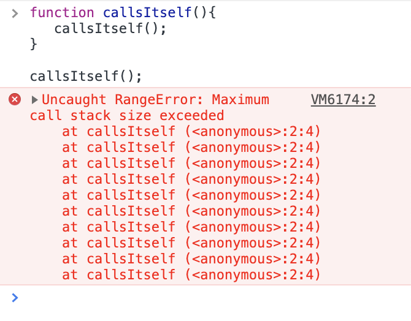

This article is about understanding how the browser executes a script. The details of this topic differ from engine to engine (or browser to browser, you could say), but they share the main ideas. This article will be an information-intensive article, so grab your coffee and stay calm. Everything is fine. You are doing great.

Let's dive.

JS engines typically consist of 2 parts, **[an interpreter](<https://en.wikipedia.org/wiki/Interpreter_(computing)>)** and a **[JIT compiler (Just In Time compiler)](https://en.wikipedia.org/wiki/Just-in-time_compilation).** The interpreter starts parsing the JS code and immediately starts executing it. It compiles the source code into **[bytecode](https://en.wikipedia.org/wiki/Bytecode)**, which is a code that targets a virtual machine rather than a specific computer architecture, like a processor. At the same time, the JIT compiler determines the most frequently used code and compiles it to machine code. **[Machine code](https://en.wikipedia.org/wiki/Machine_code)** is binary code that is directly understandable for a computer's CPU (central processing unit). JIT does its work while the code is being executed by the interpreter. That's why it is called just in time compiler, the compilation is done on the runtime.

JS engines optimize the time that is required for the compilation and execution for better performing websites. For example, the chunks of code that didn't change between the last execution and the current execution will not be recompiled, but the previously compiled code will be run again by the JS engine. This is just one of the optimizations, there are many more.

Browsers also give you a couple of other features that are called **[the Web API's](https://en.wikipedia.org/wiki/Web_API)**. **[API](https://en.wikipedia.org/wiki/API)** is short for Application Programming Interface. It is an interface that defines interactions for the software that is used, and how to use those interactions. These Web API's are part of the browser, but you can access them via your JS code, in ways that are defined by the browser. They are communication bridges between you and some features of the browser. The Web API's are also standardized (thankfully, or we would be writing different JS codes for each browser) and do not differ between browsers. The group that works on standardizing the Web API's is named **[WHATWG](https://whatwg.org/)**, and they are pretty cool. Check out the other API's they work on, from [here](https://spec.whatwg.org/).

Now, how are your variables stored? How does function execution work, how is the order of execution guaranteed? Let's dive into those.

We have two important concepts inside of the JS engine, **[the heap](https://en.wikipedia.org/wiki/Memory_management#HEAP)** and **[the call stack](https://en.wikipedia.org/wiki/Call_stack)**. Heap is a long term memory allocated to the browser by the operating system and the browser manages the heap. Stack manages the execution flow of the program, it is more of a short term memory. The stack is interested in the current function that is being executed. If you call a function, it is added on top of the call stack and when that function returns, it is removed from there.

JavaScript is a single-threaded programming language. It does one thing at a time and it has a single call stack. JS code is read from top to bottom and gets executed in that order.

If you declare a function but never call it, it gets registered in the heap. The declared functions have a rather long life, they stay registered in the heap as long as your application stays open.

Let's see how heap and stack works on a simple JS code snippet:

```javascript
function getAge() {
  return prompt("Your age:", "")
}

function getPermission() {
  const age = parseInt(getAge())
  if (age >= 0 && age < 21) {
    console.log("Age under 21: drinking alcoholic beverages is not permitted.")
  } else if (age >= 21) {
    console.log("You are legally permitted to drink. Enjoy yourself.")
  } else if (typeof age !== number) {
    console.log("Please enter a valid number.")
  }
}

getPermission()
```

You can try running this code snippet in your Chrome console.

So, at the example above, the two functions (getAge and getPermission) are stored in the Heap, and as the code runs, the browser pushes the currently running function to the stack. The topmost item in the call stack is always the thing that's currently happening.

Let's do it step by step:

1. :pancakes: **Bottom pancake gets baked:** First, the overall script that is running is pushed to the stack, and as our script has no name it will run as "anonymous". This makes the first thing that will be pushed in stack anonymous().
2. :pancakes::pancakes: **Second pancake from the bottom gets baked:** Then the JS engine will read the file from top to bottom and getPermission function will be called. The second item that is pushed to the call stack is getPermission().
3. :pancakes::pancakes::pancakes: **Third pancake from the bottom gets baked:** parseInt() is pushed on top of the stack.
4. :pancakes::pancakes::pancakes::pancakes: **Fourth pancake from the bottom gets baked:** getAge() is pushed on top of the stack.
5. :pancakes::pancakes::pancakes::pancakes::pancakes: **Fifth pancake from the bottom gets baked:** prompt() is pushed on top of the stack.
6. :pancakes::pancakes::pancakes::pancakes: **Fifth pancake from the bottom is eaten:** Once the user enters clicks ok or cancel, the prompt will return something, so the prompt function is done executing. It is popped off from the call stack. (It doesn't mean that it is also moved from the heap. Functions that are registered in the heap stay there as long as the application is open. The data needed for that function execution is also removed from the heap.)
7. :pancakes::pancakes::pancakes: **Fourth pancake from the bottom is eaten:** getAge function returns the result of the prompt, therefore it is resolved and removed from the stack.
8. :pancakes::pancakes:**Third pancake from the bottom is eaten:** parseInt function returns an integer, therefore it is resolved and removed from the stack. It is stored as a variable, so the age variable is added to the heap.
9. :pancakes: **Second pancake from the bottom is eaten:** getPermission function returns something according to the age variable, therefore it is also resolved and removed from the stack. After this function is resolved, the age variable is not needed, so it is also removed from the heap.
10. **The last pancake is eaten:** Nothing is left in the script to execute, so it is also removed from the stack.

Call stack has a certain type of order, it is to keep the relationship between the functions that are running (to keep track of who called who).

If there is something in the code that gives a compiling error, the code execution will stop and the JS engine will show you an error that contains something called a **[stack trace.](https://en.wikipedia.org/wiki/Stack_trace)** It is a snapshot of the call stack.

Example of an erroneous function call:

```javascript
function sayHiBack() {
  throw new Error("Subject scared of people.")
}

function createConversation() {
  console.log("Hi!")
  sayHiBack()
}

createConversation()
```

If you run this code snippet in your console, it will give back a stack trace with the error message that looks like this:



Example of a recursive function that causes an error:

```javascript
function callsItself() {
  callsItself()
}

callsItself()
```

If you run this code in your console, you will encounter this error:



Until this point, we ran **synchronous code**, which means the lines of code are executed in order, each function waits for the previous function to resolve before proceeding. And everything was okay since the functions we used didn't take much time anyway. The call stack is blocked until the topmost call gets resolved, but some functions don't resolve fast enough. This is why we use **asynchronous code.** Asynchronous code doesn't have to wait, the code can keep running, the call stack isn't blocked. It will resolve whenever it can.

Let's make an analogy to make the difference between synchronous code and asynchronous code more clear. You are a pastry chef that recently started working in a beautiful bakery. The other pastry chef who does most of the main pastries is sick, and for at least a day, you have to take over. You start baking the signature cake of that pastry and as soon as you take the recipe in your hands, you realize, the sizes of the baking trays you need to use are not specified. This is a problem because if you bake it in a bigger pan, the layers will be thinner and if you bake it in a smaller pan, the layers will be thicker, and as it is a signature pastry that has to be the same every time. You call the other pastry chef hoping that she would open up and tell you the size. Until she does that, you won't be able to bake that cake. Now, in this situation you have 2 options:

1. You can stop doing anything until the other chef calls you to inform you about the sizes of the baking trays.
2. You can continue with other tasks you need to do, gathering the items for the cake, making the fillings, bake the other pastries needed for the day.

In option 1, you execute synchronously. Synchronous communication is rarely needed in our daily lives. You might be a surgeon with a patient on the operating table, waiting for the pathology result to decide what to do in the next step. In the surgeon example, the synchronous communication and execution are necessary, but real-life situations like this are really rare (if you are not a surgeon or a pathologist, or a pilot maybe).

Most of us use asynchronous communication and execution in most of our daily lives. We send emails, text messages, and leave voice mails. Then we continue our day, and other people get in touch with us whenever they can.

So how does the browser manage asynchronous code?

We have talked about the Web APIs in the previous paragraphs. [Here](https://developer.mozilla.org/en-US/docs/Web/API) is the list of the available Web APIs. An important feature of Web API's is that they work asynchronously. The Web API's have a container separate from the call stack, and the action remains inside this container until it is triggered. This can be a click event, an HTTP request (AJAX), or a timer. Once the action is triggered, the callback function is added to another container that is called **[the callback queue](https://en.wikipedia.org/wiki/Message_queue)** (also referred to as **the message queue**). This container stores the callback functions in the order in which they were added.

There is another program called **[the event loop](https://en.wikipedia.org/wiki/Event_loop)** and all this guy does is to check the callback queue and the call stack. If the call stack is empty and if there are callback functions in the callback queue, it pushes the first callback function to the call stack.

The asynchronous code execution is not managed by the JS engine, but by the browser. The event loop is not a part of the engine, but the host environment. When the callback is ready for executing, the browser waits until the call stack is empty, then pushes the callback function into the call stack.

Let's give a very simple example:

```javascript
console.log("Start")

setTimeout(function () {
  console.log("Finish line")
}, 2000)

console.log("Wroom wroom!")
```

Let's see what happens where step by step:

1. :pancakes: **Bottom pancake gets baked:** First, the overall script that is running is pushed to the stack, and as our script has no name, the first thing that will be pushed in the stack will be anonymous().
2. :pancakes::pancakes: **Second pancake from the bottom gets baked:** Then the JS engine will read the file from top to bottom and the first thing it sees will be the console.log("Start") statement, so that is pushed to the call stack.
3. :pancakes: **Second pancake from the bottom gets eaten:** console.log("Start") is instantly invoked and popped off the stack.
4. setTimeout(function() { console.log("Finish line")}, 2000); is added to the Web API container.
5. :pancakes::pancakes: **Second pancake from the bottom gets baked:** Code execution continues. console.log("Wroom wroom!") statement is pushed to the call stack.
6. :pancakes: **Second pancake from the bottom gets eaten:** console.log("Wroom wroom!") is instantly invoked and popped off the stack.
7. After the 2 second delay, the callback function is pushed to the callback queue.
8. :pancakes::pancakes: **Second pancake from the bottom gets baked:** The event loop checks the callback queue, sees a callback function there, checks the call stack, sees no function there, so pushes the callback function to the call stack.
9. :pancakes::pancakes::pancakes: **Third pancake from the bottom gets baked:** The callback function wants to execute a console.log. console.log("Finish line") is added to the top of the call stack.
10. :pancakes::pancakes: **Third pancake from the bottom gets eaten:** console.log("Finish line") is instantly invoked and popped off the stack.
11. :pancakes: **Second pancake from the bottom gets eaten:** callback function is resolved and popped off the stack.
12. **The last pancake is eaten:** Nothing is left in the script to execute, so it is also removed from the stack.

Loops (for, while) run synchronously, meaning that if a loop starts getting executed, it will block the code execution until it is finished.

- _Let's see an example:_

```
const button = document.querySelector('button');
button.addEventListener('click', function(){
   console.log("Clicked!")
});

let sum = 0;

for (let i = 0; i < 100000000000; i++) {
   sum += i;
}

console.log(sum);
```

In this code snippet, we assumed that we have a button on our HTML page, and on line 2 a click event listener is added to that button. The event listener is added to the Web API container, and just after that the for loop starts being executed. So when you run this code, no matter how fast or how many times you click the button, "Clicked!" will print out later than the sum.

- _Another example:_

```
const button = document.querySelector('button');

function getUserPosition() {
   navigator.geolocation.getCurrentPosition(
      data => {
         console.log(data);
      },
      error => {
         console.log(error);
      }
   );
   console.log("Fetching user location data. Please wait.");
}

button.addEventListener('click', getUserPosition);
```

In this example, when the button is clicked, "Fetching user location data. Please wait." will always print sooner than the error message or the user location data. The Web API is always pushed to the Web API container initially, and the script execution continues. Only after `console.log("Fetching user location data. Please wait.")` line runs, the callback function that is pushed into the callback queue by the Web API will run.

### Bonus: Garbage Collection

We have described the heap is a long term memory allocated to the browser by the operating system. The variables and function declarations of the programs that are currently being used by your browser, they all live here. Heap is a limited resource, as all memory spaces in a computer are expensive and must be used correctly. If your browser exceeds the heap limits allocated for its use, the browser gets angry and it simply kills the browser. (Don't worry, although it's being killed, it doesn't easily die. Who wants their browser to shut itself off when they are doing something? Only crazy people.)

Good news! You seldom need to actively manage the heap as a user. It is something your browser does for you in the shadows, and you simply take it for granted. (Not judging, I do too!)

So how does your browser manage this precious memory? What happens when you close an application?

You have guessed correctly: all the redundant information that belongs to the program that we just closed are still lingering in the heap. They become "garbage" as they are taking space that we want to actively use, and the heap must be cleaned.

Every JS engine has a guy called **[the garbage collector.](<https://en.wikipedia.org/wiki/Garbage_collection_(computer_science)>)** Its job is to check the heap periodically and look for unused objects, which are objects without references. If an object that is registered in the heap is not used anywhere in the current code that is running, it will just go ahead and remove it.

This **garbage collector** guy, while being very useful, is a free-spirited dude. You can't trigger it yourself, or you can't force your script to go ahead and clean stuff up. It has its own algorithm and it will run on its own schedule.

There is one thing here to be aware of. If you don't use an object after some point, you must destroy all the references to it, or else the garbage collector won't be able to delete it. And even though it is not used anymore, it will take up space in the heap memory, because there is still a reference to it. This is called a **[memory leak.](https://en.wikipedia.org/wiki/Memory_leak)** A memory leak will reduce a computer's performance by simply decreasing the available memory.

Let's give some examples to demonstrate:

**_Code snippet-1:_**

```
let article = {title: "Rolling Stones"};

article = {title: "Paint it, black"};
```

So the first example doesn't make sense as a whole, but it will demonstrate what I mean, so try to stick with me. In the first line, we created a new object which is `{title: "Rolling Stones"}` and assigned a reference to that object which is "article". If we finished the code here, the garbage collector wouldn't have cleaned this object at its next round, because a reference still points out to it. But with the second line we change what that reference points out to, we create another object, which is `{title: "Paint it, black"}` and we point that reference to the new object, so now, there is nothing that points out to the old one. The garbage collector will clean out the `{title: "Rolling Stones"}` object the next time it visits the heap.

**_Code snippet-2:_**

```
const listenerAdderButton = document.getElementById('listener-adder-btn');
const printButton = document.getElementById('print-btn');

function printSomeMessage() {
   console.log("Nan desu ka.");
}

function addEventListener() {
   printButton.addEventListener('click', printSomeMessage);
}

listenerAdderButton.addEventListener('click', addEventListener);
```

Here, we have two buttons, one of them adds an event listener to the other one (listenerAdderButton), and after that button is clicked, the other button (printButton) can print some text to the console when it is clicked.

What do you think happens when you click the listenerAdderButton multiple times?

You would expect it to add more and more event listeners as you click. But that doesn't happen because the browser is smart and when it sees a function you already used before as a callback to an event listener, it just goes ahead and replaces the previous event listener with the new one, therefore you don't end up with multiple event listeners.

**_Code snippet-3:_**

```
const listenerAdderButton = document.getElementById('listener-adder-btn');
const printButton = document.getElementById('print-btn');

function printSomeMessage() {
   console.log("Nan desu ka.");
}

listenerAdderButton.addEventListener('click', function(){
   printButton.addEventListener('click', printSomeMessage);
});
```

Things change when you are using an anonymous function (a function without a reference) when adding a new event listener. The function is created on the fly, and every anonymous function that is created is a new object. The browser will not recognize the function so it will keep creating a new function and adding it as a callback function. In code snippet-3, you will end up with multiple event listeners if you click the listenerAdderButton multiple times. This is a potential problem because it will most definitely cause memory leaks.

### <3 V8 Engine

V8 engine is the JS engine that Chrome and Node.js uses. It is written in C++ and developed by Google. It can run standalone or be embedded into other C++ applications.

V8 engine (the one embedded in your browser) compiles and executes JS code, handles the call stack, manages the heap memory, does garbage collection and provides all the data types, operators, objects and functions.

It doesn't provide the event loop, event loop is implemented by the browser. It also doesn't know anything about the DOM (Document Object Model) which is also provided by the browser.

That's it, folks! Hope you enjoyed it.

**Resources:**

1. [The Modern JavaScript Tutorial- javascript.info](https://javascript.info/)
2. [MDN web docs- Memory Management](https://developer.mozilla.org/en-US/docs/Web/JavaScript/Memory_Management)
3. [JS V8 Engine Explained- hackernoon](https://hackernoon.com/javascript-v8-engine-explained-3f940148d4ef)
4. [Wikipedia](https://www.wikipedia.org/)
5. [V8's Garbage Collection Logic](https://v8.dev/blog/free-garbage-collection)
6. [Academind](https://academind.com/)
7. [Eloquent JavaScript: A Modern Introduction to Programming](https://eloquentjavascript.net/)
8. [w3schools](https://www.w3schools.com/js/)
