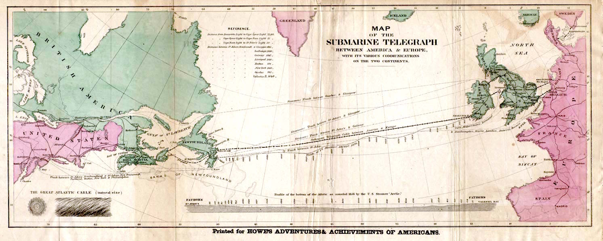

Is everything associated with computers "digital"? If not, what is [digital](https://en.wikipedia.org/wiki/Digital_data) and what is [analog](https://en.wikipedia.org/wiki/Analog_signal)? Is digital better than analog or vice versa?

There is so much confusion around these two terms. This article will try to answer some of these questions.

The word **[digital](https://en.wikipedia.org/wiki/Digital_data)** comes from "digitalis", which means finger or toe in Latin. Since fingers and toes are used for counting things from the very early ages of humanity, **digit** at some point sort of gained another meaning, which is "numerals below 10" (0, 1, 2, 3, 4, 5, 6, 7, 8, 9). That way **digital** came to have a meaning of "using digits".

In computers, everything is bits, and bits can only be 1's and 0's. They cannot be anything in between. Either there is electricity in the wire, or there isn't. Either your lights are on, of off (assuming you're not using a dimmer).

The words **[analog](https://en.wikipedia.org/wiki/Analog_signal)**, **analogy**, and **analogous** all come from the same roots, and all of them are used to describe "the likeness of things". For example, most of the time if you make an analogy, you are trying to find a similar but more relatable example of the same thing, so that you can describe the original thing better.

Analog data is the data with continuous change. If we are using numbers 0 and 1 to define our data, if our data is digital, we can encode our data with 0 or 1, whereas if our data is analog, it can be encoded with 0, 1, and anything in between those. (0.25, 0.332, 0.99, whatever.)

Example time! If you buy some acrylic paint, mix them and paint a flower, your painting is analog. How you mix your colors, how you hold your brush, the position of your hand, everything matters when you are doing an analog painting. If you paint a picture using a computer, your painting is digital (each tiny square that forms your painting, which is called a **[pixel](https://en.wikipedia.org/wiki/Pixel)**, have a specific binary data). If you sing your favorite song in the shower, your song is analog. When you are cooking, if you're following a recipe strictly by measuring everything, your cooking is digital. If you are adding spices and vegetables on a whim without following a set of rules, then your cooking is analog. You can perfectly replicate a digital thing, but replicating an analog thing is very, very hard because how much you try to imitate it, there will always be slight differences. In analog, you have an infinite number of choices, but in a digital setting, you have a limited amount of choices.

The world surrounding us is mostly analog.

Technology until around 40 years ago was mostly analog as well. [Telephone](https://en.wikipedia.org/wiki/Telephone), [phonograph](https://en.wikipedia.org/wiki/Phonograph), [radio](https://en.wikipedia.org/wiki/Radio), [television](https://en.wikipedia.org/wiki/Television), [tape recorders](https://en.wikipedia.org/wiki/Tape_recorder) and [videocassette recorders](https://en.wikipedia.org/wiki/Videocassette_recorder) were all analog devices. Oddly enough, telegraph was digital.

Let's look at an analog phone (also known as a telephone). Maybe you had one in your house when you were a child like I did. It simply contained a switch that connected the phone to a network when the handset was lifted (when connected to the network it made a continuous sound), a speaker at the top side of the handset, and a microphone that was located at the bottom side of the handset. When you talked through the speaker, your sound was converted to an electrical pattern that was the analog of the sound, and through the wires that are directly connected to it, it traveled to another person's phone. There, the electrical signal is converted back to the analog sound. Of course, a system like this needed amplifiers if the sound is traveling long distances, as the electrical signal gets smaller and smaller on the way. When you amplify a signal, possible noise also amplifies as a side effect, so as the electrical data traveled, it got slightly distorted.

Now let's look at a digital phone, the phones we use today. The system is kind of the same, there still is a microphone and a speaker, but the analog data (your voice) is converted to digital data instead of electrical data. It also has a radio transmitter and a receiver. The digital data is broadcasted as the radio waves by the radio transmitter to the nearest cellphone mast. The mast passes the signals on to its base station, and the base station routes the signals to the base station nearest to the destination phone, and then, finally, to the destination phone.

### Why prefer digital over analog?

Why make a digital version of something that was working already?

Because one of the biggest advantages of digital data is, it does not distort, nor have any additional noise. The arriving digital data is as good as the one that was converted at the beginning. The second big advantage of digital data has to do with making copies. When you use something like a tape recorder to make a copy of a vinyl record, as it is a mechanical copy, the copy will be slightly different from the one that's being recorded. And as the record needle touches the vinyl record when it's playing the friction in between will always scrape some tiny amount of the material. Or there might be some other physical insults to the record, like dust or scrapes, and each time a vinyl record is played, it will be slightly different. This means each copy of it will slightly be different too.

Digital data on the other hand, no matter how many times you play it, will always be the same set of 1's and 0's. When you try to copy it, you always get the exact copy. Of course, while it's being converted from analog to digital there will be some data that is lost according to how many bits you choose to encode the loudness, or the sampling rate or to rounding errors, but after a sound is recorded digitally, it can be carried and copied without any loss.

### Bonus: How do telegraphs work?

The telegraph is a long-distance message transmission system that worked in both directions and was invented in the 1830s by [Samuel Morse](https://en.wikipedia.org/wiki/Samuel_Morse). He is also known for his other invention, which is the **[Morse code](https://en.wikipedia.org/wiki/Morse_code)**. What you probably didn't know was he was also a painter, and he was pretty good at it too.

This is his self-portrait:

An [electrical telegraph](https://en.wikipedia.org/wiki/Electrical_telegraph) uses pulses of electricity that travels through wires. The electrical current activates a telegraph sounder which makes click sounds. After making it possible to transmit the click sounds, Morse and his physicist friend Joseph Henry needed to find a way to transmit words and sentences, and that was how Morse code was born. It was initially designed to make marks on a paper tape and then translated into letters. But never underestimate the learning capacity of humans- the operators that worked in telegraph offices learned to interpret the clicks and made the whole process faster. If you think about it, the data is pretty much digital. It cannot be anything in between, it is either a dot or a dash. It is pretty straightforward.

_Image Credit: By Rhey T. Snodgrass &amp; Victor F. Camp, 1922 - Public Domain, https://commons.wikimedia.org/w/index.php?curid=3902977_

In the late 1840s, most developed nations had commercial telegraph networks and many local telegraph offices, and the public could send each other a telegram for a fee. In 1854, the [submarine telegraph cables](https://en.wikipedia.org/wiki/Submarine_communications_cable) were placed on the sea bed, and this allowed communication between continents. The first [transatlantic telegraph cable](https://en.wikipedia.org/wiki/Transatlantic_telegraph_cable) was placed in 1858.

This is the route of the first transatlantic cable:

**Note:** If you're interested in the cable structures, [atlantic-cable.com](https://atlantic-cable.com/Maps/index.htm) has a cool collection of old maps that show submarine and land telegraph lines, and [infrapedia.com](https://live.infrapedia.com/) has an interactive map for showing the modern cables.

**Resources**

1. [Merriam-Webster Dictionary](https://www.merriam-webster.com/)
2. Wikipedia- [Digital data](https://en.wikipedia.org/wiki/Digital_data), [Analog signal](https://en.wikipedia.org/wiki/Analog_signal), [pixel](https://en.wikipedia.org/wiki/Pixel), [Samuel Morse](https://en.wikipedia.org/wiki/Samuel_Morse), [Morse code](https://en.wikipedia.org/wiki/Morse_code), [electrical telegraph](https://en.wikipedia.org/wiki/Electrical_telegraph), [submarine telegraph cables](https://en.wikipedia.org/wiki/Submarine_communications_cable), [transatlantic telegraph cable](https://en.wikipedia.org/wiki/Transatlantic_telegraph_cable)
3. "But How Do It Know" by [J. Clark Scott](http://www.buthowdoitknow.com/index.html)
4. [howstuffworks.com](https://electronics.howstuffworks.com/telephone.htm)
5. [explainthatstuff.com](https://www.explainthatstuff.com/telephone.html)
