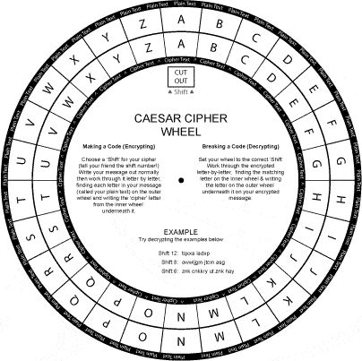

**Cryptography** is the art of taking a text and scrambling it in a very precise way, so only the people who know precisely how you scrambled it can read the original text. Cryptography is very old, and has been used for centuries to protect sensitive information from unwelcomed eyes. It has been used by merchants, by emperors, and today, normal people like us, even if we don't notice it. With the invention of the computer, internet and the world wide web, we started keeping personal information on our personal computers and we send data to each other occasionally. But how do we keep our information safe? That's where cryptography comes into play.

### Symmetric key cryptography

In symmetric key cryptography, you decrypt a message by directly doing the reverse of the actions during encryption process.

One of the first encryptions of humanity happened in Victorian era, by the market traders who didn't want their customers to understand when they were discussing business. It was a language called **Black Slang**, and it basically operated by taking a word and reversing its letters.

If you encode each letter with the next letter in the alphabeth (a becomes b, b becomes c, c becomes d, and so on), this will be called **substitution cypher** (as you are substituting the real letter with another one). It doesn't have to be the next letter in the alphabet, it can be 3 letters next to the original letter. The specific number to indicate the movement of the substitution letter is called the **encryption key.** The original text that is being encrypted is called the **plain text** and the encoded message is called the **cipher text.** Converting plain text into cipher text is called **encryption** and reverse is called **decryption.**

One simple way of encrypting a text with the substitution cypher is using a cipher wheel, and it looks like this:



_Image Credit: https://bobmckay.com/i-t-support-networking/security/caesar-cipher-wheel-printable-pdf/_

The outer letters represent the cipher text, and the inner letters represent the plain text. If the encryption key is 2, you can rotate the inner wheel 2 places clockwise, then the substitutions for the real letters can be read directly from the outer wheel. As the Roman Emperor Julius Caesar used this method to send secret messages to his generals in the battlefield hundreds of years ago, this method of encrypting was called **the Caesar cipher.**

Is there a way to decipher a message that uses substitution cipher technique without knowing the encryption key? Yes, you could try 3 things. First one is the brute-force approach, you mainly start from one and increase the number until the deciphered text makes sense. The second approach is to look at the one letter and two letter words and try to get the encryption key from those words (as there aren't many words in english language that has one and two letters). The third approach is to do a frequency analysis of the cipher text: the letter 'e' is the most used letter in the English alphabeth followed by 't', then 'a', then 'o'. This method is less reliable, especially in the short texts as it depends on the assumptions.

Another substitution technique that uses a word instead of a number as an encryption key is **the keyword cipher,** also known as the Vigenère cipher. This is harder to decrypt if you have no encryption key. The Ceaser cipher can only have numbers 1 to 25 as an encryption key, which means there are only 25 possible keys. But in the keyword cipher, the encryption key can be any word.

Write the keyword under the plain text, as many times as you need to, so that there is a keyword letter for each letter of the plain text. Then write down the position of the key letters in the alphabet.

```
M  E  E  T  M  E  A  T  T  H  R  E  E
C  A  T  C  A  T  C  A  T  C  A  T  C
3  1  20 3  1  20 3  1  20 3  1  30 3

// Now, you use the Caesar cipher, but this time with a key that isn't the same for each letter.

P  F  Y  W  N  Y  D  U  N  K  S  Y  H
```

The keyword in this method is also known as a **symmetric key**, because the encryption process is the same as decryption process. You can also do what is called a double transformation to make the decryption process harder, which is encrypting the encrypted text with a second keyword.

Not all symmetric key cryptography methods use substitution. There are methods that do encryption by simply rearranging letters in the plain text message. **The Rail Fence Cipher** uses rearranging.

For example, let's encrypt this text using the rail fence cipher: 'BIRDS BORN IN CAGES THINK FLYING IS AN ILLNESS'

```
Plain text: BIRDS BORN IN CAGES THINK FLYING IS AN ILLNESS

Exclude the spaces and write the plain text in 2 lines, making a zigzag, like this:

B R S O N N A E T I K L I G S N L N S
 I D B R I C G S H N F Y N I A I L E S

// To compose the cipher text, add the first line to the second one:
BRSONNAETIKLIGSNLNSIDBRICGSHNFYNIAILES

// When decrypting, count the letters in the cipher text.
// In the example, we have 38. This means we are going to need a grid with 2 rows and 38 columns. Arrange the first half by skipping one square at a time, and rest of it to the second column, in a zigzag pattern.
```

If you want to make it harder to decipher, you can use the rail fence cipher with different keys. The example used the encryption key of 2 (plain text was encrypted using 2 rows), but you can always use more rows.

Many modern ciphers use **the XOR cipher.** (XOR: Exclusive OR)

Any key you press on your keyboard has an ASCII code that is sent to the processor of your computer. The ASCII code is translated to binary to be processed.

Let's encrypt the lowercase z using this method.

ASCII code of z is 122.
ASCII code in binary (8 bits): 01111010
Encryption key (Also has to be 8 bits, because the number we are trying to encode is 8 bits, ut can be any combination of 1's and 0's): 01010101
Note: Anybody who wants to decrypt the cipher text has to know this key.

Each binary unit of the plain text will be XORed with the complementing binary unit of the key to form the encrypted binary code. Think of XOR as an arithmetic operation. It will return 0 if both of inputs are the same (both 0 or both 1), otherwise it will return 1.)

| Description  | Binary          |
| ------------ | --------------- |
| Plain Text:  | 0 1 1 1 1 0 1 0 |
| Key(secret): | 0 1 0 1 0 1 0 1 |
| After XOR:   | 0 0 1 0 1 1 1 1 |

The encrypted letter z is: 00101111

When decrypting, put the cipher text and the encryption key and perform XOR operation for every bit. (You do the same thing when encrypting and decrypting and that's why this method is also symmetrical and also very fast. So your data is secure and you can encrypt and decrypt it quickly.)

### Asymmetric key cryptography

To use symmetric key cryptography, both sides has to know 3 things, the cipher text, the encryption key (secret) and the algorithm used for encryption. But what if two sides cannot communicate each other the secret key and the algorithm privately? Then the symmetric cryptography would not be safe enough to use.

Ron Rivest, Adi Shamir and Leonard Adleman suggested using two separate keys to make it safer, one to encrypt the data and another one to decrypt it. The decryption key would be unique to that specific encryption key. These are known as asymmetric keys. The three computer scientists who suggested this system won the Turing award for this work. They also gave their names to this cryptography system, asymmetric key cryptography is also known as the **RSA algorithm.**

So how does this work?

A → B

One side (A) decides to send the other side (B) a secret message, and makes this intention known by (B). (The first communication is A to B. This could be sent as plain text, as this is simply saying 'I want to send a secret message to you.').

A ← B

B uses a program to generate two keys, an encryption key and a decryption key. B sends A the copy of the encryption key, but doesn't send the decryption key. Anyone can have a copy of any encryption key, as they are public knowledge.

A → B

A uses his copy of the encryption key to encrypt his message and he sends it to B. (It's not important if anybody can reach the ciphertext at this point, as only B has the unique decryption key that is not sent anywhere.)

If B wants to send a secret message as well, she can ask A for an encryption key, and the same circle will happen in the reverse direction. Therefore each person in the communication line will have their own encryption keys, and as the decryption keys never leave their own devices, it is safe and they can communicate privately.

A pair of asymmetric keys are often called **public key (encryption key)** and **private key (decryption key).**

RSA is not good for encrypting really long messages, but using this, both sides can agree on a secret key and use symmetric key cryptography for the long encryptions.

Asymmetric key cryptography is the heart of secure internet communication. When you are visiting an online shop or online banking systems, asymmetric key cryptography is going on behind the scenes. Your web browser takes care of encrypting and decrypting messages. You can view the public key your browser is using when you connect to a secure website by clicking to the lock icon in front of the URL of the site.

(Lock Icon > Certificate > Details > Public Key Info > Public Key)
