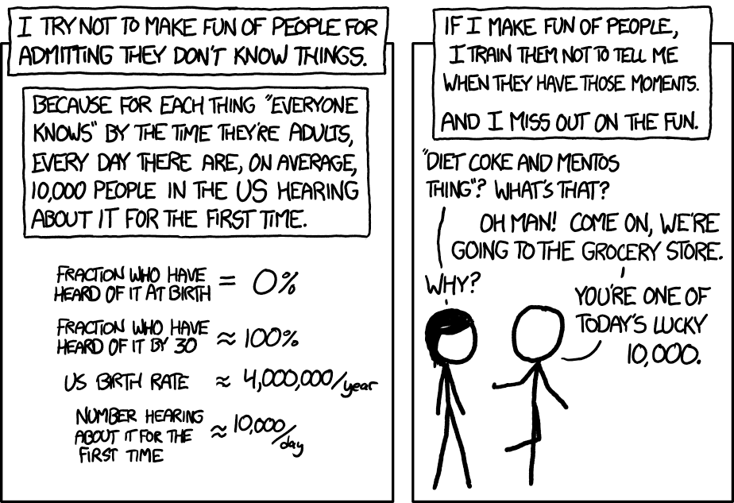

If you want to imitate any piece of code in this article, I simply suggest using the mighty Chrome console. You can open it by using the `Command + Option + J` shortcut in Mac or the `Control + Shift + J` shortcut in Windows.

Let's start by learning how to check the variable types. JavaScript has a simple and very useful operator for this purpose, and that is the **typeof operator.**

We'll go through every data type you see in this example, and some more:

```javascript
typeof 3 // ↪ "number"
typeof "hello" // ↪ "string"
typeof undefined // ↪ "undefined"
typeof null // ↪ "object"
typeof true // ↪ "boolean"
typeof { name: "cake" } // ↪ "object"
typeof [1, "cake"] // ↪ "object"
typeof NaN // ↪ "number"
```

Operators like `typeof`, `++`, `--` and `!` are called **unary operators** because they accept a single value. Operators like >, <, +, -, \*, / are called **binary operators** as they accept two inputs and create a single output.

The data types in JS can be divided into 2 major categories: **Primitive** and **Non-primitive** (or Reference).

### Primitive data types:

###### **String, Number, Boolean, Null, Undefined, Symbols(ES6), BigInt**

What makes primitive values "primitive"?

If we create a variable and link a value to it ( `let a = 5`), it will be stored in memory. If we create another variable and assign it to the first variable that we created (`let b = a`), a copy of the first variable is created and copied to the second variable (in memory, the second variable we created will be kept like this: `let b = 5`).

If you change the value of the first variable (`a = 10`), the second variable created will still be equal to the initial value of a (`b = 5`).

Primitive data types are compared by their values:

```javascript
let a = 5
let b = 5
a === b // true

a = "oh"
b = "oh"
a === b // true

let c
let d
c === d // true
```

Primitive data types are considered **immutable**, which simply means you cannot modify primitive data after it has been created.

Example:

```javascript
let word = "hello"
word[0] = y // This does not throw an error, but it also does not change anything.

console.log(word) // "hello"
```

Now, let's talk about all primitive values one by one:

- **1. String:**

  Strings are just pieces of text. What makes a string a string is the quotation marks around it. It can be double("") or single('') quotes, or backticks(\`\`), it doesn't matter, but you need to be consistent throughout your code. Don't mix both.

  JS uses 16 bits to encode a single string element. But some characters (such as emojis) are represented with two character positions (2 blocks of 16 bits).

  The only arithmetic operator that can be used on strings is +, and it does not add, but it **concatenates**, which is stitching two pieces of string to each other.

  ```javascript
  console.log("crazy" + " " + "bird" + " " + "lady") // prints: crazy bird lady
  ```

  Using **[template literals](https://developer.mozilla.org/en-US/docs/Web/JavaScript/Reference/Template_literals)** is a way to make a string hold bindings (or placeholders). If you want to write a string as a template literal, use backticks(\`\`) instead of quotation marks. And when using a placeholder, place the placeholder inside `${}`. A very simple example is shown in the next code block. You can nest template strings, and they also can hold stuff like ternary operators. You can even create multiline strings if you ever need to. One downside of it is, it is not supported by IE.

  Some methods come built-in with every string and they are extremely useful. You can check them from the [MDN docs](https://developer.mozilla.org/en-US/docs/Web/JavaScript/Reference/Global_Objects/String), or writing `String.prototype` to your chrome console, which will return you the String prototype object.

  <details>
    <summary>Built-in String methods cheatsheet</summary>

  ```javascript
  let color = "yellow";

  // -> Template string:
  console.log(`${color} is the best color`); // Prints: yellow is the best color

  ---------------------------

  // -> Strings have indices, and indices always start with 0. They also have a built-in length property.
  // -> charAt() is a built-in method that gives us the character at a given index.
  // -> charCodeAt() is the built-in method that gives us the UTF-16 code of the character at a given index.

  const sentence = "purple is the new yellow";
  let index = 3;

  console.log(`The character at index ${index} is ${sentence.charAt(index)}`);
  // Prints: The character at index 3 is p`

  console.log(sentence.length); // prints: 24
  console.log(sentence.charCodeAt(index)); // prints: 112

  ---------------------------

  // -> concat() is a built-in method that merges two strings and returns the result as a new string.

  const str1 = 'taco';
  const str2 = 'cat';
  const str3 = str1.concat(' vs ', str2);

  console.log(str3);
  // prints: taco vs cat

  console.log(`${str1}, ${str2}`);
  // prints: taco, cat

  ---------------------------

  // -> endsWith() is a method to determine if a string ends with given characters.
  // -> startsWith() is a method to determine if a string starts with given characters.

  let str = 'To bee, or not to bee!'

  console.log(str.endsWith('!'));  // true
  console.log(str.endsWith('not'));      // false
  console.log(str.endsWith('to bee', 21));  // true
  console.log(str.startsWith('To b')); // true
  console.log(str.startsWith('To bee', 3)) // false

  ---------------------------

  // -> includes() method determines if one string includes another given string.

  const sentence = "yellow is my favorite color";
  const word = "yellow";

  console.log(`The "${word}" word ${sentence.includes(word)? "is" : "is not"} in the given sentence.`)
  // prints: "The "yellow" word is in the given sentence."

  ---------------------------

  // -> indexOf() returns the starting index of a given string. It can take a second argument that will make the search start from that given index.
  // -> lastIndexOf() method does the same thing, but it starts searching from the end of a given string, so it will result in the last occurrence. It takes an optional second argument as an index to start the backward search.
  // Both of them return -1 if the value is not found, and both of them are case sensitive.

  const sentence = "a taco cat loves tacos.";

  const searchTerm = 'taco';
  const indexOfFirst = sentence.indexOf(searchTerm);

  console.log(`The index of the first "${searchTerm}" from the beginning is ${indexOfFirst}.`);
  // prints: The index of the first "taco" from the beginning is 2.

  console.log(sentence.indexOf(searchTerm, 3)); // prints: 17

  console.log(`The index of the 2nd "${searchTerm}" is ${sentence.indexOf(searchTerm, (indexOfFirst + 1))}.`);
  // prints: The index of the 2nd "taco" is 17.

  console.log(sentence.lastIndexOf(searchTerm)); // prints: 17

  ---------------------------

  // -> match() method brings the matching string of a regular expression. (For regular expressions, check the bonus section of this article.)

  const sentence = "Roses are red. Violets are blue.";
  console.log(sentence.match(/[A-Z]/g)); // prints: ["R", "V"]

  // Match method either returns an array that contains the elements that match, or null.

  ---------------------------

  // -> padEnd() method pads the string with a given string (if needed, repeated), until the resulting string reaches the given length. The padding is applied from the end of the given string.
  // -> padStart() method does the same, but the padding is applied from the beginning of the given string.

  const string = "snap peas";

  console.log(string.padEnd(12)); // prints: "snap peas   "

  console.log(string.padEnd(24," yes")); // prints: "snap peas yes yes yes ye"

  console.log(string.padEnd(13," are great")); // prints: "snap peas are"

  console.log(string.padStart(13," are great")); // prints: "snap peas are"

  const year = "1991";
  console.log(year.padStart(10,"**/")); // prints: **/**/1991

  ---------------------------

  // -> trim() method removes white spaces from both ends of a given string.
  // -> trimEnd() method removes white spaces from the beginning of a given string.
  // -> trimStart() method removes white spaces from the end of a given string.

  const str = "   Greetings!   ";

  console.log(str.trim()); // prints: "Greetings!"
  console.log(str.trimStart()); // prints: "Greetings!   "
  console.log(str.trimEnd()); // prints: "   Greetings!"

  ---------------------------

  // -> repeat() method returns a new string with the specified number of copies of a given string.
  // -> replace() method replaces a given string with another given string, but only the first occurrence of it.
  // -> replaceAll() method replaces the matches of a given string with all occurrences of another given string.

  const chirp = 'Chirp. Chirpy chirp. ';
  const birdSong = chirp.repeat(3);

  console.log(`This is how the cardinals sing: ${birdSong}`);
  // prints: "This is how the cardinals sing: Chirp. Chirpy chirp. Chirp. Chirpy chirp. Chirp. Chirpy chirp."

  console.log(birdSong.replace('chirp', 'chiiiiiiiirp'));
  // prints: "Chirp. Chirpy chiiiiiiiirp. Chirp. Chirpy chirp. Chirp. Chirpy chirp."

  console.log(birdSong.replaceAll('chirp', 'chiiiiiiiirp'));
  // prints: "Chirp. Chirpy chiiiiiiiirp. Chirp. Chirpy chiiiiiiiirp. Chirp. Chirpy chiiiiiiiirp."

  ---------------------------

  // -> search() method returns the index of the first occurrence of a match between a given regular expression and a string. If there are no matches, it will return -1.

  let str = "hello Cookie"
  let regExpCapitals = /[A-Z]/g
  let regExpDot = /[.]/g
  console.log(str.search(regExpCapitals))  // prints 6, which is the index of the first capital letter "C".
  console.log(str.search(regExpDot)) // prints -1

  ---------------------------

  // -> slice() method slices a part of the string and returns it as a new string.

  const str = "heaven is a place on earth";

  console.log(str.slice(11)); // prints: "place on earth"
  console.log(str.slice(-5)); // prints: "earth"
  console.log(str.slice(0,6)); // prints: "heaven"
  console.log(str.slice(-8,-6)); // prints: "on"
  console.log(str.slice()); // prints: "heaven is a place on earth"

  ---------------------------

  // -> split() method divides a given string into an ordered list of substrings and puts substrings into an array, and returns the array. The initial string is not changed.

  const str = "Human beings!";

  console.log(str.split(" ")); // prints: ["Human", "beings!"]
  console.log(str.split("")); // prints: ["H", "u", "m", "a", "n", " ", "b", "e", "i", "n", "g", "s", "!"]
  console.log(str.split()); prints: ["Human beings!"]

  ---------------------------

  // -> substring() method returns the part of the string between given start and end indexes.
  // -> \ is an escape character in JS. Special characters (quotation marks, and \) can be written using \ in front of them so that they'll be perceived as normal characters.
  // -> \n is also an escape notation that adds a new line.

  const str = "I\'ll keep coming"

  console.log(str.substring(6,10)); // prints: "keep"
  console.log(str.substring(5)); // prints: "keep coming"

  const poem = "Burn bridges\nand dance naked\nwith your tribe\non the islands\nthat you make.\n-Atticus"

  console.log(poem);
  // prints:
  // Burn bridges
  // and dance naked
  // with your tribe
  // on the islands
  // that you make.
  // -Atticus

  ---------------------------

  // -> toUpperCase() method returns the string value converted to uppercase. (If it's not a string, it will be converted to a string in the process.)
  // -> toLowerCase() method returns the string value converted to lowercase.
  // -> toLocaleLowerCase() method converts the string value to lowercase with specified locale settings.
  // -> toLocaleUpperCase() method

  const str = "2 Red Foxes";

  console.log(str.toUpperCase()); // prints: "2 RED FOXES"
  console.log(str.toLowerCase()); // prints: "2 red foxes"

  const city1 = 'İstanbul';

  console.log(city1.toLocaleLowerCase('en-US')); // prints: "i̇stanbul"

  console.log(city1.toLocaleLowerCase('tr')); // prints: "istanbul"

  const city2 = 'istanbul';

  console.log(city.toLocaleUpperCase('en-US')); // prints: "Istanbul"

  console.log(city.toLocaleUpperCase('tr')); // prints: "İstanbul"

  ---------------------------

  // -> toString() method returns a string version of a given value.

  const areaCode = 407;

  console.log(areaCode.toString(), typeof areaCode.toString(), typeof areaCode); // prints: "407" string number

  ```

  </details>

- **2. Number:**

  Number is a data type that is used to represent integers and decimals.

  Numbers can be used to make simple mathematical operations, such as **addition (+)**, **subtraction (-)**, **multiplication (\*)** and **division (/)**. There is also the **exponential operator**, which is symbolized by **\*\***. (Example: 2 \*\* 3 will be equal to 8.) There are other operators as well, such as the **modulo operator**, which is also known as the "remainder operator". It takes the second operand and divides the first one with it, and returns the remainder that is left. A good way to use a modulo operator is to see if a given number is odd or even. (Use number % 2 for it.)

  Examples for the modulo operator:

  ```javascript
  console.log(25 % 5) // prints 0
  console.log(17 % 5) // prints 2
  console.log(29 % 2) // prints 1 (odd number)
  console.log(32 % 2) // prints 0 (even number)
  ```

  ***

  **A small note:** JS uses a fixed number of bits (to be more precise, 64 bits) to store a Number data. Given 64 binary digits, you can represent 2⁶⁴ of numbers. As numbers can be both negative and positive, one bit is always occupied with this data, leaving us with 63 bits to store the actual number. So integers smaller than 2⁶³ can be represented precisely. But here is another issue: the decimals. Decimals lose precision as many of them need more than 64 bits to store (think of π).

  To sum up, we can treat whole numbers smaller than 2⁶³ as precise, but decimals (fractional numbers) should always be thought of as approximations rather than a precise value.

  Also, if a number is not in the range that can be represented by 64 bits, its value will be **[Infinity](https://developer.mozilla.org/en-US/docs/Web/JavaScript/Reference/Global_Objects/Infinity)** or **-Infinity**, which are also considered as of type Number.

  ***

  There is also the issue of precedence, if there are multiple operations to be taken care of, the order of precedence will be: (You can remember it by the acronym they form: **PEMDAS**)

  **P**arenthesis > **E**xponents > **M**ultiplication > **D**ivision > **A**ddition > **S**ubtraction

  Other data types can be converted to numbers by using the `Number()` function. If it's a value that cannot be converted, it will return **[NaN (Not A Number)](https://developer.mozilla.org/en-US/docs/Web/JavaScript/Reference/Global_Objects/NaN)**. NaN is also of type Number but it doesn't have a numeric value. NaN is also the only value in JS that is not equal to itself.

  ```javascript
  85 === 85
  85 === 85.0
  Number("85") // returns the number 85

  Number("Mordecai") // NaN
  Number(undefined) // NaN
  typeof NaN // "number"

  NaN == NaN //returns false

  0 / 0 = NaN
  NaN + 3 = NaN

  // -0 is also a number in JS. Weird, but here it is:
  0 === -0 // true

  // There is also -Infinity:
  32 / -0 = -Infinity
  32 / 0 = Infinity
  ```

  Some methods come built-in with every number. You can check them from the [MDN docs](https://developer.mozilla.org/en-US/docs/Web/JavaScript/Reference/Global_Objects/String), or writing `Number.prototype` to your chrome console, which will return you the Number prototype object.

  <details>
    <summary>Built-in Number methods cheatsheet</summary>

  ```javascript
  // -> Number.MAX_SAFE_INTEGER static property represents the biggest reliable integer JS can represent as a number.
  // -> JS can only reliably represent numbers between -(2⁵³ - 1) and 2⁵³ - 1. Numbers outside this range can't be compared correctly.
  Number.MAX_SAFE_INTEGER // ↪ 9007199254740991
  Number.MAX_SAFE_INTEGER + 1 === Number.MAX_SAFE_INTEGER + 2 // ↪ true

  // -> Number.MIN_SAFE_INTEGER static property represents the biggest reliable integer JS can represent as a number.
  Number.MIN_SAFE_INTEGER // ↪ -9007199254740991
  Number.MIN_SAFE_INTEGER - 1 === Number.MAX_SAFE_INTEGER - 2 // ↪ true

  //-> Number.isSafeInteger() determines if a given value is a safe integer or not.
  Number.isSafeInteger(10) // ↪ true
  Number.isSafeInteger(10.3) // ↪ false
  Number.isSafeInteger("10") // ↪ false
  Number.isSafeInteger(Infinity) // ↪ false

  // -> Number.MAX_VALUE represents the biggest numeric value a number can hold, beyond this number lies infinity.
  Number.MAX_VALUE // ↪ 1.7976931348623157e+308
  Number.MAX_VALUE * 2 // ↪ Infinity

  // -> Number.MIN_VALUE represents the smallest number that is close to 0 and can be represented within float precision.
  // -> It is NOT the smallest negative number JS can represent.
  Number.MIN_VALUE // ↪ 5e-324

  Number.NaN // represents NaN, same as NaN.
  Number.NEGATIVE_INFINITY // represents -Infinity
  Number.POSITIVE_INFINITY // represents +Infinity

  // -> Number.isFinite() determines if a given value is finite or not.
  Number.isFinite(1 / 0) // ↪ false
  Number.isFinite(22312 / 23) // ↪ true
  typeof 0 / 0 // NaN
  Number.isFinite(0 / 0) // ↪ false

  // -> Number.isInteger() determines if a given value is an integer or not.
  Number.isInteger(0) // ↪ true
  Number.isInteger(12) // ↪ true
  Number.isInteger(-12) // ↪ true
  Number.isInteger(0.3) // ↪ false
  Number.isInteger(NaN) // ↪ false
  Number.isInteger(Infinity || -Infinity) // ↪ false
  Number.isInteger("10") // false
  Number.isInteger(true || false) // ↪ false
  Number.isInteger([1, "a"]) // false

  // -> Number.isNaN() determines if a given value is type of NaN or not.
  Number.isNaN(NaN && Number.NaN && 0 / 0) // ↪ true
  Number.isNaN(10 && "hello" && undefined && true && null) // ↪ false

  // -> Number.parseFloat(str) parses a floating point number from a given string. If it cannot be parsed, returns NaN.
  Number.parseFloat("7.65") // ↪ 7.65
  Number.parseFloat("hello world") // ↪ NaN

  // -> Number.parseInt(str) parses an integer from a given string. If it cannot be parsed, returns NaN.
  Number.parseInt("9.99") // ↪ 9
  Number.parseInt("9.12") // ↪ 9
  Number.parseInt("-9.92") // ↪ -9
  Number.parseInt("") // ↪ NaN
  Number.parseInt("hello") // ↪ NaN

  // -> Number.prototype.toFixed() limits the floating point to a given number.
  let num = 12.3456789
  num.toFixed() // ↪ "12"
  num.toFixed(2) // ↪ "12.35" // Note the rounding!
  num.toFixed(5) // ↪ "12.34568" // Note the rounding!
  num.toFixed(9) // ↪ "12.345678900" // Note the 0's at the end!

  // -> Number.prototype.toLocaleString() returns a language specific implementation of a given string.
  num = 123456789.0
  num.toLocaleString("ar-EG") // ↪ "١٢٣٬٤٥٦٬٧٨٩"
  // As a second argument you can give an optional argument that defines options
  num.toLocaleString("de-DE", { style: "currency", currency: "EUR" }) // ↪ "123.456.789,00 €"

  // -> Number.prototype.toString() returns a string value that represents the given number. You can give an optional base value as an argument.
  let num = 256
  let float = 128.25
  let negativeNum = -256
  num.toString() // ↪ "256"
  float.toString() // ↪ "128.25"
  negativeNum.toString() // ↪ "-256"
  num.toString(2) // ↪ "100000000" // base 2, binary
  num.toString(16) // ↪ "100" // base 16, hexadecimal

  // -> Number.prototype.valueOf() returns the numeric value of a number object.
  const numObject = new Number(123)
  typeof numObject // ↪ "object"
  const numValue = numObject.valueOf() // ↪ 123
  typeof numValue // ↪ "number"
  ```

  You can use three methods to convert a string to a number:

  ```javascript
  let num = "123"
  Number(num) + num // ↪ 123 // ↪ 123
  parseInt(num) // ↪ 123
  ```

</details>

- **3. BigInt:**

  BigInt is the data type that is used for numbers that are larger than 2⁵³ - 1, which is the largest number that can be reliably represented with JavaScript Number data type. To indicate that a value is a BigInt type, you either append "n" to the end of the value or call the BigInt function.

  Example:

  ```javascript
  typeof 198798700707039858n === "bigint" // true
  typeof BigInt("198798700707039858") === "bigint" // true

  typeof 1 // ↪ "number"
  typeof 1n // ↪ "bigint"

  // A bigInt is not strictly equal to a Number
  1n === 1 // ↪ false
  // but they are loosely equal
  1n == 1 // ↪ true
  ```

  Number to BigInt coercion (or otherwise) is not recommended by [MDN docs](https://developer.mozilla.org/en-US/docs/Web/JavaScript/Reference/Global_Objects/BigInt), as it can lead to a loss of precision.

- **4. Boolean:**

  There are only two boolean values: _true_ or _false_. They are really useful for setting flags.

  All values have an inherent _truthy_ or _falsy_ value under their real values. That means, in certain conditions, they will act like boolean values.

  Everything else is truthy except falsy values! And here are the falsy values:

  1.  False (oh, such a coincidence)
  2.  0
  3.  "", '', `` (empty string)
  4.  null
  5.  undefined
  6.  NaN

- **5. Undefined:** If a variable is declared and no value is assigned to it, its value is _undefined_. This is a value, but it is not a meaningful one as it carries no information. In JS, operations return the value of undefined, if they are not supposed to return some meaningful value.

```javascript
let name
typeof name // ↪ undefined
```

- **6. Null:**

  Null and undefined are very similar with a slight difference. They both mean nothing, but null has the connotation of being set specifically to nothing, while undefined has the connotation that that property has never been set at all. For a value to be null, a developer has to explicitly set it to null.

  ```javascript
  let name = null
  typeof name // ↪ null
  ```

- **7. Symbol:**

  Symbol data type was introduced to JavaScript in ES2015. They are a little confusing and they have very special use cases. The most valuable part of a symbol is its uniqueness. You create a symbol by using the `Symbol()` keyword, and any argument it gets (which is also called the symbol name) is used for debugging purposes. It doesn't affect anything. Even if you don't provide any arguments, with each call, the Symbol keyword will create a unique symbol.

  Also, JavaScript does not automatically coerce symbols into strings, if you want strings, you gotta make them yourself.

  ```javascript
  // This is how you create a symbol:

  const bird = Symbol("Cookie")
  console.log(typeof bird) // -> prints: symbol
  console.log(bird) // -> prints: Symbol(Cookie)
  console.log(bird.valueOf()) // -> prints: Symbol(Cookie)
  console.log(bird.toString()) // -> prints: "Symbol(Cookie)"
  console.log(bird.description) // -> prints: "Cookie"

  // Each created symbol is unique and immutable.

  console.log(Symbol("Cookie") === Symbol("Cookie")) // -> prints: false
  console.log(Symbol("Cookie") == Symbol("Cookie")) // -> prints: false

  // Symbols can be used to create private properties, to prevent accidental access or overwriting.
  // If you're working with a third-party API that provides you some sort of information, but you would like to add another key-value pair for your own use, creating keys as symbols will prevent third-party access.

  // This is our third party code:
  let player = {
    name: "Midoritori",
    species: "Night elf",
    occupation: "Monk",
    covenant: "Night Fae",
    mount: "Silky Shimmermoth",
  }

  // Let's say that we want to add an id to this player:

  let id = Symbol(player.name)
  player[id] = 1

  console.log(player[id]) // -> prints: 1

  // To add them in object literal, you need to wrap the Symbol in square brackets:

  let id1 = Symbol("id")
  let pet = {
    species: "parrot",
    name: "Cookie",
    [id1]: 12,
  }
  console.log(pet[id1]) // -> prints: 12

  // JavaScript keeps a global registry of all the Symbols created in that script.
  // If you want to read a specific symbols value, but if it doesn't exist, create one, you use Symbol.for(key):

  let id2 = Symbol.for("id")
  let id3 = Symbol.for("id")
  console.log(id1 === id2) // -> prints: false (for this to be true, we needed to create the id1 with Symbol.for(key) as well.)
  console.log(id2 === id3) // -> prints: true

  // You can also query the symbol name by using Symbol.keyFor(sym):
  console.log(Symbol.keyFor(id2)) // prints: "id"
  ```

  Symbols are not enumerated. You cannot use `for...in`, or `for...of`, or any other loop on them. They will also not show among the the properties of the object when `Object.getOwnPropertyNames()` is used. `JSON.stringify` will also omit the key-value pairs where the key is of type Symbol.

  ```javascript
  let id1 = Symbol("id")
  let pet = {
    species: "parrot",
    name: "Cookie",
    [id1]: 123,
  }

  console.log(Object.getOwnPropertyNames(pet)) // -> prints: ["species", "name"]
  console.log(pet) // {species: "parrot", name: "Cookie", Symbol(id): 123}

  for (let key in pet) {
    console.log(`key: ${key}, value: ${pet[key]}`)
  }
  // -> prints:
  // key: species, value: parrot
  // key: name, value: Cookie
  ```

  Although, the symbols are not completely hidden: you can reach them by using `Object.getOwnPropertySymbols(obj)` static method.

  ```javascript
  // I'm using the object in the example above:
  console.log(Object.getOwnPropertySymbols(pet))
  // -> prints: [Symbol(id)]
  ```

  To sum up, symbols are mostly used for providing unique values. Their use cases, however, are somewhat a little miscellaneous.

### Non-primitive (Reference) data types:

###### **Arrays, Object Literals, Functions, Dates, and anything else...**

In reference data types, when you create a variable, the variable doesn't actually hold a value, instead it holds a pointer to that value. So when you copy a variable, it's the pointer that gets copied, not the value itself.

So if you change the value, all the values of the variables that store a pointer to that value will change. Keep this in mind when you're working with reference type values!

Example:

```javascript
let bird1 = { type: "parrotlet", name: "Cookie" }
let bird2 = { type: "parrotlet", name: "Cookie" }

bird1 === bird2 // false
{} === {} // false
```

Non-primitive data types are mutable, which means you can modify them on the go (unlike primitive values).

Example:

```javascript
let pets = ["Cookie", "Dust", "Dander"]
pets[1] = "Cake"
console.log(pets) // ["Cookie", "Cake", "Dander"]
```
- **1. Function:**
  
  We have seen many built-in functions up until this point, and we'll keep on seeing them, but this is the time we talk about what functions are. Functions are reusable pieces of code that are designed to do certain tasks. Parentheses (\(\)) that follow the 'function' keyword is the most basic way to indicate that a code block will serve as a function. The parentheses may or may not include arguments.

  You have to first define what the function is going to be called and what it is supposed to do, and this is called the **function declaration** or the **function statement**. (The terminology related to this subject are sometimes use synonymously, and although they have some subtle differences, and I'm not exactly sure if they really matter when it comes to everyday programming. For example, function declarations are hoisted to the top of their closures while function expressions are not. This simply means that the declared functions can be used before they were defined, but that won't work with expressed functions. But as a common sense, isn't it better to define functions before calling them anyways?)

  Let's create a function in three different ways:

  ```javascript
    // -> Function declaration:
    function double(num) {
      return num*2;
    }

    // -> Function expression:
    const double = function d(num) { 
      // Here, the inner function has a name that is 'd'. It can call itself and be recursive if it wants to.
      return num*2;
    } 

    // If the inner function doesn't have a name, it will be an anonymous function, and it will look like this: (And it is totally fine if nothing else is referring to the inner function anyway.)
    const double = function(num) { 
      // Here, the inner function has a name that is 'd'. It can call itself and be recursive if it wants to.
      return num*2;
    } 

    // -> Arrow function expression: (Introduced with ES6, fairly new.)
    const double = (num) => {
      return num*2
    };

    // Arrow functions can be simplified. If you have one argument, you can omit the parentheses and if you have a single line of code to execute, you can omit the curly braces and the return statement:

    const double = num =>  num*2; // See how cute and simple this is?
  ```
  You can return or print something with a function, but you absolutely don't have to. If you return nothing from it, it will simply return `undefined`.

  Defining a function will not run that piece of code, it is merely a description. To execute that code, you need to **invoke** or **call** that function.
   
  ```javascript
    // -> Calling a function:
    double(2); // prints: 4
    double(39); // prints: 78
  ```

  A declared function returns us an arguments object, which we can use if we like to.

  ```javascript
  function doesntMatter() {
    console.log(arguments)
  }
  doesntMatter(56, 'hello', true); // prints: [56, "hello", true, callee: ƒ, Symbol(Symbol.iterator): ƒ]
  // The arguments.callee method contains currently executing function. 

  // -> The arrow function has a slightly different syntax called the rest operator:
  const doesntMatter = (...args) => {
    console.log(args)
  }
  doesntMatter(56, 'hello', true); // prints: [56, "hello", true]
  ```

- **2. Object:**

  An object is an _unordered_ data structure consisting key-value pairs. Object keys can be either of type string or symbol, and nothing else. If the value of a property is a function, that key-value pair is called a **method**, otherwise, keys are also known as the **properties** of an object.

  ```javascript
    // -> To create an object literal, wrap the key-value pairs in double curly braces:
    let obj = {
      shape: "rectangle",
      color: "black",
      sides: 6
    };
    console.log(obj); // prints: {shape: "rectangle", color: "black", sides: 6}
  ```
  Notice something weird? I have no quotation marks around the keys. The keys are directly converted to strings without me doing anything, so I can write them without quotation marks too.
  
  ```javascript
    // -> You can get the specific values by using either a dot or square brackets notation:
    console.log(obj.shape); // prints: rectangle
    console.log(obj["shape"]); // prints: rectangle
  ```
  There's a special keyword to indicate the properties of the object itself, and it is **this** keyword. (If you're going to use 'this', don't use the arrow function to define the method. 'this' in arrow functions refer to the window object, not the object you're defining the function in.)
  
  ```javascript
    // Let's add a method to our object and use 'this' keyword as well:
    obj.ring = function() {
      console.log(`This ${this.color} ${this.shape} is ringing!`)
    }
    console.log(obj) // prints: {shape: "rectangle", color: "black", sides: 6, ring: ƒ}
    obj.ring() // This black rectangle is ringing!
  ```

  <details>
    <summary>Built-in Object methods cheatsheet</summary>
    
    ```javascript
      // -> Object.assign() is used to copy an object (without touching the original object)
      const obj = {
        color: "white",
        luckyNumbers: [12, 34, 56] 
      }

      const copyObj1 = Object.assign({}, obj);
      const copyObj2 = Object.assign({hasAnotherProperty: true}, obj);

      console.log(copyObj1); // prints: {color: "white", luckyNumbers: Array(3)}
      console.log(copyObj2); // prints: {hasAnotherProperty: true, color: "white", luckyNumbers: Array(3)}
      ---------------------------

      // -> Object.keys() returns the keys of an object as an array
      // -> Object.values() returns the values of an object as an array
      // -> Object.entries() returns each key-value pair in their own array inside of another array (returns an array of arrays)

      const user = {
        name: "River Song",
        id: 12134343454356
      }

      console.log(Object.keys(user)); // prints: ["name", "id"]
      console.log(Object.values(user)); // prints: ["River Song", 12134343454356]
      console.log(Object.entries(user)); // prints: [["name", "River Song"], ["id", 12134343454356]]
    ```
  </details>

- **3. Array:**

  An array is an _ordered_ data structure consisting values and each value has an index number that corresponds to it. They also have a length property just like strings.

  <details>
    <summary>Built-in Array methods cheatsheet</summary>

  ```javascript
   // -> Array.from() static method creates a new array of a given iterable object. You can use an optional second argument to map the iterable value.

   console.log(Array.from(123)); // prints: [], numbers are not iterable!
   console.log(Array.from("sauce")); // prints: ["s", "a", "u", "c", "e"], strings are iterable!
   console.log(Array.from([1,2,3], x => x+3)); prints: [4, 5, 6]

   ---------------------------

   // -> Array.isArray() static method determines if a given value is an array or not.

   Array.isArray([1, 2, 3]);  // true
   Array.isArray({name: "Elisa"}); // false
   Array.isArray('Elisa');   // false
   Array.isArray(undefined);  // false
   Array.isArray(null);  // false

   ---------------------------

   // -> Array.of() static method creates an array from any given value.

   Array.of(78);       // [78]
   Array.of(1, 2, 3); // [1, 2, 3]
   Array.of("sauce", "apple"); // ["sauce", "apple"]
   Array(8); // creates an empty array with the length property of 8.

   ---------------------------

   // -> concat() method merges two or more arrays and returns the result as a new array.

   const arr1 = ['h', 'i'];
   const arr2 = ["M", "r"];
   const arr3 = ['C', 'a', 't'];

   const arr4 = arr1.concat(arr2);
   const arr5 = arr1.concat(arr2, arr3);

   console.log(arr4); // prints: ["h", "i", "M", "r"]
   console.log(arr5); // prints: ["h", "i", "M", "r", "C", "a", "t"]
   console.log(arr1); // prints: ['h', 'i']

   ---------------------------

   // -> entries() method returns an Array Iterator object that contains key-value pairs for each item on that given array.

   const arr = ['a', 'b', 'c'];

   const iterator = arr.entries();

   console.log(iterator.next().value);
   // prints: Array [0, "a"]

   for(let [index, element] of iterator) {
      console.log(index, element);
   }
   // prints: 0 "a" 1 "b" 2 "c"

   ---------------------------

   // -> every() method tests whether every item in a given array passes the test by a given function, and returns a boolean value in the end.
   // every method on an empty array will return true for any condition.

   const isOver21 = age => age>= 21;

   const arr = [26, 29, 30, 32];

   console.log(arr.every(isOver21)); // prints: true

   ---------------------------

   // -> fill(value, start, end) method replaces values with another value, from a start index (default 0) to an end index (default array.length). It returns the modified array.
   // fill is a mutator method, it will change the array.

   const arr = [1, 2, 3, 4, 5, 6];

   console.log(arr.fill(0, 2, 4)); // prints: [1, 2, 0, 0, 5, 6]
   console.log(arr.fill("hello", 3)); // prints: [1, 2, 0, "hello", "hello", "hello"]
   console.log(array1.fill(6)); // prints: [6, 6, 6, 6, 6, 6]
   console.log(array1); // prints: [6, 6, 6, 6, 6, 6]

   ---------------------------

   // filter() method provides a callback function and calls that callback function for every item in the array, constructs a new array of the values that returns true and returns this new array.
   // filter() is NOT a mutator method, it will return a new array without touching the giving one.

   const words = ['camp', 'marshmallow', 'tent', 'firewood', 'mountain', 'bag'];

   const result = words.filter(word => word.length >= 5);

   console.log(result); // prints: Array ['marshmallow', 'firewood', 'mountain']

   console.log(words); // prints: ['camp', 'marshmallow', 'tent', 'firewood', 'mountain', 'bag'];

   ---------------------------

   // -> find() method returns the value of the first element in the given array that satisfies the testing function provided by the callback function.
   // -> findIndex() method does the same thing, but instead of the value, it returns the index.

   const words = ['camp', 'marshmallow', 'tent', 'firewood', 'mountain', 'bag'];

   const found = words.find(el => el.length > 7);
   const foundNum = words.findIndex(el => el.length > 7);
   console.log(found); // prints: 'marshmallow'
   console.log(foundNum); // prints: 1

   ---------------------------

   // -> indexOf() method
   // -> includes() method
   // -> some() method

  ```
  </details>

- **4. Date:**

#### Logical Operators

JS supports four logical operators, [OR(||)](https://developer.mozilla.org/en-US/docs/Web/JavaScript/Reference/Operators/Logical_OR), [AND(&&)](https://developer.mozilla.org/en-US/docs/Web/JavaScript/Reference/Operators/Logical_AND), [NOT(!)](https://developer.mozilla.org/en-US/docs/Web/JavaScript/Reference/Operators/Logical_NOT) and [NULLISH COALESCING(??)](https://developer.mozilla.org/en-US/docs/Web/JavaScript/Reference/Operators/Nullish_coalescing_operator).

```javascript
// NOT(!) is a unary operator and flips the value to the opposite when used.
console.log(!false) // prints: true

// AND(&&) will return true only if both of the given values are true.
console.log(!false && true) // prints: true
console.log(!false && !true) // prints: false

// OR(||) will return true if at least one of the given values are true.
console.log(true || true) // prints: true
console.log(false || true) // prints: true
console.log(false || false) // prints: false

// Nullish Coalescing(??) will return the rightside value only if the left side is either null or undefined.
// Otherwise, it will return the leftside value.
console.log(null ?? { name: "Barusu" }) // prints: {"name": "Barusu"}
console.log(undefined ?? { name: "Barusu" }) // prints: {"name": "Barusu"}
console.log(0 ?? { name: "Barusu" }) // prints: 0
console.log("" ?? { name: "Barusu" }) // prints: ""
console.log(["red", "apple", 12, false] ?? { name: "Barusu" }) // prints: ["red", "apple", 12, false]
```

**Precedence:** || has the lowest precedence, followed by &&, comparison operators (>, <, >=, <=, ==, ===), which is also followed by the arithmetic operators (PEMDAS), respectively. ! has the highest precedence.

**Peculiar behavior of logical operators:**

The logical operators && and || handle things differently when they are given values of different types.

OR(||) operator checks the leftside value first. If it is true or truthy, it will directly return the first value. If the leftside value is false or falsy, it checks the rightside value. If the rightside value is true or truthy in this situation, it will directly return the rightside value; if it is false as well, then it will return the rightside value.

```javascript
console.log("hello" || null) // prints: "hello"
console.log(0 || "world") // prints: "world"
console.log("!" || 2328) // prints: "!"
console.log(NaN || undefined) // prints: undefined
```

AND(&&) operator works in a different way. It also checks the leftside value first, if it is false or falsy, it directly returns the leftside value. If the leftside value is true or truthy, it returns the rightside value.

```javascript
console.log("hello" && null) // prints: null
console.log(0 && "world") // prints: 0
console.log("!" && 2328) // prints: 2328
console.log(NaN && undefined) // prints: NaN
```

Both of them have the same logic to it: They don't check the value on the right side unless they have to. An || operator will result with true if the leftside value is true or truthy, and in this case the rightside value doesn't matter, so it is short-circuited. Same goes for the && operator, if the leftside value is false or falsy, the result will be false no matter what the rightside value is, so it is never evaluated.

**Ternary Operator:**

We have seen unary and binary operators, but there is also a **ternary operator**, which is also known as the **conditional operator**. Binary operator operates on a single value, binary operator operates on two values, and ternary operator operates on three values. For the syntax, a question mark (?) and a colon (:) is used. Statement before the question mark indicates condition, the statement after that is what will happen if that condition is true, and the statement after the colon is what happens if that condition isn't met.

```javascript
let status = "offline"

// Written with if-else:
let color
if (status === "offline") {
  color = "red"
} else {
  color = "green"
}

// Written with ternary:
let color = status === "offline" ? "red" : "green"
```

#### Type Coercion

Sometimes, JS automatically converts one type to another, especially if a operation is taking place. This is called the **type coercion**.

```javascript
// Null gets converted to 0 when used with mathematical operations:
console.log(null * 10) // Prints: 0
console.log(null + 10) // Prints: 0

// Strings can be converted to number when used with mathematical operations:
console.log("12" - 1) // Prints: 11
console.log("12" * 2) // Prints: 24

// Numbers get converted to strings if used with +:
console.log("12" + 34) // Prints: 1234
console.log(12 + "aa") // Prints: 12aa

// Strings can be converted to NaN when used with mathematical operations:
console.log("eightynine" - 1) // Prints: NaN
```

There are two types of comparison operators, one is the **double equals(==)**, which tests loose equality, the other one is **triple equals(===)**, which tests for strict equality. Double equals perform type coercion, but triple equals doesn't. Triple equals compare both value and data type, but double equals just check for value.

```javascript
console.log(8 == "8") // Prints: true
console.log(8 === "8") // Prints: false

console.log(undefined == null) // Prints: true
console.log(undefined === null) // Prints: false

console.log(false == 0) // Prints: true
console.log(0 == "") // Prints: true

console.log(NaN == NaN) // Prints: false
```

As it behaves loosely and sometimes yields unexpected results, double equals is not much liked by the community. It is strongly recommended to use triple equals for comparison purposes.

#### I hate the endings, but here we are

If a new programmer is reading this, keep rocking on! If you don't understand things, guess what, you're just human. There's always cool people who'll help you understand things. And if you keep trying to learn things, one day you'll become a member of that cool and unique club, so keep on going on.



###### Image Credit: [xkcd](https://xkcd.com/), https://xkcd.com/1053/

Don't miss out all the fun!

**Resources:**

1. [The Modern JavaScript Tutorial- javascript.info](https://javascript.info/)
2. [Memory Management](https://developer.mozilla.org/en-US/docs/Web/JavaScript/Memory_Management), [Expressions and operators](https://developer.mozilla.org/en-US/docs/Web/JavaScript/Reference/Operators) by MDN web docs
3. [JS V8 Engine Explained- hackernoon](https://hackernoon.com/javascript-v8-engine-explained-3f940148d4ef)
4. [Academind](https://academind.com/) - Maximilian Schwarzmüller
5. [Eloquent JavaScript: A Modern Introduction to Programming](https://eloquentjavascript.net/)
6. [w3schools](https://www.w3schools.com/js/)
