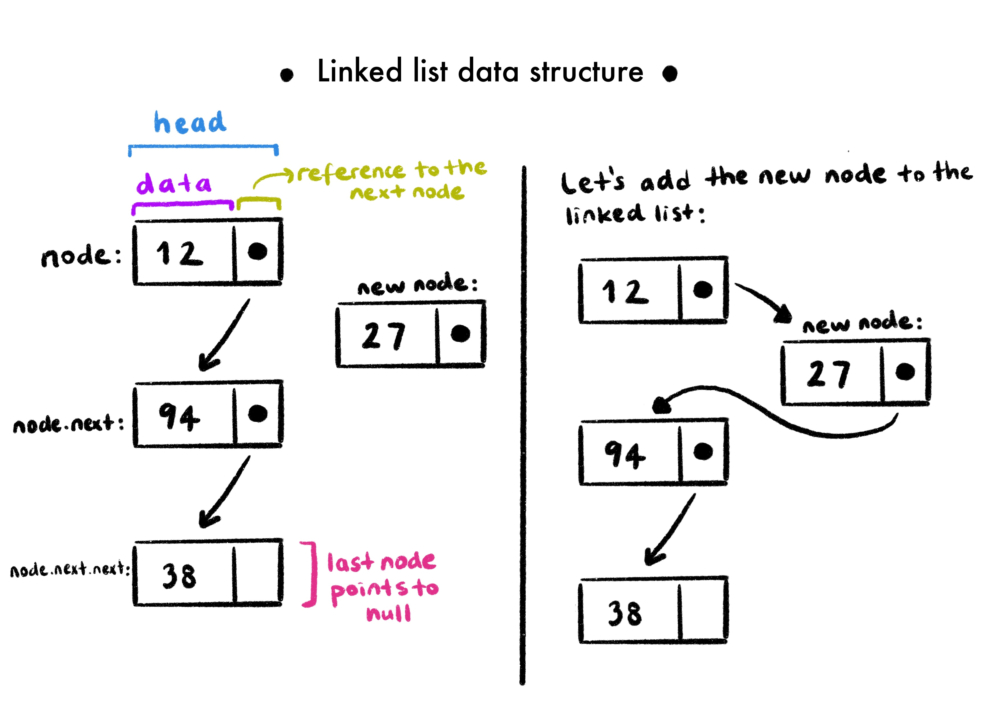
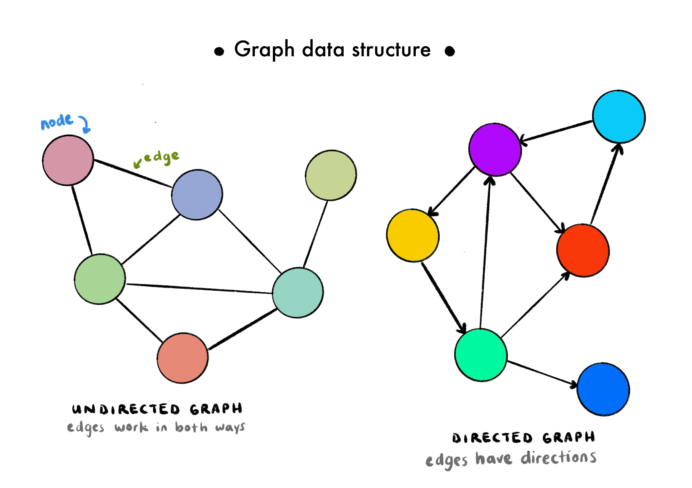
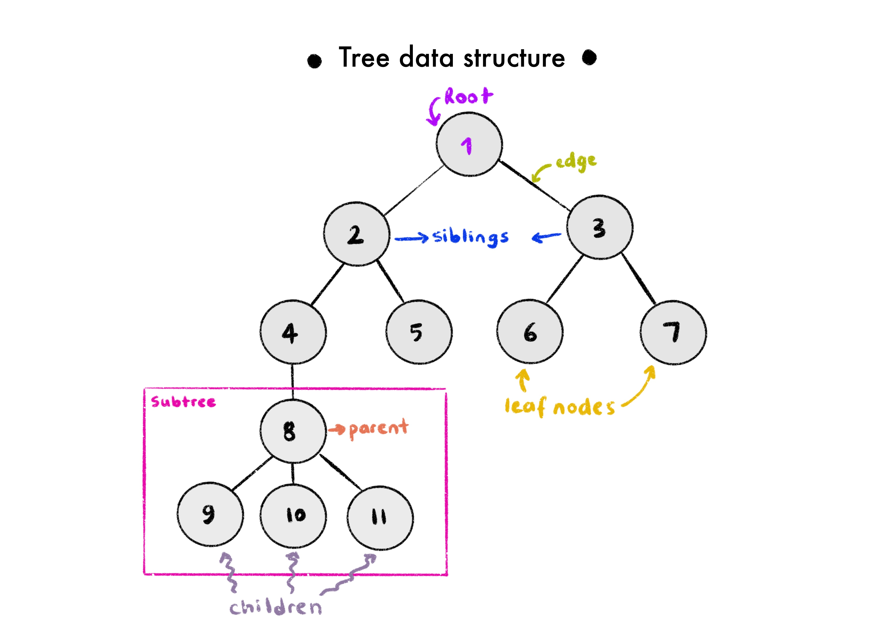
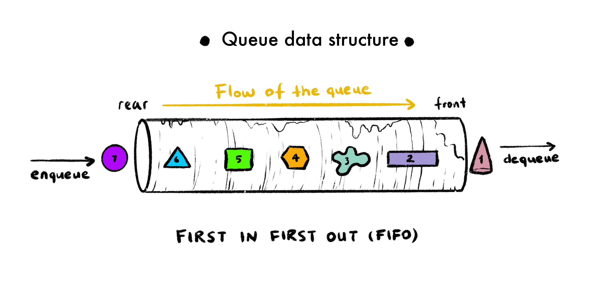
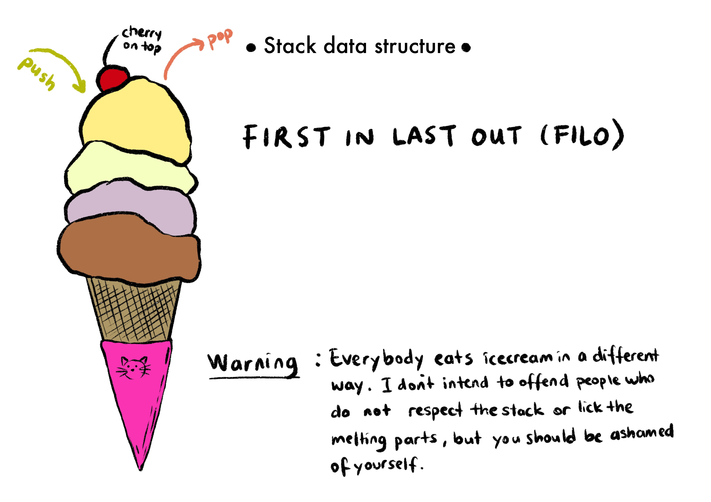

#### Understanding the algorithm

Let's start with the description of an algorithm.

**An algorithm** is a sequence of instructions to solve a problem or accomplish a certain task. Although you are not exactly aware, you do solve a lot of problems using simple algorithms, every day.

For example, this is a very simplified algorithm of me getting out of my house every day, which I assure you, is not as easy as it looks:

1. Stop the alarm
2. Get out of bed
3. Walk to the bathroom
4. Wash face and brush teeth
5. Go to the living room
6. Water the plants
7. Change the birds drinking water
8. Check if the bird has enough seeds
9. If he hasn't, add more seeds. If he has, continue with 10.
10. Get back to the bedroom
11. Get dressed
12. Pack the bag
13. Wear some shoes
14. Walk outside
15. Lock the door

#### Understanding the data structures

Another thing you probably heard about is **data structures.** Data structures are our ways of storing and organizing our data with optimal runtime complexity for accessing, adding, or removing data. It is important how you organize things so that when you're trying to find something, you won't be in so much agony. Think of your closet, you could have tossed every clothing item inside, and you would spend hours trying to find a single thing, every day. Or you can organize it by dividing it into subdivisions using their type (shirt, pants, shorts, hats) or if you're feeling crazier, you can divide these subdivisions by their colors.

The types of data structures used in computer science are **array**, **hash table**, **linked list**, **graph**, **tree**, **queue**, and **stack.** The type of data structure you are using is important because each one of them has a different organization method.

JavaScript natively implements several data structures. The array data structure in JS is very powerful and can do a tremendous amount of things. For example, it covers everything a queue data structure can do, and much more. So you can use a JS array to represent a queue.

Let's talk about them one by one.

**Array**

Think of a box that has tiny little boxes inside of it. Each tiny little box is numbered. The big box is an array, and the numbers on the little boxes are the index numbers of the items inside of an array. Nobody cares what you put inside of the smaller boxes (hell, it can be another set of smaller boxes, which is another array!). But it is easy to get a hold of anything you like, you just go and say, oh I want the thing inside the 8th box, and there you have it.


**Hash Table**

A [hash table](https://en.wikipedia.org/wiki/Hash_table) can also be called a hash map, an object, or a dictionary. It is a data structure that can map keys to values. Think of a box again, it contains many smaller boxes, but this time the smaller boxes have some stuff written on them instead of the numbers. You can think of a phone book too, it has phone numbers inside but each phone number is linked to a name. So this way, if you want to call somebody but don't know their phone number, you just open the book up and look for the person's name (key), and the phone number (value) attached to it.

A hash table uses a hash function to map the indexes (keys) to an array of buckets, which consists of all the values. Ideally, the has function should assign each key to a unique bucket, but collisions are possible.


**Linked List**

[A linked list](https://en.wikipedia.org/wiki/Linked_list#:~:text=In%20computer%20science%2C%20a%20linked,which%20together%20represent%20a%20sequence.) is an ordered collection of data. The collection contains multiple nodes, and each note contains a chunk of data and a reference to the next node (hence the name "linked"). You can think of a chain when you think of a linked list, with each circle being the nodes. In every linked list, there are two special nodes, one is the head node (first node of the linked list), the other one is the tail node (the last node of the linked list). The tail node can easily be identified as the only node that doesn't have a reference to the next node.

There are two distinct parts of each node, one is the data container that can hold any type of data, and the second one is the reference to the next one in the chain. Let's create a very primitive linked list with three nodes as an example:

```javascript
// This is a very simple linked list data structure with only three nodes:

const firstNode = {
  data: 1,
}

const secondNode = {
  data: "two",
}

const thirdNode = {
  data: [3],
}

firstNode.next = secondNode
secondNode.next = thirdNode
```



**Graph**

In the graph data structure, the data points are called **nodes** or **vertices**, and the relationships between them are called **edges** or **connections**.

The graph data structure is used to represent networks, such as a telephone network of a city or a social network like Twitter, Instagram, and Facebook. The relationship between nodes can be bi or unidirectional depending on the design. If they work unilaterally, meaning the connection exists one way but not the other way, then it is called a **directed graph.** If the edges don't have a specific direction (they're active in both ways) they are called **undirected graphs.** Some operations you can perform on a graph data structure is addNode, addEdge, removeNode, removeEdge, contains (to check if a given value is inside the graph), or hasEdge (to check if a certain connection between given nodes exists).

GPS systems and Google Maps also uses a graph data structure to find the shortest path between two given destinations. They use **weighted graphs**, which are graphs that contain edges that have values associated with them. With these "weights", you can present a quantifiable relationship between edges.

Social networks use **unweighted graphs**, which don't have data associated with their edges.



**Tree**

The tree data structure is useful for both back end and front end development. There are different types of trees, but we'll start with the one that is used the most (the most basic type of tree).

Each container on a tree data structure is also called **node**, just like linked lists. Each node holds data and a reference to its children (or branches, you could say). A child is any node directly underneath a given node. And a child node can refer to the node directly on top of it as its parent. Nodes at a given level are called **siblings** if they share the same parent.



Of course, it is possible to traverse through a tree. Tree traversal has different types, but in general, it means to iterate through different elements inside a tree in some fashion. There are 2 major types of tree traversal methods. The order of traversing is what distinguishes the methods of tree traversal. Let's talk about those 2:

1. **Breadth-first traversal:** With this method, we iterate each level of a tree one by one. By that, I mean starting at the root of the tree (where every branch stems), and then go to its children and iterate over all of them, and then go over their children an iterate all over them, and don't reach the next generation before finishing iterating over every member of the current generation.

2. **Depth-first traversal:** With this method, we iterate each branch, and only when all of the subbranches are finished, we start to iterate over another one. But when the first subbranch is traversed, the first thing we do is to hit the bottom branch, iterate over its siblings, then climb to the parent, and iterate over its siblings, until you reach the very top, which is the root. Then you go hit another branch with the same method until all branches are finished.

You can say how a tree of yours should look like. For example, if we say that each node in a tree can only have a maximum of two children, our tree would be called a **binary tree**. If you also want to restrict the values of the nodes you have, it is called a **binary search tree**, and this tree has more strict requirements. Still, a node can only have a maximum of two children, and these children are referred to by their position to the parent (like left and right). So rather than making children an array, the child nodes are assigned to properties named left and right. The left side child cannot have a bigger value than its parent, and the right side child cannot have a smaller value than its parents. The value a single node carries can be named data, value, or key.

To see the JavaScript implementation of a binary search tree, you can check [here](https://github.com/cakebatterandsprinkles/algorithms/blob/main/binary_search_tree/index.js).

**Queue:**

A queue is also like a container of sorts, where pieces of data enter from one end and exit from the other. The best way to imagine a queue is to imagine a real-life queue, where you're going to buy a train ticket or a movie ticket. A person has to enter the line from the end, and wait until it's his/her turn, buy the ticket and leave the line. Skipping or cutting in line is strictly prohibited, so the order does matter. The process of adding data into a queue is called **enqueuing**, and removing data from the queue is called **dequeuing**.

A queue follows _First In First Out principle_ (FIFO for short), which means whenever we attempt to remove anything from the queue, it will always be the one that's closest to the endpoint of the queue. So the first one in will always be the first one out.

There is not a queue data structure that is implemented in JS, but there is a data structure called an array, which can do whatever a queue can do and many more. While you can interact with a JS array in many ways, a queue has a very tiny API attached to it, which only can add and remove records. So in JS, whenever you want to implement a queue from an array (to restrict other methods to interact with an array), you can make a queue class and use two built-in array methods, and you are done. For adding records to a queue, you'll need `array.unshift()`, and for removing records, you'll need `array.pop()`. You can see the queue implemented from a JS array from [here](https://github.com/cakebatterandsprinkles/algorithms/blob/main/queue/index.js).



**Stack:**

The stack data structure is extremely similar to the queue data structure.

In the stack data structure, data also lives in some sort of a container. Adding data to a stack is called **pushing** and removing data from a stack is referred to as **popping**.

A stack follows _First In Last Out principle_ (FILO for short), which means whenever we attempt to remove anything from a stack, it will always be the last one that has been added to the stack. So the first one in will always be the last one out.



Think of a stack of books. The topmost book in the stack is the last book you put there, and if you remove that book, the topmost book becomes the one before the last book you put there. If you try to grab a book from the middle, the stack could collapse, so removing stuff in between is strictly prohibited. So the only way to work with this book stack is to pick the last one you put.

An example of a stack we daily use is the browser's back button. When you visit a new website, that URL is pushed on top of a stack. If you click a hyperlink and visit a new one, it is again pushed on top of the stack, making it the topmost URL. When you press the back button, it will pop off the topmost URL in the stack.

The built-in functions for stack data structure manipulation in JS are **push** (to place data on the topmost layer on a stack), **pop** ( to remove the data on the topmost layer on the stack), **peek** (to display the topmost element in the stack), **length** (to determine how many items there are on the stack).

Just like a queue, the stack data structure can be implemented from a JS array. You can see an example from [here](https://github.com/cakebatterandsprinkles/algorithms/blob/main/stack/index.js).

#### Finally, Big O

There are many problems in the world, and on many occasions, a problem can be solved in multiple ways. In real life, we try to choose the best solutions by making pro-con lists, trying to compare the side effects of each option. Computer science uses Big O notation for the same purpose, to describe the performance or complexity of an algorithm. There might be multiple valid solutions (algorithms) to solve a single problem, and each of them might be using a different approach. With each algorithm, Big O decides the worst outcome possible, and when comparing algorithms we compare their worst outcomes. The big O notation also provides a common vocabulary to talk about the performance of a code block. Unfortunately, it is really hard to express real-life problems as mathematical equations, so big O is kinda useless outside of its forte. In the end, what we try to do is the same: try to find the best, the most efficient solution.

Now let's talk about how we decide if an algorithm is efficient or not. We look at _the time it takes to do the work, the amount of memory it uses, the amount of secondary storage space it needs._ The performance of an algorithm also depends on the capabilities of the computer it is running on. You also have to think of scalability- what happens when the amount of data the algorithm has to deal with increases? (Common sense tells us that solving a problem takes longer when there is more data to work on. But it is not necessarily always true.) The code also needs to be readable so it can be maintained.

#### Runtime Complexity

Runtime complexity describes the performance of an algorithm in terms of how much processing power/time is required to run the algorithm if you increase the input size. For comparing algorithms, software engineers had to come up with a certain common language, which brings us to the Big O.

#### The order of magnitude

To get an idea of how complex and algorithm would be, we can count the number of simple operations the computer has to perform.

The complexity of the algorithm is shown next to a capital O, inside of parenthesis, like this: **O(n).** Let's break this syntax down. O(n) is short for "Order of n", as O is known as the Order function. This is a simplified version of something called **[the order of magnitude.](https://en.wikipedia.org/wiki/Order_of_magnitude)** Now I'm not a mathematician so I'll keep this as simple as possible. The order of magnitude of a number can be defined as the number of powers of 10 contained in the number. We use it in our daily lives too, think of the phrase "x figure income". If it is a 6 figure income, the order of magnitude is 5. As an example, let's think of a random 6 figure income, such as 300.000, this number has 5 powers of 10, and it is multiplied by 3. But 3 is less than 10, so we round it to the nearest power of 10. If the number we were working with was 600.000, the order of magnitude would have been rounded to 7. The order of magnitude provides **approximation** on a logarithmic scale, not an actual number. Another example that could be given is on a planetary scale, the mass of [Saturn](https://en.wikipedia.org/wiki/Saturn) (5.683 × 10^26 kg) is 95 times that of [the Earth](https://en.wikipedia.org/wiki/Earth) (5.972 × 10^24 kg), so Saturn is two orders of magnitude more massive than Earth.

#### Comparing Typical Big Os

We have seen that Big O was just a way of defining the complexity of the algorithms, and it is all about the approximation of the worst case possible. It doesn't show the time or the space running that algorithm would take. It is an evaluation made based on the number of operations that are going to be performed.

Let's see the typical Big O's and what they mean.

**O(1)**

O(1) describes constant-time, an algorithm that will always execute in the same time (or space) regardless of the size of the input data set. If you can create an algorithm with the complexity of O(1), it doesn't get any better than this.

Let's see an example:

```javascript
const findLast = arr => arr[arr.length - 1]

findLast(["Holly", "Sally", "Catherine", "Jack", "Emma"]) // prints "Emma", complexity O(1).

findLast([
  "Holly",
  "Sally",
  "Catherine",
  "Jack",
  "Emma",
  "Conny",
  "Marcus",
  "May",
  "June",
  "Violet",
  "Gumball",
  "Darwin",
]) // prints "Darwin", complexity O(1).
```

Regardless of the number of items in a given array, the time of a single iteration will be constant. No matter the size of the given array, this function will iterate over it just a single time, so the complexity of this algorithm is O(1).

**O(log(n))**

O(n²) describes a logarithmic-time algorithm.

Logarithms (log for short) were discovered by a mathematician named **John Napier** in the 1500s. Simply put, logarithms are the inverse of exponentiation, just like subtraction is the inverse of addition or division is the reverse of multiplication.

Let's see an example, and get used to the related terminology:

2³ = 8 (2 to the power of 3 is 8. 2 is the base, 3 is the exponent.)

log₂(8) = 3 (base 2 log of 8 is equal to 3.)

O(log(n)) describes a logarithmic complexity, which means the running time of the algorithm grows in proportion to the logarithm of the data size. For example, if 10 items take x amount of time, 100 items will take 2x, and 1000 items will take 3x.

The best example of an algorithm that has a complexity of O(log(n)) is **the binary search algorithm.** A binary search is used to search an ordered list for a particular value. It has a divide and conquer approach. The target value is compared with the middle value, then half of the list is discarded until the target is found. This method is very efficient for large, sorted lists. This is also a recursive approach because we are repeatedly solving smaller and smaller versions of the same problem.

A very common analogy that explains binary search very well is the telephone book example. The telephone book has the names and phone numbers of everyone that lives in a certain area in the alphabetic order. If you are looking for somebody specific, you can just open the midsection, and the person you are looking for will be on one of the two sides (or maybe it will be on that specific page if you're crazy lucky). As it is in alphabetic order, you don't need to think of the other half anymore, so you can even rip the book apart get rid of the irrelevant side. You can do the same thing until you find the person you're looking for.

**O(n)**

O(n) describes a linear-time algorithm. The worst-case scenario entails a calculation or an iteration done **n** times, with **n** being the data size.

Let's see an example:

```javascript
const findIndex = (arr, item) => {
  for (let i = 0; i < arr.length; i++) {
    if (arr[i] === item) {
      return i
    }
  }
  return -1
}

// Best case scenario:
findIndex(["Holly", "Sally", "Catherine", "Jack", "Emma"], "Holly") // prints 0, complexity O(1) (Found the item on the first iteration.)

// Worst case scenario:
findIndex(["Holly", "Sally", "Catherine", "Jack", "Emma"], "Emma") // prints 4, complexity O(5) (Found the item on the first iteration.)
```

An unordered list is searched for a particular value and each value on the list is compared to a target value. This is a brute-force approach that is usually implemented with a simple loop. This is called a **linear search algorithm.** There is a simple relationship between the size of the data and the time it is going to take. The time taken is directly proportional to the amount of data. For n items, the time taken is equal to some constant multiplied by n.

The complexity of the algorithm is highly dependent on the data size, so this algorithm has a complexity of O(n).

**O(n log(n))**

O(n²) describes a quasilinear-time algorithm.

One of the examples of an algorithm that has a complexity of O(n log(n)) is the **merge sort algorithm.** This algorithm sorts the data in a list. It works by splitting each list into sublists, each of them containing 1 item at first, therefore each sublist is sorted. It merges the sublists by 2, sorting as it merges. In the end, it results in a single sorted list. This is usually the most efficient approach if you're dealing with large lists.

Another example would be **the quick sort algorithm.** This algorithm deals with a large list by selecting a random pivot number, and sets 2 pointers, one to the beginning of the list (let's name it left side pointer), and one at the end of the list (and this could be the right side pointer). Each value the pointers point at is compared to the pivot value, and for example, until the left side pointer value is bigger than the pivot value, it will keep moving to the one right next to it. The same goes with the right pointer until it finds a value smaller than the pivot value, it skips to the one next to it. When both of the pointers find what they are looking for, they exchange values and continue doing the same thing until the whole list is sorted.

**O(n²)**

O(n²) describes a quadratic-time algorithm.

**O(2ⁿ) and memoization**

O(2ⁿ) describes an exponential-time algorithm. If an algorithm uses exponential runtime, it means it can be written better, so try not to accept a solution that has an exponential runtime. For example, the recursive solution to the Fibonacci problem that is shown [here](https://github.com/cakebatterandsprinkles/algorithms/blob/main/fibonacci/index.js) as the fib2 function has exponential runtime. For an n of 5, this function calls fib(4) and fib(3), and both of them call the same function with smaller numbers until it returns with a number, not caring about calling the same functions as each other, so it is very much ineffective as well.

Now here's the golden question: Is there any way we can improve this recursive solution's runtime?

The answer is yes! And it is called **[memoization](https://en.wikipedia.org/wiki/Memoization#:~:text=In%20computing%2C%20memoization%20or%20memoisation,the%20same%20inputs%20occur%20again.)**.

Memoization is the act of storing the arguments of each function call as well as the result. So if the function is called with the same arguments multiple times, the function will return the stored result instead of running that function again. So when you memoize a function, you cache the arguments and the computed results.

Now it's time to refactor the recursive solution. For that, we write a memoizer function that will take our ineffective recursive function and return a fast, memoized Fibonacci function. So the memoizer function will be a function that will return a better version of our old fib2 function. Check the fib3 example from [here](https://github.com/cakebatterandsprinkles/algorithms/blob/main/fibonacci/index.js).

**O(n!)**

The overall comparison between these Big Os look like this:


###### Image Credit: [Big O Cheatsheet](https://www.bigocheatsheet.com/)

Other than the complexities explained here, there are 2 more:

**O(nᵏ)**

O(nᵏ) describes a polynomial algorithm.

Time taken is proportional to the amount of data raised to the power of a constant. (n: data size, k: constant)

**O(kⁿ)**

O(kⁿ) describes an exponential algorithm.

Time taken is proportional to a constant raised to the power of the amount of data. (n: data size, k: constant)

#### Space Complexity

Simply put, space complexity answers this question: _How much additional memory do we need to allocate to run our algorithm?_

Most primitives (booleans, numbers, undefined, null) are constant space! They take the same amount of space. Strings require O(n) space, n being the string length. Reference types are generally O(n) (for arrays => n = array length, for objects => n = number of keys).

Example-1:

```javascript
function sum(arr) {
  let total = 0
  for (let i = 1; i <= arr.length; i++) {
    total += arr[i]
  }
  return total
}
```

Let's break up the space we need for this single sum function:

We have a variable named "total" and a variable named "i". Other than these two variable declarations, we have nothing that takes up space. Of course, a calculation is being made, but the space we need for that calculation is already reserved at the second line of the code.

This means this algorithm always requires constant space, no matter what the input is. So the big O for space complexity for this algorithm is O(1).

Example-2:

```javascript
function double(arr) {
let newArr = [];
for (let i = 1; i <= arr.length; i++) {
newArr.push(2 \* arr[i]);
}
return newArr;
}
```

In this example, as the input length approaches infinity, the length of the array will be increasing directly proportionate to the length of the given array. This means the big O for space complexity of this algorithm is O(n).

#### Analyzing the Performance of Arrays and Objects

**Simplifying Big O, The Rule**

1. _Constants don't matter:_

   O(2n) will simplify to O(n). O(13n^2) will simplify to O(n^2). O(500) will simplify to O(1).

2. _Arithmetic operations & variable assignments are constant!_

   O(100n+20) will simplify to O(n).

   O(5n^2 + 100n + 8) will simplify to O(n^2) -> n becomes too small when compared to n^2, so it can be neglected!

3. _In a loop, the complexity is the length of the loop times the complexity of whatever happens inside of that loop!_

   Note: If a function has more than one for loops(not nested), the for loops will each have O(n). In the end, the function itself will have an O(n). But for example, if a function has a single nested for loop, it will have an O notation of O(n^2).

**Big O of actions related to objects:**

- Insertion -> O(1)
- Removal -> O(1)
- Access -> O(1)
- Search -> O(n)

**Big O's of object methods:**

- Object.keys -> O(n)
- Object.values -> O(n)
- Object.entries -> O(n)
- hasOwnProperty -> O(1)

**Big O of actions related to arrays:**

- Insertion -> If you are inserting to the end of the array (push) it is O(1). If you insert an item to the beginning of an array (unshift), it becomes O(n), because you will be changing the indices of every item on that array.
- Removal -> If you are removing from the end of the array (pop) it is O(1). If you remove an item from the beginning of an array (shift), it becomes O(n), because you will be changing the indices of every item on that array.
- Access -> O(1)
- Search -> O(n)

**Big O's of array methods:**

- push -> O(1)
- pop -> O(1)
- shift -> O(n)
- unshift -> O(n)
- concat -> O(n)
- slice -> O(n)
- splice -> O(n)
- sort -> O(n\*log(n))
- forEach/map/filter/reduce -> O(n)

Note: Accessing elements in an array (by index) or object (by key) is constant!

#### Sorting Algorithms:

There are many types of sorting algorithms, all working in different ways. I am going to discuss the most common four, which are **bubble sort**, **selection sort**, **merge sort**, and **quick sort**.

Bubble sort and selection sort have the same worst-case runtime (n²), which makes them a bad choice for big datasets. If your dataset is expected to grow bigger in time, or you just don't know if it will ever get bigger, other algorithms with better worst-case runtimes will work better.

Merge sort has a complexity of O(nlog(n)), which is better than bubble sort and selection sort, but it is a little bit harder to implement. Quicksort also has a time complexity of O(nlog(n)).

Now let's implement these together.

**◉ Bubble Sort**

Bubble sort is composed of nested for loops, one of them iterating over the whole array, and the other one creates a smaller bubble inside to compare two consecutive values in order. If the value in index-1 is bigger than the value in the index, they will be switched, essentially carrying the biggest values to the end of the array with each iteration. Also, with each iteration, the inner bubble gets smaller, because you know that you carried the biggest number inside the current iteration is carried to the end, so you don't need to check the last item anymore.

The implementation looks like this:

```javascript
function bubbleSort(arr) {
  for (let i = 0; i < arr.length; i++) {
    for (let j = 0; j < arr.length - i - 1; j++) {
      let num1 = arr[j]
      let num2 = arr[j + 1]
      if (num1 > num2) {
        arr[j] = num2
        arr[j + 1] = num1
      }
    }
  }
  return arr
}
```

**◉ Selection Sort**

Selection sort is very similar to bubble sort and is consisted of nested for loops. This time, when you're iterating through the array, you assume that the value you are iterating over is the lowest value in the array, and if you see a lower value, you swap the current value with that one.

The implementation looks like this:

```javascript
// I will use a helper function to swap the values in given indexes:

function swapper(arr, index1, index2) {
  let value1 = arr[index1]
  arr[index1] = arr[index2]
  arr[index2] = value1
}

function selectionSort(arr) {
  for (let i = 0; i < arr.length; i++) {
    let indexOfMin = i
    for (let j = i + 1; j < arr.length; j++) {
      if (arr[j] < arr[indexOfMin]) {
        indexOfMin = j
      }
    }

    if (indexOfMin !== i) {
      swapper(arr, indexOfMin, i)
    }
  }
  return arr
}
```

**◉ Merge Sort**

Merge sort algorithm is generally implemented with recursion. The recursive solution uses two separate functions. The first function takes two sorted arrays, compares the first index of both arrays, pushes the smallest one to a results array, and continues doing it until nothing is left on at least one of the arrays. The first function returns a combined sorted array from two separate sorted arrays.

Second function takes an array, divides the array into two parts. Until there are subarrays that only consist of one value, the function keeps on calling the mergeSort function. When each subarray has only one value, it means each subarray is sorted, and then we can merge them using the first function. The implementation is below:

```javascript
// The first function:

function merge(sortedArr1, sortedArr2) {
  const results = []
  while (sortedArr1.length && sortedArr2.length) {
    for (let i = 0; i < sortedArr1.length; i++) {
      if (sortedArr1[0] < sortedArr2[0]) {
        results.push(sortedArr1.shift())
      } else if (sortedArr2[0] < sortedArr1[0]) {
        results.push(sortedArr2.shift())
      }
    }
  }
  return [...results, ...sortedArr1, ...sortedArr2]
}

// The second function:

function mergeSort(arr) {
  if (arr.length === 1) {
    return arr
  }

  const center = Math.floor(arr.length / 2)

  let left = arr.slice(0, center)
  let right = arr.slice(center)

  return merge(mergeSort(left), mergeSort(right))
}
```

**◉ Quick Sort**

Quick sort algorithm also requires recursion. You define the middle element of the given array as the pivot, and put two pointers, one pointer to the start of the array (leftIndex) and one pointer to the end of the array (rightIndex). You compare the value of the leftIndex to your pivot, and until you find an element that is greater than the pivot, you move your pointer to the one next to it. You also move your right pointer the one next to it until you find a value that's smaller than the pivot. Swap these two values, and continue until you meet at the pivot. Then sort the subarrays that are positioned left and right to the pivot the same way.

```javascript
// this function will swap the leftIndex and rightIndex
function swap(items, leftIndex, rightIndex) {
  let temporaryVariable = items[leftIndex]
  items[leftIndex] = items[rightIndex]
  items[rightIndex] = temporaryVariable
}

function partition(items, left, right) {
  let pivot = items[Math.floor((right + left) / 2)] // choose the middle element as the pivot
  let i = left // assign a left pointer
  let j = right // assign a right pointer
  while (i <= j) {
    while (items[i] < pivot) {
      i++
    }
    while (items[j] > pivot) {
      j--
    }
    if (i <= j) {
      swap(items, i, j)
      i++
      j--
    }
  }
  return i
}

function quickSort(items, left, right) {
  let index
  if (items.length > 1) {
    index = partition(items, left, right) //index is returned from the partition function
    if (left < index - 1) {
      // it means there are more elements on the left side of the pivot, time to quicksort those!
      quickSort(items, left, index - 1)
    }
    if (index < right) {
      // it means there are more elements on the right side of the pivot, time to quicksort those!
      quickSort(items, index, right)
    }
  }
  return items
}

// Let's call quicksort with an array
let numberArray = [6, 2, 12, 8, 4, 7, 101]
let sortedArray = quickSort(numberArray, 0, numberArray.length - 1)
console.log(sortedArray) //prints [2, 4, 6, 7, 8, 12, 101]
```

JavaScript has a built-in `sort()` function that sorts given arrays in ascending order. Then why do we need all these other algorithms if we have that?

Default `sort()` function in JavaScript is implemented with insertion sort in Chrome's V8 Engine, and it is implemented with merge sort algorithm in the JS engines of Mozilla Firefox and Safari.

#### Resources:

1. Wikipedia
2. [Know Thy Complexities!](https://www.bigocheatsheet.com/) by Eric Rowell
3. [Big-O notation explained by a self-taught programmer](https://justin.abrah.ms/computer-science/big-o-notation-explained.html) by Justin Abrahms
4. [What is Big O Notation Explained: Space and Time Complexity](https://www.freecodecamp.org/news/big-o-notation-why-it-matters-and-why-it-doesnt-1674cfa8a23c/) by Shen Huang
5. [Big O Notation in JavaScript](https://medium.com/cesars-tech-insights/big-o-notation-javascript-25c79f50b19b) by César Antón Dorantes
