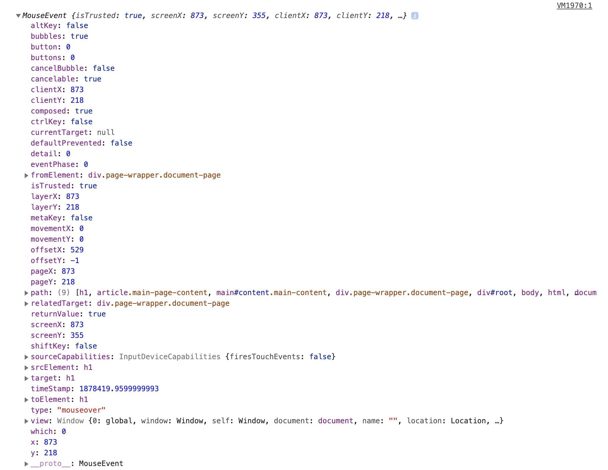

### What is DOM?

The **Document Object Model** (aka, the DOM) is a structured representation of an HTML document where each HTML element is represented as objects, an interface between HTML+CSS and JavaScript code created by the browser.

Every element inside an HTML file is represented as objects and these representations are tucked inside a single, bigger object called **[the document object](https://developer.mozilla.org/en-US/docs/Web/API/Document)**. The DOM represents the document as a node tree. A **node** represents a part of the document and the hierarchy between the elements is kept intact. The root is the topmost object in a tree-like data structure, so in DOM's case, the root element (who is also everyone's parent) is the document object.

The DOM object is loaded by a browser. The topmost object in the browser is **[the window object](https://developer.mozilla.org/en-US/docs/Web/API/Window)**. Each tab is represented by its own Window object.

You can check out the document object by writing `console.dir(document)`, and the window object by writing `console.log(window)` to your browser console.

**But why do we care?** Because the DOM structure allows us to interact with the HTML document. Nodes can be modified, created, removed, and moved by using the methods and properties the document and the window object provide us. We can add event listeners to do something when a certain event happens. And that means one thing: Interactive webpages!

---

This article will consists of 4 main titles:

1. [Selecting](#selecting)

2. [Manipulating](#manipulating)

3. [Listening for an event](#event-listeners)

4. [navigator, location, and history objects](#nav-loc-his)

---

<div id="selecting"></div>

### 1. Selecting:

To tickle your friends, you need to catch them first. So this is the first step of manipulating the DOM, and there are various ways to do catch the node you want. Let's see them all:

**❣ `document.getElementById("")`** -> This will return a single object with that id. There shouldn't be a situation like this, but if somehow there are two matching ids in the document, it will return the first one matching. If there's nothing with that id, it will return null.

**❣ `document.getElementsByTagName("")`** -> This will return an _HTML collection_ that consists of all of the objects with the specified tag. If there is nothing matching, it will return an empty HTML collection.

An **[HTML collection](https://developer.mozilla.org/en-US/docs/Web/API/HTMLCollection)** is an array-like list. You can't use array methods on it (as it's not an array), but it has a `length` property and you can access objects inside with the square bracket notation. You can also iterate over it with a for...of loop. It has two available methods: the `.item()` method accepts a number and returns the element at the specified index number, and the `.namedItem()` method takes an id and returns the element with that id in the given HTML collection. If you need an array of the nodes you need, you can always spread the HTML collection inside an array.

**❣ `document.getElementsByClassName("")`** -> This will return an _HTML collection_ that consists of all the objects with a specified class name. If there is nothing matching, it will return an empty HTML collection.

**❣ `document.querySelector("")`** -> This takes any type of CSS selector (id, class, tag name) but it will only return the first thing it finds. To indicate a class, use a dot (.) and to indicate an id, use an octothorp (#) at the beginning of the query parameter.

You can look for nested objects as well: **`document.querySelector("div a.special")`** means you request the first anchor tag that has a class named special and is nested inside a div.

**❣ `document.querySelectorAll("")`** -> This one takes any type of CSS selector returns all matching elements as a _Node List_.

A **[node list](https://developer.mozilla.org/en-US/docs/Web/API/NodeList)** is another type of array-like collection. A slight difference between an HTML collection and a node list is that a node list has forEach method available to it while an HTML collection doesn't. Also, an HTML collection can contain only the element nodes, but a NodeList can contain any type. But you can use for...of loop or regular for loop for both of them.

**❣ Traversing the DOM: (parentElement, children, nextSibling, previousSibling)** These methods allow you to access other elements based on the current element you're working with. Think of a very simple HTML document, that has a single unordered list inside the body tags, and inside that unordered list, there are 3 list items. The parent of any list item is the unordered list, the parent of the unordered list is the body, the parent of the body is the HTML document and the parent of the HTML document is null (doesn't exist). If you go the opposite way, all the list items are unordered list's children, the unordered list is body's children and the body is the html tag's children. List items are siblings to each other.

The children property will return an _HTML collection_ that consists of all the nested elements of the specified node.

There are other properties such as nextElementSibling and previousElementSibling, which chooses the next and previous "element" siblings, skipping over text and comment nodes.

<div id="manipulating"></div>

### 2. Manipulating:

Now that we can get a hold onto the whichever node we want, it's time to manipulate them. You basically select a node, and chain the methods or properties you want to use, like so:

```html
// Some very simple HTML code:
<div class="wrapper">
  <h1>Manipulating the DOM is fun!</h1>
  <h2>Everybody can do it.</h2>
  <ul id="myList"></ul>
</div>
```

```javascript
// Step 1: Select the first h1 tag inside the element with the wrapper class
const header = document.querySelector(".wrapper h1")

// Step 2: Change its text:
header.innerText = "Octomumther"
```

You can apply this simple example to everything below, so I'm not going to create separate examples for every one of these. Let's see what else we can do:

**❣ [innerText](https://developer.mozilla.org/en-US/docs/Web/API/HTMLElement/innerText) - [textContent](https://developer.mozilla.org/en-US/docs/Web/API/Node/textContent):** Both of these are used to change or get the text content of an HTML element. All the text contents of the nested elements will also show. The difference between these is innerText is aware of the content we are showing on the page and just gets the text content as a simple string. textContent will show additional data, such as script tags or returns. Although innerText returns a much cleaner text, textContent is faster. With both of them, you can override the nested HTML nodes if you're not careful.

**❣ [innerHTML](https://developer.mozilla.org/en-US/docs/Web/API/Element/innerHTML):** innerHTML returns every HTML code inside the chosen object as a string. You can pass in some HTML code to change what's inside the selected object, but you have to pass it as a string.

**❣ [value](https://developer.mozilla.org/en-US/docs/Web/API/DOMTokenList/value), src, href:** To get the user input inside forms (text or password), you can use their `value` property after selecting them. For checkboxes, we have another property that indicates value, and that's the `checked` property, which is either true or false. Inputs with the type submit won't have a value property. For inputs with type range, you generally have `min` and `max` attributes, (and an optional `step` attribute, default is 1) so the value of this input will depend on these properties. Links have a `href` property and images have a `src` property.

**❣ [getAttribute](https://developer.mozilla.org/en-US/docs/Web/API/Element/getAttribute) / [setAttribute](https://developer.mozilla.org/en-US/docs/Web/API/Element/setAttribute):** After selecting a node from the DOM, you can reach its attributes by simply typing `element.getAttribute("max")`. If the element has that attribute, it will return its value as a string, if it doesn't, it will return null. If you want to set an attribute, you need to say the name of the attribute and its desired value, like this: `element.setAttribute("min", "-250")`. This will set the value of the min attribute of the selected element to -250.

**❣ [classList](https://developer.mozilla.org/en-US/docs/Web/API/Element/classList):** After selecting a node from the DOM, you can see the assigned classes of the element by typing `element.classList`. It returns a DOMTokenList, which is an array-like collection of the classes. It also has some other methods like `add()`, `remove`, `replace`, and `toggle` that you can use to manipulate the classList collection.

**❣ Creating elements:** [document.createElement()](https://developer.mozilla.org/en-US/docs/Web/API/Document/createElement) method creates an HTML element with the specified tag name.

**❣ [append](https://developer.mozilla.org/en-US/docs/Web/API/Element/append), [prepend](https://developer.mozilla.org/en-US/docs/Web/API/Element/prepend), [insertBefore](https://developer.mozilla.org/en-US/docs/Web/API/Node/insertBefore):** After creating an element, you can insert an element as the last child of a given element (append), or the first child of a given element (prepend), or before a selected child element (insertBefore).

**❣ [removeChild](https://developer.mozilla.org/en-US/docs/Web/API/Node/removeChild), [remove](https://developer.mozilla.org/en-US/docs/Web/API/ChildNode/remove):** `removeChild` method removes a child node from the DOM and returns the removed node. `remove` method removes the specified node.

An example to demonstrate some of these methods:

```javascript
// HTML code:
<div id="parent">
  <p id="child">P2!</p>
</div>

// CSS code:
.red { color: red }
.emphasis { font-weight: "bold" }

// JS code:
// Create a new and empty <p> element by using createElement method:
let p1 = document.createElement("p")
// Add a css class to the new node:
p1.classList.add("red");
// Get the reference element
let p2 = document.getElementById("child");
// Get the parent element
let parentDiv = p2.parentNode;
// Insert the new element p1 before p2
parentDiv.insertBefore(p1, p2)
// Change text of p1, which was previously empty:
p1.innerText = "P1";
// Remove p2 from the DOM:
p2.remove();
```

<div id="event-listeners"></div>

### 3. Events:

There are sometimes things that happen inside a browser window that you wish to respond to. Say that you want to make an unclickable button. Each time the user's cursor enters the button div, you're going to relocate the button to another part of the page. For this to happen you need to know two things: you need a flag to tell you that the user's cursor has entered the specified area (which is called **the event listener**) and you need to know what to change when that happens (which is called **the event handler**). The event handler is a piece of code that runs if a certain event happens. To set up an event listener, we can use the [addEventListener()](https://developer.mozilla.org/en-US/docs/Web/API/EventTarget/removeEventListener) method. The event listeners do not stop listening until they are removed. This might cause unwanted side effects, such as memory leaks. Therefore we disconnect the event listeners when their jobs are done by using the [removeEventListener()](https://developer.mozilla.org/en-US/docs/Web/API/EventTarget/removeEventListener) method.

```javascript
// Let's select the button first:
const btn = document.querySelector("button")

// Let's create a function that relocates our button to a random place inside our window:
function relocateBtn() {
  let randX = Math.floor(Math.random() * 10000) % window.innerWidth
  let randY = Math.floor(Math.random() * 10000) % window.innerHeight
  btn.style.top = `${randY}px`
  btn.style.left = `${randX}px`
}

// Let's create a 'mouseenter' event listener, and register our relocate function:
btn.addEventListener("mouseenter", relocateBtn)
```

If you want to see it in action, check out this [pen](https://codepen.io/cakebatterandsprinkles/pen/KKaOrwQ).

**The event object**

Whenever a user interacts with a webpage, the browser registers the event and returns an **event object** that has additional information about the event that has occurred. The event object could be passed to the handler as an argument. You can either use it or ignore it, it's up to you.

For example, assuming you have an h1 element in your HTML body, let's select that element and add an event listener with an event handle that only prints the event object to the console when mouseover event is triggered:

```javascript
const h1 = document.querySelector("h1")
h1.addEventListener("mouseover", () => console.log(event))
```

The event object that belongs to this specific event looks like this:



As you can see, this is called a "mouse event". According to the specific event that is triggered, the properties and methods associated with the event object also change. The most used events are the [KeyboardEvent](https://developer.mozilla.org/en-US/docs/Web/API/KeyboardEvent), [MouseEvent](https://developer.mozilla.org/en-US/docs/Web/API/MouseEvent), and [InputEvent](https://developer.mozilla.org/en-US/docs/Web/API/InputEvent). You can check other event interfaces from [here](https://developer.mozilla.org/en-US/docs/Web/API/Event#introduction).

**Event bubbling and delegation**

Events normally start with the smallest nested element and propagate through its parents until it hits the outermost layer. This is called **bubbling up**. Check out [this pen](https://codepen.io/cakebatterandsprinkles/pen/eYvOjbX?editors=1010) for an example. The click event that we trigger from the child element propagates to the parent element, and if there's also a listener for that event, it triggers an event in the parent as well. To stop the propagation to the parent, you can use the `event.stopPropagation()` method inside the child's event handler.

**Event delegation** is the opposite of event bubbling. Sometimes we want the event listener we put on a parent element to propagate into child elements, otherwise, we would end up manually adding the event listeners to the children elements ourselves, which can be quite cumbersome. This is where we need event delegation. Check out [this pen](https://codepen.io/cakebatterandsprinkles/pen/YzZKOWQ) for an example. Instead of adding a separate event listener to each child, we add the event listener to the parent element and use `event.target` to reach the specific paragraph element that was clicked.

<div id="nav-loc-his"></div>

### 4. Some other useful Web API's

The browsers have a set of built-in functionalities to help the developers solve certain problems with more ease. These are called the **Web API's** and here's [a list](https://developer.mozilla.org/en-US/docs/Web/API) of them.

I'll briefly explain what some of the most useful ones do.

The Window object keeps references to three objects that contain more information about the currently open browser window. The [Navigator object](https://developer.mozilla.org/en-US/docs/Web/API/Navigator) contains more information about the browser, the [Location object](https://developer.mozilla.org/en-US/docs/Web/API/Location) contains more information about the current URL that's being displayed, and the [History object](https://developer.mozilla.org/en-US/docs/Web/API/Window/history) contains the information about the previous URLs that have been visited.

The [Geolocation API](https://developer.mozilla.org/en-US/docs/Web/API/Geolocation_API) helps the application to reach the user's location, providing the user gives permission.

The [Canvas API](https://developer.mozilla.org/en-US/docs/Web/API/Canvas_API) provides a canvas for drawing 2D and 3D graphics. Check out [this](https://cakebatterandsprinkles.github.io/breakout/) breakout game I made using the Canvas API. The [WebGL API](https://developer.mozilla.org/en-US/docs/Web/API/WebGL_API) is another API that is used for 2D and 3D graphics. The Canvas API is more straightforward and beginner-friendly, but you can do more with WebGL. You can find a good comparison of these two [here](https://stackoverflow.com/questions/21603350/is-there-any-reason-for-using-webgl-instead-of-2d-canvas-for-2d-games-apps#:~:text=Both%20canvas%20and%20webGL%20are%20JavaScript%20APIs.&text=WebGL%20is%20faster%20and%20it,and%20are%20more%20'tweakable'.).

The console that we love dearly and use daily also has an API, and that's how we can print things: behold, the [Console API](https://developer.mozilla.org/en-US/docs/Web/API/Console_API).

The [Fetch API](https://developer.mozilla.org/en-US/docs/Web/API/Fetch_API) helps us fetch data from other resources.

The [HTML Drag and Drop API](https://developer.mozilla.org/en-US/docs/Web/API/HTML_Drag_and_Drop_API) enables applications to use the drag-and-drop feature.

The [Web Notifications API](https://developer.mozilla.org/en-US/docs/Web/API/Notifications_API) helps to display notifications to the user, providing the user gives permission.

Some of the Web APIs are still at their experimental phases, but many of them are being maintained and improved by many smart people working on them. And they're much fun to work with (most of the time).

**Resources:**

1. [MDN Web Docs](https://developer.mozilla.org/en-US/)
2. [The Modern JavaScript Tutorial- javascript.info](https://javascript.info/)
3. [StackOverflow](https://stackoverflow.com/)
4. [Academind](https://academind.com/) - Maximilian Schwarzmüller
