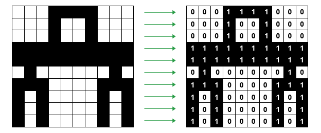
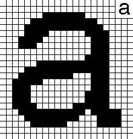
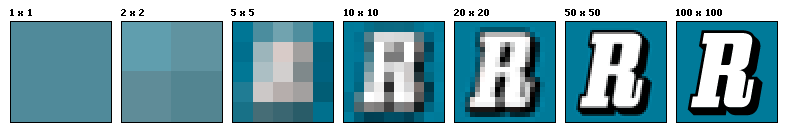

This is the time and place where we talk about image file formats, yay! This is going to be a long one, because there are so many of them.

One wonders - why the heck there are so many of them? This is what I exactly thought after a very long night doing live cell imaging, while trying to export my data. Would I like to use TIFF, PNG, or JPG? I have always chosen TIFF because that was what we used in publications as it and high resolution without giving much thought to it. Then I made the mistake of writing **image file formats** to google. There is so much more. And I learned that each of them are useful for some purpose. Kinda amazing.

The first thing to know: everything inside the computer are composed of tiny bits. A pattern of bits only mean something if we assign a meaning to them. The same bits might indicate other things in different locations. Image formats exist because they encode the image data using different techniques and different amount of bits. And as a user, you have the responsibility of choosing the one that serves your purpose the best.

To understand the image formats better, we are first going to understand how to represent an image in bits, then how to represent the color. After that, we are going to talk about something called **compression** which is a trade in itself, you trade the file size with image quality. After that we are going to look at different image file formats, and what they are useful for.

#### Representing an image with bits

A bitmap is the easiest way to represent image data. To represent image data, we divide it into small squares and call each square a **pixel.** Simply put, a bitmap is an array of bits that represent these tiny pixels.

Think of a monochrome picture. Each pixel is going to be either black or white, and nothing else. In this scenerio, we can enconde white with 0 and black with 1, and this was all the early computers could manage. The pixels were also quite large, so you could have images such as this:

###### A simple bitmap image with just two colors, black and white. Image Credit: https://www.bbc.co.uk/bitesize/guides/zpfdwmn/revision/2

The first letters were also designed like this:

###### Bitmap representation of letter "a". Image Credit: https://en.proft.me/2017/08/2/how-work-bitmap-android/

The number of pixels per square inch is a measure of the pixel density, which is commonly referred as **[resolution](https://en.wikipedia.org/wiki/Image_resolution)**. Resolution is usually given as dots per inch (dpi). And as you can guess, if you make pixels smaller, you can fit more of them to the same screen area, which means you will have a higher density of pixels and a better image resolution.

###### The same image in different resolutions. Image Credit: Public Domain, https://commons.wikimedia.org/w/index.php?curid=1078380

Let's calculate the space we need to keep for an image like this. If you have a monochrome image that only consists of black and white pixels, and if it has 100 pixels in a single column and 100 pixels in a row, it means in total you have an image that is composed of 10000 pixels (and the resolution of the image would be 100x100). Each pixel is either black or white, so they can be encoded with a single bit (0 or 1), so it means your image will be encoded in 10000 bits in total. 1 byte consists of 8 bits, so 10000 bits is 1.250 bytes (10000/8). 1 kilobyte consists of 1024 bytes, so this image will take up 1.22 KB's of space (1250/1024).

Super, duper! Now that we have done black and white, let's do a colored one.

To represent colors, you need more than 1 bit per pixel. Let's say you assigned 8 bits (or 1 byte) to encode the color of a pixel. This actually means you get to encode 256 different colors (2⁸), but this image will take 8 times more space than it took for a black and white only image.

Early computers used 1 or 8 bit colors. Later came 16-bit color which was known as [high color](https://en.wikipedia.org/wiki/High_color) and more recently 24 bit color, which is also called [true color](<https://en.wikipedia.org/wiki/Color_depth#True_color_(24-bit)>).

If you assign 24 bits (3 bytes) to encode a single pixel, you can represent 16.777,216 different colors (2²⁴), and this is a bit of an overkill as the average human eye can only distinguish around 10.000,000 colors. If the resolution of your image is 960 x 640 (w x h), it means you have 614.400 pixels in total (960x640). Each pixel requires 3 bytes, so that's 1.843,200 bytes of memory. That's 1800 KB (1.843,200/1024). As 1 megabyte is equal to 1024 kilobytes, it's also equal to 1.76 MBs (1800/1024).

There is also a 32 bit color system. 24 bits of it are reserved for the description of the color itself. The remaining 8 bits are used to control transparency.

Now, what determines the quality of an image? The quality of a raw, uncompressed bitmap depends on 2 things:

1. [The resolution](https://en.wikipedia.org/wiki/Image_resolution) (a.k.a., pixel density): The smaller cubes you divide the image into, the better the quality will be.
2. [The color depth](https://en.wikipedia.org/wiki/Color_depth) (the number of bits that was used to encode the color of each pixel): The higher the color depth, the better the quality.

And no need to say this, but let's say it regardless. The better the quality, the more memory it will require! (The mighty quality-memory balance!)

---

**Note:** When you take a photograph with a digital camera, it will first create a rectangular array of pixels. Some extra information called **metadata** is also added to the file. Metadata includes additional important information about the image, such as the number of pixels in each row, the number of rows, and the color depth. In addition to this it will also keep the shutter speed, the focal depth, details about the make and model of the camera, etc. Image processing software can also add additional metadata to the image file, such as captions or titles. Metadata added to the image when it is saved will make the file size slightly bigger than expected.

---

#### Color Spaces

#### Data Compression

#### Image Formats and when to use which

#### Resources:
