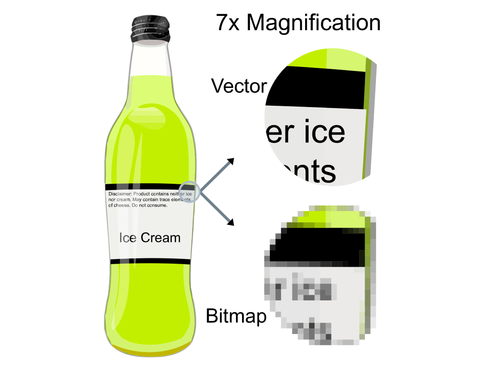
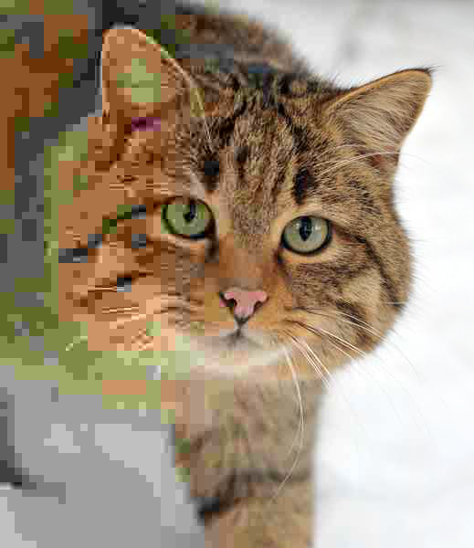

This is the time and place where we talk about image file formats, yay! This is going to be a long one, because there are so many of them.

One wonders - why the heck there are so many of them? This is what I exactly thought after a very long night doing live cell imaging, while trying to export my data. Would I like to use TIFF, PNG, or JPG? I have always chosen TIFF because that was what we used in publications as it and high resolution without giving much thought to it. Then I made the mistake of writing **image file formats** to google. There is so much more. And I learned that each of them are useful for some purpose. Kinda amazing.

The first thing to know: everything inside the computer are composed of tiny bits. A pattern of bits only mean something if we assign a meaning to them. The same bits might indicate other things in different locations. Image formats exist because they encode the image data using different techniques and different amount of bits. And as a user, you have the responsibility of choosing the one that serves your purpose the best.

To understand the image formats better, we are first going to understand how to represent an image in bits, then how to represent the color. After that, we are going to talk about something called **compression** which is the art of making the file size as small as possible, with the least amount of data loss. After that we are going to look at different image file formats, and what they are useful for.

#### Representing an image with bits

**A bitmap** is the easiest way to represent image data. A bitmap image is also known as a **[raster image](https://en.wikipedia.org/wiki/Raster_graphics)**. To represent image data, we divide it into small squares and call each square a **[pixel](https://en.wikipedia.org/wiki/Pixel).** (Although, describing a pixel as a square is quite debatable. [This article](http://alvyray.com/Memos/CG/Microsoft/6_pixel.pdf) clearly states that a pixel is not a square but a point sample. But my simple mind likes to imagine it as a square, and you will see the square definition of pixel everywhere you look anyway, so here we go.) A pixel is the smallest addressable unit in image representation. Simply put, a bitmap is an array of bits that represent the color of these tiny pixels.

Think of a monochrome picture. Each pixel is going to be either black or white, and nothing else. In this scenerio, we can enconde white with 0 and black with 1, and this was all the early computers could manage. The pixels were also quite large, so you could have images such as this:


###### A simple bitmap image with just two colors, black and white. Image Credit: https://www.bbc.co.uk/bitesize/guides/zpfdwmn/revision/2

The first letters were also designed like this:


###### Bitmap representation of letter "a". Image Credit: https://en.proft.me/2017/08/2/how-work-bitmap-android/

The number of pixels per square inch is a measure of the pixel density, which is commonly referred as **[resolution](https://en.wikipedia.org/wiki/Image_resolution)**. Resolution is usually given as dots per inch (dpi). And as you can guess, if you make pixels smaller, you can fit more of them to the same screen area, which means you will have a higher density of pixels and a better image resolution.


###### The same image in different resolutions. Image Credit: Public Domain, https://commons.wikimedia.org/w/index.php?curid=1078380

Let's calculate the space we need to keep for an image like this. If you have a monochrome image that only consists of black and white pixels, and if it has 100 pixels in a single column and 100 pixels in a row, it means in total you have an image that is composed of 10000 pixels (and the resolution of the image would be 100x100). Each pixel is either black or white, so they can be encoded with a single bit (0 or 1), so it means your image will be encoded in 10000 bits in total. 1 byte consists of 8 bits, so 10000 bits is 1.250 bytes (10000/8). 1 kilobyte consists of 1024 bytes, so this image will take up 1.22 KB's of space (1250/1024).

Super, duper! Now that we have done black and white, let's do a colored one.

To represent colors, you need more than 1 bit per pixel. Let's say you assigned 8 bits (or 1 byte) to encode the color of a pixel. This actually means you get to encode 256 different colors (2⁸), but this image will take 8 times more space than it took for a black and white only image.

Early computers used 1 or 8 bit colors. Later came 16-bit color which was known as [high color](https://en.wikipedia.org/wiki/High_color) and more recently 24 bit color, which is also called [true color](<https://en.wikipedia.org/wiki/Color_depth#True_color_(24-bit)>).

If you assign 24 bits (3 bytes) to encode a single pixel, you can represent 16.777,216 different colors (2²⁴), and this is a bit of an overkill as the average human eye can only distinguish around 10.000,000 colors. If the resolution of your image is 960 x 640 (w x h), it means you have 614.400 pixels in total (960x640). Each pixel requires 3 bytes, so that's 1.843,200 bytes of memory. That's 1800 KB (1.843,200/1024). As 1 megabyte is equal to 1024 kilobytes, it's also equal to 1.76 MBs (1800/1024).

There is also a 32 bit color system. 24 bits of it are reserved for the description of the color itself. The remaining 8 bits are used to control transparency.

Now, what determines the quality of an image? The quality of a raw, uncompressed bitmap depends on 2 things:

1. [The resolution](https://en.wikipedia.org/wiki/Image_resolution) (a.k.a., pixel density): The smaller cubes you divide the image into, the better the quality will be.
2. [The color depth](https://en.wikipedia.org/wiki/Color_depth) (the number of bits that was used to encode the color of each pixel): The higher the color depth, the better the quality.

And no need to say this, but let's say it regardless. The better the quality, the more memory it will require! (The mighty quality-memory balance!)

---

**Note:** When you take a photograph with a digital camera, it will first create a rectangular array of pixels. Some extra information called **metadata** is also added to the file. Metadata includes additional important information about the image, such as the number of pixels in each row, the number of rows, and the color depth. In addition to this it will also keep the shutter speed, the focal depth, details about the make and model of the camera, etc. Image processing software can also add additional metadata to the image file, such as captions or titles. Metadata added to the image when it is saved will make the file size slightly bigger than expected.

---


###### [Exif](https://en.wikipedia.org/wiki/Exif) metadata of an image. Image Credit: Praveenp, CC BY-SA 3.0 <https://creativecommons.org/licenses/by-sa/3.0>, via Wikimedia Commons

#### True Color vs Indexed Color Bitmaps

If you keep the color data of each and every pixel as a number that encodes its color, it's known as a **true color** image.

A bitmap can also be saved by using something called **indexed color**, and it is generally more efficient when compared to true color. In this method, a color table known as a **palette** is included in the image file in the metadata section. The palette only contains the colors that are used in the specific image. Each color in this palette has its own index number, and the information about each pixel is simply a reference to one of the colors in this palette. If this palette has 16 colors (which would be a very small palette, but why not), it means maximum of 4 bits is required to encode the color of each pixel. Palette does take up some space in the metadata, but with larger images and higher resolutions, the size of the palette itself becomes insignificant. By using indexed color, you can get very good quality images and use a much smaller memory space at the same time. If you choose to save your image as indexed color bitmap, the image editing application you use will generate an optimal palette for you from colors that are used in the image. This palette is called the **adaptive palette**.

Another thing to mention is the web-safe colors. Web-safe colors are colors that would look the same in any browser on most computer screens. Although 8 bits allow to encode 256 different colors, only 216 of them are web-safe. The web-safe pallete allows consistency, but if your image has more than 216 colors (which is most probably the case), then most of your color data will be lost on the saved file. The quality of the image saved with a web-safe palette will be worse in this case. In attempt to maintain the quality of the image, the image editing software can apply a process called **dithering**, which is also referred to as **color quatization**. Dithering works by placing available colors next to each other, an attempt to create the illusion of a color that does not exist in the palette. If the pixels are small enough, human eye can be deceived, but dithered images tend to have a speckled/grainy appearance when zoomed in.

Resaving a 24 bit RGB true color image as an indexed bitmap will usually make the image file smaller. This is one method you can use to effectively compress a bitmap image file. Resaving a bitmap with fewer colors classifies as lossy compression (because the image will lose some of its quality in the process), and this data loss is irreversible, which is something we will discuss later.

#### RGB and CMYK Color Spaces and How Screens Work

Mathematical representation of a set of colors is called a **color space**. A color space defines the whole color spectrum as a multidimensional model. Color spaces differ depending on the medium that is being used. For example, physical pigments (such as crayons and colored pencils) and light (rainbows!) work differently, therefore they have their own color spaces.

Let's start with light.

We have all seen rainbows, and I haven't met a person who doesn't like a good rainbow (). The [rainbow](https://en.wikipedia.org/wiki/Rainbow) we all love is essentially white light refracted into the colours it consists of by the water droplets in the air. We can also see the same colors by refracting the same white light using a prism, just like Isaac Newton did in 1660s.


###### In a dispersive prism, material dispersion (a wavelength-dependent refractive index) causes different colors to refract at different angles as all colors have a different wavelength, splitting white light into a spectrum. Image Credit: CC BY-SA 3.0, https://commons.wikimedia.org/w/index.php?curid=57730

Using light, you can make any color (including white) by mixing different amount of three main colors, red, green and blue. For example, RGB (short for Red, Green and Blue) color space looks like this:


###### The representation of the RGB Color Space. Each color defines one axis (magenta, blue, cyan, red, yellow, green, black and white), and any possible RGB color falls somewhere inside this sweet cube. Image Credit: By SharkD - Own work. Download source code., CC BY-SA 3.0, https://commons.wikimedia.org/w/index.php?curid=9803283

The RGB color model is an "additive model", which means green, red and blue light are added on top of each other to create various colors.

This is quite out of our comfort zone, as we first experience colors through crayons when we are children, but light does the exact opposite thing. But even as children, we know this: the absence of light is black. To see anything, we need light. But as children, what we don't know is how we see things in color. It is quite simple. The sun radiates white light. Almost everything around us has pigments, and pigments absorb some light, and reflect the ones which cannot be absorbed. Certain pigments absorb certain wavelengths, so when sunlight hits them they absorb some of it, and reflect other waves that they can't absorb. The reflected waves enter human eye from the pupil and reach retina, which has receptors that make us perceive light and color. Here, things get a little bit tricky. As each of us have different amount of receptors, it is safe to say we experience the colors differently, but most of us are able to say if something is blue or green. ([Some of us can supposedly see more of the spectrum, which is a debated subject](https://www.imbs.uci.edu/colorcoglab/4-9.pdf), and [some of us can see less](https://en.wikipedia.org/wiki/Color_blindness). I'll skip this subject to keep the article short.)


###### Red, green and blue lights showing secondary colours. Image Credit: en:User:Bb3cxv, CC BY-SA 3.0 <http://creativecommons.org/licenses/by-sa/3.0/>, via Wikimedia Commons

So if you think something is yellow, it actually means it has pigments that absorb blue light and reflect green and red. The combination of green and red creates yellow. If you think something is magenta, it actually means that it has pigments that absorb green and reflect red and blue, which we percieve as magenta. The leaves are green, because they have pigments that reflect green and absorb blue and red.

The screens also rely on this principle, because they are made of tiny, physical pixels. When magnified, each screen pixel can be seen to consist of three tiny lights, one red, one green and one blue. These tiny lights are controlled independently for each screen pixel to create the illusion of a single color. In a 24 bit RGB bitmap, the amount of red, blue and green in each pixel are encoded separately (8 bits for each, so each color can have a value between 0 and 255). Each of these 3 colors is known as a **channel**. 8 bits per channel means the color of each pixel is encoded in 24 bits. So you can think of an RGB image as 3 separate bitmaps combined together, each bitmap representing the color values for a single channel. In a 24 bit bitmap image, a pixel can have up to 16.7 million colors (2⁸ x 2⁸ x 2⁸).


###### Pixel geometry can change among different types of screens, but the logic stays the same. This image shows different pixel geometries. Clockwise from top left: a standard definition CRT television. "Palsonic" brand. (this image is significantly reduced compared to others) a CRT computer monitor. Diamond View 19" (18" viewable). Model 1995SL. a laptop LCD: Lenovo X61, 12" 1024×768 the OLPC XO-1 LCD display. (Test-B2)

###### Image Credit: Pengo, CC BY-SA 3.0 <https://creativecommons.org/licenses/by-sa/3.0>, via Wikimedia Commons

With crayons, you start with the absance of pigments, which is white (or transparent, if you are using a transparent acrylic board, for example). An example of this type of color model is the CMYK Color model, which is primarily used in printing. CMYK refers to theses four pigments: cyan, magenta, yellow, and key (which is black). As you mix these cyan, magenta and yellow, you get different colors, and if you mix all of them, you end up with black. Additional black was added for deeper black tones. This is called the "subtractive model", because each ink that is used will substract green, red or blue from the white light. If red is absorbed by the used pigment, the reflecting colors will be perceived as cyan. If the green is absorbed by the pigment, the reflected lightwaves will be percieved as magenta. If blue is absorbed, the remaining reflecting light will be percieved as yellow. Black pigments absorbs every wavelengths of light and nothing will be reflected, therefore it will be percieved as the absance of light, which is black.


###### CMYK Color Space. Image Credit: SharkD, CC0, via Wikimedia Commons

There are also some other tricks that are used in printing, such as **[halftoning](https://en.wikipedia.org/wiki/Halftone)**. In halftoning, tiny dots of primary colors are printed in small patterns, and they are perceived as solid colors by human eyes. Without halftoning, only 7 colors can be created from the pigments (red, blue, green, cyan, yellow, magenta, black), but with halftoning, a whole range of colors can be produced.


###### The cerulean color that appears in the left side image is actually created by a pattern of cyan, magenta, yellow and black, that can be seen on the right side image, which is the same image under a microscope. Image Credit: Psiĥedelisto, CC0, via Wikimedia Commons

There are other color models that also encode brightness information for each pixel, such as HSV (stands for Hue, Saturation, and Value (brightness)), HSL (Stands for Hue, Saturation, Light), YCbCr (Y is for brightness, Cb stands for 'Chroma blue' which is the blue color, Cr stands for 'Chroma red' which is the red color) and many more. (If you want to learn more about HSV and HSL, you can read [this](https://programmingdesignsystems.com/color/color-models-and-color-spaces/index.html) post as well.) As brightness information of a pixel is stored separately from the chroma information, chroma information can be changed independently from the brightness information. Human sight is much more sensitive to different levels of brightness than it is to differences in color. So with these models, we can reduce the color detail of an image without compromising the brightness. This way, we can generate an image that contains less data, hence taking up less space, but muore or less looks similar to the human eye.

#### Data Compression

The first question that poppes into mind is, why do we compress data? Isn't it better to keep and use everything at their best quality? This question has a simple answer: data storage and transmission costs money. Compressed data takes up less space in the memory and is transmitted more quickly, and is therefore cheaper to keep and use.

There are 2 main types of compression:

1. **Lossless:** Lossless compression has no loss in information or quality. You can recreate the original data from the compressed data. For example, GIF (stands for Graphics Interchange Format) is a widely used lossless compression format for images. GIF is generally used in simple images that has a large area of the same color, like logos. If you're working with text data (a document that includes text), then lossless compression is essential, otherwise the decompressed document will be unreadable.

2. **Lossy:** Lossy compression has some loss in information or quality. You can NOT recreate the original data from the compressed data. For example, JPEG (stands for Joint Photographic Experts Group) is a widely used lossy compression format for images.

So how do we compress image data? There are many ways to do that, and it is always a compromise (a balance, a trade) between image quality and space. Very simply put, we try to encode the same data in such ways that it takes up less space. Think of it as putting something in your luggage. With certain folding techniques, you can make your cardigan take less space then it usually does, but you can also take the scissors and cut some of it as well. Cutting some of it is irreversible, what is cut is lost. With or without cutting it, after it is folded, you need to unfold it when taking out of the luggage so you can put it on. Image data works the same way, a data compression program is used to convert data from a not-so-compressed format into a format that is optimized for compactness. A decompression program returns the data back into its original form. Needless to say, the decompression algorithm has to match the compression algorithm, and it will rely on some additional information like the width and height of the image.

One of the compression techniques is called **Run Length Encoding (RLE)**, which is a lossless compression technique. RLE has a simple logic, when using this algorithm, compression program first scans the data. While scanning, it keep strack of how many times a unique value occurs in the data and it keeps track of it. At the end, it outputs a code that is composed of the number of the values followed by the value itself. It looks like this:

```
// Uncompressed Data-1:
"qqqgffffhhhhhhhhhhjkkkkkkkkkkkk"

// Compressed Data-1 with RLE:
3q1g4f10h1j12k

// Uncompressed Data-2:
"qqgffhjkklllmnopprrstuuvwwwyzz"

// Compressed Data-2 with RLE:
2q1g2f1h1j2k3l1m1n1o2p2r1s1t2u1v3w1y2z
```

In this second dataset, compressed data is larger than the uncompressed one. This obviously does not work for us, and this is called **negative compression**. Clearly, this technique is not suitable for all types of data. RLE works best when data has long sequences that is the same value repeated. Line art images, architectural drawings that has small amounts of color data, data sent with fax machines are some of the data that is encoded well using RLE. Some medical scanners that create huge amounts of 3 dimensional imaging data that also lacks too many colors (MRI, CT scan, PET scan etc.) also take advantage of RLE. RLE is rarely used by itself, but generally combined with some other algorithm.

There are many other [lossless](https://en.wikipedia.org/wiki/Category:Lossless_compression_algorithms) and [lossy compression algorithms](https://en.wikipedia.org/wiki/Category:Lossy_compression_algorithms). The image file formats are an indicator of the way they were organized and stored.

#### Vector Graphics

Until this point, we dealt with bitmap images (otherwise known as raster images or raster graphics), which we defined as an array of pixel color (and maybe brightness) data. Unlike bitmap images, vector images are composed of the coordinates of points, and lines, curves and shapes that are made by those points in space (see the Cartesian plane), which can be defined as mathematical formulas. As the vector images are simply defined mathematically, they can be scaled up and down without any loss of data. When a raster image is scaled up, we start to see the pixels that creates the image. When a vector image is scaled up, the image is redrawn using the same mathematical formula, so the resulting image is as smooth as the first one.



###### Vector graphics versus raster graphics. The original vector-based illustration is at the left. The upper-right image illustrates magnification of 7x as a vector image. The lower-right image illustrates the same magnification as a bitmap image. Raster images are based on pixels and thus scale with loss of clarity, while vector-based images can be scaled indefinitely without degrading quality.

###### Image Credit: The original uploader was Darth Stabro at English Wikipedia., CC BY-SA 3.0 <http://creativecommons.org/licenses/by-sa/3.0/>, via Wikimedia Commons

#### Image Formats and when to use which

Every image you see around (the sticker on your laptop, the image printed on your shirt, the image on a website, the image on a billboard, and many, many more) came from a digital image file. The format of that image file changes a single thing: it either came out the way the maker of it intended, or slightly different. A poor format decision might screw the outcome, regardless of how good the image itself is.

Let's say you are creating the content. If the end destination for the visual content you are creating is a digital environment (anything that is displayed on a screen), then it is better to use RGB color space. If you are creating content for printed media, such as books or posters, it is better to work with the CMYK color space. This way, the outcome (the display or the print) will be as consistent as possible.

Now which format to choose when you are exporting your visual content? If you have ever exported any image in your life using any software, then you faced with this decision before. We can mainly classify image file formats in two subtitles, the ones that create raster images, the ones that create vector images (and some of them can do both). Now let's see the most common formats that are used, and their advantages and disadvantages in certain situations.

**Raster Formats:**

Raster images are pixel based, therefore they are "resolution dependent", meaning they look alright until a certain size. When these images are enlarged more than they are supposed to, the pixels are stretched, so the end result will be blurry and pixelated.

▸ **[JPG/JPEG/JFIF:](https://en.wikipedia.org/wiki/JPEG)** JPEG (short for Joint Photographic Experts Group) is a lossy compression format, which results in significant reduction in file size (and also quality). JPEG and JPG are actually the same thing, but some earlier versions of Windows operating systems (like MS-DOS 8.3 and FAT-16) required a three letter extension for the file names, so it was shortened to JPG. Other operating systems that had no such limitations kept on using JPEG as an extension, therefore creating two versions of the exact same thing. JPEG images are usually stored in JFIF (short for JPEG File Interchange Format) format. Softwares generally let you choose the level of the compression applied, and as the level of compression gets higher, the quality of the image goes lower. JPEG supports supports eight-bit grayscale images and 24-bit color images (8 bits for each element of RGB).



###### Gradual JPEG artifacts example, with decreasing quality from right to left. Image Credit: Felis_silvestris_silvestris.jpg: Michael Gäblerderivative work: AzaToth, CC BY 3.0 <https://creativecommons.org/licenses/by/3.0>, via Wikimedia Commons

This image format is useful for web images that needs to be downloaded fast, or previews for comissioned artworks (when you don't want to send the original), online photographs and artworks. JPEG format doesn't have a transparency channel, so if you need a transparent background for something, JPEG is not the way to go. Also, with every edit and save, the quality of an JPEG image will deteriorate, as it is being compressed again.

▶ **[GIF:](https://en.wikipedia.org/wiki/GIF)** GIF (short for Graphics Interchange Format) is generally used with an 8-bit palette, which only allows for 256 colors. (It does allow a 24-bit color depth, but it is generally not used for that as it makes the file size much bigger.) GIF is a lossless compression format, but most suitable for images that have few colors and large areas with same colors, such as logos, line drawings, diagrams, and cartoons. It is widely used in animations, as it allows a separate palette of up to 256 colors for each frame. Also it has a transparency channel (as a single transparent color). But if you're going to print an image, or use an image with a lot of different colors GIF is not the way to go.

▶ **[PNG:](https://en.wikipedia.org/wiki/Portable_Network_Graphics)** When it was first created, GIF wasn't free to use (the patents for the [LZW compression algorithm](https://en.wikipedia.org/wiki/Lempel%E2%80%93Ziv%E2%80%93Welch) have expired in 2003 and 2004 in different continents). PNG (short for Portable Network Graphics) was created as the open-source and free alternative to GIF. (If you're interested in its history, check out [this article](https://www.popularmechanics.com/technology/a21457/the-gif-is-dead-long-live-the-gif/).) It supports a wide range of color spaces: it supports eight-bit paletted images, 24-bit truecolor images (16 million colors) or 48-bit truecolor images with optional transparency channel for all colors. Also, PNG doesn't support animations.

PNG's are optimized for the screen and don't do well with the CMYK color space, so it is not recommended to be used in printed media. JPEG and TIFF formats work better if the image is going to be printed. So we can safely say that JPEG is better for distributing (as it has a much smaller size), and PNG is better for storing and editing (as it is lossless).

▶ **[TIFF/TIF:](https://en.wikipedia.org/wiki/TIFF)** TIFF (short for Tag Image File Format) is a lossless raster format. It is not widely supported by web browsers which limits its use in webpages, however, it is useful if you want to print or scan high-quality photographic images. It is also a safe choice for saving scientific images, where high-quality is also needed. The 'tagged' part is also useful in this case, as microscopy systems tend to populate the tags with useful metadata, such as the used objective, exposure and binning. TIFF also supports layers.

▶ **[RAW:](https://en.wikipedia.org/wiki/Raw_image_format)** A raw image is the unprocessed and uncompressed data captured by a digital camera or another sensor (like a scanner). Raw isn't an image format by it's own, but a group name for some image formats, such as CRW (Canon), NEF (Nikon), and DNG (Adobe). A raw image is at the highest quality possible (which is great for editing), but it cannot be used for the web or printed without being compressed in some way.

▶ **[EXIF:](https://en.wikipedia.org/wiki/Exif)** EXIF (short for Exchangeable image file format) is mainly used to save the metadata tags, that includes date and time information, camera settings, a thumbnail of the picture, and other things that is related to a photographic image.

Raster graphic editors also have their own file formats that allows data to be saved in different layers. Popular ones are: **PSD** (Adobe PhotoShop Document), **AFPhoto** (short for Affinity Photo Document), **CPT** (Corel Photo Paint), **KRA** (Krita) and **XCF** (eXperimental Computing Facility format, native GIMP format). These files can be used by their individual softwares to compose a final, compressed image with a web or print friendly format, but these are not usable themselves in neither printed nor digital media.

**Vector Formats:**

Very simply put, vector images are a set of instructions on how to create a specific image, rather than a set of pixels. This way, vector images can be scaled to fit any screen without the loss in quality. Still, all vector images have to be rasterized to be displayed on digital screens.

▶ **[SVG:](https://en.wikipedia.org/wiki/Scalable_Vector_Graphics)** SVG (short for Scalable Vector Graphics) format is basically a set of notes that describe the image in XML format. SVG format doesn't have a compression algorithm of its own, but as XMLs are text files, it can be compressed by softwares like [gzip](https://en.wikipedia.org/wiki/Gzip). SVG images can be edited by a text editor or a image editing software. SVG supports simple shapes, text, fills, gradients, and is scriptable (supports interactivity, like the changes on hover, click, scroll etc). This creates a perfect opportunity to create animations. Websites that have animations and user interactivity mostly use SVGs, as they are also very lightweight regarding the image size.

▶ **[PDF:](https://en.wikipedia.org/wiki/PDF)** PDF (short for Portable Document Format)

▶ **[EPS:](https://en.wikipedia.org/wiki/Encapsulated_PostScript)** Can contain both raster and vector images.

▶ **AI:**

There are many compression methods that were created for many other needs. I just scratched the surface and wrote about the most common ones. You can check other formats from [here](https://en.wikipedia.org/wiki/Image_file_formats).

#### Resources:

1. Wikipedia
2. [A Pixel Is Not A Little Square, A Pixel Is Not A Little Square, A Pixel Is Not A Little Square! (And a Voxel is Not a Little Cube)](http://alvyray.com/Memos/CG/Microsoft/6_pixel.pdf) by Alvy Ray Smith
3. [Color Theory](http://web.mit.edu/22.51/www/Extras/color_theory/color.html) by MIT
4. [Color models and color spaces](https://programmingdesignsystems.com/color/color-models-and-color-spaces/index.html) by Programming Design Systems
5. [THE GIF IS DEAD. LONG LIVE THE GIF.](https://www.popularmechanics.com/technology/a21457/the-gif-is-dead-long-live-the-gif/) by Eric Limer
6. ["Computer Science" channel](https://www.youtube.com/c/KevinDrumm/videos) by Kevin Drumm
7. [File Formats for Microscopy](https://microscopy.duke.edu/guides/file-formats) by Duke University
