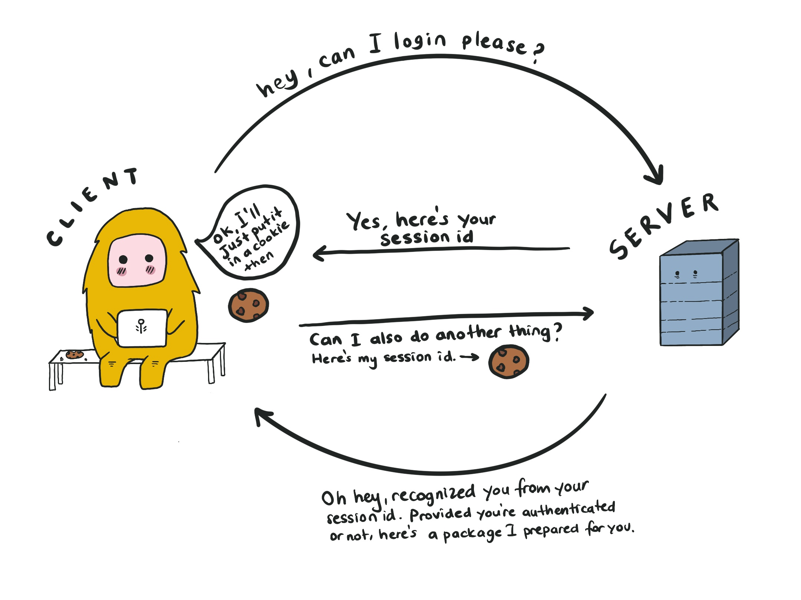
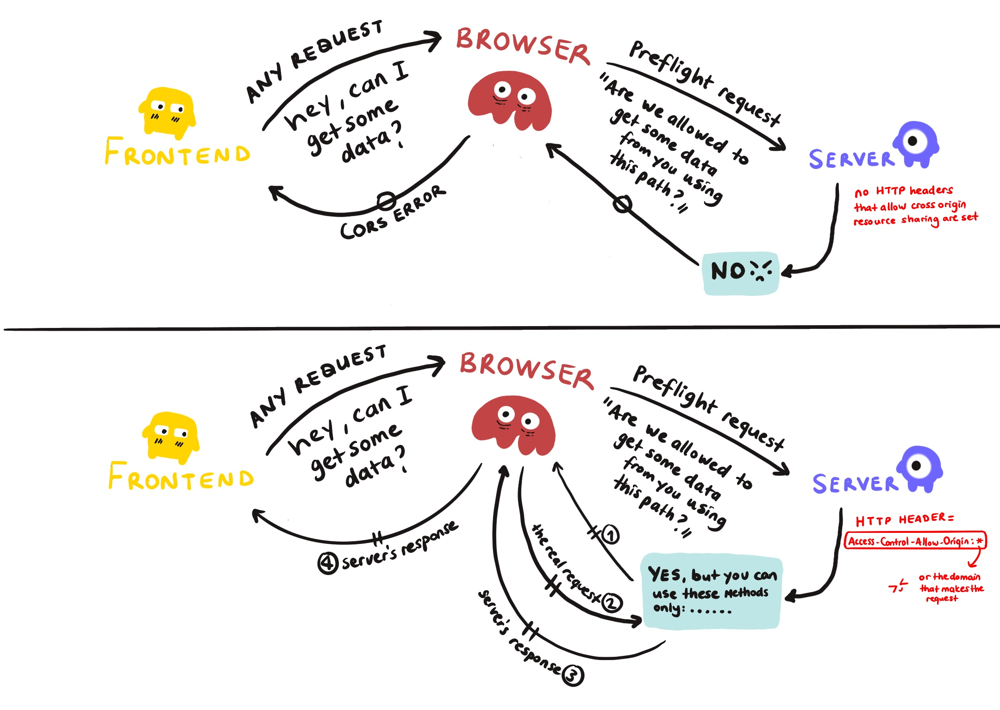

Browser storage mechanisms are useful for a variety of reasons:

- logging a user out after a certain time has passed until the last login (then you can keep the last login timestamp)
- keeping the preferences of the user (user-specific settings, such as the light mode or dark mode)
- keeping some additional information about the user that you use inside your app (like name or username)
- caching your static application resources (like HTML, CSS, JS and images)

Either way, keeping that information on the client-side saves you from an additional and unnecessary server call, and helps you provide offline support. But, there is a limit to the amount of data you can store on client-side. The exact amount can change according to the browser and user settings. There are multiple ways of caching data in the browser, so you got to choose the one that fits your needs, and this article is going to be about that.

**What is in this article?**

1. [Before we start](#before-starting)

   - [Where are they hiding in the browser?](#where-they-hide)
   - [What are Web Workers and Service Workers?](#web-and-service-workers)

2. [localStorage and sessionStorage (Web Storage)](#local-and-session-storage)

3. [HTTP Cookies](#cookies)

4. [The Cache API and IndexedDB API](#cacheAPI-indexedDB)

5. [File system API](#file-system-API)

6. [Same Origin Policy](#same-origin-policy)

<div id="before-starting"></div>

#### ☀ Before we start

<div id="where-they-hide"></div>

**Where are they hiding in the browser?**

1. Open the Chrome Console (`Command + Option + J` in Mac and `Control + Shift + J` in Windows).

2. From the tabs above, choose _Application_, and you can see all of them under the _Storage_ section (**Local Storage**, **Session Storage**, **IndexedDB**, **Web SQL**, and **Cookies**).

As you may have noticed how easy it is for you to see the data that's kept here, it is also easy for the user to delete or modify this data. So when you're writing your application, keep that in mind, and try not to rely on these guys so much.

To check how much of the storage your application is using, open the Chrome console and under the Application tab, choose _Storage_. From here, you can also create a custom storage data to simulate how your application will act under harsh conditions like low disk space. To check how much space is available, you can you can use [StorageManager API](https://developer.mozilla.org/en-US/docs/Web/API/StorageManager/estimate) but be aware that it is [not supported by every browser](https://caniuse.com/mdn-api_storagemanager). The `estimate` method returns a promise that has quota and usage properties (but beware, they are not precise):

```javascript
navigator.storage
  .estimate()
  .then(estimate => {
    console.log(
      `You have used approximately ${(
        (estimate.usage / estimate.quota) *
        100
      ).toFixed(2)}% of your available storage.`
    )
    console.log(
      `You have up to ${estimate.quota - estimate.usage} remaining bytes.`
    )
  })
  .catch(err => console.log(err))
```

---

**Tiny but important note:** The browser storage mechanisms may act differently in different browsers due to the implementation differences, so take it with a grain of salt and check out other resources if you're looking for a browser-specific property.

Also, [Web SQL support has been removed](https://caniuse.com/sql-storage) from many browsers, and it is recommended to migrate the existing usage to
IndexedDB.

---

<div id="web-and-service-workers"></div>

**What are Web Workers and Service Workers?**

The script file that you link to the HTML file using the `<script>` tag runs in the browser's main thread. If the main thread (the UI thread) has too many synchronous calls, it may slow down the application and create a bad user experience. This is where the workers come in handy.

**A worker** is a script that runs on the background on a separate thread. **[Web workers](https://developer.mozilla.org/en-US/docs/Web/API/Web_Workers_API)** are the most commonly used workers, and they don't have a dedicated job description. They are mostly used to relieve the main thread by taking on the heavy processing or the calculations that are going to take time. The worker script will be separate from the main script and as it has no access to DOM, the data that needs to be processed has to be sent from the main script with the built in `postMessage` method. For a basic live web worker example, checkout [this GitHub repo](https://github.com/mdn/simple-web-worker).

**[Service workers](https://developer.mozilla.org/en-US/docs/Web/API/Service_Worker_API)** are specific type of workers that act like a proxy between the browser, the network and the cache. They have the ability to intercept every network request made from the main script. This allows the service worker to respond a network request by returning a response from the cache instead of the server, therefore making it possible to run the application offline. For a basic live service worker example, checkout [this GitHub repo](https://github.com/mdn/sw-test).

<div id="local-and-session-storage"></div>

#### 1. localStorage and sessionStorage (Web Storage)

Browsers that support localStorage and sessionStorage keep localStorage and sessionStorage objects that allow you to save key/value pairs.

The APIs of localStorage and sessionStorage are almost identical. Their main difference is **persistence**: sessionStorage is very temporary and cleared after a browser session ends (when the tab or the window is closed). Interestingly, data stored in sessionStorage survives page reloads. Data that is stored in localStorage persists until it is intentionally and explicitly deleted.

[The Web Storage API](https://developer.mozilla.org/en-US/docs/Web/API/Web_Storage_API) is pretty simple and consists of 4 methods (`setItem()`, `getItem()`, `removeItem()`, and `clear()`) and a `length` property:

```javascript
// For sessionStorage, replace localStorage with sessionStorage in the code below

console.log(typeof window.localStorage) // Prints: Object

// Let's cache some data in our localStorage
localStorage.setItem("colorMode", "dark")
localStorage.setItem("username", "cakebatterandsprinkles")
localStorage.setItem("favColor", "green")

console.log(localStorage.length) // Prints: 3

// retrieving data
console.log(localStorage.getItem("colorMode")) // Prints: dark

// removing data
localStorage.removeItem("colorMode")
console.log(localStorage.length) // Prints: 2
console.log(localStorage.getItem("colorMode")) // Prints: null

// clearing local storage
localStorage.clear()
console.log(localStorage.length) // Prints: 0
```

- Both localStorage and sessionStorage are great for caching non-sensitive application data.

- Both of them are **synchronous** in nature and will block the main UI thread. This is why they should be used with caution.

- Maximum storage limit is around 5MB. (Both provide bigger storage when compared to cookies, which is 4KB of storage space.)

- They both only accept strings. (But you can work around this by JSON.stringify and JSON.parse as shown [here](https://stackoverflow.com/questions/2010892/storing-objects-in-html5-localstorage?noredirect=1&lq=1).)

- They cannot be accessed by web workers and service workers.

- Stored data is only available on the same origin for both of them. (They work on same-origin policy. For more explanation check out the last subtitle in this article.)

<div id="cookies"></div>

#### 2. HTTP Cookies

[HTTP Cookies](https://en.wikipedia.org/wiki/HTTP_cookie) are mostly used for authentication and user data persistence. You create a token that is unique for the user and the session, and add it to every HTTP request made from the client. One of the reasons to use cookies is to keep track of what the user is doing in the website - such as adding items to your cart in an e-commerce site, or the login information.

Cookies are attached to every HTTP request, so you should be cautious about what you put inside. Storing too unnecessary data will make your HTTP requests chonkier, making the application slower than its supposed to be.

- Maximum storage limit is around 4KB, and can only contain strings.

- They work synchronously.

- They are not accesible from the web workers but accessible from the global `window` object.

Providing that a website uses HTTP cookies, the first cookie is created by the backend of the webpage that is being used. The backend is also responsible for setting the [HTTP header](https://developer.mozilla.org/en-US/docs/Web/HTTP/Headers) named `Set-Cookie` to the token that is uniquely created for that session and that user, which consists of a key-value pair. **HTTP headers** let the client and the server to share additional information about the HTTP request that is being made.

Cookies can also be modified by the user or intercepted in transit. For security purposes, the data should always be encrypted, so in any interception attempt, the user's credentials stay safe. Also, you should never store sensitive information such as passwords in them. There are [several points](https://developer.mozilla.org/en-US/docs/Web/Security/Types_of_attacks) where the communication can be compromised:

- **[Cross-site scripting (XSS)](https://developer.mozilla.org/en-US/docs/Web/Security/Types_of_attacks#cross-site_scripting_xss):** If a web application is not using enough validation and encryption, it might give access to a malicious user access to sensitive information, which then can be used by the attacker to inject another client-side code that enables them to impersonate a user.
- **[Cross-site request forgery (CSRF)](https://developer.mozilla.org/en-US/docs/Web/Security/Types_of_attacks#cross-site_request_forgery_csrf):** This is an attack pattern that abuses the logged in user, steal their session, and trick them to execute malicious code which they don't know anything about. In such a scenerio, your user is tricked into a fake site that runs a script or makes requests to your server. People should only be able to use your session if they are working with your views, so that session should not be available on any other page.
- **[Man-in-the-middle (MitM)](https://developer.mozilla.org/en-US/docs/Web/Security/Types_of_attacks#man-in-the-middle_mitm):** A third party impersonates a server and intercepts the communication between a web server and a client, capturing sensitive data such as login credentials or credit card information. It can also possibly alter data while doing so.
- **[Session Fixation](https://developer.mozilla.org/en-US/docs/Web/Security/Types_of_attacks#session_fixation):** A third party steals a user's session identifier (like a cookie) and impersonates the user.

```javascript
// The header has to have the id in some form, because you need to uniquely identify the user.
// By default, cookies expire after a session ends, or when the user closes the browser. To persist a cookie and extend it's existance, we can use Expires attribute that sets an expiration date and prevents the session fixation attacks, or the Max-Age attrubute. If both of them exists, Max-age attribute has  precedence over expires attribute.
// A cookie with a Secure attribute is only sent to the server if the request is made by an HTTPS server. This helps preventing the man-in-the-middle (MitM) attacks.
// HttpOnly attribute helps preventing the XSS attacks. Cookies that have HttpOnly attribute cannot be accessed by client-side JavaScript code.
Set-Cookie: id=a96dw8; Expires=Thu, 31 Oct 2021 07:28:00 GMT; Secure; HttpOnly

// You can access the cookies that don't have the HttpOnly flag with client-side JavaScript, using `document.cookies`.
// You can also set new cookies by using `document.cookies`, but bear in mind that they will also be missing the HttpOnly flag, so they will not be secure. So do not store sensitive information this way.

document.cookies // will return the existing cookies as a concatenated string.
document.cookies = "dark_mode=true" // Adds another key value pair to your cookie, which is dark_mode=true.
```

So very simply, this is how the client authenticates and talks to a server:



###### Yes, I prepared this piece of art. In my defense, there was a lot of unexpected sunshine and I was a little dehydrated. As you can see, both the server and the client are still very polite despite the circumstances.

To see if you have any cookies set on your own browser, you can visit the Application > Storage > Cookies on your Chrome console. If you want to know more about setting cookies, [this article](https://www.valentinog.com/blog/cookies/) is a good start.

<div id="cacheAPI-indexedDB"></div>

#### 3. The Cache API and IndexedDB API

- The Cache API and IndexedDB API are widely supported in modern browsers.
- Both of them work **asynchronously**, meaning they will not block the main UI thread.
- They can be accessed from the global `window` object, web workers and service workers.
- Different browsers have different amount of quotas, for example Firefox allows an origin to store up to 2GB, Safari up to 1GB. The quota in Chromium-based browsers depends on the total disk space of the computer that's being used (around 60% of the total disk space). If you exceed the available quota, both API's throw you an QuotaExceededError.

**IndexedDB API:**

- Stores key-value pairs

<div id="file-system-API"></div>

#### 4. File system API

<div id="same-origin-policy"></div>

#### ☀ Same Origin Policy

[Same-origin policy](https://developer.mozilla.org/en-US/docs/Web/Security/Same-origin_policy) is a security mechanism that restricts how one document or script can interact with a document or script from another origin. It defines **same origin** as two files using the same [protocol](https://developer.mozilla.org/en-US/docs/Glossary/Protocol), [host](https://developer.mozilla.org/en-US/docs/Glossary/Host), and [port](https://developer.mozilla.org/en-US/docs/Glossary/Port). If one of them is different, the source is from a different origin, which makes the communication **cross-origin**.

Let's give an example. Our fake origin host is: `https://smart.monke.com/index.html`

```
`http://smart.monke.com/user/dashboard.html` || Same Origin, only path is different
`http://smart.monke.com/index.html` || Cross Origin, Different Protocol
`https://cute.monke.com/index.html` || Cross Origin, Different Host
`https://smart.monke.com:81/about.html` || Cross Origin, Different Port
```

For security purposes, the API's that help us make HTTP requests from a server (like [XMLHttpRequest](https://developer.mozilla.org/en-US/docs/Web/API/XMLHttpRequest) and the [Fetch API](https://developer.mozilla.org/en-US/docs/Web/API/Fetch_API)) follow the same-origin policy, so unless a specific **[Access-Control-Allow-Origin](https://developer.mozilla.org/en-US/docs/Web/HTTP/Headers/Access-Control-Allow-Origin)** HTTP header is set, they cannot share information with a website of a different origin. This header is returned by the server and it indicates who can use it's resources. It can be set to `*`, which allows any origin to access to it, or a specific domain, which allows only that specified domain to access the resource. If you support authentication via cookies, for the backend to allow the cross-origin request, it has to set another header named **[Access-Control-Allow-Credentials](https://developer.mozilla.org/en-US/docs/Web/HTTP/Headers/Access-Control-Allow-Credentials)**. You also have to include the credentials flag to the request in the frontend of the application, or the Fetch API ignores the cookie.

Any cross-origin request that is made from a frontend falls into browsers hands. The browser sends something called a **[preflight request](https://developer.mozilla.org/en-US/docs/Web/HTTP/CORS#preflighted_requests)** to the server, which has no body, but only headers. This request is only made to confirm that the server will allow such a request from that domain. If the required **Access-Control-Allow-Origin** is not set, the request fails, and the browser sends back a CORS error. If the header is set and that domain is allowed to make a request, the browser sends the original request, and delivers back the response.



This is not required for the requests made from the backend of the applications. CORS is strictly for the frontend of the applications and is applied by browsers to protect the users from **cross-site scripting (XSS)** attacks. It is quite a controversial subject (as some say CORS doesn't exist to prevent XSS attacks), but check out [this example](https://security.stackexchange.com/a/224207) that explains how CORS helps to prevent XSS attacks quite nicely.

If you want more details on the subject, I recommend [this](https://developer.mozilla.org/en-US/docs/Web/HTTP/CORS#preflighted_requests) detailed article in MDN Web Docs.

#### Resources

1. [Client-side storage](https://developer.mozilla.org/en-US/docs/Learn/JavaScript/Client-side_web_APIs/Client-side_storage), [Service workers](https://developer.mozilla.org/en-US/docs/Web/API/Service_Worker_API), [Web workers](https://developer.mozilla.org/en-US/docs/Web/API/Web_Workers_API) by MDN Web Docs
2. [Storage for the web](https://web.dev/storage-for-the-web/), [The Cache API: A quick guide](https://web.dev/cache-api-quick-guide/) by Pete LePage
3. [Web workers vs Service workers vs Worklets](https://bitsofco.de/web-workers-vs-service-workers-vs-worklets/) by Ire Aderinokun
4. [A practical, Complete Tutorial on HTTP cookies](https://www.valentinog.com/blog/cookies/) by Valentino Gagliardi
5. [Cross-Origin Resource Sharing (CORS)](https://developer.mozilla.org/en-US/docs/Web/HTTP/CORS#preflighted_requests) by MDN Web Docs
6. [How does CORS prevent XSS?](https://security.stackexchange.com/questions/108835/how-does-cors-prevent-xss) by StackExchange
7. [Storage for the web. IndexedDB, Cache API](https://techplanet.today/post/storage-for-the-web) by Alex
