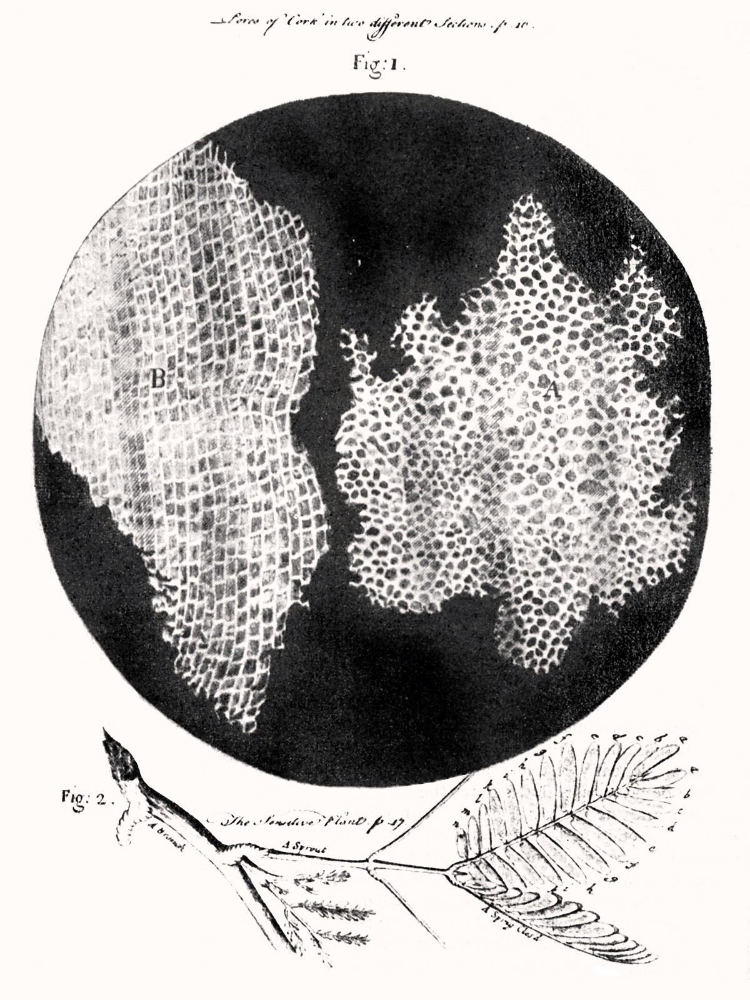
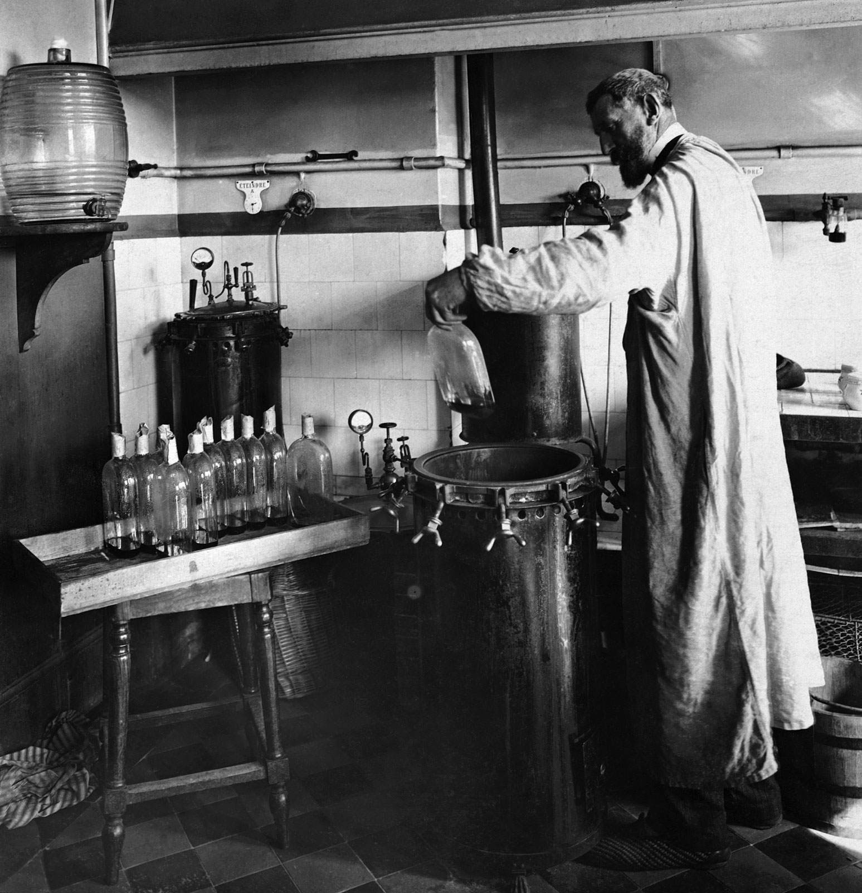
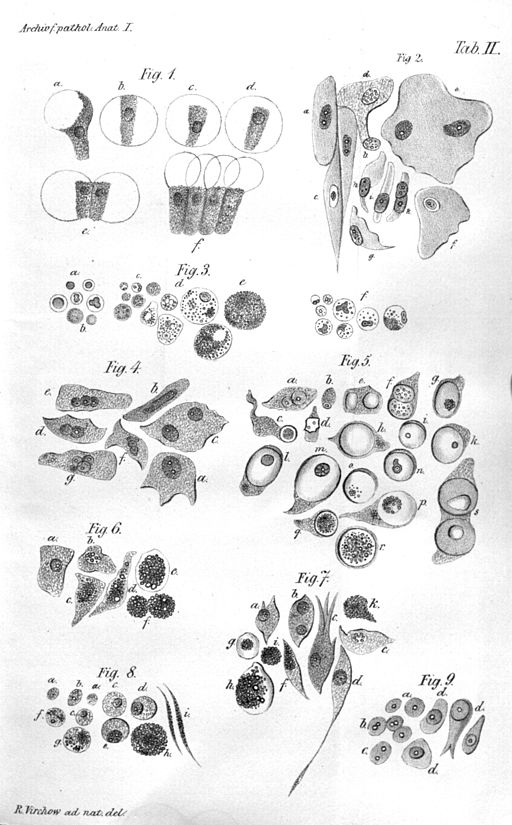
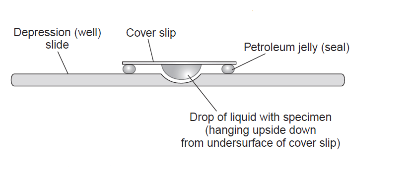
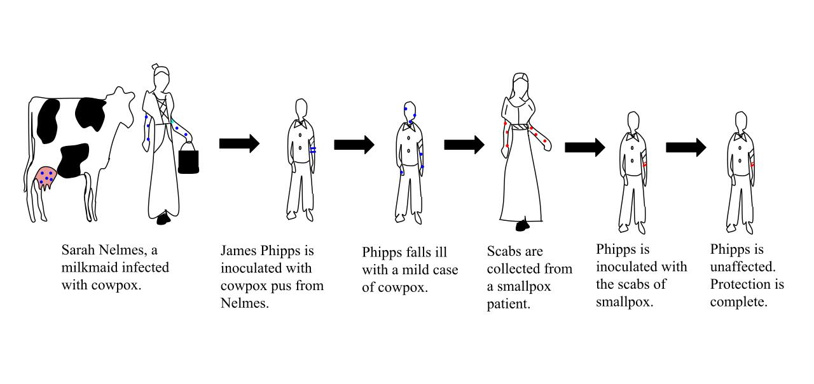
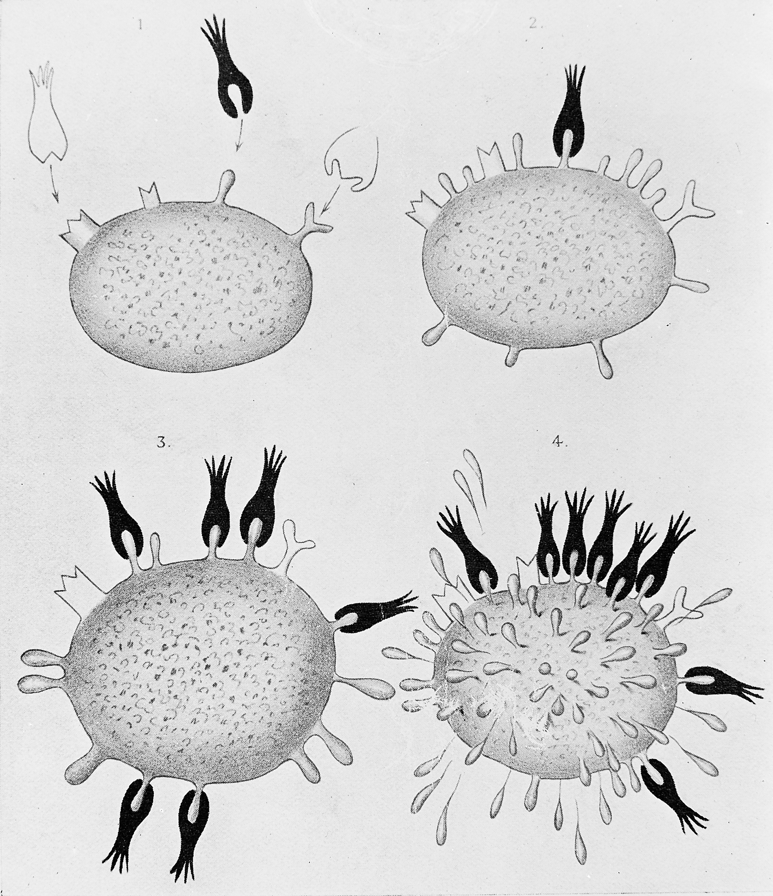

During grad school, I had the great privilege to get accustomed to some of the more creative ways of understanding diseases. One of them is called **tissue clearing**, which was an idea that was circulating around for a long time, but was not fully achieved until the early 2000s. Neuroscience, the brain itself, and humans trying to understand themselves are all amazing, but the methods we use to understand ourselves are also worth praise. I have a certain respect for people who create tools for other people to create beautiful things.

I love reading about history of things with an amateurish passion. It was no surprise to me when I wanted to write this tiny article too. I appreciate things that society offers to us, like phones, computers, cars, vaccines, cameras. All this exists because lots of people before us took one step more to understand how things work.

This will be a long and beautiful story. I will try to not get lost in small details, I promise. There will be many people I'll fail to mention for simplicities sake, but that doesn't mean I don't see them or think that their work was not important. Science indeed stands on the giant's shoulders. No contribution is small, and thank you for everything.

### The domino effect

Let's start the story from far back, when the first microscope was constructed by the English physicist **[Robert Hooke](https://en.wikipedia.org/wiki/Robert_Hooke)** in 1665. He's also the first one to put probably anything he can find under the microscope and be amazed with what he sees. One day, he put some mimosa leaves under his microscope and observed the small building blocks that created it, and called them "plant cells". He published **[Micrographia](https://en.wikipedia.org/wiki/Micrographia)**, which consisted of his amazing findings and their drawings.

###### The first observed plant cells.

###### Image Credit: Robert Hooke (1635–1707), Public domain, via Wikimedia Commons

As expected from a work well done, Micrographia inspired other scientists as well. One of them was the Dutch scientist [Antonie van Leeuwenhoek](https://en.wikipedia.org/wiki/Antonie_van_Leeuwenhoek). He even took things one step further and made better optical lenses that could achieve 270x magnification, while Hooke's microscope could only achieve 50x magnification. He took samples from human mouth and observed uni-cellular organisms like bacterias and protozoas. He called these organisms "animalcules". He also put many other animal and human tissues under the microscope and observed blood cells, muscle fibers, and sperm cells. He even used saffron to stain some muscle fibers. He illustrated and published his findings in [Arcana Naturae Detecta](https://digital.sciencehistory.org/works/sb3979577) in 1695 and is considered to be the "father of microbiology".

In 1745, an English biologist (and priest) named [John Needham](https://en.wikipedia.org/wiki/John_Needham) read about Leeuwenhoek's "animalcules" and started experimenting. At that point, scientists thought the living organisms could spontaneously be generated from non-living matter, and this was called **[spontaneous generation](https://en.wikipedia.org/wiki/Spontaneous_generation)**. He boiled some broth, cooled the mixture to the room temperature, then sealed the flasks, and see the microbes make the broth go cloudy in the next few days. The Italian naturalist named [Lazzaro Spallanzani](https://en.wikipedia.org/wiki/Lazzaro_Spallanzani) who read about these experiments were intrigued, as he thought the design of the experiment was wrong. He suggested that the microorganisms entered the flasks before it was sealed. So he repeated the experiments with a modified technique, he put the broth in flasks, sealed them, vacuumed them, and only then boiled the broth. This time, the microorganisms didn't grow. Although it sounds funny today, spontaneous generation was very much in balance with the cultural and religious beliefs of those days, so people just argued that this just proved that for some reason spontaneous generation couldn't happen without the air. In 1859, a young French chemist called [Louis Pasteur](https://en.wikipedia.org/wiki/Louis_Pasteur) finally disproved this hypothesis. He boiled meat broth for several minutes in a flask where he could heat the neck and bent it into an S shape. The air could enter, but the microorganisms and the dust would settle down in the neck of the bottle where it was bent. No microorganisms grew in this flask, but when it was tilted enough for the broth to touch the neck area where the airborne particles are, the broth became cloudy, indicating microorganism growth. This meant, life came from pre-existing life, and nothing else.

###### Pasteur experimenting in his laboratory.

###### Image Credit: https://upload.wikimedia.org/wikipedia/commons/4/44/Louis_Pasteur_experiment.jpg, Public domain, via Wikimedia Commons

Pasteur also realized that microorganisms were responsible for the spoiling of beverages and food, so he thought some human diseases might be connected to these microorganisms as well. Following this, a British surgeon named [Joseph Lister](https://en.wikipedia.org/wiki/Joseph_Lister) created and promoted the idea of sterile surgery, which consisted cleaning the surgical instruments with carbolic acid before any procedure to prevent microorganism contamination. Therefore, Lister is known as the "father of modern surgery".

Meanwhile, in the 19th century, the **cell theory** began to emerge. With the invention of the microscopes, scientist began to see that every living thing was formed of tiny building blocks that they called cells, and the structure and the relationship between these cells were important for the living organism. A German physician and physiologist named [Theodor Schwann](https://en.wikipedia.org/wiki/Theodor_Schwann) figured there were 3 essential elements in a cell: A nucleus, s fluid around the nucleus and a membrane or a wall that enclosed the cell. Meanwhile, another German scientist named [Rudolf Virchow](https://en.wikipedia.org/wiki/Rudolf_Virchow) suggested that cells came from cells, therefore if a pathological tissue exists somewhere, its abnormal prototype version also exists. He thought the physiologically healthy cells shifted to a more pathological state in response to an effect, and this was the cause of any pathology. Pasteur argued that the diseases were caused by microorganisms, and these were the two hypothesis that were leading on the pathology of diseases. Of course, now we know both of them were right: Virchow described cancer, and Pasteur described infectious diseases. Virchow is known as the "father of modern pathology".

###### Illustration of Virchow's cell theory.

###### Image Credit: https://upload.wikimedia.org/wikipedia/commons/7/7b/Virchow-cell.jpg, Public domain, via Wikimedia Commons

### Cell Culture

In the late 19th century, a scientist named [Wilhelm Roux](https://en.wikipedia.org/wiki/Wilhelm_Roux) managed to keep the living cells of the neural plate of a chick embryo alive and healthy outside the body in a saline solution for a few days. But the first in vitro cell culture techniques came in the early 20th century. An American embryologist named [Ross Granville Harrison](https://en.wikipedia.org/wiki/Ross_Granville_Harrison) adapted a microbiology technique called **the hanging drop technique** that was essentially used in microbiology at the time. This technique was developed by the German physician and microbiologist [Robert Koch](https://en.wikipedia.org/wiki/Robert_Koch) in the late 19th century and was used to culture [Bacillus anthracis](https://en.wikipedia.org/wiki/Bacillus_anthracis). The hanging drop technique depended on a glass slide that had a circular concavity in the middle, where a drop of fluid could hang from when the glass slide was inverted. Harrison successfully adapted the hanging drop technique to the cell cultures, also involving an aseptic technique as the first few cultures were successful but contaminated. This invention made it possible to culture cells up to 5 weeks in vitro.

###### An illustration that shows the hanging drop cell culture technique.

###### Image Credit: https://microbeonline.com/procedure-hanging-drop-method-test-bacterial-motility/

To be able to do efficient cell cultures opened up a new chapter in the science history, as almost every biomedical research today involves cell cultures of some sorts. In the early 20th century, scientists [Montrose Burrows](https://en.wikipedia.org/wiki/Montrose_Thomas_Burrows) and [Alexis Carrel](https://en.wikipedia.org/wiki/Alexis_Carrel) created cell cultures of many embryonic and adult tissues (such as skin, connective tissue, periosteum, bone, bone marrow, cartilage, kidneys, and thyroid gland) of multiple species (dog, cat, chicken, guinea pig, rat). They also started to experiment with the culture media that involved diluted plasma. In 1912, Carrel developed the first **cell line** from a chicken embryo heart. Due to careful application of the aseptic procedures, frequent medium change, and a Pyrex flask of his own design, this culture could be maintained until 1946 (for 34 years), and was terminated on will. He claimed that all cells can grow indefinetely given the right circumstances. (Now we know that healthy cells become [senescent](https://en.wikipedia.org/wiki/Cellular_senescence) at one point and is one of the factors that cause [aging-associated diseases](https://en.wikipedia.org/wiki/Aging-associated_diseases) such as Age-Related Macular Degeneration (AMD) and Benign Prostatic Hyperplasia (BPH), while immortal cells like cancer cells can replicate forever. If you want to read more about cellular senescence, I recommend [this](https://www.ncbi.nlm.nih.gov/pmc/articles/PMC5643029/) article.)

Cell cultures were possible due to four things, one which we failed to mention, and will do in this paragraph. The first thing was the hanging drop technique, which was essentially developed for microbiology cultures. The second was the aseptic techniques. The third was the media, as the cell life depends widely on the microenvironment that's provided it. (The media we use today for cell cultures include lots of things, aminoacids, vitamins, ions, trace elements, glucose, animal serum, additional growth factors and hormones, and antibiotics and antimicotics. Depending on the cell and culture type, we even coat surfaces with extracellular matrix proteins such as collagen, gelatin, laminin, fibronectin, poly-L-lysine so that they attach more easily. Also, we provide incubators with controlled humidity, carbondioxide, oxygen and temperature. The cells cultured today are as comfortable as they were inside a living organism. :]) The fourth factor was the trypsinization technique. In 1912, scientists [Rous](https://en.wikipedia.org/wiki/Francis_Peyton_Rous) and Jones 3% trypsin solution was enough to detach cells from the surfaces without harming them in the process, and the obtained cells could be replanted somewhere else. The original article can be reached from [here](https://www.ncbi.nlm.nih.gov/pmc/articles/PMC2125431/).

In 1950's and 1960's, the first cell lines (many of them are used even today) were established. The first one was created from mouse connective tissue in 1948, and was called **L929**. One of the most famous ones is the **[HeLa](https://en.wikipedia.org/wiki/HeLa)**cell line, which belongs to [Henrietta Lacks](https://en.wikipedia.org/wiki/Henrietta_Lacks), who was diagnosed with an aggressive adenocarcinoma of the cervix in 1951. After the biopsy, her cells were sent to Dr. [George Gay](https://en.wikipedia.org/wiki/George_Otto_Gey), who was the director of the Tissue Culture Laboratory. His research assistant Mary Kubicek realized the cells were viable on their own and didn't need a surface to grow. Finding this unusual, she decided to culture them. The cells grew meticulously (divided once in every 20 hours) and in various media, which made the scientists [Jonas Salk](https://en.wikipedia.org/wiki/Jonas_Salk) and [John Enders](https://en.wikipedia.org/wiki/John_Franklin_Enders) think of the possibility to grow poliovirus in a non-nervous system tissue. The HeLa cells were successfully infected with the poliomyelitis virus, which made the vaccine possible. After this, HeLa cells were widely distributed to the laborotories around the world and became a valuable resource for the scientific studies. Now we know why the HeLa cells are so special (and aggresive): They were infected with a virus called HPV-18 that supressed and degraded the p53 protein, which is the product of the p53 tumor supressor gene. Also the HLA supergene family on Chromosome 6 was mutated, and the genetic material suffered from a condition known as [chromothripsis](https://en.wikipedia.org/wiki/Chromothripsis) in various points, which very simply can be defined as chromosomal rearrangement that exists in 2-3% of all cancers.

###### Immunofluorescence imaging of HeLa cells showing microtubules in green, mitochondria in yellow, nucleoli in red and nuclear DNA in purple.

###### Image Credit: GerryShaw, CC BY-SA 4.0 <https://creativecommons.org/licenses/by-sa/4.0>, via Wikimedia Commons

### Immunity, vaccines, and the discovery of antibodies

Immunity to diseases has been documented throughout the human history, even without the knowledge of the existance of the antibodies. But the idea of actively acquiring the immunity without getting the worst effects of the disease (which we now know as vaccination) only emerged in the late 18th century.

[Smallpox](https://en.wikipedia.org/wiki/Smallpox) was a disease that emerged in the 6th century, and its characteristic symptoms were high fever, fatigue, headache and backache for the first 2-3 days, and red rashes filled with pus all around the body afterwards, which left pitted scars if you could survive. It was spreaded easily through coughing, sneezing, or contact with the fluid from the blisters, and had a 30% mortality rate. In the 18th century, people themselves were trying to acquire immunity by a method called "variloation", which was taking some fluid from a smallpox pustule, and either inoculate it to a small scratched area on their skin, or inhale it through their nose. With variolation people still had symptoms of the disease, but fewer died. In 1976, an English doctor named [Edward Jenner](https://en.wikipedia.org/wiki/Edward_Jenner) observed that milkmaids who had gotten cowpox did not develop the symptoms for smallpox. This lead to the first attempt of vaccination in the human history. Dr. Jenner took some fluid from a cowpox pustule, and inoculated to the arm of a 9-year-old. The 9-year-old never developed the smallpox disease, although he was exposed to it several times. Dr. Jenner published his findings in 1801: [On the Origin of the Vaccine Inoculation](https://www.ncbi.nlm.nih.gov/pmc/articles/PMC5598692/).

###### The steps taken by Edward Jenner to create vaccination, the first vaccine for smallpox. Jenner did this by inoculating James Phipps with cowpox, a virus similar to smallpox, to create immunity, unlike variolation, which used smallpox to create an immunity to itself.

###### Image Credit: Srcyr16, CC BY-SA 4.0 <https://creativecommons.org/licenses/by-sa/4.0>, via Wikimedia Commons

In 1959, the World Health Organization (WHO) started the Global Smallpox Eradication Program. After many efforts of many people and better understanding of the vaccines and the procedures, as of 1980, smallpox was eradicated from the world. It is one of two diseases that humanity was able to eradicate (the other one is [Rinderpest](https://en.wikipedia.org/wiki/Rinderpest)), and the only eradicated disease that effects humans (Rinderpest affected cattles). Plus, we do have an effective vaccine that has our back thanks to science.

In the late 19th century, [Emil von Behring](https://en.wikipedia.org/wiki/Emil_von_Behring) and [Shibasabura Kitasato](https://en.wikipedia.org/wiki/Kitasato_Shibasabur%C5%8D) realized that the transfer of the serum of an animal that previously encountered and survived diptheria could cure the infected animals that showed the symptoms of the disease. For the discovery of the diphtheria antitoxin serum, Behring and was awarded the Nobel Prize in 1901. (I could not find a legit source on why Dr. Kitasato wasn't also awarded, but he was nominated.)

In 1900, a German scientist named Paul Ehrlich proposed [the side-chain theory](https://en.wikipedia.org/wiki/Side-chain_theory). Here, he hypothesised a model of immunity with some specialized macromolecules that has multiple binding sites and reside on the cell membrane that he called antibodies, bind to the foreign materials that are also known as antigens through a specific binding site, therefore triggering a cell response that eliminates the foreign material. He also suggested that the binding site of these antibody molecules can be trained, and if these molecules do bind something, it would induce the reproduction of that given cell. This model holds true today with a slight addition: now we are aware of the antibodies can exist both cell-bound and soluable (free from a membrane).

###### Diagrams illustrating the side-chain theory of Paul Ehrlich.

###### Image Credit: https://commons.wikimedia.org/wiki/File:Diagrams_illustrating_the_side-chain_theory_of_Paul_Ehrlich_Wellcome_M0013303.jpg

Later in 1948, a Swedish immunologist named [Astrid Fagraeus](https://en.wikipedia.org/wiki/Astrid_Fagraeus) showed that the plasma B cells were specifically involved in antibody production. In 1959, scientists [Gerald Edelman](https://en.wikipedia.org/wiki/Gerald_Edelman) and [Rodney Porter](https://en.wikipedia.org/wiki/Rodney_Robert_Porter) published the molecular structure of antibodies, separately and independent from each other. In 1972, both of them were awarded a Nobel Prize for this discovery. In 1957, [Frank Burnet](https://en.wikipedia.org/wiki/Macfarlane_Burnet) and [David Talmage](https://en.wikipedia.org/wiki/David_Talmage) proposed the [clonal selection theory](https://en.wikipedia.org/wiki/Clonal_selection). Very simply put, this theory states that when the pre-existing lymphocyte group (specifically B cells) encounteres a foreign antigen, it activates a certain subgroup of those cells, therefore triggering the multiplication of that subgroup and the production of the identical clones of that antibody. If a subgroup reacts to the antigens of it's own environment (self reacting lymphocytes), that subgroup is destroyed.

In 1975, Georges Köhler and César Milstein invented monoclonal antibodies.

Now we know that antibodies have two main functional parts: One part is the antigen binding fragment (called Fab), and the other part is the crystallizable fragment (called Fc) which interacts with other elements of the immune system such as phagocytes or a component of the [complement cascade](https://en.wikipedia.org/wiki/Complement_system) which eventually leads to cell death (apoptosis). All antibodies have the same physical structure: they are made of two light and two heavy chains.

### The development of immunofluoroscence and microscopy

### Tissue Clearing

### Final Words

This article is just a tiny crumble that has fallen down from the 12 tiered cake known as the history of science. Anything that we hold in our hands and affect our lives immensely has this type of story: the events, observations, discoveries, and inventions that inspired another smart being. Inventions were only possible because of the other ones before it. It is as Isaac Newton said: "If I have seen further it is by standing on the sholders of Giants". Oh, and if you want to know the story behind the quote, read [this](https://www.brainpickings.org/2016/02/16/newton-standing-on-the-shoulders-of-giants/) great article. Kudos! You have reached the end. :]

### Resources

1. Wikipedia
2. [Science History Institute](https://www.sciencehistory.org/)
3. [The Slow Death of Spontaneous Generation (1668-1859)](https://webprojects.oit.ncsu.edu/project/bio183de/Black/cellintro/cellintro_reading/Spontaneous_Generation.html) by Russell Levine and Chris Evers
4. [History of Cell Culture](https://www.intechopen.com/books/new-insights-into-cell-culture-technology/history-of-cell-culture) By Magdalena Jedrzejczak-Silicka
5. [History of Smallpox](https://www.cdc.gov/smallpox/history/history.html) by CDC
