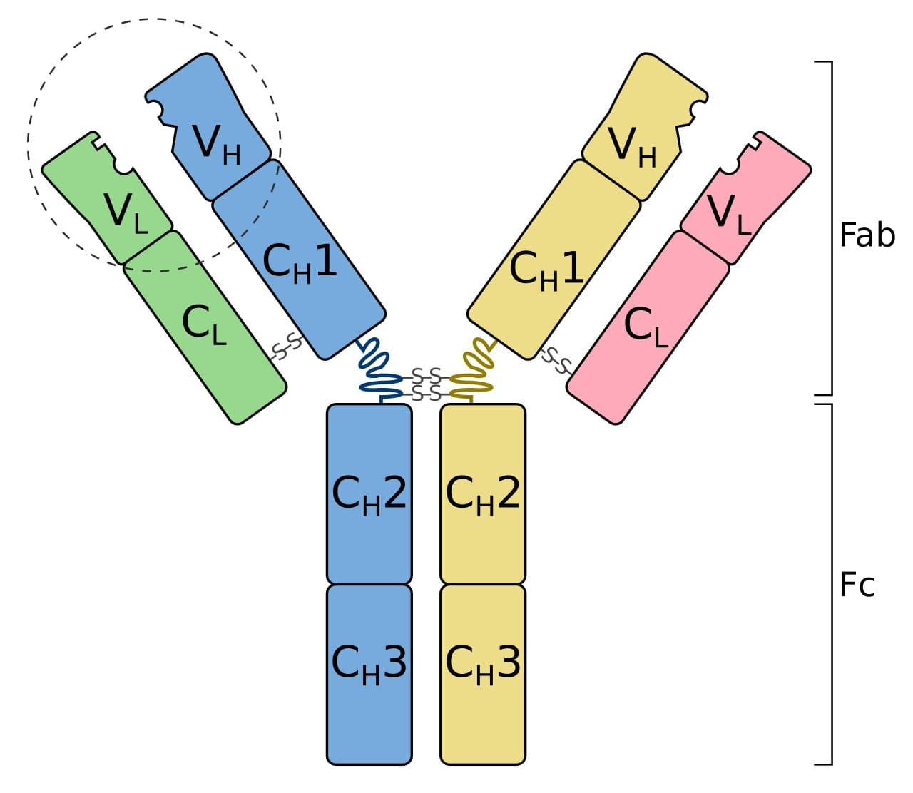
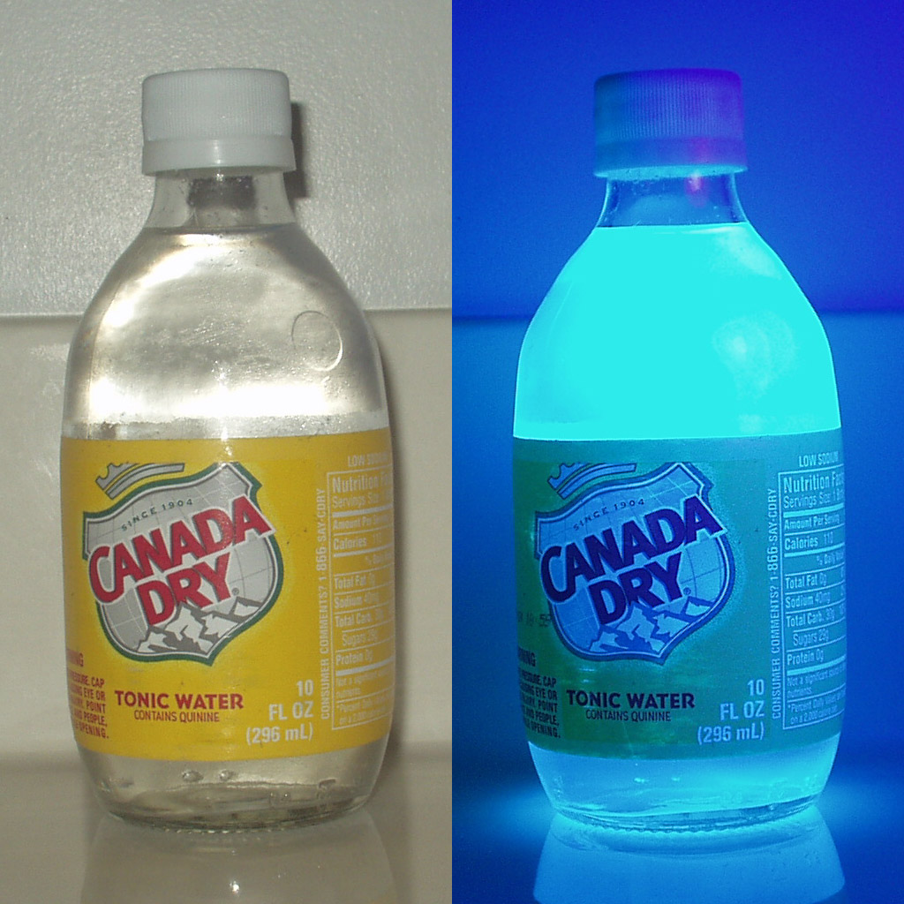
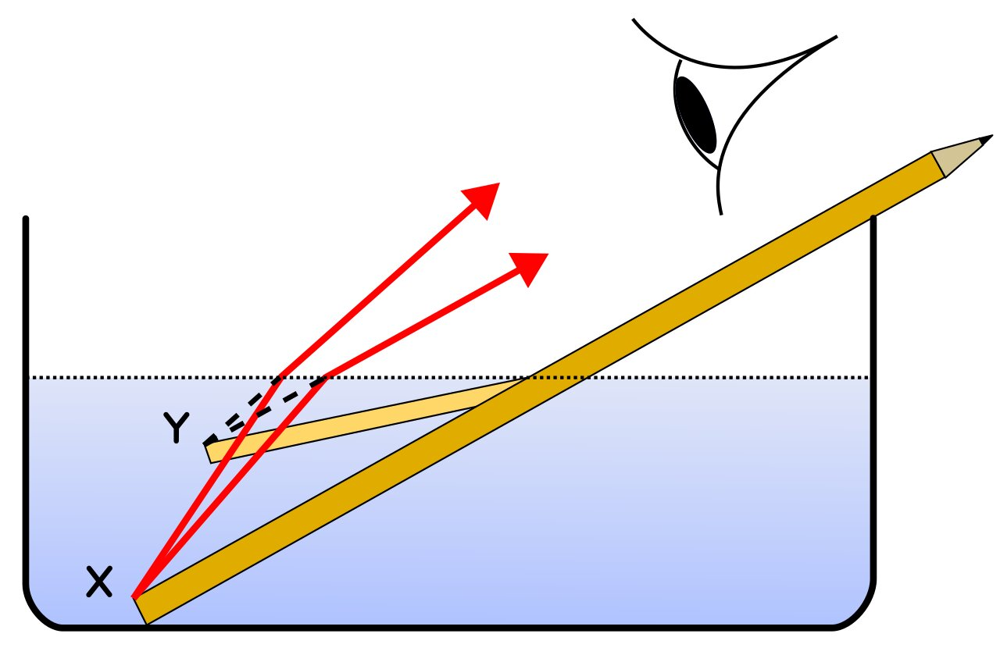
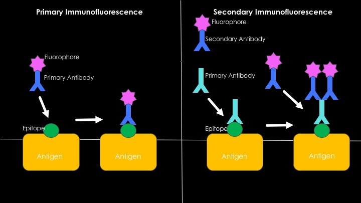
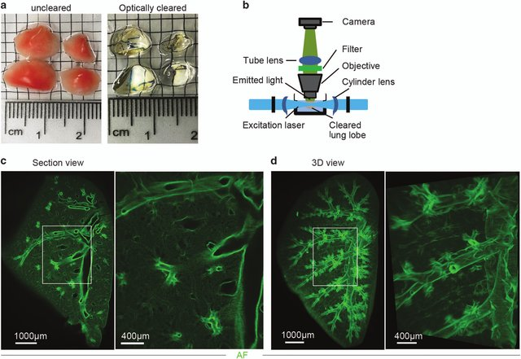
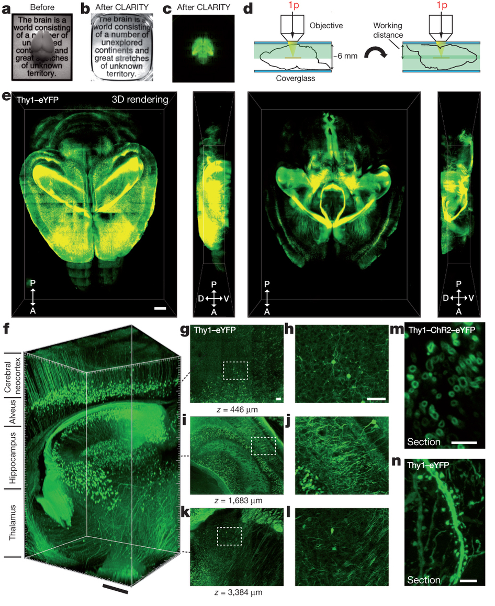

During grad school, I had the great privilege to get accustomed to some of the more creative ways of understanding diseases. One of them is called **tissue clearing**, which was an idea that was circulating for a long time but was not fully achieved until the early 2000s. Neuroscience, the brain itself, and humans trying to understand themselves are all amazing, but the methods we use to understand ourselves are also praiseworthy. I have a certain respect for people who build tools for other people to create beautiful things.

I love reading the history of things with an amateurish passion. It was no surprise to me when I wanted to write this article too. I appreciate things that the society offers to us, like phones, computers, cars, vaccines, cameras, and everything else. All this stuff exists because lots of people before us took one more step to understand how things work.

This will be a long and beautiful story. There will be many people I'll fail to mention just to keep things simple, but that doesn't mean I don't see them or think that their work was not important. Science indeed stands on the giant's shoulders. No contribution is small.

**What is in this article?**

1. [The Domino Effect](#the-domino-effect)
2. [Cell Culture](#cell-culture)
3. [Immunity, vaccines, and the discovery of antibodies](#immunity-vaccines-and-the-discovery-of-antibodies)
4. [The development of immunofluorescence and microscopy](#the-development-of-immunofluorescence-and-microscopy)
5. [Tissue Clearing](#tissue-clearing)
6. [Resources](#resources)

### The domino effect

Let's start the story from far back, when the first microscope was constructed by the English physicist **[Robert Hooke](https://en.wikipedia.org/wiki/Robert_Hooke)** in 1665. He's also the first one to put probably anything he can find under the microscope and be amazed by what he sees. One day, he put some mimosa leaves under his microscope and observed the small building blocks that created it, and called them "plant cells". He published **[Micrographia](https://en.wikipedia.org/wiki/Micrographia)**, which consisted of his amazing findings and their drawings.

###### The first observed plant cells.

###### Image Credit: Robert Hooke (1635–1707), Public domain, via Wikimedia Commons

As expected from a work well done, Micrographia inspired other scientists as well. One of them was the Dutch scientist [Antonie van Leeuwenhoek](https://en.wikipedia.org/wiki/Antonie_van_Leeuwenhoek). He even took things one step further and made better optical lenses that could achieve 270x magnification, while Hooke's microscope could only achieve 50x magnification. He took samples from the human mouth and observed unicellular organisms like bacterias and protozoa, which he called **animalcules**. He also put many other animal and human tissues under the microscope and observed blood cells, muscle fibers, and sperm cells. He even used saffron to stain muscle fibers. He illustrated and published his findings in [Arcana Naturae Detecta](https://digital.sciencehistory.org/works/sb3979577) in 1695 and is considered to be the "father of microbiology".

In 1745, an English biologist (and priest) named [John Needham](https://en.wikipedia.org/wiki/John_Needham) read about Leeuwenhoek's animalcules and started experimenting. At that point, scientists thought the living organisms could spontaneously be generated from non-living matter, and this was called **[spontaneous generation](https://en.wikipedia.org/wiki/Spontaneous_generation)**. He boiled some broth, cooled the mixture to room temperature, then sealed the flasks, and see the microbes make the broth go cloudy in the next few days. The Italian naturalist named [Lazzaro Spallanzani](https://en.wikipedia.org/wiki/Lazzaro_Spallanzani) who read about these experiments were intrigued, as he thought the design of the experiment was wrong. He suggested that the microorganisms entered the flasks before it was sealed. So he repeated the experiments with a modified technique, he put the broth in flasks, sealed them, vacuumed them, and only then boiled the broth. This time, the microorganisms didn't grow. Although it sounds funny today, spontaneous generation was very much in balance with the cultural and religious beliefs of those days, so people just argued that this just proved that for some reason spontaneous generation couldn't happen without the air. In 1859, a young French chemist called [Louis Pasteur](https://en.wikipedia.org/wiki/Louis_Pasteur) finally disproved this hypothesis. He boiled meat broth for several minutes in a flask where he could heat the neck and bent it into an S shape. The air could enter, but the microorganisms and the dust would settle down in the neck of the bottle where it was bent. No microorganisms grew in this flask, but when it was tilted enough for the broth to touch the neck area where the airborne particles are, the broth became cloudy, indicating microorganism growth. This meant life came from pre-existing life and nothing else.

###### Pasteur experimenting in his laboratory.

###### Image Credit: https://upload.wikimedia.org/wikipedia/commons/4/44/Louis_Pasteur_experiment.jpg, Public domain, via Wikimedia Commons

Pasteur also realized that microorganisms were responsible for the spoiling of beverages and food, so he thought some human diseases might be connected to these microorganisms as well. Following this, a British surgeon named [Joseph Lister](https://en.wikipedia.org/wiki/Joseph_Lister) created and promoted the idea of sterile surgery, which consisted of cleaning the surgical instruments with carbolic acid before any procedure to prevent microorganism contamination. Therefore, Lister is known as the "father of modern surgery".

Meanwhile, in the 19th century, the **cell theory** began to emerge. With the invention of the microscopes, scientists began to see that every living thing was formed of tiny building blocks that they called **cells**, and the structure and the relationship between these cells were important for the living organism. A German physician and physiologist named [Theodor Schwann](https://en.wikipedia.org/wiki/Theodor_Schwann) figured there were three essential elements in a cell: A nucleus, fluid around the nucleus, and a membrane or a wall that enclosed the cell. Meanwhile, another German scientist named [Rudolf Virchow](https://en.wikipedia.org/wiki/Rudolf_Virchow) suggested that cells came from cells, therefore if a pathological tissue exists somewhere, its abnormal prototype version also exists. He thought the physiologically healthy cells shifted to a more pathological state in response to an effect, and this was the cause of any pathology. Pasteur argued that the diseases were caused by microorganisms. These were the two hypotheses that were leading to explain the source of diseases at the time. Of course, now we know both of them were right: Virchow described cancer, and Pasteur described infectious diseases. Virchow is known as the "father of modern pathology".

###### Illustration of Virchow's cell theory.

###### Image Credit: https://upload.wikimedia.org/wikipedia/commons/7/7b/Virchow-cell.jpg, Public domain, via Wikimedia Commons.

### Cell Culture

In the late 19th century, a scientist named [Wilhelm Roux](https://en.wikipedia.org/wiki/Wilhelm_Roux) managed to keep the living cells of the neural plate of a chick embryo alive and healthy outside the body in a saline solution for a few days. But the first in vitro cell culture techniques came in the early 20th century. An American embryologist named [Ross Granville Harrison](https://en.wikipedia.org/wiki/Ross_Granville_Harrison) adapted a microbiology technique called **the hanging drop technique** that was essentially used in microbiology at the time. This technique was developed by the German physician and microbiologist [Robert Koch](https://en.wikipedia.org/wiki/Robert_Koch) in the late 19th century and was used to culture [Bacillus anthracis](https://en.wikipedia.org/wiki/Bacillus_anthracis). The hanging drop technique depended on a glass slide that had a circular concavity in the middle, where a drop of fluid could hang from when the glass slide was inverted. Harrison successfully adapted the hanging drop technique to the cell cultures, also involving an aseptic technique as the first few cultures were successful but contaminated. This invention made it possible to culture cells up to 5 weeks in vitro.

###### An illustration that shows the hanging drop cell culture technique.

###### Image Credit: https://microbeonline.com/procedure-hanging-drop-method-test-bacterial-motility/

To be able to do efficient cell cultures opened up a new chapter in science history, as almost every biomedical research today involves cell cultures of some sort. In the early 20th century, scientists [Montrose Burrows](https://en.wikipedia.org/wiki/Montrose_Thomas_Burrows) and [Alexis Carrel](https://en.wikipedia.org/wiki/Alexis_Carrel) created cell cultures of many embryonic and adult tissues (such as skin, connective tissue, periosteum, bone, bone marrow, cartilage, kidneys, and thyroid gland) of multiple species (dog, cat, chicken, guinea pig, rat). They also started to experiment with the culture media that involved diluted plasma. In 1912, Carrel developed the first **cell line** from a chicken embryo heart. Due to careful application of the aseptic procedures, frequent medium change, and a Pyrex flask of his own design, this culture could be maintained until 1946 (for 34 years) and was terminated on will. He claimed that all cells can grow indefinitely given the right circumstances. (Now we know that healthy cells become [senescent](https://en.wikipedia.org/wiki/Cellular_senescence) at one point and is one of the factors that cause [aging-associated diseases](https://en.wikipedia.org/wiki/Aging-associated_diseases) such as Age-Related Macular Degeneration (AMD) and Benign Prostatic Hyperplasia (BPH), while immortal cells like cancer cells can replicate forever. If you want to read more about cellular senescence, I recommend [this](https://www.ncbi.nlm.nih.gov/pmc/articles/PMC5643029/) article.)

Cell cultures were possible due to four things, one which we failed to mention, and will do in this paragraph. **The first thing** was the hanging drop technique, which was essentially developed for microbiology cultures. **The second** was the aseptic techniques. **The third** was the media, as cell life depends widely on the microenvironment that's provided for it. (The media we use today for cell cultures include lots of things, amino acids, vitamins, ions, trace elements, glucose, animal serum, additional growth factors and hormones, and antibiotics and antimycotics. Depending on the cell and culture type, we even coat surfaces with extracellular matrix proteins such as collagen, gelatin, laminin, fibronectin, poly-L-lysine so that they attach more easily. Also, we provide incubators with controlled humidity, carbon dioxide, oxygen, and temperature. The cells cultured today are as comfortable as they were inside a living organism. :]) **The fourth factor** was the trypsinization technique. In 1912, scientists [Rous](https://en.wikipedia.org/wiki/Francis_Peyton_Rous) and Jones discovered 3% trypsin solution was enough to detach cells from the surfaces without harming them in the process, and the obtained cells could be replanted somewhere else. The original article can be reached from [here](https://www.ncbi.nlm.nih.gov/pmc/articles/PMC2125431/).

In the 1950s and 1960s, the first cell lines (many of them are used even today) were established. The first one was created from mouse connective tissue in 1948 and was called **L929**. One of the most famous ones is the **[HeLa](https://en.wikipedia.org/wiki/HeLa)**cell line, which belongs to [Henrietta Lacks](https://en.wikipedia.org/wiki/Henrietta_Lacks), who was diagnosed with an aggressive adenocarcinoma of the cervix in 1951. After the biopsy, her cells were sent to Dr. [George Gay](https://en.wikipedia.org/wiki/George_Otto_Gey), who was the director of the Tissue Culture Laboratory. His research assistant Mary Kubicek realized the cells were viable on their own and didn't need a surface to grow. Finding this unusual, she decided to culture them. The cells grew meticulously (divided once in every 20 hours) and in various media, which made the scientists [Jonas Salk](https://en.wikipedia.org/wiki/Jonas_Salk) and [John Enders](https://en.wikipedia.org/wiki/John_Franklin_Enders) think of the possibility to grow poliovirus in a non-nervous system tissue. The HeLa cells were successfully infected with the poliomyelitis virus, which made the vaccine possible. After this, HeLa cells were widely distributed to laboratories around the world and became a valuable resource for scientific studies. Now we know why the HeLa cells are so special (and aggressive): They were infected with a virus called HPV-18 that suppressed and degraded the [p53 protein](https://en.wikipedia.org/wiki/P53), which is the product of the p53 tumor suppressor gene. Also, the HLA supergene family on Chromosome 6 was mutated, and the genetic material suffered from a condition known as [chromothripsis](https://en.wikipedia.org/wiki/Chromothripsis) in various points, which very simply can be defined as chromosomal rearrangement that exists in 2-3% of all cancers.

###### Immunofluorescence imaging of HeLa cells showing microtubules in green, mitochondria in yellow, nucleoli in red and nuclear DNA in purple.

###### Image Credit: GerryShaw, CC BY-SA 4.0 <https://creativecommons.org/licenses/by-sa/4.0>, via Wikimedia Commons

### Immunity, vaccines, and the discovery of antibodies

Immunity to diseases has been documented throughout human history, even without the knowledge of the existence of the antibodies. But the idea of actively acquiring the immunity without getting the worst effects of the disease (which we now know as vaccination) only emerged in the late 18th century.

[Smallpox](https://en.wikipedia.org/wiki/Smallpox) was a disease that emerged in the 6th century, and its characteristic symptoms were high fever, fatigue, headache and backache for the first 2-3 days, and red rashes filled with pus all around the body afterward, which left pitted scars if you could survive. It spread easily through coughing, sneezing, or contact with the fluid from the blisters, and had a 30% mortality rate. In the 18th century, people themselves were trying to acquire immunity by a method called **variolation**, which was taking some fluid from a smallpox pustule, and either inoculate it to a small scratched area on their skin or inhale it through their nose. With variolation people still had symptoms of the disease, but fewer died. In 1796, an English doctor named [Edward Jenner](https://en.wikipedia.org/wiki/Edward_Jenner) observed that milkmaids who had gotten cowpox did not develop the symptoms for smallpox. This lead to the first attempt at vaccination in human history. Dr. Jenner took some fluid from a cowpox pustule and inoculated it to the arm of a 9-year-old. The 9-year-old never developed the smallpox disease, although he was exposed to it several times. Dr. Jenner published his findings in 1801: [On the Origin of the Vaccine Inoculation](https://www.ncbi.nlm.nih.gov/pmc/articles/PMC5598692/).

###### The illustration of the steps taken by Edward Jenner to create the first vaccine for smallpox.

###### Image Credit: Srcyr16, CC BY-SA 4.0 <https://creativecommons.org/licenses/by-sa/4.0>, via Wikimedia Commons

In 1959, the World Health Organization (WHO) started the Global Smallpox Eradication Program. After many efforts of many people and a better understanding of the vaccines and the procedures, as of 1980, smallpox was eradicated from the world. It is one of two diseases that humanity was able to eradicate (the other one is [Rinderpest](https://en.wikipedia.org/wiki/Rinderpest)), and the only eradicated disease that affects humans (Rinderpest affected cattle). Plus, we do have an effective vaccine that has our back thanks to science.

In the late 19th century, [Emil von Behring](https://en.wikipedia.org/wiki/Emil_von_Behring) and [Shibasabura Kitasato](https://en.wikipedia.org/wiki/Kitasato_Shibasabur%C5%8D) realized that the transfer of the serum of an animal that previously encountered and survived [diptheria](https://en.wikipedia.org/wiki/Diphtheria) could cure the infected animals that showed the symptoms of the disease. In 1897, another scientist named [Rudolf Kraus](https://en.wikipedia.org/wiki/Rudolf_Kraus) developed the **precipitin test**, which demonstrated the reaction between antitoxins and antigens. The precipitin test is still actively used for determining blood types. Forensics experts also use this test to determine which species an unknown blood sample belongs to. For the discovery of the diphtheria antitoxin serum, Behring was awarded the Nobel Prize in 1901. (I could not find a legit source on why Dr. Kitasato wasn't also awarded, but he was nominated.)

In 1900, a German scientist named Paul Ehrlich proposed [the side-chain theory](https://en.wikipedia.org/wiki/Side-chain_theory). Here, he hypothesized a model of immunity with some specialized macromolecules that has multiple binding sites and reside on the cell membrane that he called antibodies, bind to the foreign materials that are also known as antigens through a specific binding site, therefore triggering a cell response that eliminates the foreign material. He also suggested that the binding site of these antibody molecules can be trained, and if these molecules do bind something, it would induce the reproduction of that given cell. This model holds true today with a slight addition: now we are aware that the antibodies can exist both in cell-bound and soluble forms (free from a membrane).

###### Diagrams illustrating the side-chain theory of Paul Ehrlich.

###### Image Credit: https://commons.wikimedia.org/wiki/File:Diagrams_illustrating_the_side-chain_theory_of_Paul_Ehrlich_Wellcome_M0013303.jpg

Later in 1948, a Swedish immunologist named [Astrid Fagraeus](https://en.wikipedia.org/wiki/Astrid_Fagraeus) showed that the plasma B cells were specifically involved in antibody production. In 1959, scientists [Gerald Edelman](https://en.wikipedia.org/wiki/Gerald_Edelman) and [Rodney Porter](https://en.wikipedia.org/wiki/Rodney_Robert_Porter) published the molecular structure of antibodies, separately and independently from each other. In 1972, both of them were awarded a Nobel Prize for this discovery. In 1957, [Frank Burnet](https://en.wikipedia.org/wiki/Macfarlane_Burnet) and [David Talmage](https://en.wikipedia.org/wiki/David_Talmage) proposed the [clonal selection theory](https://en.wikipedia.org/wiki/Clonal_selection). Very simply put, this theory states that when the pre-existing lymphocyte group (specifically B cells) encounters a foreign antigen, it activates a certain subgroup of those cells, therefore triggering the multiplication of that subgroup and the production of the identical clones of that antibody. If a subgroup reacts to the antigens of its own environment (self reacting lymphocytes), that subgroup is destroyed.

Now we know that [antibodies](https://en.wikipedia.org/wiki/Antibody) (otherwise known as immunoglobulins) have two main functional parts: One part is the **antigen-binding fragment** (called **Fab**), and the other part is the **crystallizable fragment** (called **Fc**) which interacts with other elements of the immune system such as phagocytes or a component of the [complement cascade](https://en.wikipedia.org/wiki/Complement_system) which eventually leads to cell death ([apoptosis](https://en.wikipedia.org/wiki/Apoptosis)). All antibodies have the same physical structure: they are made of two light and two heavy chains. The Fab domains of the antibodies have two variable and two constant domains. The three loop structures known as the complementarity determining regions (CDRs) in the variable domains are responsible for the [lock and key recognition](https://en.wikipedia.org/wiki/Antigen-antibody_interaction) between the antigen and the antibody.

###### Schematic diagram of an antibody (immunoglobulin). It consists of two heavy chains (blue, yellow) and two light chains (green, pink). One of the two antigen-binding regions is circled: they are formed by the variable regions at the tip of the antibody. The heavy chains have a variable domain (VH), followed by a constant domain (CH1), a hinge region, and two more constant domains (CH2, CH3). The light chains have a variable domain (VL) and a constant domain (CL). The CH2 and CH3 regions form the crystallizable fragment (Fc). The variable and CH1, CL regions form a pair of antigen-binding fragments (Fab). Two heavy chains are connected via disulfide bonds that are shown as S-S. Their exact number and location vary for different isotypes.

###### Image Credit: Tokenzero, CC BY-SA 4.0 <https://creativecommons.org/licenses/by-sa/4.0>, via Wikimedia Commons

In 1975, Georges Köhler and César Milstein invented [monoclonal antibodies](https://en.wikipedia.org/wiki/Monoclonal_antibody). Before I explain what monoclonal antibodies are, I want to introduce another word called **[epitope](https://en.wikipedia.org/wiki/Epitope)**, which is the part of the antigen that is recognized by the immune system. An antigen can have multiple epitopes. Monoclonal antibodies are created by cloning a single lineage of white blood cells and only bind to a single epitope of a given antigen. Polyclonal antibodies are created by several lineages of white cells and are a more heterogeneous group of antibodies that can bind to different epitopes of the same antigen. Monoclonal antibodies take more time to produce and they are more expensive, but they have less [cross-reactivity](https://en.wikipedia.org/wiki/Cross-reactivity), as they are only targeted to react to a single epitope. The invention of monoclonal antibodies lead to [improved and targeted treatments](https://en.wikipedia.org/wiki/Monoclonal_antibody_therapy) of various diseases such as many types of cancer, autoimmune diseases, and asthma. It also improved the quality of biomedical research and diagnostic tests.

### The development of immunofluorescence and microscopy

[The first report on fluorescence](https://royalsocietypublishing.org/doi/10.1098/rstl.1845.0004) was in 1845 by Fredrick W. Herschel, who put a transparent quinine solution in direct sunlight and observed the emission of some peculiar blue light.

###### The quinine content of tonic water causes it to fluoresce under UV light.

###### Image Credit: User:Splarka from en:wp, Public domain, via Wikimedia Commons

In 1852, an Anglo-Irish physicist named [George Stokes](https://en.wikipedia.org/wiki/Sir_George_Stokes,_1st_Baronet) [described fluorescence in a more detailed way](https://archive.org/details/bub_gb_CE9FAAAAcAAJ/page/n502): he realized that some materials like [fluorite](https://en.wikipedia.org/wiki/Fluorite) and [uranium glass](https://en.wikipedia.org/wiki/Uranium_glass) were able to convert the invisible ultraviolet light into visible wavelengths.

In 1873, a German physicist named [Ernst Abbe](https://en.wikipedia.org/wiki/Ernst_Abbe) demonstrated that the resolution of the optical devices used in the day, such as microscopes and telescopes, were limited by the refraction of light.

###### **A very simple explanation of [refraction](https://en.wikipedia.org/wiki/Refraction):** Light slows down when it travels through different materials composed of different molecules. Also as if it comes with an angle, the first waves that reach the second material on one side will slow down first, causing the light to bend. In this illustration, the pencil part immersed in the water looks bent due to refraction: the light waves from X change direction and so seem to originate at Y.

###### Image Credit: Pencil_in_a_bowl_of_water.png: User:Theresa_knottderivative work: Gregors (talk) 10:51, 23 February 2011 (UTC), CC BY-SA 3.0 <http://creativecommons.org/licenses/by-sa/3.0/>, via Wikimedia Commons

Scientists discussed the possibility of higher resolution images (therefore better quality data) if the specimens themselves were emitting light. So in 1929, scientists Philipp Ellinger and August Hirt created the intravital microscopes, which involved treating a living organism with fluorescent substances, using a UV light for illumination, and placing filters between the objective and eyepiece to reflect the exciting rays. This is pretty close to modern fluorescence microscopy, but the way of labeling specimens was very primitive.

The idea of tagging the antibodies with dyes was around for a decade, and the first study that demonstrated a successful immunohistochemistry method was made in 1941 by an American scientist [Albert Coons](https://en.wikipedia.org/wiki/Albert_Coons). The study used [Fluorescein isothiocyanate (FITC)](https://en.wikipedia.org/wiki/Fluorescein_isothiocyanate) labeled antibodies to localize Pneumococcal antigens in infected tissues. In the 1960s, the introduction of **enzymatic immunochemistry techniques** such as peroxidase anti-peroxidase (PAP), alkaline phosphatase anti-alkaline phosphatase (APAAP), and diaminobenzidine (DAB) - horseradish peroxidase (HRP) methods followed.

There are two main methods of immunofluorescence, which are known as the **direct** and the **indirect** methods. In the direct method, the antibody that is binding to the antigen we want to see is directly labeled with an enzyme or a fluorophore. In the indirect method, the antibody that directly binds to the antigen we want to see doesn't have any labels, so with another antibody that is labeled, we target the first antibody.

###### **Direct vs. indirect methods of immunofluorescence.** The direct method has a single step: The antibody that is labeled with a fluorophore is applied to the specimen where the antigen-antibody binding occurs. The emitted light under UV light can be observed with a fluorescence microscope. The indirect method involves two steps: First, an unlabeled antibody that binds to a specific antigen we want to see is applied to the specimen. Second, another antibody that is labeled with a fluorophore that binds to the first one is applied. In the indirect method, the second antibody is anti-species, if the antibody that's applied in the first step was produced in rabbits, the second antibody should be produced in another animal, such as a goat, and should be anti-rabbit. (So the second antibody will be Goat-anti-Rabbit.)

In the 1960s GFP (green fluorescent protein) was isolated from a jellyfish ([Aequorea victoria](https://en.wikipedia.org/wiki/Aequorea_victoria)) by a Japanese marine biologist and chemist named [Osamu Shimomura](https://en.wikipedia.org/wiki/Osamu_Shimomura). In 1992, an American molecular biologist named [Douglas Prasher](https://en.wikipedia.org/wiki/Douglas_Prasher) published the nucleotide sequence of the GFP molecule. The availability of GFP and its derivatives redefined fluorescence microscopy. And in 1996, for their discovery of GFP, Osamu Shimomura, [Martin Chalfie](https://en.wikipedia.org/wiki/Martin_Chalfie), and [Roger Tsien](https://en.wikipedia.org/wiki/Roger_Y._Tsien) was awarded the 2008 Nobel Prize for chemistry.

The logic behind fluorescence in its most simplified form is this: When an atom absorbs a high-energy photon, one of the electrons is raised to an excited state. The excited state of an electron is unstable, and eventually, it wants to go back to its grounded state again. Therefore, it releases the excess energy as a lightwave, but some of the energy is lost in the process, so the emitted light has a longer wavelength than before. This is the light we observe with a fluorescence microscope.

Fluorescence microscopy and antibody labeling developed immensely at the beginning of the 21st century. Now we have many options, [live cell imaging](https://en.wikipedia.org/wiki/Live_cell_imaging), [confocal](https://en.wikipedia.org/wiki/Confocal_microscopy), [two-photon](https://en.wikipedia.org/wiki/Two-photon_excitation_microscopy), [light-sheet](https://en.wikipedia.org/wiki/Light_sheet_fluorescence_microscopy), [STED microscopy](https://en.wikipedia.org/wiki/STED_microscopy), and many more, each developed for different types of specimens and experiments. We can also create [transgenic animals](https://en.wikipedia.org/wiki/Genetically_modified_animal) that express various types of fluorophores in different cells or exhibit some sort of genetic predisposition to a disease.

One of the most amazing and artsy-looking brains I've ever seen is the Brainbow mice brain. [Brainbow mice](https://en.wikipedia.org/wiki/Brainbow) is a transgenic animal that randomly expresses different ratios of red, green, and blue in each individual neural cell, creating the opportunity to track down each individual neuron. It was created in 2007 by a team of scientists led by [Jeff W. Lichtman](https://en.wikipedia.org/wiki/Jeff_W._Lichtman) and [Joshua R. Sanes](https://en.wikipedia.org/wiki/Joshua_Sanes), and it was a major contribution to the science field called [neural connectomics](https://en.wikipedia.org/wiki/Connectomics), which studies the connections between neurons of an organism's nervous system.

.jpeg>)

###### a) A motor nerve innervating ear muscle. b) An axon tract in the brainstem. c) The hippocampal dentate gyrus. In the **[Brainbow mice](https://en.wikipedia.org/wiki/Brainbow)** from which these images were taken, up to ~160 colors were observed as a result of the co-integration of several tandem copies of the transgene into the mouse genome and the independent recombination of each by Cre recombinase. The images were obtained by the superposition of separate red, green and blue channels. From Lichtman and Sanes, 2008.

###### Image Credit: Jeff W. Lichtman and Joshua R. Sanes, CC BY 3.0 <https://creativecommons.org/licenses/by/3.0>, via Wikimedia Commons

### Tissue Clearing

Until this point in science history, if you wanted to see anything inside of a given tissue, you needed to slice it into thin sections to observe anything. And even then, creating 3D images out of them and understand how the cells connect was an issue. (Especially if you were working with neural cells that can have long [neurites](https://en.wikipedia.org/wiki/Neurite).) Making tissues transparent was an idea that solved this particular problem.

The first attempts at making opaque tissues transparent were done in the early 1900s, by a German anatomist named [Werner Spalteholz](https://en.wikipedia.org/wiki/Werner_Spalteholz). He created a method where he used harsh chemical solvents for eliminating the light scattering tissue components and therefore making a human tissue transparent. Imaging and immunohistochemical labeling methods were not as developed back then, and after they caught up, the technique was found to be incompatible with the modern fluorescent agents. It was also found to be too harsh and damaging for the biological tissues. But, observing cells in their microenvironments with their connections intact was also a dream of other scientists, especially neuroscientists, who deal with cells that connect in complicated ways. Understanding disturbed connections is a huge step in understanding diseases and disorders. So the work continued while the microscopy techniques also evolved.

Today, there are many tissue clearing methods, such as CLARITY, DISCO methods (iDISCO, uDISCO, 3DISCO, DIPCO), BABB, PEGASOS, SHANEL, SeeDB, [CUBIC](https://en.wikipedia.org/wiki/CUBIC), ExM, and SHIELD. The chemical solvents and the application methods used in each method changes the refractive indexes and the physical properties of the final tissue. The method you choose to clear your tissues should depend on what you want to observe, and how you're going to image it. All clearing methods aim the same thing: making tissues transparent by removing the parts that absorb and scatter the light without affecting the protein structure. The cellular component that makes a tissue opaque is mostly the double layer phospholipid membrane, so all the methods involve strong chemical solvents. I will briefly talk about two of these methods that I had the chance to use and observe: CLARITY and 3DISCO.

**[3DISCO](https://en.wikipedia.org/wiki/3DISCO)** is a technique that uses different concentrations of some organic solvents to achieve optical transparency, and was developed in 2012, by [Ali Erturk](https://en.wikipedia.org/wiki/Ali_Ert%C3%BCrk) and his team. With this method, immunostaining has to be done before the sample is cleared, as chemicals that are being used (like tetrahydrofuran ([THF](https://en.wikipedia.org/wiki/Tetrahydrofuran)) and Dichloromethane ([DCM](https://en.wikipedia.org/wiki/Dichloromethane))) alters the chemical composition of the tissue and the sample cannot be immunostained after it is optically cleared. The technique consists of three major steps: **The first step** is tissue dehydration, as the refractive index of the water inside tissues is also a factor that affects the resolution of the final image. This is done by bathing the tissues in step by step increased concentrations of THF. **The second step** consists of the removal of the lipid structures in the tissue, by incubating it in a chemical solvent named DCM. **The third step** is the refractor index matching, which is done with another chemical named Dibenzyl ether ([DBE](https://en.wikipedia.org/wiki/Dibenzyl_ether)). In the following years the technique evolved and now has various modifications (iDISCO, uDISCO, DIPCO) for different purposes.

###### **3DISCO clearing and light sheet microscopy (LiSM) imaging of whole lung lobes.** (a) Clearing of separated lung lobes using organic solvents. Separated lung lobes (left) were dehydrated in increasing concentrations of THF followed by optical clearing in DBE (right) before LiSM imaging. (b) Diagrammatic representation of LiSM set-up showing sample orientation, excitation by a thin light sheet and image acquisition. (c, d) Representative LiSM micrographs from 3DISCO-cleared lung lobes, showing sectional and 3D views of an imaged lobe from a wild-type (WT)mouse. AF, autofluorescence.

###### **Image Credit:** Mzinza, D.T., Fleige, H., Laarmann, K. et al. [Application of light sheet microscopy for qualitative and quantitative analysis of bronchus-associated lymphoid tissue in mice.](https://www.researchgate.net/publication/323125099_Application_of_light_sheet_microscopy_for_qualitative_and_quantitative_analysis_of_bronchus-associated_lymphoid_tissue_in_mice) Cell Mol Immunol 15, 875–887 (2018). https://doi.org/10.1038/cmi.2017.150

**[CLARITY](https://en.wikipedia.org/wiki/CLARITY)** is a [hydrogel](https://en.wikipedia.org/wiki/Hydrogel) based technique, and it was developed in 2013, by Kwanghun Chung and [Karl Deisseroth](https://en.wikipedia.org/wiki/Karl_Deisseroth). A hydrogel is a network of physically and chemically linked hydrophilic polymer chains which create a robust 3D structure, that can absorb water but does not dissolve in it. The method depends on three steps: **In the first step**, you place the tissue you want to clear in a hydrogel monomer solution. Hydrogel monomers are the building blocks of the hydrogel polymers, and the point of this step is to let them diffuse through the sample, which will take longer for thicker tissues. In this step, a thermal initiator for the polymerization is also added to the solution, and as long as the sample is kept cold, the monomers will not polymerize. **The second step** is the hydrogel-tissue hybridization, which involves triggering polymerization by increasing the temperature to 37 C. Biomolecules inside the sample act as cross-linkers, and at this step, the purpose is to create a hydrogel skeleton inside the tissue that also links to the other biomolecules, other than lipids. **The third step** involves the tissue clearing, which is done by a solution that involves an anionic surfactant called [SDS](https://en.wikipedia.org/wiki/Sodium_dodecyl_sulfate). In this step, the purpose is to get rid of the parts of the tissue that didn't chemically link with the polymer skeleton and is responsible for scattering the light and making a tissue opaque. After the clearing step, you can immunostain your tissue by bathing it in various antibodies, as the transparent polymer brain is permeable to the antibodies. The technique can be used for both post-mortem animal and human tissues. The microscopy images borderline between art and science. They are beautiful.

###### **Intact adult mouse brain imaging.** A) Cajal quote before CLARITY. B) Cajal quote after CLARITY: Mouse brain after hydrogel–tissue hybridization, ETC and refractive-index matching. C) Fluorescence image of brain depicted in b. D) Dorsal aspect is imaged (single-photon (1p) microscopy), then brain is inverted and ventral aspect imaged. E) 3D rendering of clarified brain imaged. Left, dorsal half. Right, ventral half. Scale bar, 1mm. F) Non-sectioned mouse brain tissue showing cortex, hippocampus and thalamus. Scale bar, 400 mm. M) Cross-section of axons in clarified Thy1–channelrhodopsin2 (ChR2)–eYFP striatum: membrane-localized ChR2–eYFP. Scale bar, 5 mm. N) Dendrites and spines of neurons in clarified Thy1–eYFP line-H cortex. Scale bar, 5 mm.

###### **Image Credit:** Chung K, Wallace J, Kim SY et al: [Structural and molecular interrogation of intact biological systems.](https://www.researchgate.net/publication/236192146_Structural_and_molecular_interrogation_of_intact_biological_systems) Nature 2013; 497: 332-337

### Final Words

This article is just a tiny crumble that has fallen from the 12 tiered cake known as the history of science. Anything that we hold in our hands and affect our lives immensely has this type of story: the events, observations, discoveries, and inventions that inspired another smart being. Inventions were only possible because of the other ones before it. It is as Isaac Newton said: "If I have seen further it is by standing on the shoulders of giants". Oh, and if you want to know the story behind the quote, read [this](https://www.brainpickings.org/2016/02/16/newton-standing-on-the-shoulders-of-giants/) great article. Kudos! You have reached the end. :]

### Resources

1. Wikipedia
2. [Science History Institute](https://www.sciencehistory.org/)
3. [The Slow Death of Spontaneous Generation (1668-1859)](https://webprojects.oit.ncsu.edu/project/bio183de/Black/cellintro/cellintro_reading/Spontaneous_Generation.html) by Russell Levine and Chris Evers
4. [History of Cell Culture](https://www.intechopen.com/books/new-insights-into-cell-culture-technology/history-of-cell-culture) By Magdalena Jedrzejczak-Silicka
5. [History of Smallpox](https://www.cdc.gov/smallpox/history/history.html) by CDC
6. [History of Immunohistochemistry](https://www.sciencedirect.com/science/article/pii/B9780123864567074013) by G.V.Childs
7. [The increasing power of immunohistochemistry and immunocytochemistry](https://www.sciencedirect.com/science/article/abs/pii/S0022175998000702) by Per Brandtzaeg
8. Chung K, Wallace J, Kim SY et al: [Structural and molecular interrogation of intact biological systems.](https://www.researchgate.net/publication/236192146_Structural_and_molecular_interrogation_of_intact_biological_systems) Nature 2013; 497: 332-337
9. Mzinza, D.T., Fleige, H., Laarmann, K. et al. [Application of light sheet microscopy for qualitative and quantitative analysis of bronchus-associated lymphoid tissue in mice.](https://www.researchgate.net/publication/323125099_Application_of_light_sheet_microscopy_for_qualitative_and_quantitative_analysis_of_bronchus-associated_lymphoid_tissue_in_mice) Cell Mol Immunol 15, 875–887 (2018).
10. Ertürk, A., Becker, K., Jährling, N. et al. [Three-dimensional imaging of solvent-cleared organs using 3DISCO.](https://www.researchgate.net/publication/232236428_Three-dimensional_imaging_of_solvent-cleared_organs_using_3DISCO) Nat Protoc 7, 1983–1995 (2012).
