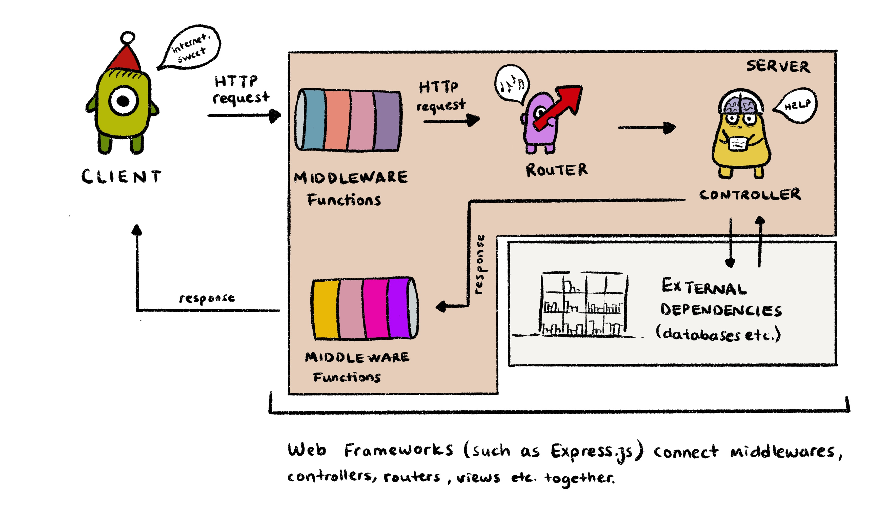

If you've ever done a backend of a project using Node.js, then you might have encountered middlewares and Express.js. This article aims to explain what both of them are used for and their connection to each other.

The story starts like this: You open a web browser and try to visit a website. Anytime you type a URL to your browser's address bar, you are requesting some data from a faraway server. The server prepares the data you ask for in a package (if it can) and sends it back to your browser. Your browser takes this package and converts it to whatever it indicates and the website you requested gets painted on your screen.

The code that runs in that server is your backend code. It is almost completely decoupled from your frontend code, so it can be written in almost any language. Good news though, whatever language you choose, the main logic is kinda similar.



Express.js is a minimal and open source web application framework for Node.js (like Ruby on Rails for Ruby or ASP .NET for C#) that helps you structure your web application to handle different HTTP requests at a specific URL. It also helps you to respond to requests with route support.

Let's create a very basic backend code for our server together: (If you want to do it on your computer, I am assuming you've installed node.js and express and initialized the project with npm init. If you haven't, check [this](https://expressjs.com/en/starter/installing.html) beautiful guide that express provided for us. I will just dissect the server.js file here.)

```javascript
// server.js

// First, you need to import express:
const express = require("express")

// Then you need to instantiate it by calling it and assigning the returned value to the app variable.
// We use the app object that is returned by calling express throughout our backend code.
var app = express()

// The app object has several methods that work in similar ways.
// These methods are GET, POST, PUT, DELETE, USE.
// As a first argument, they accept a route, and as the second they accept a function.
// In this example, if a GET request comes to the "/" route, the function will run.
app.get("/", (req, res) => {
  res.send("Hello World")
})

// Binds the application to a port on our machine.
app.listen(3000)
```

Now let's do middlewares. As the name suggests, middlewares are really between some stuff, stuff being you (the client) and the server. Middlewares are functions that can reach the **request (req)** the client sends, the **response (res)** the server sends, and the **next** function, which is the function that is going to be executed after the current one is finished. So middlewares are the perfect places if you want to modify the data that's being passed between the client and server. If the next function is not called inside the middleware function the request-response cycle will end there. To pass a middleware function in an express app, you use the `app.use()` method.

Example:

```javascript
const express = require("express")
var app = express()

// Let's create a middleware function that prints the request object to the console.
function printRequest(req, res, next) {
  console.log(req)
  next()
}

app.use(printRequest)

app.get("/", (req, res) => {
  res.send("Hello World")
})

app.listen(3000)
```

In the example at the upper code block, every time this app gets a request, it will just print the request to the console first. The order of the middleware calls matter, as the middlewares that are parsed first are going to be executed first.

#### How do you structure a Node Express app?

Neither Node nor Express dictates a strict folder structure, and there are multiple ways to structure your code. But here's some insight into the folders and files that you might see in other people's projects, or express-node.js starter boilerplates. The idea is simply dividing everything into modular pieces so that you know where you can find a certain piece of the app if an error occurs.

```
yourApp/
 |--controllers/      # Defines the functions that create the app logic.
 |--middlewares/      # Functions that process the incoming request before passing them to routes.
 |--models/           # Represents data storage logic
 |--routes/           # Calls controller functions depending on the routes. Has no logic, only does routing
 |--utils/            # Helper functionality that is shared by different parts of the app
 |--public/           # Holds all the static files
 |--views/            # Contains HTML templates that are served by the routes
 |--tests/            # The code that tests the application code
 |--.env              # Logs environment-specific variables
 |--.gitignore        # Specifies files that Git should ignore
 |--README.md         # Contains information about the app, a form of documentation
 |--LICENSE           # Specifies license information
 |--server.js         # Where you initialize your express app. (Alias: app.js)
 |--package.json      # Keeps the log of every dependency your app has (& versions)
 |--package-lock.json # Automatically created by node, locks dependencies to a certain version.
```

#### Resources

1. [Express.js Documentation](https://expressjs.com/)
2. [gitignore](https://git-scm.com/docs/gitignore)
3. [dotenv](https://www.npmjs.com/package/dotenv)
4. [Writing middleware for use in Express apps](https://expressjs.com/en/guide/writing-middleware.html)
