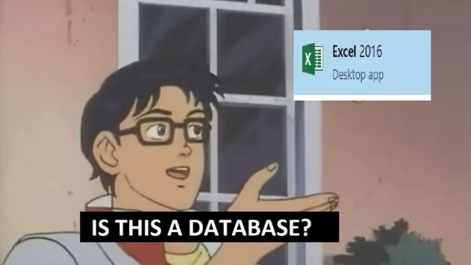
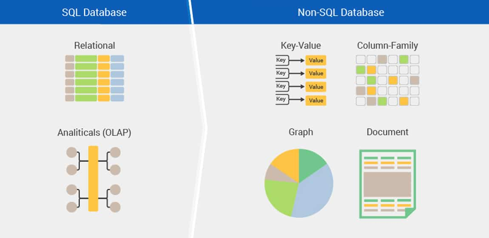
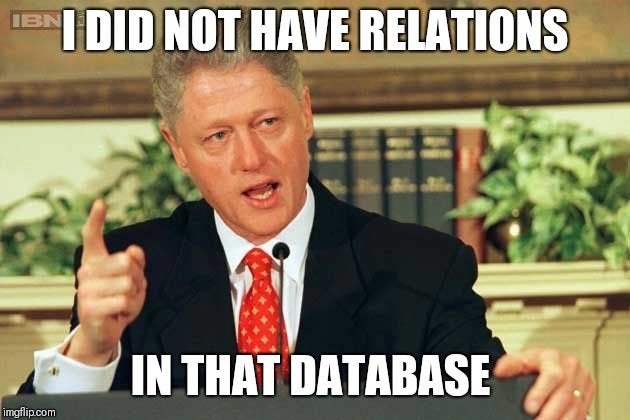

#### What is a database?

**A database** is a set of organized and structured data. We use databases to store data for us, and access or retrieve that data whenever it's needed. It is much like an excel spreadsheet, but better.

###### Image credit: https://devrant.com/rants/1998554/trying-to-explain-what-database-is-to-non-technical-people-non-developer

Think of it as a pantry. If you threw anything inside without any logic to it, whenever you need to get something out, you would be organizing a search party for it. Also, you wouldn't know if you have chili flakes, so maybe you would be buying them again and again. Or things would be expiring, and you wouldn't even know, so you would end up throwing away your money and time. As the items put there are to be retrieved in some way, the pantry (and your database) should be organized so that items can easily be accessed, managed, and updated.

How is a database better than an excel spreadsheet? Because you can access information in various ways when using a database, like only retrieving items that match certain criteria or update a bunch of records at the same time. You can also cross-reference the records in different tables.

#### Database Management Systems (DBMS)

The thing that makes databases better than a spreadsheet is the **Database Management System (DBMS)** which is the software that allows you to insert or access data. DBMS is the one that enforces the rules in a database and manages data manipulation. DBMS also defines the **data schema**, which is a strong and strict definition of how the data "must" be stored. Think of the pantry again. Schema is the way how you organize the things inside (spices: left side - second rack from the top, jams: right side - first rack from the top, etc).

The databases can be classified as **relational** and **non-relational**, depending on the DBMS they use.

###### Image credit: https://www.digitalconnectmag.com/sql-versus-nosql-database-design-which-one-to-pick-for-maximum-cloud-data-storage-performance/

**Relational database management systems** implement a relational model. The word "relational" has nothing to do with the word "relationship", but comes from "relational algebra", which was explained very neatly in [this article](https://medium.com/lambdax/what-if-i-told-you-there-are-no-tables-in-relational-databases-13d31a2f9677). The data is stored as tuples, which are ordered lists of attributes that represent a single item in the database. The data is easily represented as tables with rows (tuples) and columns (attributes). Each row in a table is called a **record** and each cell is a **field**. Generally, they have a **Graphical User Interface (GUI)** where you can view the tables and make changes. Also, they use a special language to interact with the database, which is called **Structured Query Language (SQL)**. Even if the GUIs are used to manipulate the data, the operations are done with SQL under the hood. Relational databases are also referred to as **SQL databases.** Some well known SQL databases are **Oracle**, **MySQL**, **Microsoft SQL Server**, and **PostgreSQL**.

**Non-relational database management systems** do not implement a strictly defined schema, instead, they use flexible "collections", which look like JavaScript objects. These are also known as **NoSQL databases**, as they don't use SQL as a query language. But they don't prohibit SQL or SQL like query languages, they just avoid storing data as tables, strict schemas, and JOIN operations that are the core concepts of SQL databases. NoSQL databases are classified by how they store data. There are databases that store key-value pairs (Redis and DynamoDB), or graphs (Neo4j and Amazon Neptune), or column (Cassandra and HBase), or document (MongoDB and CouchDB).

###### Image credit: https://www.reddit.com/r/ProgrammerHumor/comments/9ki9n3/drop_table/

#### SQL vs. NoSQL databases - pro's and con's

###### Pro's are indicated with ⬆, and con's with ⬇.

**◉ SQL:**

⬆ **Better performance:** Due to a process called **normalization**, the data is optimized, accurate, and up-to-date. Normalization reduces redundancy (that means no duplicate data), which results in better performance.

⬆ **Data is 100% reliable, up-to-date, and consistent:** SQL databases have **[ACID](https://en.wikipedia.org/wiki/ACID)** compliance, which protects the integrity of your data. A transaction is a sequence of operations to get a single unit of work done. **ACID** stands for **A**tomicity (each transaction is an atomic unit that either succeeds or completely fails), **C**onsistency (all data is subject to any rules defined by the schema), **I**solation (each transaction works separately and not visible to others until it's done), **D**urability (a transaction that succeeds is stored and available even in the event of a system failure)

⬇ **Scales vertically:** Increasing capacity by horizontal scaling is hard (which is simply adding more machines to work together to store data, and the DBMS needs to be able to manage and maintain all data across multiple machines). Scaling is mainly done vertically. Vertical scaling refers to adding more capacity to a single machine, by increasing CPU, RAM, etc.

**◉ NoSQL:**

⬆ **Flexible:** Data models are flexible (no rigid schema) and changes can be applied easily if the business requirements change.

⬆ **Fast queries:** Data is stored in a way that is optimized for queries and not reducing data duplication. (Popular motto: _Data that is accessed together should be stored together._) For this reason, NoSQL databases can be larger than SQL databases. As the storage is currently cheap and some NoSQL libraries even support data compression, it is not much of a drawback.

⬆ **Can be scaled horizontally:** Horizontal scaling is possible. This means it is perfect if the database is growing unexpectedly.

⬆ **Faster development time:** Data structures resemble real application code, so it is easier to learn by developers.

⬇ Data may not be always 100% up-to-date, but it catches up eventually.

#### Choosing a database

In a nutshell, we can say that SQL databases were designed to maintain the integrity of the data at all costs, and NoSQL databases were designed to be fast and flexible.

When choosing a database you should be fully aware of the needs and the requirements of the software you're building and the data you're going to store. If you're creating software for a rapidly growing company with no clear definitions of their data, NoSQL is useful. If the company has a predefined data structure or requires multi-row transactions (like many e-commerce companies or accounting software) then an SQL database is the way to go. NoSQL is also great for storing data for blogs, and social media posts.

#### Resources

1. Wikipedia - [Database](https://en.wikipedia.org/wiki/Database), [SQL](https://en.wikipedia.org/wiki/SQL), [NoSQL](https://en.wikipedia.org/wiki/NoSQL), [ACID](https://en.wikipedia.org/wiki/ACID)
2. [What is a Database?](https://www.lifewire.com/what-is-a-database-1019737) by Mike Chapple
3. [What Is a Database Management System (DBMS)?](https://www.lifewire.com/database-management-system-1019609) by Mike Chapple
4. [SQL vs. NoSQL Databases: What's the difference?](https://www.ibm.com/cloud/blog/sql-vs-nosql) by Benjamin Anderson
5. [What if I told you there are no tables in relational databases?](https://medium.com/lambdax/what-if-i-told-you-there-are-no-tables-in-relational-databases-13d31a2f9677) by Rafał Pocztarski
6. [SQL vs. NoSQL – what’s the best option for your database needs?](https://www.thorntech.com/2019/03/sql-vs-nosql/) by Mike Chan
