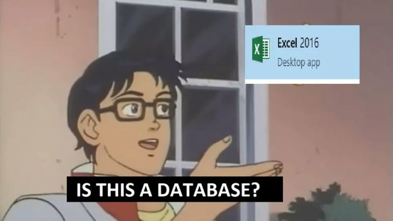

#### What is a database?

**A database** is a set of organized and structured data. Basically, we use databases to store data for us, and access or retrieve that data whenever it's needed. It is much like an excel spreadsheet, but better.

###### Image credit: https://devrant.com/rants/1998554/trying-to-explain-what-database-is-to-non-technical-people-non-developer

Think of it as a pantry. If you threw anything inside without any logic to it, whenever you need to get something out, you would be organizing a search party for it. Also, you wouldn't know if you have chili flakes, so maybe you would be buying them again and again. Or things would be expiring, and you wouldn't even know, so you would end up with throwing away your money and time. As the items put there are to be retrieved in some way, the pantry (and your database) should be organized so that items can easily be accessed, managed and updated.

How is a database better than an excel spreasdsheet? Because you can access information in various ways when using a database, like only retrieving items that match a certain criteria, or update a bunch of records at the same time. You can also cross-reference the records in different tables.

#### Database Management Systems (DBMS)

The thing that makes databases better than a spreadsheet is the **Database Management System (DBMS)** which is the software that allows you to insert or access data. DBMS is the one that enforces the rules in a database and manages data manipulation. DBMS also defines the **data schema**, which is basically a strong and strict definition of how the data "must" be stored. Think of the pantry again. Schema is the way how you organize the things inside (spices: left side - second rack from top, jams: right side - first rack from the top, etc).

The databases can be classified as **relational** and **non-relational**, depending on the DBMS they use.

**Relational database management systems** implement a relational model, which means they store data in tables with rows (tuples) and columns (attributes). Each row in a table is called a **record** and each cell is a **field**. Generally they have a **Graphical User Interface (GUI)** where you can view the tables and make changes. Also they use a special language to interact with the database, which is called **Structured Query Language (SQL)**. Even if the GUIs are used to manipulate the data, the operations are done with SQL under the hood. Relational databases are also referred as **SQL databases.**

**Non-relational database management systems** does not implement a strictly defined schema, instead they use flexible "collections", which look like JavaScript objects. These are also known as **noSQL databases**, as they don't use SQL as a query language.

###### Image credit: https://www.reddit.com/r/ProgrammerHumor/comments/9ki9n3/drop_table/

#### SQL vs. NoSQL databases - pro's and con's

#### Choosing a database

#### Terminology related to databases

#### Resources

1. Wikipedia - [Database](https://en.wikipedia.org/wiki/Database), [SQL](https://en.wikipedia.org/wiki/SQL)
2. [What is a Database?](https://www.lifewire.com/what-is-a-database-1019737) by Mike Chapple
3. [What Is a Database Management System (DBMS)?](https://www.lifewire.com/database-management-system-1019609) by Mike Chapple
