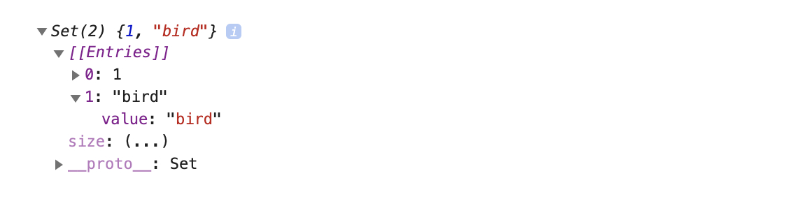

Before ES6 (ECMAScript 2015), there were only two built-in data structures in the JavaScript world that were used predominantly, and these two are known as Arrays and Objects. **Arrays** are data structures that keep the data as indexed lists. **Objects** keep the data as key-value pairs.

Two new kinds of iterable data structures were introduced with ES6, which are **Maps** and **Sets**.

Choosing the right data structure to store your data will help you manipulate it easier, which in turn will make your life easier. This article is about introducing the new data structures by describing the methods available to them and comparing them to the other ones that we already know and love. You can use the Chrome Developer Console to follow up with examples.

### Map:

A [Map](https://developer.mozilla.org/en-US/docs/Web/JavaScript/Reference/Global_Objects/Map) is an ordered collection that maps key-value pairs. From the outside it looks like an Array (as data inside it are indexed), but the data is kept as key-value pairs, which resembles an Object. In a Map, the keys can be of any data type, whereas in an object they have to be of String type.

So if you want to match anything other than strings to any kind of data, you can use a Map.

**⁂ Initializing a map, and setting and getting values:**

You can use the `new` keyword to initialize a Map data structure, which will return an empty Map:

```javascript
let map = new Map()
console.log(map) // prints: Map(0) {}
```

We've created a Map, which is awesome, but how do we put data inside or get a value out of it? The Map data structure has `set` and `get` methods for these purposes. The `set` method takes the key and the value as an argument, respectively. The `get` method only takes the key.

```javascript
let exampleMap = new Map()

// Keys can be of any type!
exampleMap.set("name", "River") // key is of String type
exampleMap.set(1, "one") // key is of Number type
exampleMap.set(true, "human") // key is of Boolean type
console.log(exampleMap) // prints: Map(3) {"name" => "River", 1 => "one", true => "human"}

// You can even use Objects as keys:
let pet = { type: "parrot" }
exampleMap.set(pet, "Cookie")
exampleMap.get(pet) // returns: "Cookie"

// Maps will keep the type! (Unlike Objects, which will turn all the keys into Strings.)
exampleMap.get(1) // "one"
```

**Note:** Map compares keys with strict equality (===), using an algorithm called [SameValueZero](https://tc39.es/ecma262/#sec-samevaluezero). This means the keys `1` and `"1"` are treated separately and can hold unique values because they are of different types. Maps don't allow duplicate values, so if you set another value with an existing key, it will be overwritten. Here, it's also important to remember how the reference types work. If you assign an Object type as a key, even though you copy and paste the same object for setting another value to it, it won't see it as the same Object, so it will create another key-value pair. But if you define an object outside, and use that as a key twice, the first value will be overwritten, because now you'll be referring to the same object.

The Map we created above actually looks like this if you extend it:


We can also initialize a Map using an Array of key-value pairs which are also inside their individual Arrays, like this:

```javascript
const exampleMap2 = new Map([
  ["name", "River"],
  [1, "one"],
  [true, "human"],
])

console.log(exampleMap2) // prints: Map(3) {"name" => "River", 1 => "one", true => "human"}
```

**Hint:** `Object.entries()` takes an object and returns an Array of Arrays with given key-value pairs, and makes the Map initialization with values easier than it looks!

```javascript
let obj = { ... }
let newMap = new Map(Object.entries(obj));
```

**⁂ Converting a Map back into an Object or an Array:**

Also, you can convert a Map into an object by using `Object.fromEntries()`, and you can convert a Map into an array by using `Array.from()`:

```javascript
const exampleObj = Object.fromEntries(exampleMap2)
console.log(exampleObj) // prints: {1: "one", name: "River", true: "human"}

const exampleArr = Array.from(exampleMap2)
console.log(exampleArr) // prints: [["name", "River"], [1, "one"], [true, "human"]]
```

**⁂ Checking if a key exists, the Map size and deleting an entry:**

Checking if a key exists is done with `map.has()`. This method returns a Boolean value.
Maps have a built-in `size` property that returns the number of key-value pairs in a Map.
Deleting an entry is done with `map.delete()`, which takes a key as an argument and returns the new version of the Map.
Deleting all the values inside a map is done with `map.clear()`

```javascript
const colorMap = new Map([
  ["pants", "gray"],
  ["shoes", "black"],
  ["shirt", "red"],
])

colorMap.size // returns 3
colorMap.has("belt") // returns false

colorMap.has("shirt") // returns true
colorMap.delete("shirt")
colorMap.has("shirt") // returns false

colorMap.clear()
colorMap.size // returns 0
```

**⁂ Iterating over a Map:**

There are three methods that return a MapIterator object which can be iterated over with a for...of loop, just like an array: `map.keys()`, `map.values()`, `map.entries()`, and a built-in `forEach()` method to iterate over a map in insertion order.

```javascript
const numberMap = new Map([
  ["pants", 1],
  ["shoes", 2],
  ["shirt", 1],
])

numberMap.keys() // returns: MapIterator {"pants", "shoes", "shirt"}
numberMap.values() // returns: MapIterator {1, 2, 1}
numberMap.entries() // returns: MapIterator MapIterator {"pants" => 1, "shoes" => 2, "shirt" => 1}

// You can use the for...of loop on MapIterator object:
let accesoriesCount = 0
for (let value of numberMap.values()) {
  accesoriesCount = accesoriesCount + value
}
accesoriesCount // returns: 4

// You can iterate over a map by using forEach:

numberMap.forEach((value, key, map) => {
  console.log(`${key}: ${value} | map: ${map.size}`)
})

// Prints:
// pants: 1 | map: 3
// shoes: 2 | map: 3
// shirt: 1 | map: 3
```

### Sets:

A [Set](https://developer.mozilla.org/en-US/docs/Web/JavaScript/Reference/Global_Objects/Set) is a data collection with unique values. You can't really say that it is unordered, as the iterator functions will follow the insertion order (except the repeated values, which will not be added, so they will not change the previous order). Also, in both maps and sets, you cannot reorder the values.

**⁂ Initializing a set, and setting and getting values:**

You can use the `new` keyword to initialize a Set data structure, which will return an empty Set:

```javascript
let exampleSet = new Set()
console.log(exampleSet) // prints: Set(0) {}
```

You can also provide an array of values to the set:

```javascript
let exampleSet = new Set([1, "bird", 1])

for (const element of exampleSet) {
  console.log(element) // Prints: 1 "bird"
}
```

The exampleSet we created above looks like this if you extend it: (And as you can see, there are index numbers for each value, so it is ordered.)



**⁂ Checking if a value exists, the Set size and deleting values:**

- The size of a given set can be reached by the `size` property.

- We can use the `add` method to insert a value into an existing set.

- To see if a given set has a certain value, we can use the `has` method.

- To delete a certain value from the set, the `delete` method can be used. If the given value exists, this function will delete the value and return `true`.If the given value doesn't exist in the set, it will return `false`.

- To delete everything inside of a given set, the `clear` method can be used.

```javascript
let set = new Set([1, "bird", 1])
set.size // returns: 2

set.add(2)
set.size // returns: 3
set.has(2) // returns: true

set.delete(2) // returns: true;
set.delete(123) // returns: false;
set.has(2) // returns: false
set.size // returns: 2

set.clear()
set.size // returns: 0
```

**⁂ Iterating over a Set:**

- Sets can be iterated over by using a `for...of loop` or the `forEach` method.

- Three methods that exists for the Map data structure that returns an iterator object (`set.keys()`, `set.values()`, `set.entries()`) also exists for Set data structure. `set.keys()` and `set.values()` both return an iterable object consists of values, `set.entries()` return an iterable object that consists of [value, value].

```javascript
let set = new Set([1, "bird", 2])

for (const item of set) {
  console.log(item)
} // prints: 1 bird 2

for (const element of set.keys()) {
  console.log(element) // prints: 1 "bird" 2
}

for (const element of set.values()) {
  console.log(element) // prints: 1 "bird" 2
}

for (const element of set.entries()) {
  console.log(element) // prints: [1, 1] ["bird", "bird"] [2, 2]
}

set.forEach((value, key, set) =>
  console.log(`${value}, ${key}, setSize: ${set.size}`)
)
// Prints:
// 1, 1, setSize: 3
// bird, bird, setSize: 3
// 2, 2, setSize: 3
```

**Hint:** Sets are mainly used to create data collections with unique values and to remove the duplicates from arrays and strings if there are any.

Removing duplicate values from an array:

```javascript
const arr = [18, 26, 34, 13, 13, 45, 18, 19, 47]

const uniqueValueArr = [...new Set(arr)]
console.log(uniqueValueArr) // Prints: [18, 26, 34, 13, 45, 19, 47]
```

Removing duplicate values from a string:

```javascript
const string = "youarecute"

const uniqueValueString = [...new Set(string)].join("")
console.log(uniqueValueString) // Prints: youarect
```

### WeakMap:

WeakMaps are Map data collections with a twist: keys are weakly referenced (and values can be anything). This way the data that is not referenced can be garbage collected without any issues, which prevents memory leaks. Keys of WeakMaps can be of type Object only. Primitive data types such as symbols, strings, numbers as keys are not allowed.

```javascript
const exampleWeakMap = new WeakMap()
exampleWeakMap.set("exampleKey", 987) // Uncaught TypeError: Invalid value used as weak map key
exampleWeakMap.set({}, 987) // Works fine as long as the key is an Object.
```

WeakMap has four built-in methods: `set`, `get`, `has`, `delete`. A WeakMap cannot be emptied by a clear method. Also, the size property and forEach method are not available here, so a WeakMap cannot be iterated over.

So what can it be useful for? If you don't want to do the cleanup on a data collection and want it to be [garbage collected](<https://en.wikipedia.org/wiki/Garbage_collection_(computer_science)>) by itself, WeakMap is great. One of the things it can be used for is memoization (keeping the computed results of expensive functions), or it can be used for managing listeners and keeping private data (as it cannot be viewed completely from anywhere).

Memoization example:

```javascript
const previouslyComputedValues = new WeakMap()

const checkPreviouslyComputedValues = obj => {
  if (previouslyComputedValues.has(obj)) {
    console.log(`Previously Computed`)
    return previouslyComputedValues.get(obj)
  } else {
    console.log(`Computed Now`)
    const firstname = obj.firstname
    previouslyComputedValues.set(obj, firstname)
    return firstname
  }
}

checkPreviouslyComputedValues({ firstname: "Barusu" }) // Prints: Computed Now "Barusu"
checkPreviouslyComputedValues({ firstname: "Emilia" }) // Prints: Computed Now "Emilia"
checkPreviouslyComputedValues({ firstname: "Barusu" }) // Prints: Computed Now "Barusu"

// As we used anonymous objects as the inputs, even though the third argument looks exactly the same as the first one, it is not. This is the deal with reference types.

const user1 = { firstname: "Barusu" }
const user2 = { firstname: "Emilia" }

checkPreviouslyComputedValues(user1) // Prints: Computed Now "Barusu"
checkPreviouslyComputedValues(user2) // Prints: Computed Now "Emilia"
checkPreviouslyComputedValues(user1) // Prints: Previously Computed "Barusu"
```

### WeakSet:

Just like WeakMap, WeakSet also exists for making garbage collection easier and it cannot be iterated over or cleared. WeakSet only stores objects. (Reminder: Arrays are also Objects at the end of the day, so they can be stored in a WeakSet as well.)

WeakSet only has 3 methods: `add`, `has`, `delete`.

```javascript
// Don't forget that you're dealing with referance type of data, which can be tricky:
let exampleWeakSet1 = new WeakSet([{ a: 1 }, { b: 2 }, { b: 2 }, { c: 3 }])
console.log(set.has({ b: 2 })) // Prints: false

let obj1 = { a: 1 }
let obj2 = { b: 2 }
let exampleWeakSet2 = new WeakSet([obj1, obj1, obj2])
console.log(exampleWeakSet2.has(obj1)) // Prints: true
exampleWeakSet2.delete(obj1)
console.log(exampleWeakSet2.has(obj1)) // Prints: false
```

If you are storing a reference to an object in a Set or a Map, even if you set that object to null, the V8 engine will not garbage collect it as something is still holding a reference to that object. WeakMap and WeakSet allow it to be garbage collected if no other values are referring to that object. (If no one else is using that object other than the WeakMap or WeakSet, it will be garbage collected.)

WeakMap and WeakSets are advanced concepts that are used for memory management (as they allow garbage collection) and useful in large applications where you have data that is fine to be deleted at some point, but you don't want to manage them with a Map or a Set where you manually have to delete the data.

#### Resources:

1. [JavaScript.info - Map and Set](https://javascript.info/map-set)
2. [Maps and Sets](https://exploringjs.com/es6/ch_maps-sets.html) - [Exploring ES6](https://leanpub.com/exploring-es6/) by Dr. Axel Rauschmayer
3. [Map](https://developer.mozilla.org/en-US/docs/Web/JavaScript/Reference/Global_Objects/Map), [WeakMap](https://developer.mozilla.org/en-US/docs/Web/JavaScript/Reference/Global_Objects/WeakMap) by MDN Web Docs
4. [Set](https://developer.mozilla.org/en-US/docs/Web/JavaScript/Reference/Global_Objects/Set), [WeakSet](https://developer.mozilla.org/en-US/docs/Web/JavaScript/Reference/Global_Objects/WeakSet) by MDN Web Docs
