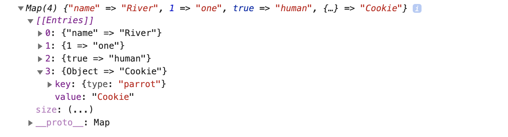

Before ES6 (ECMAScript 2015), there were two built-in data structures in the JavaScript world that were used predominantly, and these two are known as Arrays and Objects. Arrays are data structures that keep the data as indexed lists. Objects keep the data as key-value pairs.

Two new kinds of iteratable data structures were introduced with ES6, which are Maps and Sets.

Choosing the right data structure to store your data will help you manipulate it easier, which in turn will make your life easier. This article is about introducing the new data structures by describing the methods available to them, and comparing them to the other ones that we already know and love. You can use the Chrome Developer Console to follow up the examples.

### Map:

A Map is an ordered collection which maps key-value pairs. From the very outside, it looks like an Array as data inside it are indexed, but the data is kept as key-value pairs, which resembles an Object. In a Map, the keys can be of any data type, whereas in an object they have to be of String type.

**Initializing a map, and setting and getting values:**

You can use the `new` keyword to initialize a Map data structure, which will return an empty Map:

```javascript
let map = new Map()
console.log(map) // prints: Map(0) {}
```

We've created a Map, which is awesome, but how do we put data inside or get a value out of it? Map data structure has `set` and `get` methods for these purposes. The `set` method takes the key and the value as an argument, respectively. The `get` method only takes the key.

```javascript
let exampleMap = new Map()

// Keys can be of any type!
exampleMap.set("name", "River") // key is of String type
exampleMap.set(1, "one") // key is of Number type
exampleMap.set(true, "human") // key is of Boolean type
console.log(exampleMap) // prints: Map(3) {"name" => "River", 1 => "one", true => "human"}

// You can even use Objects as keys:
let pet = { type: "parrot" }
exampleMap.set(pet, "Cookie")
exampleMap.get(pet) // returns: "Cookie"

// Maps will keep the type! (Unlike Objects, which will turn all the keys into Strings.)
exampleMap.get(1) // "one"
```

**Note:** Map compares keys with strict equality (===), using an algorithm called [SameValueZero](https://tc39.es/ecma262/#sec-samevaluezero). This means the key `1` and `"1"` gets treated separately and can hold unique values, because they are of different types. Maps don't allow duplicate values, so if you set another value with an existing key, it will be overwritten. Here, it's also important to remember how the reference types work. If you assign an Object as a key, even though you copy and paste the same object for setting another value to it, it won't see it as the same Object, so it will create another key-value pair. But if you define an object outside, and use that as a key twice, the first value will be overwritten, because now you'll be referring to the same object.

The Map we created above actually looks like this, if you extend it:



We can also initialize a Map using an Array of key-value pairs which are also inside their individual Arrays, like this:

```javascript
const exampleMap2 = new Map([
  ["name", "River"],
  [1, "one"],
  [true, "human"],
])

console.log(exampleMap2) // prints: Map(3) {"name" => "River", 1 => "one", true => "human"}
```

**Hint:** `Object.entries()` takes an object and returns an Array of Arrays with given key-value pairs, and makes the Map initialization with values easier than it looks!

```javascript
let obj = { ... }
let newMap = new Map(Object.entries(obj));
```

Also, you can convert a Map into an object by using `Object.fromEntries()`, and you can convert a Map into an array by using `Array.from()`:

```javascript
const exampleObj = Object.fromEntries(exampleMap2)
console.log(exampleObj) // prints: {1: "one", name: "River", true: "human"}

const exampleArr = Array.from(exampleMap2)
console.log(exampleArr) // prints: [["name", "River"], [1, "one"], [true, "human"]]
```

**Checking if a key exists, the Map size and deleting an entry:**

Checking if a key exists is done with `map.has()`. This method returns a Boolean value.
Maps have a built in `size` property that returns the number of key-value pairs in a Map.
Deleting an entry is done with `map.delete()`, which takes a key as an argument and returns the new version of the Map.
Deleting all the values inside a map is done with `map.clear()`

```javascript
const colorMap = new Map([
  ["pants", "gray"],
  ["shoes", "black"],
  ["shirt", "red"],
])

colorMap.size // returns 3
colorMap.has("belt") // returns false

colorMap.has("shirt") // returns true
colorMap.delete("shirt")
colorMap.has("shirt") // returns false

colorMap.clear()
colorMap.size // returns 0
```

**Iterating over a Map:**

There are three methods that return a MapIterator object which can be iterated over with a for...of loop, just like an array: `map.keys()`, `map.values()`, `map.entries()`, and a built-in `forEach()` method to iterate over a map in insertion order.

```javascript
const numberMap = new Map([
  ["pants", 1],
  ["shoes", 2],
  ["shirt", 1],
])
```

### WeakMap:

Keys of WeakMaps are of the type Object only. Primitive data types as keys are not allowed. (symbols, strings, numbers, etc.)

It is called the weakmap because it holds weak references to the entries in the map.

Has 4 methods: get, delete, has, set.

This in turn, means that it is able to get rid of the entries that are not used anymore. (Like a garbage collector) But for that behaviour it has to have reference type data as keys.

Browser or the environment running the javascript will go over your code and when this code runs it will identify which objects aren't used anymore. (This is done to free some memory. It also improves the performance of your application and takes off some work from your hands, because you should do the managing the resources otherwise!)

Disadvantages: Using objects as keys, it is enumarable (you cant loop through it, the reason for this is, we don't know the size of it, some items might have been deleted, etc)

Size property and for .. of loop can't be used here.

```jsx
let cardAce = {
	name: "Ace of Spades"
};

let cardKing = {
	name: "King of Clubs"
};

let key1 = {a:1};
let key2 = {b:2};

let deck = new WeakMap();
deck.set(key1, cardAce);
deck.set(key1, cardKing);

console.log(deck.get(key1));
	// will print [object Object] {
								//name: "Ace of Spades"
								};
```

### Sets:

A set is just a list of values. (no key-value pairs). The difference btw an array and a set is arrays can have the same values multiple times, but sets can't.

A set is an array with unique values. In a set, the order doesn't matter, because there is only a single one of that value, so you can reach them by using value.

```jsx
let array = [1, 1, 1]

//initialize a set:
let set = new Set([1, 1, 1])

for (element of set) {
  console.log(element) //will print out 1
}

for (element of array) {
  console.log(element) //will print out 1 1 1
}

set.add(2)
for (element of set) {
  console.log(element) //will print out 1 2
}

//if I try to add an existing value to a set, it doesn't override the value inside
//the set, it basically doesn't execute the new code.

set.delete(1) //deletes value 1 from the set.
set.clear() //deletes all values from the set.

//you can check if a set has a specific value:
console.log(set.has(1)) //true

for (element of set.entries()) {
  console.log(element) //will print out [1, 1] [2, 2]
}
//you get key value pairs with .entries(), key is always equal to the value.
//you can also use .keys()
for (element of set.keys()) {
  console.log(element) //will print out 1 2
}
```

### WeakSet:

WeakSet only stores arrays or objects. (All arrays are objects at the end!)

Only has 3 methods: add, delete, set

WeakSet has only values, not keys. Like the WeakMap, the WeakSet is enumerable. (you can't iterate through it)

```jsx
let set = new WeakSet([{ a: 1 }, { b: 2 }, { b: 2 }, { c: 3 }])
console.log(set.has({ b: 2 })) //false

//In the set variable the {b:2} objects are not the same, because an object only
//keeps a pointer to a value. So each {b:2} objects are different from each other
//in the code above.

let obj1 = { a: 1 }
let obj2 = { b: 2 }
let set = new WeakSet(obj1, obj1, obj2)
console.log(set.has(obj1)) //true
set.delete(obj1)
set.add(obj1)
```

**Difference between Set and WeakSet:**

If you are storing a reference to an object in a set, even if you set that object to null, V8 engine will not garbage collect it as something is still holding a reference to that object.

WeakSet allows it to be garbage collected if there are no other values referring to that object. ( If no one else is using it other than the WeakSet, it will be garbage collected.)

This is also true for Map and WeakMap!

WeakMap and WeakSets are advanced concepts that are used for memory management (as they allow garbage collection) and useful in large applications where you have data which is fine to be deleted at some point, but you don't want to manage them with map and set where you manually have to delete the data.

#### Resources:

1. [JavaScript.info - Map and Set](https://javascript.info/map-set)
2.
