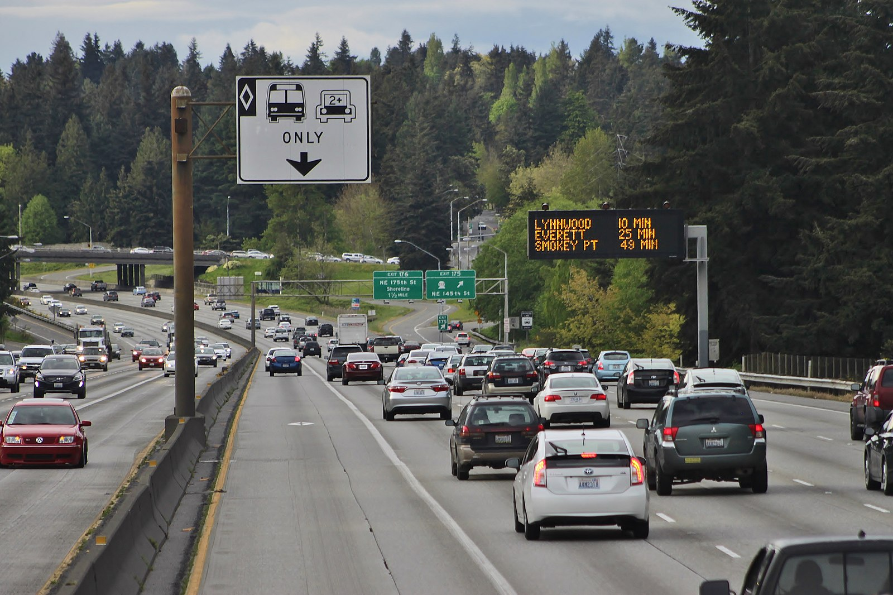

Punctuation marks are pretty valuable in any written language. Their mere existence, and if they do exist, their positions can change the overall meaning of a sentence.

Poor punctuation can destroy your relationships! Joke aside, check out this sentence with the same letters but different punctuation marks:

```
A woman without her man is nothing.
A woman: without her, man is nothing.
```

So yes, punctuation marks are really important. Plus, they look really cool. I always thought the coolest part of any typeface were the tiny but delicate differences of the punctuation marks.

Years ago, I audited a typography class that required us to create new punctuation marks as one of the assignments. While creating the new punctuation marks, I learned there were old ones that we don't use anymore, and rarely used ones that got everybody confused. If you're interested in the common punctuation marks and how to use them, [The Punctuation Guide](https://www.thepunctuationguide.com/) seems to be a good start. This article is about the rarely used and/or confusing pounctuation marks, right out of the miscellaneous box of typography.

### Interrobang (‽, ?!, !?, ?!? or !?!)

The question mark (?) has a function that indicates interrogation, and the exclamation mark (!) indicates strong feelings towards something. Exclamation mark is also referred to as a bang which is a slang, therefore creating the name of this symbol that is a combination of both: interro + bang.

[The interrobang](https://en.wikipedia.org/wiki/Interrobang) symbol was created in 1962, by Martin K. Speckter, who believed the advertisements would work better if rhetorical questions were indicated by a single punctuation mark. For anyone who doesn't know the meaning of it, a **[rhetorical question](https://en.wikipedia.org/wiki/Rhetorical_question)** is a question that has an obvious answer and does not require one from the person it is directed at. It is meant to display the speaker's or writer's opinion about a certain topic.

A rhetorical question can be used to emphasize the answer:

```
Can fish swim‽
Do dogs bark‽
Is hell hot‽
Is rain wet‽
Can snakes fly‽
Does money grow on trees‽
Could I possibly love you more‽
```

Rhetorical questions were also used in literature, to convey an obvious message to the reader:

```
If you prick us, do we not bleed?
If you tickle us, do we not laugh?
If you poison us, do we not die?
And if you wrong us, shall we not revenge?

- The Merchant of Venice (Act III, scene I) by William Shakespeare
```

There is also the **inverted interrobang** (combining ¿ and ¡: ⸘) that is suitable for Hispanic languages.

### Irony punctuation (⸮)

The irony punctuation mark was first used in the mid-1800s. Although I love the [Alanis Morissette song](https://www.youtube.com/watch?v=Jne9t8sHpUc&ab_channel=AlanisMorissette), it is true that it kinda destroyed the meaning of irony in people's minds. A generation of people thought having rain on your wedding day was an irony. [Irony](https://en.wikipedia.org/wiki/Irony) is when you actually mean the opposite of whatever you said. For example, if you get a flat tire in the middle of nowhere, and shout "Oh, that's nice!", it is an irony. But getting a flat tire is not an irony. It simply isn't nice, it's awful, and you're angry and frustrates, and you mean exactly that by saying the opposite. The irony punctuation indicates the following sentence is either ironic or sarcastic. In real life, generally the tone of your voice and the context speaks for itself, but in written language, it is easier to indicate sarcasm or irony with a punctuation mark (although nobody is using it).


###### An example of situational irony: A "No smoking" sign surrounded by images of a smoking Sherlock Holmes at Baker Street tube station. Image Credit: Dpbsmith at English Wikipedia, CC BY-SA 3.0 <http://creativecommons.org/licenses/by-sa/3.0/>, via Wikimedia Commons

Percontation Point (or a rhetorical question mark, ⸮) was created by Henry Denham in the 1580s to mark rhetorical questions, but it's use died out in the 17th century. It looks a lot like a reversed question mark, but with minor differences.

In some right-to-left scripts such as Arabic, Persian or Urdu, [the question mark is also reversed](https://en.wikipedia.org/wiki/Question_mark#Mirrored_question_mark_in_right-to-left_scripts) in left-to-right direction (⸮). Hebrew and Yiddish are also written right-to-left, but the question mark is not mirrored.

### Interpunct (·)

[The interpunct](https://en.wikipedia.org/wiki/Interpunct) is a vertically centered dot which is used for many different purposes in different languages. It was used frequently for separating words in ancient Latin. **[The space](<https://en.wikipedia.org/wiki/Space_(punctuation)>)** took its place in the modern texts.

So to give you a point, before the interpunct, **thetextslookedlikethis**; and after the interpunct **they·looked·like·this**. After meeting this little punct, I grew a new appreciation for the space between words.

Japanese texts use interpunct for a different reason. Foreign sentences, names, and words are written using katakana, and interpunct serves as a separator between words. In japanese written language, words aren't separated by spaces.

### Dinkus

A dinkus is a mark that divides text, used to indicate subdivisions or increase attention to a certain paragraph. It has multiple forms, it can be a **[fleuron](<https://en.wikipedia.org/wiki/Fleuron_(typography)>) (❧, ❦)** (also known as the hedera symbol), or an **[Asterism](<https://en.wikipedia.org/wiki/Asterism_(typography)>) (⁂)**, or three dots or asterisks on a horizontal row (**\* \* \***), or simply an extra space.


###### Page 240 of James Joyce Ulysses, first edition, second printing, 1922, France. Check out the asterisms that divide the texts. Image Credit: https://en.wikipedia.org/wiki/File:James_Joyce,_Ulysses,_1ed_2pr,_p240.jpg

### Silcrow (§) and Pilcrow (¶)

The [silcrow](https://en.wikipedia.org/wiki/Section_sign) (§) is generally used to mark legal sections in a document, and is also known as the section sign. The symbol itself is used to symbolize the justice system, just like how the [Staff of Aesculapius](https://en.wikipedia.org/wiki/Rod_of_Asclepius) is associated to medicine and healthcare.


###### The former logo of The Austrian Ministry of Justice, silcrow in the middle.

The [pilcrow](https://en.wikipedia.org/wiki/Pilcrow) (¶) is used to mark the beginning of a new paragraph. The middle age texts used it to mark a new train of thought. Nowadays, we use pilcrow in mostly proofreading, as an indicator of the content that must start with a paragraph break.

In the middle ages, drawing the pilcrow was another person's job, who was called the **[rubricator](https://en.wikipedia.org/wiki/Rubrication)**. The scribes used the black ink to write most of the text, while the rubricators used red ink. It comes from the Latin rubrīcāre, which means **to color red**. The scribes would leave empty spaces before the paragraphs and the rubricators filled them afterwards. When the printing press came, the space at the start of the paragraphs were still left for the rubricators, but as the printing process is way faster, mostly the empty spaces were left empty. This is the story of the indent at beginning of the paragraphs.

### Dagger (†) and Double Dagger (‡)

The first footnote is indicated with an asterisk (\*). If an asterisk is already used and another footnote is needed, [a dagger](<https://en.wikipedia.org/wiki/Dagger_(typography)>) is used (†). The third foodnote can be indicated by a double dagger (‡). (Symbols for footnotes after the third one? Can be either parallels (‖), section sign (§), or the pilcrow ¶.)

The dagger can also symbolize death. If it's placed before the name of a person, it probably means that they are deceased (you should still check the footnote though).

### Lozenge (◊)

A [lozenge](https://en.wikipedia.org/wiki/Lozenge) is a rhombus shape, that can serve as a bullet point inside a text. The very first cough tablets were shaped like this, which got them the name of lozenge. There are many more places where you see this diamond shape, for example at the traffic signs in United States and Canada, which marks the lane for a specific use. In US, it marks a high-occupancy vehicle (HOV) lane:



###### A high-occupancy vehicle lane on Interstate 5 in Seattle, Washington, United States, which is marked by the lozenge sign. Image Credit: SounderBruce, CC BY-SA 4.0 <https://creativecommons.org/licenses/by-sa/4.0>, via Wikimedia Commons

In Japan and South Korea, white lozenge mark on the road shows possible uncontrolled pedestrian crossing.

You can see it in company logos (mitsubishi!), old churches, tapestries, a deck of cards (ace of spades!), and in flags (flag of Brazil, and Bavaria!). Lozenges are everywhere.

### Dingbats

[Dingbats](https://en.wikipedia.org/wiki/Dingbat) are symbols with assigned unicode code points. There is an amazing variety of dingbats, and they are quite useful if you're looking for a very simple, minimalistic icon for your projects.

✿ As a slang word, it means [ silly, crazy or stupid](https://wikidiff.com/dingbat/idiot), but apparently in a way that is not too offensive.

### Ellipsis (. . ., ..., ⋯, ︙)

The [ellipsis](https://en.wikipedia.org/wiki/Ellipsis) is a punctuation mark that consists of three dots in some sort of alignment and is generally found in the middle of sentences. They indicate the intentional absence of some amount of text at that section. It is mainly done to save space (or time, or attention span, which are all limited resources). The absent part shouldn't change the overall meaning, but it is meant to convey the same meaning in a shorter sentence.

Let's use it ourselves:

- Original quote:

```
“Actors are so fortunate. They can choose whether they will appear in tragedy or in comedy, whether they will suffer or make merry, laugh or shed tears. But in real life it is different. Most men and women are forced to perform parts for which they have no qualifications. Our Guildensterns play Hamlet for us, and our Hamlets have to jest like Prince Hal. The world is a stage, but the play is badly cast.”

― Oscar Wilde, Lord Arthur Savile's Crime and Other Stories
```

- Shortened quote:

```
“Actors are so fortunate. They can choose whether they will appear in tragedy or in comedy ... in real life it is different. Most men and women are forced to perform parts for which they have no qualifications. ... The world is a stage, but the play is badly cast.”

― Oscar Wilde, Lord Arthur Savile's Crime and Other Stories
```

The ellipsis can also be used to indicate emotions or other physical cues in written form. Written language is a very limited way of communication. Think of all the cues you get from a person when you're talking face to face. The tone of their voice, the position of their arms, all the facial cues and so much more. The written language lacks these kind of cues and the ellipsis can cover for some of these. For example, an ellipsis at the end of a sentence can indicate hesitation:

```
Excuse me madam, um . . . sorry, I don't know how to put this nicely. Your zippers are down.
```

It can indicate trailing off of thoughts:

```
So, do you think we should have . . . ? Oh, never mind, it doesn’t matter now.
```

If you want to learn more on how to use ellipses correctly, I think [this page](https://writingcommons.org/article/omitting-words-from-a-direct-quotation-mla/) is a good start.

### Reference mark (※)

The [reference mark](https://en.wikipedia.org/wiki/Reference_mark) was used in Chinese, Japanese and Korean (CJK) writing, to indicate an important note that is related to some part of the text. In European texts, these notes are added at the bottom of the page or at the end of the chapter, indicated with an asterisk. In Japanese texts these notes are inserted into the main text immediately after this symbol.


###### Check out the notes starting with reference marks at the end of the text. Image Credit: Tmtm, CC BY-SA 3.0 <https://creativecommons.org/licenses/by-sa/3.0>, via Wikimedia Commons

I was amused (but not surprised) to see that there are many other [Japanese specific punctuation marks](https://en.wikipedia.org/wiki/List_of_Japanese_typographic_symbols). For example, 「...」denotes the single quotation marks, and 『...』 denotes double quotation marks. Check them out if you're interested.

### Dash (En dash, Em dash, Horizontal Bar, Figure Dash, Tilde (~))

Dashes are punctuation marks that horribly resembles the [hyphen](https://en.wikipedia.org/wiki/Hyphen) (‐) and the [minus sign](https://en.wikipedia.org/wiki/Plus_and_minus_signs#Minus_sign) (−), which are two symbols that again, very much look alike. But the dashes are significantly longer than both hyphen and the minus sign, and their vertical alignment is also slightly different from each other.

Why are there so many dashes? The printing manuals from 19th century, such as [this one](https://books.google.com/books?id=XJwXAAAAYAAJ&pg=PA72&dq=%22m+dash%22&hl=en&sa=X&ved=0ahUKEwj-n9q53O7JAhUB7CYKHWbeCng4ChDoAQhAMAc#v=onepage&q=dash&f=false), doesn't describe any distinctions between en and em dashes when used as a punctuation mark. The printers did have dashes in multiple lengths to create horizontal rules in random lengths. At some point, a printer decided that some dashes looked better in certain places, and everybody agreed, so everybody started using them that way.

Let's do the [hyphen](https://en.wikipedia.org/wiki/Hyphen) first. It is the symbol you use when you are spelling a word. Let's spell the word "definition": `def-i-ni-tion`. Alternatively, interpunct can be used instead of the hypen to denote syllabification. (Like this: `def·i·ni·tion`)
Compound adjectives (such as `award-winning`, `college-educated`, `well-differentiated`, `part-time` or `check-in`) can be separated with either an en dash or a hyphen.

Now let's do the en and em dashes. Simply put, en dash is a dash with the width of a capital N, and em dash is a dash with the width of a capital M. Traditionally, an en dash has the half width of an em dash.

[Em dashes](https://www.thepunctuationguide.com/em-dash.html) (—) are used for breaks in sentences (instead of a comma or colon): `Cats, dogs, birds, and lizards – his house looked like a zoo.`
Em dashes can also be used instead of parenthesis: `I ate a bunch of chocolates – some of them as big as my fist – until I felt dizzy.`
Multiple em dashes can be used instead of the intentionally omitted parts of words: `Little M—— knew it meant that her mother was gone.`

[En dashes](https://www.thepunctuationguide.com/en-dash.html) (–) can be used for the range of numbers, instead of 'to' and 'and': `The Second World War (1939⁠–⁠1945) involved more than 30 countries.`
En dashes can be used between words that represent direction or confliction: `The liberal⁠–conservative debate` or `The New Zealand–Miami flight`

[The horizontal bar ](https://en.wikipedia.org/wiki/Dash#Horizontal_bar)(—) or the em dash can be used to indicate the author of a quote:

```
“There's something that doesn't make sense. Let's go and poke it with a stick.”
― Steven Moffat
```

[Tilde (~)](https://en.wikipedia.org/wiki/Tilde#Punctuation) is mainly used to indicate "approximately" or "about": `~120 means approximately 120.` In some Asian languages it can be used to indicate a range between two numbers. For example, `1~20` means `1 to 20`, `~50` means `up to 50`, and `50~` means `more than 50`.

---

**NOTE:**

There are many other symbols that look like a dash. For example, [Chōonpu](https://en.wikipedia.org/wiki/Ch%C5%8Donpu) (also known as **Katakana-Hiragana Prolonged Sound Mark**) exists in the Japanese written language and is a sign that looks very much like a dash. It is slightly longer (ー) and is used to lengthen vovels, and it is important as it changes the meaning of the word. Tilde can be used for the same purpose, but only in unofficial settings. Chōonpu also looks similar to the kanji character 一 ("one").


###### The word タクシー (takushī, ‘taxi’) written vertically with vertical chōonpu. Image Credit: Hajime NAKANO, CC BY 2.0 <https://creativecommons.org/licenses/by/2.0>, via Wikimedia Commons

---

### Copyright (©) and Copyleft (🄯)

It all starts with the invention of the [printing press](https://en.wikipedia.org/wiki/Printing_press) by [Johannes Gutenberg](https://en.wikipedia.org/wiki/Johannes_Gutenberg). Until this point in human history, the copies of anything were handmade, which made them very expensive and hard to reach. After the invention of the printing press, it became much easier to create copies of written content, but there was no control over who was printing it. This gave birth to the discussions about how to protect the original authors, and for this reason, [Copyright Licensing](https://copyrightalliance.org/faqs/what-is-copyright-licensing/) was created.


###### The Printing Press. Image Credit: By Daniel Niklaus Chodowiecki - DANIEL CHODOWIECKI 62 bisher unveröffentlichte Handzeichnungen zu dem Elementarwerk von Johann Bernhard Basedow. Mit einem Vorworte von Max von Boehn. Voigtländer-Tetzner, Frankfurt am Main 1922. (self scanned from book), Public Domain, https://commons.wikimedia.org/w/index.php?curid=17927966

[Copyright](https://en.wikipedia.org/wiki/Copyright) protects the rights of the authors who produced the original work (whether it be books, art, or software). The author has the right to authorize or ban the publication or distribution of their work. Copyrights are only granted for a limited amount of time (50-100 years) and the amount of time differ according to the country and the type of work. After that, the works becomes a part of the [Public Domain](https://en.wikipedia.org/wiki/Public_domain). If the work is in the Public Domain, anyone can use, modify and sell the works wothout the permission of the author. There are various types of copyright licenses, some of them have very limited restrictions such as MIT License, and some of them are really strict.

The [Copyleft](https://en.wikipedia.org/wiki/Copyleft) license lets people to use, modify and distribute the work, but there is a single condition that needs to be met: the modified/shared versions of the work has to have the same or equivalent license. The [GNU General Public License](https://en.wikipedia.org/wiki/GNU_General_Public_License) was the first Copyleft license to be used extensively in software.

### Summing up

Punctuation marks and symbols are not as old as the written language. When the written language first appeared, there were no punctuation marks, no spaces in between words, and apparently understanding a text by reading it a single time was unheard of. If you're interested in the evolution of the punctuation marks, proceed with [this article](https://www.bbc.com/culture/article/20150902-the-mysterious-origins-of-punctuation). Although it is important to use the punctuation marks and symbols correctly, I think we should remember why we needed them first: To make our lives easier. So let's educate each other without sticks and stones.

**Apes together strong!**

#### Resources:

1. Wikipedia
2. [The Visual Communication Guy](https://thevisualcommunicationguy.com/category/vcg-blog/writing/)
3. [The Punctuation Guide](https://www.thepunctuationguide.com/)
4. [Omitting Words from a Direct Quotation](https://writingcommons.org/article/omitting-words-from-a-direct-quotation-mla/) by Nancy Lewis
5. [www.apsstylemanual.org](https://web.archive.org/web/20120331065709/http://www.apsstylemanual.org/oldmanual/parts/authors.htm)
6. [Understanding the Copyright License](https://www.smashingmagazine.com/2011/06/understanding-copyright-and-licenses/) by David Bushell
7. [The mysterious origins of punctuation](https://www.bbc.com/culture/article/20150902-the-mysterious-origins-of-punctuation) by Keith Houston
