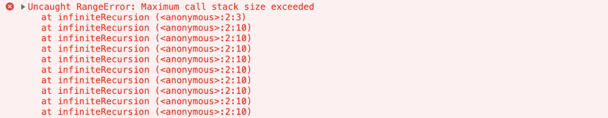
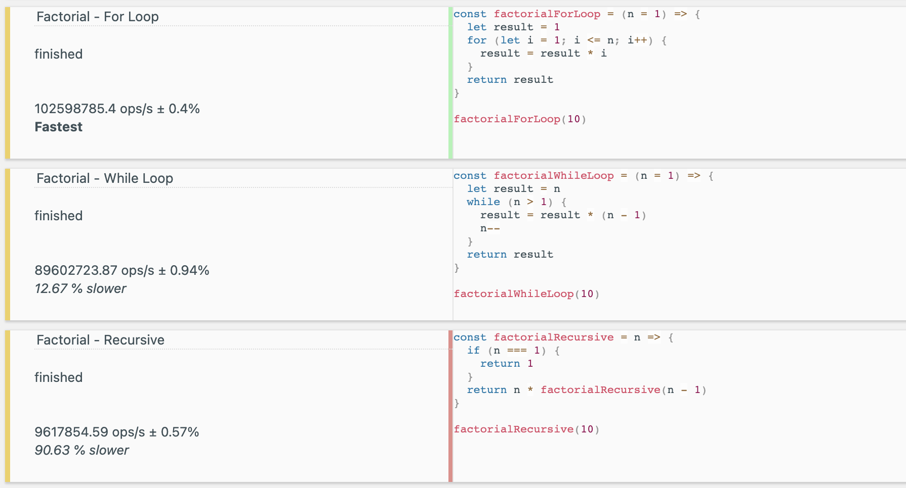
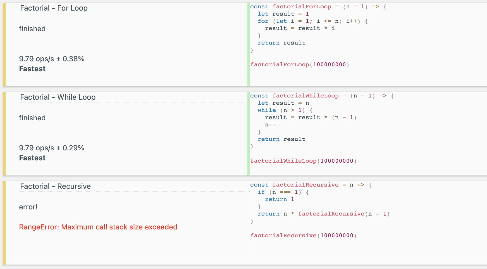
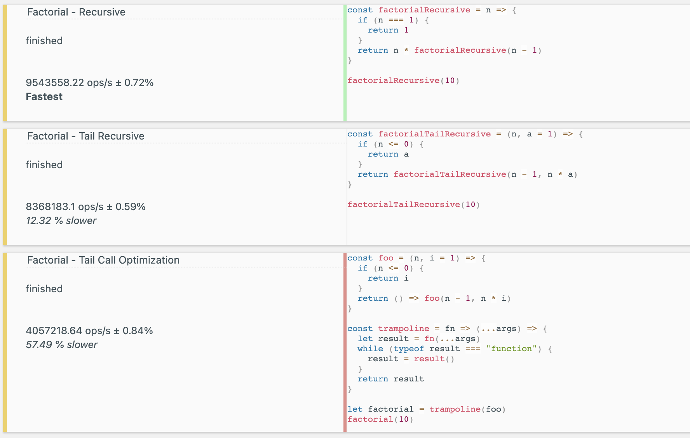
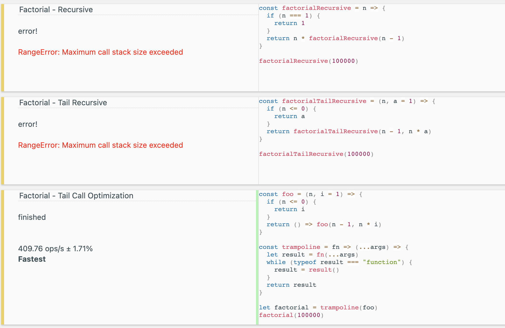

#### What is recursion?

**Recursion** is a method of solving a bigger problem by solving smaller instances of the same problem.

In other words, recursion is calling is a function calling itself, again and again, until a condition is met.

Although it seems like a hard to understand concept, I think recursion is everywhere in our daily lives. When you eat, you eat until you feel full (or close), which makes "being full (or close)" your base condition and eating your recursive function. You sleep until you feel rested again, which makes "being rested" your base condition and sleeping your recursive function. You drink coffee until you are no longer sleepy, which makes "not feeling sleepy" your base condition and drinking coffee your recursive function. You got the idea.

- Example of recursion:


###### Image credit: [xkcd](https://xkcd.com/), https://xkcd.com/1739/

#### Iteration vs. recursion

For and while loops do the same thing, but what they do is not called recursing, but **iterating**. In recursion, a function calls itself until a certain condition is met, and in iteration, a set of instructions (a sequence, so to say) are repeated until a certain condition is met. A problem that can be solved recursively most possibly can be solved iteratively as well. However, in many cases recursion makes the solution more legible and easier to debug.

- Example of iteration, a nice infinite loop:


###### Image credit: [xkcd](https://xkcd.com/), https://xkcd.com/1411/

&nbsp;

The rule is **to always have at least one base case**. **A base case** is where you decide where to stop the recursion process. It is really easy to create an infinite loop when writing a recursive function.

```javascript
function infiniteRecursion() {
  return infiniteRecursion()
}

infiniteRecursion()
```

The first thing we see in this code snippet is the function initialization. Then we see the function call in the global scope, so the function call gets added to our call stack. Inside the function the function itself is called again, which adds another call of the same function to the call stack, and this goes on forever (or until it crashes), because there is absolutely nothing to stop it. If you run this code snippet in your chrome console, it will give you a `RangeError`.



Each function call that gets added to our call stack uses some amount of memory. So, a disadvantage of using recursion is the increased space complexity.

Also, always make sure that you have reasonable default numbers of the optional arguments you are receiving to safely handle the recursion.

Let's write three different code snippets that does the same thing, calculating the factorial of a given n number. One will be doing it with a for loop, one with while loop, and one will be recursive:

```javascript
// For loop implementation
const factorialForLoop = (n = 1) => {
  let result = 1
  for (let i = 1; i <= n; i++) {
    result = result * i
  }
  return result
}

factorialForLoop(10) // prints: 3628800

// While loop implementation
const factorialWhileLoop = (n = 1) => {
  let result = n
  while (n > 1) {
    result = result * (n - 1)
    n--
  }
  return result
}

factorialWhileLoop(10) // prints: 3628800

// Recursive solution
const factorialRecursive = n => {
  if (n === 1) {
    return 1
  }
  return n * factorialRecursive(n - 1)
}

factorialRecursive(10) // prints: 3628800
```

If we compare these three implementations by how fast they are using a tool named [jsbench](https://jsbench.me/), we see that at small n sizes, the fastest one is the for loop, and the slowest one is the recursion:



If do the same comparison with a big and arbitrary n number, we see that the speed gap between for loop and while loop got smaller and the recursive function exceeded the call stack limit, therefore giving a range error:



In this case, recursive solution is (arguably) easier to read and understand. But as it needs much more space than the browser can allocate to it, the browser won't do it at all. The recursive implementation of the same problem won't work for bigger numbers, and that's a thing to keep in mind.

Another thing to keep in mind is, infinite iteration will increase the CPU usage by simply never ending. If you're working with a system that does multi tasking with multiple threads, it will clog that entire thread, rendering it useless. On the other side, infinite recursion can crash your system by causing a stack overflow on the thread it is running. Browsers are smart, they have a cap on the memory space the call stack can use, so if the thread is exhausted, they will just simply abort mission.

#### Tail Recursion

[Tail recursion](https://www.geeksforgeeks.org/tail-recursion/) is a type of recursion that returns the result of the recursive function call without doing anything else to it. So, the last thing that is returned from a tail recursive function is a recursive function call.

Let's implement the same factorial function we used before, with non-tail-recursion and tail recursion approaches:

```javascript
// The non-tail-recursive solution
const factorialRecursive = n => {
  if (n === 1) {
    return 1
  }
  return n * factorialRecursive(n - 1)
}

factorialRecursive(10) // prints: 3628800

// The tail-recursive solution
const factorialTailRecursive = (n, a = 1) => {
  if (n <= 0) {
    return a
  }
  // The recursive function returns as the final result
  return factorialTailRecursive(n - 1, n * a)
}

factorialTailRecursive(10) // prints: 3628800
```

When we compare these two with [jsbench](https://jsbench.me/) we see that non-tail-recursive solution seems to work faster with smaller inputs, and both exceed the call stack when called with bigger inputs. (There is a screenshot that demonstrates this in the following section.)

So why did I write about this if it doesn't make our lives easier? To get to the point where I explain **Tail Call Optimization** (TCO for short). As the non-tail-recursive solution does a mathematical operation on the result of the recursive function call, it needs to keep track of that, and that occupies space in the call stack. But tail recursive approach directly returns the result of the recursive function call, which means you don't need to keep track of the function calling it. This means less space complexity.

So why did our tail-recursive solution gave a RangeError? Because [TCO is not implemented in any browsers except in Safari](<https://kangax.github.io/compat-table/es6/#test-proper_tail_calls_(tail_call_optimisation)>). At one point Chrome's V8 engine tried to implement it, but apparently too many issues arised, such as TCO making debugging harder (as the call stack is not being tracked, which is the whole point anyway). So although it exists in ECMAScript 6, it is not implemented in browsers, and apparently there are no future plans of doing so.

I've seen a technique called trampoline technique, which simply calls a tail-recursive function one by one by putting it inside a while loop, which is a simple implementation of TCO. Although it spiked my interest, I have not used it anywhere so I'm not sure of the range of problems it might cause.

```javascript
// foo function returns a function
const foo = (n, i = 1) => {
  if (n <= 0) {
    return i
  }
  return () => foo(n - 1, n * i)
}

// trampoline function also returns a function
const trampoline = fn => (...args) => {
  let result = fn(...args)
  // repeat until result comes back as 1, which is of type number
  while (typeof result === "function") {
    result = result()
  }
  return result
}

let factorial = trampoline(foo)
factorial(10) // prints: 3628800
```

If we compare the speed of the recursive solution, tail recursive solution and the TCO version using a random small number as an input, we see that TCO version is way slower than the other two, and the recursive solution is the fastest:



But when bigger numbers are used, both recursive and tail recursive exceed the maximum call stack size, but the TCO version doesn't:



I leave you with this wonderful video of Hal trying to fix the lightbulb (Malcolm in the middle), because you might be needing a laugh after reading this article:

[](https://www.youtube.com/watch?v=AbSehcT19u0)

### Resources:

1. Wikipedia
2. jsbench
3. [Tail call optimization in ECMAScript 6](https://2ality.com/2015/06/tail-call-optimization.html) by Dr. Axel Rauschmayer
4. [Iteration vs Recursion](https://medium.com/backticks-tildes/iteration-vs-recursion-c2017a483890) by Bolaji
5. [What is tail call optimization?](https://stackoverflow.com/questions/310974/what-is-tail-call-optimization) - stackoverflow
6.
