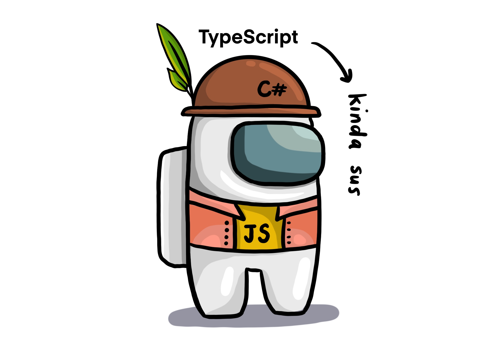

### What is TypeScript?

TypeScript is an open source programming language developed and maintained by Microsoft, and it is simply a **superset** of JavaScript. Being a superset means offering every feature JavaScript has, but adding a little bit more on top, such as **optional static typing**, **generics**, and **interfaces**. (So TypeScript is nothing to be scared of. Underneath, it is our good old JavaScript, but has some additional functionalities similar to a more type-strict language, such as C#.) Of course, it comes with a certain disadvantage: it cannot be executed by JavaScript environments, such as the browsers. So TypeScript comes with a TypeScript compiler, which compiles TypeScript into JavaScript so that it can be run in JS environments.



The main advantage of using **TypeScript Type System** is catching errors during development phase. With JavaScript, you can only see errors during runtime, when you execute your code, which is not very efficient. The type system is an improvement for the development workflow. As the code is being written, TypeScript compiler constantly analyzes it, and this is called **type checking**. For type checking, the TS compiler uses something called **type annotations** which are simply type rules that the developer defines. This type system is only active during development and not available in runtime. (Which makes sense, because TS is run in JS environments and is compiled to JS before it is executed.) Also, the TS compiler does not do any performance optimizations.

**⁂ What is in this article?**

This article is a long one and it consists of five main sections and their subtitles:

1. [TypeScript Type System](#typescript-type-system)

   - Type Annotations
   - Type Inference
   - Void and Never
   - Destructuring with type annotations
   - Typed Arrays
   - Tuples
   - Type Aliases

2. [Interfaces](#interfaces)
3. [Classes](#classes)
   - Abstract class
   - Access Modifiers
   - Static keyword
4. [Generics](#generics)
   - Using generics with multiple types
   - Using generics with interfaces
5. [Namespaces and Modules](#namespaces-and-modules)

If you want to replicate the code in the following examples, I suggest you to use [TS Playground](https://www.typescriptlang.org/play), which is an in-browser TS compiler. Or you can install `typescript` and `ts-node` on your machine, and write typescript files in your own code editor. [This article](https://www.digitalocean.com/community/tutorials/typescript-running-typescript-ts-node) describes how to do that clearly.

<div id="typescript-type-system"></div>

### TypeScript Type System

JavaScript has **dynamic types**, which means, you can assign different types of values to a single variable. If you're not familiar with JavaScript types, munch on [this article](https://yagmurcetintas.com/journal/javascript-introduction-to-data-types) first.

Simply put, types are labels that define the certain properties and methods a value has. In TypeScript, there is a supertype called **any**, which encompasses all the data types available. A variable with the type **any** can literally be anything. If a variable is of type any, it means you are not using type checking on it, therefore the variable becomes dynamically typed. There are also **built-in types** which are the classic primitive (string, number, boolean, undefined, null, bigInt, symbol, void) and a reference types (Object, Array, Function, Date). The void type is TypeScript specific and does not exist in JavaScript. In TypeScript there are also **user-defined types** which are enums, classes, arrays, and interfaces, created by and for the developer for specific needs.

There are two ways for TypeScript to understand what type a variable is. One of them is the developer writing a chunk of code that specifies what type of a value the variable will hold, and this is called **type annotation**. If it isn't specified by the developer, the compiler itself tries to figure out the type of that variable and assign a type to it, and this is called **type inference**.

**Type Annotations:**

Let's create some type annotations ourselves:

```typescript
// Type annotation means that we are going to assign a single type of values to that variable:
let firstName: string = "Cookie"
let age: number = 3
let hasWings: boolean = true
let evilness: null = null
let eyeColor: undefined = undefined

// If you try to reassign a different type of value to the same variable, you'll get a type error:
firstName = true // Error: Type 'boolean' is not assignable to type 'string'.

let hatchDate: Date = new Date(2018, 5, 28)

// Type annotations ending with square brackets denote the type is going to be an array filled with the specified type:
let colors: string[] = ["blue", "green"]
let luckyNumbers: number[] = [3, 12, 81]

// Or we can assign a type that we create ourselves:
class Parrot {...}
let parrotlet: Parrot = new Parrot()

// Object literal:
let coordinates: {latitude: number; longitude: number} = {
  latitude: 51.5,
  longitude: 0
}
coordinates[latitude] = true // Error: Type 'boolean' is not assignable to type 'number'.
```

Functions are a little bit harder to read with the type annotation. A function takes the types of the expected arguments and the type of value it is going to return. If it returns nothing at all, the return type is 'void'.

```typescript
const multiplier: (num1: number, num2: number) => number = (
  num1: number,
  num2: number
) => {
  return num1 * num2
}

// If we dissect this function, the first half following the variable name is the decription of the function:
// Will take two arguments of type number and will return a number:
(num1: number, num2: number) => number

// And the rest is the function itself:
(num1: number, num2: number) => num1 * num2

// We can also write the same function like this:
const multiplier = (num1: number, num2: number) : number => num1 * num2

// If we dissect it, the part below specifies the type of arguments, and the return type, respectively:
(num1: number, num2: number) : number

// Same style works with anonymous functions as well:
const divider= function(num1: number, num2: number): number{
  return num1 / num2
}
```

**Type Inference:**

While going through all this trouble is necessary for using TypeScript better, it is also optional because of the **type inference**. You could delete all the type annotations and everything would still work perfectly. If the **variable declaration** (naming a variable) and **initialization** (assigning a value to a variable for the first time) are on the same line, TypeScript compiler will infer the type of a value and will hold you responsible for it by not letting you assign any other type to that variable, as you can see in the example below:

```typescript
let fruitType = "peach"

console.log(typeof fruitType) // string
fruitType = true // Error: Type 'boolean' is not assignable to type 'string'.
```

If the declaration and the initialization are on separate lines, the TypeScript will assign the type 'any' to that variable, as you can see in the example below:

```typescript
// When we declare a variable but don't assign any values to it, the type is inferred as 'any'.
// Although we assign it a string on the second line, the type will not be inferred as 'string', but stay 'any'.
let fruitType
fruitType = "peach"

// If you want to declare and initialize in separate lines but don't want to give up on strict typing, you can do it like this:
let favoriteFruit: string
favoriteFruit = "strawberry"

favoriteFruite = true // Error: Type 'boolean' is not assignable to type 'string'.
```

In functions, TypeScript compiler can help you by inferring the return value, but specifying it always makes it less prone to errors.

```typescript
// In multiplier1 function, the return type is implicitly set to number.
// In multiplier2 function, the return type is implicitly set to void, because we forgot the return keyword. If we have explicitly set the return type to number, the compiler would have warned us that this function wasn't returning anything.
const multiplier1 = (a: number, b: number) => {
  return a * b
}

const multiplier2 = (a: number, b: number) => {
  a * b
}

const multiplier3 = (a: number, b: number): number => {
  a * b // Error: A function whose declared type is neither 'void' nor 'any' must return a value.
}
```

So when to let the compiler help you by inferring, and where to use type annotations? Simply, if you are going to initialize a variable later, you can use annotations when you are declaring it. Also in places where you know the type is going to be inferred as 'any', as this may introduce bugs in the future.

Some built-in functions such as `JSON.parse()` has the return type of 'any', mainly because they can return several types of values. The return type of the `JSON.parse()` function heavily depends on the argument it receives, so the compiler cannot do any type checks on the returned value. There are times like this where 'any' makes sense, but most of the time the type 'any' should be avoided at all costs, because it renders the type checking feature of the TypeScript compiler useless.

In some scenarios, a variable might have to hold two or more different types of values, and we do that by using a pipe (|). These are called **union types**. In most of these cases the type inference will not work us, so we have to use type annotation.

Example:

```typescript
let age: number | string = "Age not specified." // This states the 'age' variable is will either be a number or a string.
console.log(age) // Prints: "Age not specified."
age = 3
console.log(age) // Prints: 3
age = false // Error: Type 'boolean' is not assignable to type 'string | number'.
```

**Void and Never:**

A function with a return type of void is a function that returns nothing. It can only return two values: 'undefined' and 'null'.

A function with a return type of never is a function that is never expected to return anything, ever. You don't even expect to execute the whole function. Never is very rarely, almost never used.

```typescript
// In JS and TS, functions return undefined implicitly if no return statement is defined explicitly:
const errorLogger = (errorMessage: string): void => console.log(errorMessage)

const errorCreator = (a: number | string): never => {
  if (a < 0) throw new Error("The number cannot be lower than 0.")
  else if (a === 0) throw new Error("The number cannot be equal to 0.")
  else throw new Error("The number cannot be higher than 0.")
}
```

**Destructuring with type annotations:**

If you're destructuring, you need to define the types of the destructured elements:

```typescript
const pets = [
  {
    nickname: "Cookie",
    age: 3,
    message: "gimme almonds please",
    shout(message: string): void {
      console.log("YAY!")
    },
  },
  {
    nickname: "Poof",
    age: 5,
    message: "oink oink oink",
    shout(message: string): void {
      console.log("YAY!")
    },
  },
]

// destructuring each pet object on the spot, and defining the exact structure with types just after it:
pets.map(
  ({
    nickname,
    age,
    message,
    shout,
  }: {
    nickname: string
    age: number
    message: string
    shout: (msg: string) => void
  }) => {
    console.log(`${nickname} is ${age} years old.`)
    shout(`${message}!!!!`)
  }
)
```

**Typed Arrays:**

Typed arrays are regular arrays where each element is consistently the same type. If you make an array that is only supposed to contain strings, then it will give error when any type of other value is being added to it. If you initialize a variable using an empty array, the TypeScript compiler will implicitly make it as type any[], which is something we want to avoid. If the array is going to be initialized with values inside, we can let the compiler infer the type.

```typescript
// initializing a variable with an empty array and type annotation:
let cakeArr: string[] = []

// Type inference:
let teaArr = ["peach blossom", "raspberry", "blueberry", "hojicha", "genma cha"] // The inferred array type is: string[]
let randomArr = [3, "cat", new Date()] // The inferred array type is: (string | number | Date)[]
let arrOfArrs = [["hello"], "world"] // The inferred array type is: (string | string[])[]
let arrOfArrs = [["hello"]] // The inferred array type is: string[][]
let arrOfArrs = [["hello"], [3, 5, 6]] // The inferred array type is: (string[] | number[])[]
```

There are many advantages of typed arrays. The most visible one is preventing the addition of incompatible values to the array. Another one is helping the compiler figure out the type of an extracted value, therefore enabling us to use built-in functions for that given value.

**Tuples:**

Tuple is a data structure very similar to the array. It is used to represent a fixed number of elemens that belong to a single thing in a certain order.

```typescript
// Let's create a simple object:
const pet = {
  nickname: "Cookie",
  age: 3,
  isGreen: true,
}

// What if I wanted to represent the values of these properties inside of an array?
const pet1 = ["Cookie", 3, true]

// We can represent them inside the array, but as we lose the property names while doing that, keeping the order of things can help us understand what those values mean. So if I keep the order, I can create another pet just like this:
const pet2 = ["Dust", 7, false]

// A problem is, if you don't specify the type as a tuple, the TypeScript compiler thinks its an array. The tuple type annotation is slightly different from an array:
const pet3: [string, number, boolean] = ["Dander", 4, false]
pet2[0] = true
console.log(pet2) // Prints: [true, 7, false]
pet3[0] = true // Error: Type 'boolean' is not assignable to type 'string'.
```

Tuples are kinda hard to read, and from the human perspective, objects with key-value pairs seem much more legible. But if you're working with lots of data and tables, they might be useful at certain corner cases.

**Type Aliases:**

Sometimes defining the types outside the code that defines logic can make code more legible, especially if the same set of types are being reused. To implement this, we use the `type` keyword:

```typescript
// Let's create a type User:
type User = { name: string; age: number }

// Let's create some users of type User:
const u1: User = { name: "Maruchan", age: 30 }
const u2: User = { name: "Cake", age: 36 }

// Let's create a function to test how we're doing:
function isOlder({ name, age }: User, checkAge: number) {
  if (age > checkAge) return `Hi ${name}! Have a fun day!`
  else
    return `Hi ${name}! We are not accepting people under ${checkAge} at the moment. Please try again when you're older!`
}

console.log(isOlder(u1, 21)) // Prints: "Hi Maruchan! Have a fun day!"
console.log(isOlder(u2, 40)) // Prints: "Hi Cake! We are not accepting people under 40 at the moment. Please try again when you're older!"
```

<div id="interfaces"></div>

### Interfaces

An interface is a custom type that describes the structure of an object. They are not blueprints like classes are, and they are only useful for type checks that TypeScript compiler does for us.

This code below works perfectly fine, but as the type annotations get longer and more complex, it makes the whole code crowded. If we used destructuring, it would look even more crowded than it is right now. And if we are using the same type in other places as well, we would be unnecessarily duplicating code, making it harder to manage, debug and read.

```typescript
const car = {
  manufacturer: "Subaru",
  year: 2019,
  isAvailable: true,
  label(): string {
    return `${this.manufacturer.slice(0, 2).toUpperCase()}${this.year}`
  },
}

const printInfo = (car: {
  manufacturer: string
  year: number
  isAvailable: boolean
  label(): string
}): void => {
  car.isAvailable
    ? console.log(
        `A ${car.year} model ${
          car.manufacturer
        } is available. Label: ${car.label()}`
      )
    : console.log(
        `The ${car.year} model ${
          car.manufacturer
        } is not available. Label: ${car.label()}`
      )
}

printInfo(car) // Prints: "A 2019 model Subaru is available."
```

Let's try to rewrite the code above, this time using an interface. To create an interface, we use the `interface` keyword, and the first letter is always capitalized as a convention:

```typescript
interface Car {
  manufacturer: string
  year: number
  isAvailable: boolean
  label(): string
}

const car1 = {
  manufacturer: "Subaru",
  year: 2022,
  isAvailable: false,
  label(): string {
    return `${this.manufacturer.slice(0, 2).toUpperCase()}${this.year}`
  },
}

// Any object given as an argument to printInfo function has to satisfy the type specifications that Car interface has. If it doesn't, we'll receive an error. It doesn't check for extra properties, so as long as it satisfies the interface, we are good to go.
const printInfo = (car: Car): void => {
  car.isAvailable
    ? console.log(
        `A ${car.year} model ${
          car.manufacturer
        } is available. Label: ${car.label()}`
      )
    : console.log(
        `The ${car.year} model ${
          car.manufacturer
        } is not available. Label: ${car.label()}`
      )
}

printInfo(car1) // Prints: "The 2022 model Subaru is not available."
```

Now let's try to make a more generic interface that we can reuse in multiple places:

```typescript
interface Product {
  isAvailable: boolean
  label(): string
}

const car = {
  manufacturer: "Subaru",
  year: 2022,
  isAvailable: false,
  label(): string {
    return `Car label: ${this.manufacturer.slice(0, 2).toUpperCase()}${
      this.year
    }`
  },
}

const fruit = {
  name: "Strawberry",
  expirationDate: new Date(),
  isAvailable: true,
  label(): string {
    return `Produce label: ${this.name
      .slice(0, 2)
      .toUpperCase()}${this.expirationDate.toString().slice(8, 10)}`
  },
}

const printInfo = (product: Product): void => {
  console.log(`${product.label()}, Available: ${product.isAvailable}`)
}

// Notice that both objects have a label function, but they are different functions.
printInfo(car) // Prints: "Car label: SU2022, Available: false"
printInfo(fruit) // Prints: "Produce label: ST06, Available: true"
```

<div id="classes"></div>

### Classes

Classes define properties and methods of objects and can be referred as "blueprints" for objects. Classes in TypeScript are very much similar to the JavaScript classes with a few differences, such as access modifiers and abstract classes.

If you know absolutely nothing about the class concept, read [this article](https://yagmurcetintas.com/journal/introduction-to-object-oriented-programming) first. If you do already know, the example below is there to remind a few simple things:

```typescript
// class names conventionally start with a capital letter:
class Beverage {
  drink(): void {
    console.log(`Chug chug chug...`)
  }
  slogan(): void {
    console.log(`Drinking soda makes life better!`)
  }
}

// classes can extend other classes and inherit all the properties and methods they have:
class CaffeinatedBeverage extends Beverage {
  // overriding the existing parent methods is also possible:
  slogan(): void {
    console.log("Caffeine: you know you need it anyway!")
  }
}

// As classes are only "blueprints" of objects, you must create instances of them before you can use their methods and properties:
const soda = new Beverage()
const coffee = new CaffeinatedBeverage()
coffee.slogan() // Prints: 'Caffeine: you know you need it anyway!'
coffee.drink() // Prints: 'Chug chug chug...'
soda.slogan() // Prints: 'Drinking soda makes life better!'
soda.drink() // Prints: 'Chug chug chug...'
```

**Abstract class:**

Abstract classes are mainly created for inheritance purposes. You cannot create an instance of an abstract class, you can only extend it. A class that extends an abstract class has to define all the abstract methods the parent abstract class has. To create an abstract class, you have to use the `abstract` keyword:

```typescript
abstract class GeometricShape {
  // An abstract class can have abstract properties and methods:
  name: string
  constructor(name: string) {
    this.name = name
  }

  abstract displayInfo(): string
  abstract calculateSurfaceArea(): number
  abstract calculateVolume(): number
}

class Cone extends GeometricShape {
  // A cone has an additional height and radius property:
  height: number
  radius: number
  constructor(name: string, radius: number, height: number) {
    // We need to call the parent class' constructor and give it the parameters it needs:
    super(name)
    this.height = height
    this.radius = radius
  }
  // We also need to define the abstract methods:
  displayInfo(): string {
    return `Name: ${this.name}, Shape: Cone, Radius: ${this.radius}, Height: ${
      this.height
    }, Surface Area: ${this.calculateSurfaceArea().toFixed(
      2
    )}, Volume: ${this.calculateVolume().toFixed(2)}`
  }

  calculateSurfaceArea(): number {
    return (
      Math.PI *
      this.radius *
      (this.radius + Math.sqrt(this.height ** 2 + this.radius ** 2))
    )
  }
  calculateVolume(): number {
    return (Math.PI * this.radius ** 2 * this.height) / 3
  }
}

const cone1 = new Cone("Cone1", 3, 4)
console.log(cone1.displayInfo()) // Prints: "Name: Cone1, Shape: Cone, Radius: 3, Height: 4, Surface Area: 75.40, Volume: 37.70"
```

**Access Modifiers:**

Modifiers are keywords that define the behaviors of properties and methods of a class. The main purpose of the modifiers are to restrict the access to certain methods or properties inside a class. There are three modifier keywords: `public`, `private` and `protected`.

- **Public** modifier represents methods and properties that can be called from anywhere and anytime.
- **Private** modifier represents methods that can only be called from other methods that are also defined inside this class.
- **Protected** modifier represents methods that can be called by other methods in this class, or any class that is extended from this class, which are also called child classes.

The default modifier is 'public', which means if there are no specified modifiers, the method or property is public. There is also `readonly` keyword to represent variables that should be initialized only once and should not be changed after.

```typescript
class Person {
  // Constructor function is a special function that runs when a new instance is created from this class.
  // The arguments can be specified when the instance is being created:
  constructor(protected height: number, public weight: number) {}
  public readonly heightUnit: string = "centimeters"
  public readonly weightUnit: string = "kilograms"
  private generateRandomNumber(): number {
    return Math.floor(Math.random() * 10)
  }
  public shout(): string {
    let num = this.generateRandomNumber()
    return num < 5 ? "Me hungry!!!" : `I ate ${num} cookies!!!`
  }
  protected eat(): string {
    let num = this.generateRandomNumber()
    return "munch ".repeat(num)
  }
}

const person = new Person(170, 70)
console.log(person.weight) // Prints: 70
console.log(person.weightUnit) // Prints: "kilograms"
console.log(person.height) // Error: Property 'height' is protected and only accessible within class 'Person' and its subclasses.
console.log(person.shout()) // Prints: "I ate x cookies!!!" or "Me hungry!!!" :)
person.generateRandomNumber() // Error: Property 'generateRandomNumber' is private and only accessible within class 'Person'.
console.log(person.eat()) // Prints: Property 'eat' is protected and only accessible within class 'Person' and its subclasses.

// Let's create a child class and see how the protected, public, and private classes work that:
class Ninja extends Person {
  // A child constructor can have a separate constructor that does a different thing from its parent:
  constructor(public favColor: string, weight: number) {
    // To call the parent class' constructor, we use another special function called 'super' and supply it with the arguments needed:
    super(180, weight)
  }
  eatDiscreetly(): string {
    let text = this.eat()
    return text ? "M" + this.eat().slice(1, -1) + "!!!!" : "Munch!!"
  }
  whisper(): string {
    return this.shout()
  }
}

const ninja = new Ninja("black", 90)
const fakeNinja = new Ninja(1234, 90) // Error: Argument of type 'number' is not assignable to parameter of type 'string'.
console.log(ninja.weight) // Prints: 90
console.log(ninja.heightUnit) // Prints: "centimeters"
console.log(ninja.height) // Error: Property 'height' is protected and only accessible within class 'Person' and its subclasses.
console.log(ninja.favColor) // Prints: "black"
console.log(ninja.generateRandomNumber()) // Error: Property 'generateRandomNumber' is private and only accessible within class 'Person'.
console.log(ninja.eatDiscreetly()) // Prints: Different amounts of "Munch!!!!"
console.log(ninja.whisper()) // Prints: "I ate x cookies!!!" or "Me hungry!!!" :)
```

Note: If you're overriding a method in a child class, you should not change the modifier.

So why do we need modifiers? Simply put, if we have functions inside a class that deeply modifies the class or do major changes, calling it by mistake from elsewhere might be problematic and might cause bugs.

**Static keyword:**

Static properties and methods are also available in TypeScript, just like ES6. To understand the meaning of the `static` keyword, think of the built-in [Math object](https://developer.mozilla.org/en-US/docs/Web/JavaScript/Reference/Global_Objects/Math) in JavaScript. For example, when you want a random floating-point number between 0 and 1 (only 1 is out of the bounds), you just call `Math.random()` and here you have it. But how can you use a method that belongs to the Math class without creating an instance of it? The answer is by making them static. Math object has numereous static methods all a number manipulation of some sorts, but all of them are static, which means you can call these methods from outside, without creating an instance of the Math class.

Let's do something similar ourselves:

```typescript
class Sphere {
  // Static and non-static properties can exist with the same name, because they will be accessed in different ways:
  static pi: number = 3.14
  public pi: number = 3

  static calculateVolume(radius: number): number {
    return (4 / 3) * (this.pi * radius ** 3)
  }
  static calculateSurfaceArea(radius: number): number {
    return 4 * this.pi * radius ** 2
  }

  public calculateDiameter(radius: number): number {
    return 2 * radius
  }
}

// Now we can call the static methods and properties without creating an instance of the Sphere class:
console.log(Sphere.pi) // Prints: 3.14
console.log(Sphere.calculateVolume(2)) // Prints: 33.49333333333333
console.log(Sphere.calculateSurfaceArea(2)) // Prints: 50.24
console.log(Sphere.calculateDiameter(2)) // Error: Property 'calculateDiameter' does not exist on type 'typeof Sphere'.

// What happens when we create an instance of it?
const globe = new Sphere()
console.log(globe.pi) // Prints: 3
console.log(globe.calculateVolume(2)) // Error: Property 'calculateVolume' does not exist on type 'Sphere'. Did you mean to access the static member 'Sphere.calculateVolume' instead?
console.log(globe.calculateSurfaceArea(2)) // Error: Property 'calculateSurfaceArea' does not exist on type 'Sphere'. Did you mean to access the static member 'Sphere.calculateSurfaceArea' instead?
console.log(globe.calculateDiameter(2)) // Prints: 4
```

<div id="generics"></div>

### Generics

Generics are useful for writing code that is reusable with different data types. I will eloborate on this sentence, but first check out the code block below:

```typescript
// Let's implement a stack data structure for arrays of strings:
class StackStr {
  private stack: string[]
  constructor(arr: string[]) {
    this.stack = arr
  }
  public push(item: string): string[] {
    this.stack = [item, ...this.stack]
    return this.stack
  }
  public pop(): string {
    let popped = this.stack[this.stack.length - 1]
    this.stack = this.stack.slice(0, -1)
    return popped
  }
  public printStack(): void {
    console.log(this.stack)
  }
}

const stack1 = new StackStr(["1", "2", "3"])
const stack2 = new StackStr([1]) // Error: Type 'number' is not assignable to type 'string'.
const stack3 = new StackStr([])
stack1.printStack() // Prints: ["1", "2", "3"]
console.log(stack1.pop()) // Prints: "3"
stack1.printStack() // Prints: ["1", "2"]
console.log(stack1.push("hai")) // Prints: ["hai", "1", "2"]
```

What if I wanted to use the same class with other data types as well? I have 3 options:

1. I could use union types (which will make the code longer and hard to read).
2. I could use type `any`, which will make my code no longer type-safe, which means I am crippling the compilers ability to type-check.
3. I could write the same class for every data type I'm planning to use it for.

Or... I could use a placeholder type when defining this class, and specify the data structure when I'm creating an instance of it. And the class that I would create using a placeholder type would be defined as a generic class. Now let's re-write the Stack example with using generics:

```typescript
class Stack<T> {
  private stack: T[]
  constructor(arr: T[]) {
    this.stack = arr
  }
  public push(item: T): T[] {
    this.stack = [item, ...this.stack]
    return this.stack
  }
  public pop(): T {
    let popped = this.stack[this.stack.length - 1]
    this.stack = this.stack.slice(0, -1)
    return popped
  }
  public printStack(): void {
    console.log(this.stack)
  }
}

const stack1 = new Stack<string>(["1", "2", "3"])
const stack2 = new Stack<number>([11, 22, 33])
const stack3 = new Stack<boolean>([true, false, true, true, true])
const stack4 = new Stack<string>(["1", 22]) // Error: Type 'number' is not assignable to type 'string'.
stack1.printStack() // Prints: ["1", "2", "3"]
stack2.printStack() // Prints: ["1", "2", "3"]
stack3.printStack() // Prints: ["1", "2", "3"]
console.log(stack1.pop()) // Prints: "3"
console.log(stack2.pop()) // Prints: 33
console.log(stack3.pop()) // Prints: true
stack1.printStack() // Prints: ["1", "2"]
stack2.printStack() // Prints: [11, 22]
stack3.printStack() // Prints: [true, false, true, true]
console.log(stack1.push("hai")) // Prints: ["hai", "1", "2"]
console.log(stack2.push("hai")) // Error: Argument of type 'string' is not assignable to parameter of type 'number'.
console.log(stack3.push(false)) // Prints: [false, true, false, true, true]
```

**Using generics with multiple types:**

It is also possible to use generics with classes and functions that require multiple types. But when using generic types, you can only use built-in methods available for every type. Type specific built-in methods are not available for use.

```typescript
function displayInfo<T, U>(
  name: T,
  age: U,
  occupation: T,
  hobbies: string[]
): void {
  const lastHobby: string | undefined = hobbies.length ? hobbies.pop() : ""
  hobbies.length
    ? console.log(
        `${name}, the ${age} year old ${occupation}, likes ${hobbies.join(
          ", "
        )}, and ${lastHobby} in her free time.`
      )
    : console.log(`${name} is a ${age} year old ${occupation}.`)
}

displayInfo<string, number>("Irene", 29, "medical researcher", [
  "fishing",
  "painting",
  "singing",
]) // Prints: "Irene, the 29 year old medical researcher, likes fishing, painting, and singing in her free time."

displayInfo<string, string>(
  "Jamie",
  "never-ask-a-lady-her-age",
  "fashion designer",
  ["running", "baking", "gardening"]
) // Prints: "Jamie, the never-ask-a-lady-her-age year old fashion designer, likes running, baking, and gardening in her free time."
```

**Using generics with interfaces:**

The generic types can also be used with interfaces. Let's create a generic interface ourselves:

```typescript
interface ProductInfo<T, U> {
  productName: T
  id: U
  createLabel(productName: T, id: U): T
}

let strawberry: ProductInfo<string, number> = {
  productName: "strawberry",
  id: 123456789,
  createLabel(arg1, arg2) {
    return `${arg1}${arg2}`
  },
}

let couch: ProductInfo<string, string> = {
  productName: "couch",
  id: "987654321",
  createLabel(arg1, arg2) {
    return `${arg2}${arg1}`
  },
}

console.log(strawberry.createLabel(strawberry.productName, strawberry.id)) // Prints: "strawberry123456789"
console.log(couch.createLabel(couch.productName, couch.id)) // Prints: "987654321couch"
```

<div id="namespaces-and-modules"></div>

### Namespaces and Modules

Anything you write in TypeScript is scoped globally, even if you write them in separate files. As the projects get bigger, there might be times that names of the functions and variables get very similar to each other. Also, if you name two variables same in different files, they might get overridden without you even knowing. To fix these problems, you can use either modules or namespaces. In ES6, you don't need to use namespaces, because modules are implied by the file structure. You can simply export a function from a file, and import it and use it another. TypeScript provides both modules and namespaces.

Namespacing helps the logical grouping of related functions. To create a namespace, you use the `namespace` keyword, like so:

```typescript
namespace StringUtilities {
  // Unless you export them you won't be able to use them elsewhere:
  export function capitalize(str: string): string {
    return str.slice(0, 1).toUpperCase() + str.slice(1)
  }

  export function selectRandomLetterFromString(str: string): string {
    let randomNum = Math.floor(Math.random() * str.length)
    return str.toLowerCase().split(" ").join("")[randomNum]
  }
}

// you can use object literal notation when you're calling:
console.log(StringUtilities.capitalize("hello world")) // Prints: "Hello world"
console.log(
  StringUtilities.selectRandomLetterFromString("why does it always rain on me")
) // Prints random letter
```

There are multiple ways of creating namespaces, and [here is an article that explains them](https://addyosmani.com/blog/essential-js-namespacing/#beginners) super nicely.

### The End

That's all folks!


###### Meep meep! Image Credit: https://looneytunes.fandom.com/wiki/That%27s_all_Folks!?file=TheEnd-AdventuresOfTheRoadRunner.PNG

### Resources:

1. [TypeScript Documentation](https://www.typescriptlang.org/docs/)
2. [tutorialspoint - TypeScript](https://www.tutorialspoint.com/typescript/)
3. https://www.digitalocean.com/community/tutorials/typescript-type-alias
4. [Essential JavaScript Namespacing Patterns](https://addyosmani.com/blog/essential-js-namespacing/#beginners) by Addy Osmani
