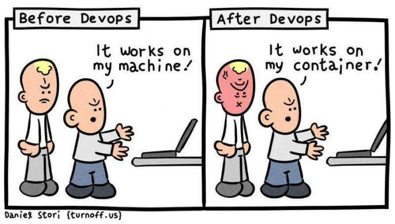
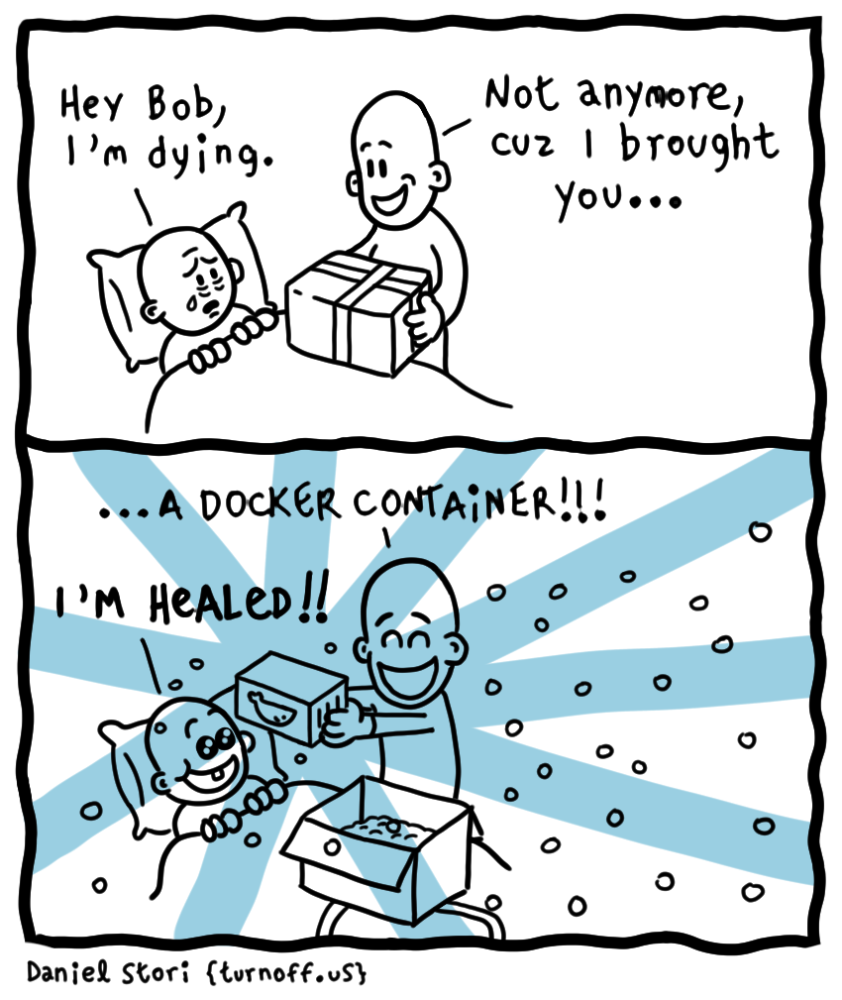

Howdy! Before we start, let's briefly talk about why Docker was created and the logic underlying it.

#### Virtual Machines

Before there was Docker, there were **[virtual machines](https://azure.microsoft.com/en-us/overview/what-is-a-virtual-machine/)** (**VM**s for short). **A virtual machine** is just like any other computer we have in our lives (like a smartphone, laptop, or tablet) in terms of having a CPU to compute and memory to store data. But there is a difference, virtual machines themselves are composed of software that behaves like an actual independent computer, but they do not have the hardware. Hardware is borrowed from a physical computer. Multiple virtual machines can live inside one physical computer that has the hardware, and share the resources as they go.

To differentiate between the main machine and the virtual ones, we name them **host** and **guest** machines, respectively.

VM's are useful in many ways. They allow us to run different operating systems on a single machine, which in turn allows us to run software that requires different operating systems. You can perform tasks in them that you don't want to execute in the host environment, and as VM's are completely contained, nothing happens to the host environment if something goes wrong. VM's are also referred to as **sandbox environments**, as you can try out applications that are in the developmental stage, just like a playground where you can experiment with things.

All is not perfect: VM's have disadvantages as well. As they're sharing the same resources, running multiple VM's on one computer can slow everything down. Also, VM's can have hardware requirements depending on their software, and if the hardware of the physical machine does not meet them, it might result in unstable performance.

#### What are containers?

Virtual Machines are great but they're big, as each one carries an operating system, libraries, and many other things that make up a computer. **Containers** are lightweight alternatives to VM's. Each container is designed to run a single application, and therefore it only has small bundles of whatever that application needs (like libraries and settings). This way you can make sure that your application runs the same everywhere, without worrying about versions of dependencies or operating systems since they will be contained within the images. Containers are fully isolated from each other but they use the host operating system, therefore they're significantly smaller and run faster when compared to VM's. And as they're very lightweight, they're easy to scale.


###### **Image credit: [Reddit](https://www.reddit.com/r/ProgrammerHumor/comments/cw58z7/it_works_on_my_machine/), https://i.imgur.com/3eTKEZp.jpg**

#### What is Docker?

So the problem of isolating software that runs on the same hardware was solved by VM's. The idea of making it much more lightweight and scalable while providing the security of knowing your application will run regardless of the host environment (which is called **containerization**) was created by Google around 2008.

**Docker** is a container platform that provides a tool that creates ready-to-run, fully isolated containers on a host machine. So what it does is help us create containers easily.



###### **Image credit: [Daniel Stori](http://turnoff.us/about/), https://i.redd.it/a0bjg4m7wzu71.jpg**

**So let's start from the beginning:**

1. We have a host machine. It can be any machine, a machine that's far away from you, or the one sitting on your lap. This machine only has one requirement to meet: it has to be able to run a Docker instance.
2. The running docker instance can create containers.
3. Each of these containers has an **image** inside them. Depending on this image, Docker will bundle all the dependencies the application needs to run. So an image is simply a file that keeps track of every dependency you want in that isolated container.
4. The image also has a writable file system, which gives us the option to use the file system within a container.
5. The environment inside the container is completely isolated from the host machine but uses the host machine's operating system and hardware.

#### How do we use Docker?

Docker supplies us with ready-to-use images in [DockerHub](https://hub.docker.com/search?type=image), which is very similar to [npm](https://www.npmjs.com/). Some of the images here were published by Docker, and some were written by other people. You can search for the images that you require, and there is a good chance that you'll find ones that suits your needs and download them.

1. First, we need to [install](https://docs.docker.com/get-docker/) and run Docker.
2. After we run Docker, we have access to the [Docker CLI](https://docs.docker.com/engine/reference/run/) to create, build, and run containers.
3. To add an image to a project, you need to create a file named `Dockerfile` at the root of your project, which is the blueprint of your container that holds the docker image. This `Dockerfile` can include images that we downloaded from DockerHub as I mentioned before, or you can write your own image.

Let's first see how a simple `Dockerfile` looks like:

```dockerfile
FROM alpine:3.12

ENV APP_NAME /appName
WORKDIR $APP_NAME

COPY . /

RUN npm install && npm run build
EXPOSE 3000
CMD ["nodemon", "dist/src/main"]
```

Many things going on there! The first thing we need to know is that the first words that are capitalized are instructions that Docker can understand. Now let's dissect it line by line to figure out what instructions our Dockerfile gives:

```dockerfile
FROM alpine:3.12 as base
```

A valid Dockerfile starts with a **[FROM](https://docs.docker.com/engine/reference/builder/#from)** instruction that declares the image you want to use. The line in our example means we want Docker to use the Docker Node Alpine version 3.12, which uses the Node version 17.0.1. [This image](https://github.com/nodejs/docker-node/blob/cbbf60da587a7ca135b573f4c05810d88f04ace7/17/alpine3.12/Dockerfile) is publicly available in [DockerHub](https://hub.docker.com/_/node). There are many variants of this image with the same Node version and they differ in size. Alpines are generally lightweight versions and they are widely used. We can write this line like this as well: `FROM node:17.0.1-alpine`.

```dockerfile
ENV APP_NAME /appName
WORKDIR $APP_NAME
```

**[ENV](https://docs.docker.com/engine/reference/builder/#environment-replacement)** help us declare environmental variables in the Dockerfile, and we can use both of the following syntaxes to fetch it later: `$variable_name` or `${variable_name}`. In our example, we set the `APP_NAME` environmental variable to '/appName'.

**[WORKDIR](https://docs.docker.com/engine/reference/builder/#workdir)** instruction sets the working directory for the other commands that may need one. In our example, we set the path as the environmental variable that we set in the previous line. It can be used multiple times, but don't forget that each one will be following the one that has been previously set. So if you had two following `WORKDIR` commands, such as this: `WORKDIR /appName` and `WORKDIR subApp`, the current directory after would lead to `/appName/subApp`.

```dockerfile
COPY . /
```

**[COPY](https://docs.docker.com/engine/reference/builder/#copy)** instruction copies files or directories to some other path. In our example, the first line indicates that it copies all the files inside our project (indicated by `.`) to the destination path of `/`.

```dockerfile
RUN npm install && npm run build
```

**[RUN](https://docs.docker.com/engine/reference/builder/#run)** instruction executes any command that's following it. In our example, we install all the npm packages registered in our package.json and execute `npm run build`.

```dockerfile
EXPOSE 3000
```

**[EXPOSE](https://docs.docker.com/engine/reference/builder/#expose)** instruction informs Docker that the container listens at this port on runtime. Node servers with Express.js run at 3000 but default, but if you've set it to another port, you should also specify it to Docker here.

```dockerfile
CMD ["node", "dist/src/main"]
```

**[CMD](https://docs.docker.com/engine/reference/builder/#cmd)** stands for the `command` instruction, and inside we can list the commands we want to run after the instructions before it. There can only be a single **CMD** instruction in a Dockerfile, and it should be formatted as a JSON array.

**Note:** The difference between RUN and CMD instructions is that RUN directly runs the specified commands at build time, but CMD specifies the command to run the image but does not run it in build time.

You can also do multi-stage builds, which means creating different builds for different conditions, such as production and development environments. [Here's an article](https://blog.logrocket.com/node-js-docker-improve-dx/) that explains how to do it. To learn more commands and how to use them, you can check the [dockerhub docs](https://docs.docker.com/engine/reference/builder).

#### Running a container

To boot up a container, you can run `docker build -t containerName .` from your command line. `-t` here creates a tag name where you can identify your container from, as you might and possibly are running multiple containers at the same time. Building a docker container for the first time is always slower as Docker downloads the image for the first time, but after the first time, it is cached, and therefore the booting process becomes faster.

After the build, we are ready to run it with the [docker run](https://docs.docker.com/engine/reference/commandline/run/) command.

If you're booting up multiple containers for your app each time, it can get cumbersome to do it manually. For this reason, another tool exists, which is called **[Docker Compose](https://docs.docker.com/compose/)**. Docker Compose helps boot up multiple containers simultaneously using one command, and it comes pre-installed with Docker, so you don't need to install anything new.

**Docker Compose**

To use **Docker Compose**, all you need to do is to define a YAML file that configures the application services. Services are containers that you expect to be booted together as a bundle to make an application work. For example, one of these can be your node-express.js server, another can be your database, and another can be an in-memory cache such as Redis.

An example `docker-compose.yml` file looks like this (and yes, it has to be named exactly like this for it to be recognized):

```yml
version: "3.9" # optional since v1.27.0
services:
  server:
    build:
      context: .
      dockerfile: Dockerfile
    env_file:
      - .env
    ports:
      - "5000:5000"
    command: npm start:dev
    volumes:
      - .:/code
      - logvolume01:/var/log
    links:
      - redis
  database:
    image: mongo
    container_name: mongodb
    ports:
      - "27017:27017"
  redis:
    image: redis:6.2.1
    ports:
      - "6379:6379"
```

In this example, the `docker-compose up` command runs three different services (containers) for this app, which are **server**, **mongodb**, and **redis**.

**.docker-ignore**

A `.dockerignore` file works just like a `.gitignore` file, it ignores files that are specified in the `.dockerignore` file when building your Docker image. This helps to keep the build cache small and therefore makes the build process faster.

When we start the container, we'll be booting all of the things inside the container.

Most applications have a load balancer that redirects the API requests to different servers according to the load they carry. The servers are just copies of the same services (container or containers), and it's easy to do because they're simple Docker images. The idea of containers is to create small services that we can duplicate as the demand grows.

#### Final Words

We'll finish with another hilarious comic, because we can:



###### **Image credit: [Daniel Stori](http://turnoff.us/about/), http://turnoff.us/geek/docker-panacea/**

### Resources:

1. [What is a virtual machine (VM)?](https://azure.microsoft.com/en-us/overview/what-is-a-virtual-machine/) by Azure
2. [Virtual Machine](https://www.vmware.com/topics/glossary/content/virtual-machine) by vmware
3. [Virtual machine](https://en.wikipedia.org/wiki/Virtual_machine) - Wikipedia
4. [Dockerfile reference](https://docs.docker.com/engine/reference/builder) by docker docs
5. [Overview of Docker Compose](https://docs.docker.com/compose/) by docker docs
6. [Use Node.js with Docker and Docker Compose to improve DX](https://blog.logrocket.com/node-js-docker-improve-dx/) by Geshan Manandhar
