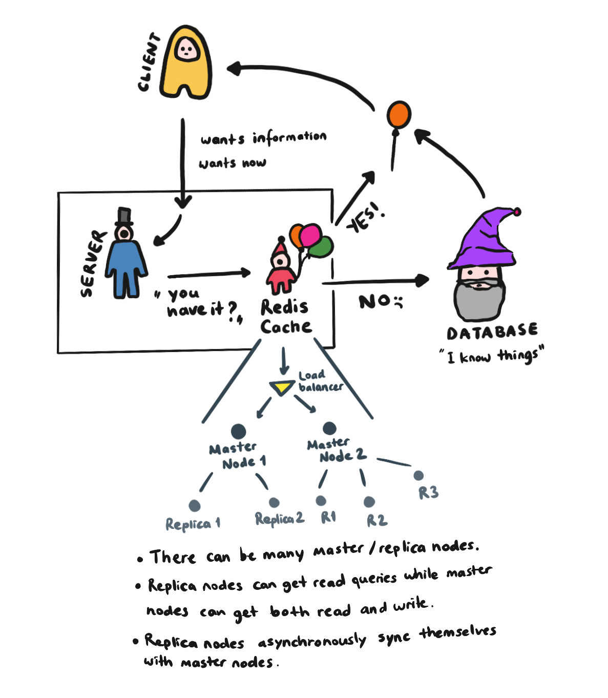

Welcome to our `understanding Redis` quest! Today we're trying to explain what Redis is and how we can use it in our web applications.

**What's in this article?**

- [What is Redis?](#what-is-redis) - [I made this funky diagram to somewhat explain how Redis works](#i-made-this-funky-diagram-to-somewhat-explain-how-redis-works)
- [Redis and Security](#redis-and-security)
- [How to use Redis](#how-to-use-redis)
  - [The Redis CLI](#the-redis-cli)
  - [Basic Commands: GET, SET, MSET, INCR, DECR, EXISTS, DEL, FLUSHALL, EXPIRE, SETEX, PERSIST, APPEND, RENAME](#basic-commands-get-set-mset-incr-decr-exists-del-flushall-expire-setex-persist-append-rename)
  - [Data Types: Strings, Lists, Sets, Sorted Sets, Hashes](#data-types-strings-lists-sets-sorted-sets-hashes)
    - [► Strings](#-strings)
    - [► Lists](#-lists)
    - [► Sets](#-sets)
    - [► Sorted Sets](#-sorted-sets)
    - [► Hashes](#-hashes)
- [Data Persistence](#data-persistence)
- [Resources](#resources)

<div id="what-is-redis"></div>

### What is Redis?

Redis is short for **RE**mote **DI**ctionary **S**erver and is mainly one of the most used NoSQL databases.

Let's start with the official definition that [Redis website](https://redis.io/) is offering us: "Redis is an **open source**, **in-memory** **data structure store**, used as a **database, cache, and message broker**." Now let's open it up a little bit more so that it makes a little bit more sense:

- **open source:** means you can contribute to it from [here](https://github.com/redis/redis).
- **in-memory:** the data stored here persists on the hard disk, which means it is non-volatile.
- **data structure store:** Means it implements and gives access to many kinds of data structures, such as strings, lists, sets, sorted sets, hashes, streams, hyperlogs, bitmaps, geospatial indexes. And data structures in Redis are implemented in a way that favors memory efficiency.
- **database, cache, message broker:** Redis keeps the data in key-value pairs. Normally in high-level programming languages, both the keys and the values that are mapped to them are strings, but in Redis, the values can be more complex data structures. As the data persists on the disk, Redis can be used as a NoSQL database. It can also store the copies of the most frequently used data in DRAM (Dynamic RAM) for caching purposes, which means the data can be reached faster, but will be volatile. Also, Redis can be used as a message broker, which is simply a middleman that enables applications and software to speak to each other and share data.

So we can say that Redis is a combination of a NoSQL database such as [MongoDB](https://www.mongodb.com/) and a caching system like [memcached](https://memcached.org/). One great thing about Redis is that it is [super fast](https://redis.io/topics/benchmarks).

Also, Redis servers can scale well and can be replicated to improve availability. When using the replication, the main Redis server that has been created becomes **the master**, and each **replica** that's created asynchronously keeps up with the data on the master. The data synchronization is non-blocking on the master side but might be blocking on the replica side. As this article aims to be an introduction to Redis, we're not going to go deep in replication, but if you're curious about it and want to learn more, read [this](https://redis.io/topics/replication) official documentation that explains it really good.



<div id="redis-and-security"></div>

### Redis and Security

Redis was designed to be accessed by trusted clients, so access from malicious external resources can be detrimental to the data store. It is possible to set a layer of authentication by editing the `redis.conf` file so that Redis will refuse any queries that come from an unauthenticated client. But there's a catch: Redis does not support data encryption, so if the network connection is exposed, somebody can eavesdrop when you're trying to be authenticated. Redis also allows restricting interfaces for users. If you're curious for more, check [this](https://redis.io/topics/security) official documentation which explains it in more detail.

<div id="how-to-use-redis"></div>

### How to use Redis

To understand how it works and practice the Redis CLI commands, we're going to download Redis into our own machines. However, keep in mind that normally Redis will live in a server or container that is dedicated to that database, so you won't be running it from your own computer.

To download it to your computer, you can either click on the download link from [here](https://redis.io/download) or scroll down on the same page to see some commands that will help you do the same thing.

<div id="the-redis-cli"></div>

#### The Redis CLI

After you install Redis, you can use the Redis CLI by simply typing `redis-cli` to your terminal. This command will open up a port in your host computer and by default, it is `6379`. If you are not sure if you've connected to your Redis server or not, write `PING` to your terminal. If you're connected, it should answer as `PONG`. To end the connection, you can just write `QUIT` to your terminal.

<div id="#basic-commands-get-set-mset-incr-decr-exists-del-flushall-expire-setex-persist-append-rename"></div>

#### Basic Commands: GET, SET, MSET, INCR, DECR, EXISTS, DEL, FLUSHALL, EXPIRE, SETEX, PERSIST, APPEND, RENAME

The Redis CLI has [a lot of available commands](https://redis.io/commands), each useful in certain conditions. Here, we're going to see some of the more commonly used ones.

**SET & GET:** To store data in your Redis server, you can can use the `SET` command. For example, let's write a command that creates a key with the name `age`, and sets its value to `3`. After this, your Redis server should return you `OK` if the operation is successful.

```bash
SET age 3 # Returns OK
```

To retrieve a value that has been set, you can use the `GET` command followed by a key name. After this, your Redis server should return you `3` if the operation is successful. If there are no keys with that key name, you'll receive a `(nil)`.

```bash
GET age # Returns '3'
GET name # Returns (nil)
```

You can also use keyspaces when you're setting a key-value pair. **A keyspace** is a logical segmentation of the namespaces. This way we know that a key belongs to a certain variable:

```bash
SET parrotlet:age 3   # Returns OK
GET parrotlet:age     # Returns "3"
```

If you want to set multiple key-value pairs at the same time, you can use the `MSET` command, followed by the keys and values, like this:

```bash
MSET name 'Cookie' gender 'male' favoriteFood 'almond'
# Returns OK
```

**APPEND:** You can also append values to the values that already exist with the `APPEND` command:

```bash
SET age 3
APPEND age ' years old'
GET age   # Returns '3 years old'
```

**INCR, DECR:** You can also increment and decrement the values that you have previously set: the `INCR age` command should return you a 4, and the `DECR age` command should return you a 3.

**EXISTS:** To understand if a key exists or not, you can use the `EXISTS` command followed by the key name. If the specified key exists, it returns 1, if it doesn't, it should return 0.

**DEL:** To get rid of a key, we can use the `DEL` command followed by the key name. If such a key exists and the deletion is successful, the server will return a 1, otherwise a 0.

**FLUSHALL:** If you want to clear all the key-value pairs in that Redis server, you can use the `FLUSHALL` command. If the operation is successful, you get an `OK`.

**EXPIRE:** We can also set values to be expired at a certain point in time. To do this, we use the `EXPIRE` command followed by the key name and the expiration time defined in seconds. To see the remaining seconds until the expiration time, you can use the `TTL` command followed by the key name. This command returns `-1` if the given key has no expiration time, and `-2` if the given key does not exist. And at the end of the expiration time, the key is deleted, so the TTL command returns -2. To get the remaining time in milliseconds, you can use the `PTTL` command.

If you want to set the expiration time and a key-value pair at the same time, you can use the `SETEX` command, followed by a key name, expiration time in seconds, and a value, respectively. If you want to get rid of a previously set expiration time, you can use the `PERSIST` command, followed by a key name. (This only works if you say it before it expires though.)

You can also rename keys with the `RENAME` command, followed by the key to be renamed and the new name respectively.

As you can see there is a lot of commands, so if you want to do something you should check [this list](https://redis.io/commands) to see if that command exists.

<div id="data-types"></div>

#### Data Types: Strings, Lists, Sets, Sorted Sets, Hashes

As we have mentioned in the `What is Redis` section of this article, Redis provides and supports many data types such as strings, hashes, lists, sets, sorted sets with range queries, bitmaps, hyperlogs, geospatial indexes, and streams. Here, we're going to talk about some basic types like strings, lists, hashes, sets, and sorted sets, but going to leave out the complicated types as they're needed for more complicated data, but not very commonly used. If you're curious about them, see [this official document](https://redis.io/topics/data-types-intro) from the Redis team, which explains them neatly.

<div id="-strings"></div>

#### ► Strings

A Redis string is a sequence of bytes that are **binary-safe**. Being binary-safe means Redis makes no assumptions about the terminating character or the length of the string, therefore you can store anything up to 512 MBs, such as a JPEG image. Redis uses **Bulk Strings** to represent the stored string, and in these, the length of the string is a part of the string representation. For more detailed information you can check the [Redis Protocol specification](https://redis.io/topics/protocol/).

<div id="-lists"></div>

#### ► Lists

A list data type in Redis is simply a list of strings that are sorted by their insertion order, just like a linked list. It is possible to add a new string to either the head (left) or the tail (right) of the list.

Let's create and modify a list ourselves, using the `LPUSH`, `RPUSH` Redis CLI:

```bash
LPUSH parrots "Cookie"  # Here we create a parrots list and add the "Cookie" string to it
LPUSH parrots "Cake" # Returns 2 (Number of values in the list)
# NOTE: You can push multiple items in one go as well.
RPUSH parrots "Merlin" # Returns 3
```

To see the values in the array, we can use the `LRANGE` command:

```bash
LRANGE parrots 0 -1 # Show the range between index 0 and -1, which is everything

# Output: 1) "Cake" 2) "Cookie" 3) "Merlin"
```

To see the length of a list, we can use the `LLEN` command. To remove an item from the list, you can use `LPOP` and `RPOP` commands:

```bash
LLEN parrots # Returns 3

LPOP parrots # Returns "Cake"
RPOP parrots # Returns "Merlin"

LLEN parrots # Returns 1
```

If you want to insert another item to the list by using a key, you can use the `LINSERT` command:

```bash
LINSERT parrots BEFORE "Cookie" "Onion"
LRANGE parrots 0 -1 # Output: 1) "Onion" 2) "Cookie"
```

You can see other commands you can use on lists from [here](https://redis.io/commands#list).

<div id="-sets"></div>

#### ► Sets

Redis Sets are unordered collections of unique strings. Any attempts of adding a new string that already exists in a given set will fail and at the end, there will only be a single copy of a given string.

The first command we're going to check out is `SSAD`, which adds new items (members) to a specified set that is stored in a key. If a set with that key doesn't exist, it will create a new one.

```bash
SADD statusSet "draft" "in progress" "complete" # Returns 3
SADD statusSet "draft" # Returns 0, as the "draft" is already a member of this set, it didn't add anything.
```

To see if a member exists in a set, we can use the `SISMEMBER` command. And to see all the members in a given set, we can use the `SMEMBERS` command. The number of items in a set can be found out with the `SCARD` command.

```bash
SISMEMBER statusSet "draft" # Returns 1, as the member already exists
SISMEMBER statusSet "incomplete" # Returns 0, as the member does not exist

SMEMBERS statusSet # Output: 1) "complete" 2) "draft" 3) "in progress"

SCARD statusSet # Returns 3
```

You can also move items between sets with the `SMOVE` command:

```bash
SMOVE statusSet projectStatusSet "draft" # Returns 1, as it moved 1 item
SCARD statusSet # Returns 2
SCARD projectStatusSet # Returns 1
```

You can remove an item from a set by using the `SREM` command. And if you want to see the difference between two sets, you can use the `SDIFF` command.

```bash
SADD statusSet "draft" # Here we add the "draft" member to statusSet
SDIFF statusSet projectStatusSet # Outputs: 1) "complete" 2) "in progress"

SREM statusSet "draft" # Returns 1, as it removed 1 item
```

You can even get a random member from a set by using the `SRANDMEMBER` command. To return and remove a random item from a set at the same time, you can use the `SPOP` command. As you can see, there are many ways you can manipulate a set. You can see other commands you can use on sets from [here](https://redis.io/commands#set).

<div id="-sorted-sets"></div>

#### ► Sorted Sets

Redis Sorted Sets are very similar to Redis Sets, but with a tiny difference. Here, each member is associated with a score that helps us sort them. The members are still unique, so sorted sets still can't hold replicated values, but scores can be repeated.

To add a member to a sorted set, you can use the `ZADD` command, but you'll have to associate the member with a score as well:

```bash
ZADD birthYearSet 1010 "Marceline the Vampire Queen"
ZADD birthYearSet 1274 "Princess Bubblegum"
ZADD birthYearSet 2001 "Lumpy Space Princess"
ZADD birthYearSet 2001 "Finn the human"
```

To see each member's rank, you can use the `ZRANK` command. (Ranking is 0 indexed.) To see all of the members of a sorted set, you can use the `ZRANGE` command.

```bash
ZRANGE birthYearSet 0 -1
# Output: 1) "Marceline the Vampire Queen" 2) "Princess Bubblegum" 3) "Finn the human" 4) "Lumpy Space Princess"

ZRANK birthYearSet "Marceline the Vampire Queen" # Returns 0, as it is the first member of the sorted set
ZRANK birthYearSet "Finn the human" # Returns 2
```

You can also increment the scores if you need to by using the `ZINCRBY` command:

```bash
ZINCRBY birthYearSet 20 "Finn the human" # Returns 2021, the updated score
ZRANK birthYearSet "Finn the human" # Returns 3
```

<div id="-hashes"></div>

#### ► Hashes

Redis Hashes are maps between strings that are keys and values which are used to represent objects.

To set a new key-value pair in a given hash, we can use the `HSET` command. If such a key does exist, the value is overwritten, and if no such key exists, a new one is created. We can retrieve a specific value with `HGET`, and we can see the whole has by using the `HGETALL` command. `HKEYS` command gives us only the keys, and `HVALS` returns only the values. If we want to check out how many key-value pairs a hash has, we can use the `HLEN` command.

```bash
HSET parrot:cookie name "Cookie" age "3" # Returns 2, as it created 2 key-value pairs

HGET parrot:cookie name  # Returns "Cookie"
HGET parrot:cookie age  # Returns "3"

HGETALL parrot:cookie # Returns 1) "name" 2) "Cookie" 3) "age" 4) "3"

HKEYS parrot:cookie # Returns 1) "name" 2) "age"
HVALS parrot:cookie # Returns 1) "Cookie" 2) "3"

HLEN parrot:cookie # Returns 2
```

You can delete a key-value pair by using the `HDEL` command and increment a value of a specified key by the `HINCRBY` command.

Also, Redis documentation has the time complexities of each operation on the top of its individual page. If you're curious, I suggest you check [them](https://redis.io/commands) out.

<div id="data-persistence"></div>

### Data Persistence

There are multiple persistence options in Redis. And if you want to, you can disable persistence completely, and let your data exist for only as long as the server is running.

1. **RDB:** This is short for **Redis Database**, and it works with snapshots of your database taken at certain intervals. This is a point-in-time representation of your data that is saved on the disk in a binary file called `dump.rdb`, which is good for disaster recovery or oh-my-god-my-data-is-deleted type of situations. But depending on the intervals you choose to do the snapshots, the data between the point where the snapshot was taken and the disaster happened is vulnerable and probably going to be lost.
2. **AOF:** This is short for **Append Only File**, and it works by logging every write operation that is received by the server. So if a disaster happens, when the server restarts it will just rerun the whole log, therefore creating the exact dataset before the disaster point.
3. **RDB + AOF:** In Redis documentation, they recommend using the third option which is the combination of both RDB and AOF.

There's also a hint of a plan of unifying RDB and AOF into a single persistence model. If you want to learn more about this subject, you can check the [official Redis document for data persistence](https://redis.io/topics/persistence).

<div id="resources"></div>

### Resources

1. [Redis Official Website](https://redis.io/)
2. [Redis Data Types](https://www.tutorialspoint.com/redis/redis_data_types.htm) by tutorialspoint
