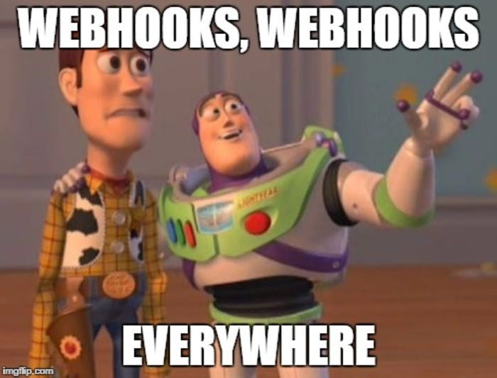
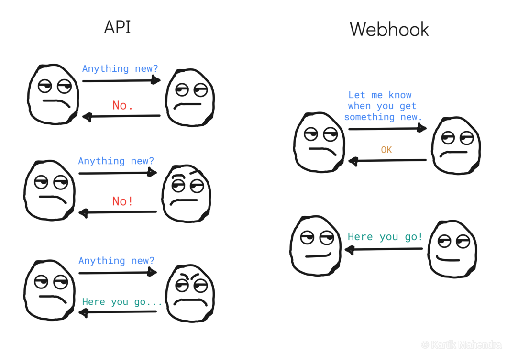
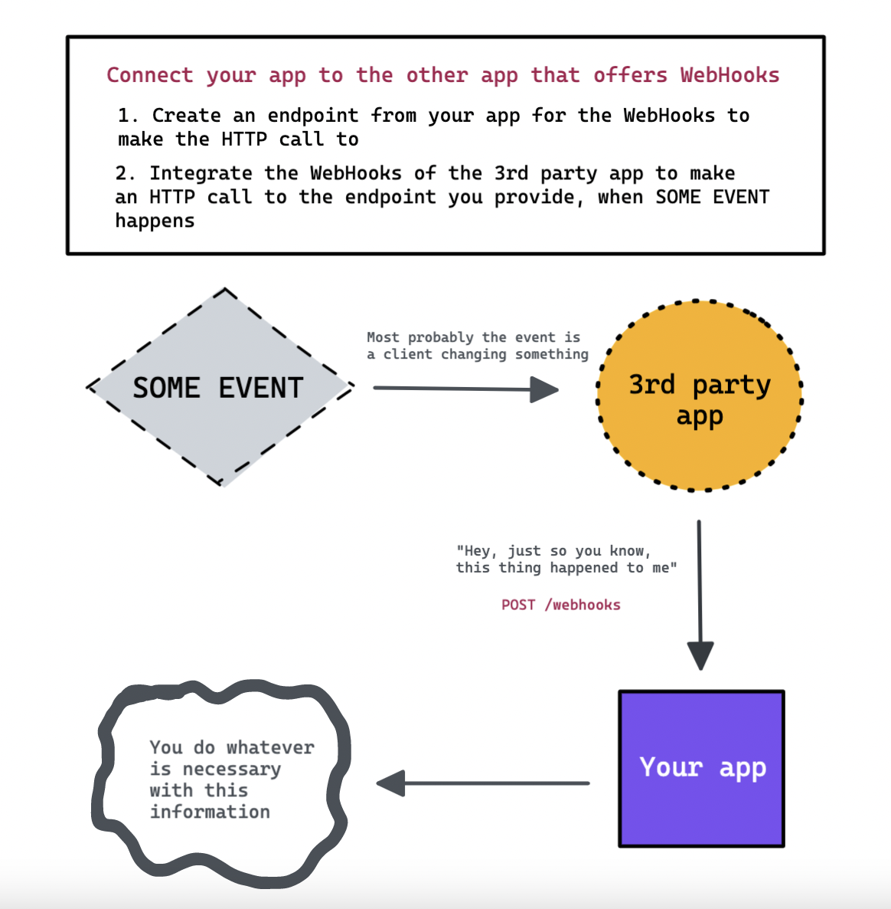

If you're into web development, there's a good chance that you'll deal with WebHooks at one point in your lifetime. In this article, we aim to explain the simple logic behind WebHooks and why so many APIs choose to implement one.

###### **Image Credit:** https://prismic.io/blog/webhooks-everywhere--support-for-sni

**Analogy Time!**

In the normal client-server relationship, the client makes the requests and the server gives back a response. You can simply think of this as a phone call: Say that you're the client and you want to make a cake. You need flour, eggs, carrots, and cinnamon. You call (or send a request to) your partner (the server) to fetch them for you. Your partner goes to the nearest store (maybe a database?), realizes they're out of all-purpose flour, but they have bread flour. Wants to call you, but doesn't have a phone. He has two options: he will either return home with the bread flour without knowing you want it or not, or he will return home and give you an error.

There are two possible solutions to this issue:

1. You have a phone, so you can call him every few minutes to see what he's buying. The repeated checks to see if something is ready is called **[polling](<https://en.wikipedia.org/wiki/Polling_(computer_science)#:~:text=Polling%20is%20the%20process%20where,often%20with%20low%2Dlevel%20hardware.&text=Polling%20also%20refers%20to%20the,returns%20to%20a%20different%20task>)** in computer science, and it's nasty and inefficient for everybody.
2. You give the store our phone number and a picture of your partner. You tell them to call you when he purchases something. Whenever your partner comes shopping, the store can call you to say whatever he has bought. This way you can get the oven going, and nobody is occupied with calling each other more than they're supposed to, as the store will only call you when your partner has finished buying things.

###### **Image Credit:** https://levelup.gitconnected.com/webhooks-82e50720abd2, Kartik Mahendra

Now, let's get out of the analogy and talk a bit more seriously. Webhooks are essentially custom-defined HTTP callbacks that are triggered by a predefined event, to a predefined URL. Many 3rd party APIs such as [Stripe](https://stripe.com/docs/webhooks), [Github](https://docs.github.com/en/developers/webhooks-and-events/webhooks/about-webhooks), [GitLab](https://docs.gitlab.com/ee/user/project/integrations/webhooks.html), [Twilio](https://www.twilio.com/docs/glossary/what-is-a-webhook), and [Sendgrid](https://sendgrid.com/blog/whats-webhook/) supports WebHooks, which means you can trigger an HTTP request to your app's server when something happens. So, we can safely say that WebHooks enable applications to communicate with each other in real-time.

WebHooks are also referred to as reverse APIs or web callbacks. But they're different from the regular APIs based on their data exchange style. APIs tend to **pull** or **push** data depending on the HTTP requests and WebHooks tend to **push** data when a certain event happens. The 3rd party API that supports the WebHook integration is called the **provider**, and the application it is communicating with and sending the data is called the **consumer** or **subscriber**.

###### As we're missing our iPad and Procreate this week, we used [Excalidraw](https://excalidraw.com/) to draw this diagram. It is pretty cool, you should try it out.

**To summarize:**

- WebHooks provide one-way data flow and that is event-based.
- This means your application doesn't have to constantly check if some event has happened, or some data has changed, which makes the whole deal very efficient.
- If you have an application that requires real-time data updates, WebHooks could be amazing for you. But saying that, not every application supports WebHooks.

**Common uses of WebHooks are:**

- Setting up automated notifications
- Subscribing to email lists
- Setting up a CI/CD pipeline to deploy a website when the content is changed
- Updating the accounting software when the invoices are paid by the customers.

  Configuring a WebHook will differ according to the service you're using. So better get into the docs if you're planning to use one!

#### But are they secure?

They are - if you are verifying the provider. As you're exposing a public endpoint from your application that has the ability to change something, you must be sure that it only responds to the resources you want. For this reason, providers use signatures and timestamps, and consumers verify them using a secret. If the provider cannot be verified, the callback isn't triggered. You can read more from [this awesome article](https://requestbin.com/blog/working-with-webhooks/#how-do-i-secure-a-webhook-integration) to see how to secure a WebHook integration.

### Resources

1. [Webhooks — The Definitive Guide/2019](https://requestbin.com/blog/working-with-webhooks/#webhooks-%E2%80%94-the-definitive-guide-2019) by pipedream
2. [APIs vs. Webhooks: What’s the difference?](https://www.mparticle.com/blog/apis-vs-webhooks) by Sean Ryan
3. [Webhooks](https://levelup.gitconnected.com/webhooks-82e50720abd2) by Kartik Mahendra
4. [What is a webhook: How they work and how to set them up](https://www.getvero.com/resources/webhooks/) by Chris Hexton
5. [Webhook](https://www.twilio.com/docs/glossary/what-is-a-webhook) by David Prothero - Twilio Docs
6. [What are Webhooks? Easy Explanation & Tutorial](https://snipcart.com/blog/what-are-webhooks-explained-example) by Maxime Laboissonniere
