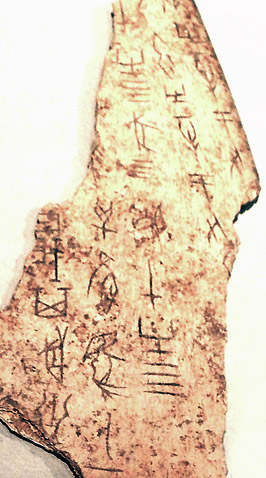

In the quarantine period of 2020, I got the chance to start learning something I wanted to learn for such a long time. I started learning Japanese. The delicate culture and the intricate but beautiful mythology of Japan never ceased to impress me since I was a teenager.

When you're learning Japanese, (especially if you're learning how to write) you face with a very different kind of problem. Japanese writing system uses symbols to indicate the sounds (or syllables, you could say). The term "kana" is mainly used for indicating "hiragana" and "kanji", which are the two systems used for symbolizing the sounds in Japanese. "Kanji" on the other hand, are Chinese characters that indicate words, not sounds. Latin alphabet can also be used to write Japanese, which is called "Romaji". And all four of these systems (Hiragana, Katakana, Kanji, Romaji) are actively used in Japan.

Now, as you can see this is a problem that makes it hard to learn Japanese, not just for us the "gaijin" (foreigners), but for Japanese people too. This article is my attempt of understanding how it became the way it is, by tracing the historical timeline.

**The history of Kanji, Hiragana and Katakana**

Before the 5th century, Japan had no written language. China on the other hand, was using a script that consisted of many symbols that indicated words. The Kanji system in China was invented by a legendary historian named Cangjie, and I am emphasising the word legendary here, because according to the legend the dude had four eyes and when he invented these characters, the deities and ghosts cried and the sky rained millet. Believe it if you must.

_Portrait of Cangjie showing his four eyes. If you are interested, read more from [here.](https://en.wikipedia.org/wiki/Cangjie)_

Another theory of how kanji was born is ancient Chinese people who wanted to ask questions to heavens made a ritual of burning turtle shells or animal bones and looking at the cracks that formed after, trying to find some sort of meaning in them. At some point they started to connect those shapes to items and use them as symbols to indicate those items. They even replicated those symbols onto not-burnt turtle shells (maybe these were some sort of prayers, sent to Gods). Whatever the reason was, there they are, we have found a lot of oracle bones with scripts on them from that era.

_Chinese inscription on an oracle bone. Image by Dr. Meierhofer [CC BY-SA 3.0], via Wikimedia Commons. If you are interested, read more from [here.](https://en.wikipedia.org/wiki/Oracle_bone_script)_

_As you can see, this turtle is not impressed. [Click](https://unsplash.com/photos/L-2p8fapOA8) for the original picture._

After the rise of Confucianism (a system of thought, a philosophy, a way of life that originates from China) it propagated to Korean peninsula and then, it arrived to Japan. As Japanese didn't have a written language and they wanted to understand Buddhist scriptures written in Chinese as well, they adopted the Chinese writing system. Now this became a problem, because Japanese have different sounds and syllables, in fact the whole Japanese language consists of only 105 sounds. Chinese on the other hand has a much complicated phonetic system with a larger inventory of sounds.
