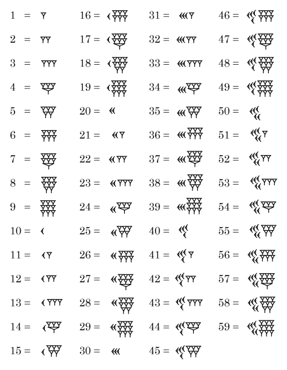
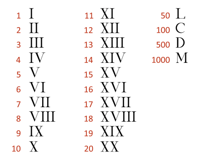

### The very first numbers

**Tally Marks**

Counting stuff is as ancient as we are. Around 30,000 years ago, even without a written language, our ancestors were counting stuff by bending their fingers, or pointing out to stones, or making marks with sharp stuff on bones which we now call the **[tally marks](https://en.wikipedia.org/wiki/Tally_marks)** (also called hash marks.) Clusters of five strokes made it more legible, and different groups of people all around the world invented the tally system in slightly different ways, but always with the same logic - clustering 5 strokes in an order.

The **[written language](http://www.pbs.org/opb/historydetectives/feature/the-written-word/)** came later than the spoken language, when humans began to build more permenant social groups and start to grow their own food. I guess at some point somebody thought writing numbers with tally marks took very, very long when the numbers get bigger, and it was cumbersome for the person who was reading it as well. So at some point, humans decided to use symbols to indicate certain numbers, and these symbols are called **[the numerals.](https://en.wikipedia.org/wiki/Numeral_system)**

There are various number systems that were invented throughout the human history, but there are 4 main ones that were used by biggest ancient human civilizations: the Babylonian numerals, the Egyptian numerals, the Roman numerals and the Mayan numerals.

**Ancient Babylonian numerals**

The Babylonian numeral system is the first known [positional numeral system](https://en.wikipedia.org/wiki/Positional_notation), which means a value of a digit depends on the position of the digit.

This is what ancient Babylonian numeral system looked like:

The ancient [Babylonian counting system](https://en.wikipedia.org/wiki/Babylonian_cuneiform_numerals) (appeared around 2000 BC) was base-60. Today we use a base-10 system. This means that with each digit to the left, the number's place value is increased 10 fold. So when we ask for 7532 carrots in base 10, it actually means 7 \* 1000 + 5 \* 100 + 3 \* 10 + 2 \* 1 carrots. The same number in the Babylonian system would be 25 32 (2 \* 3600 + 5 \* 60 + 32 \* 1). 7532 in base 10 is equal to 25 32 in base 60.

Ancient Babylonians affected the world in many ways. Did you ever wonder why there are 60 seconds in a minute, 60 minutes in an hour and 24 hours in a day? Or why there are 360 degrees in a full circle? These are all echoes of this base 60 numeral system that ancient Babylonians used.

**Ancient Egyptian numerals**

The (ancient Egyptian counting system)[https://en.wikipedia.org/wiki/Egyptian_numerals] (appeared around 3000 BC) used objects from everyday life to symbolize numbers and used base 10. A rod meant 1, a cattle hobble was 10, a coiled rope was 100, a lotus flower was 1000. They didn't have the concept of positional notation.

This is what ancient Egyptian numeral system looked like:

Ancient Egyptians also had a symbol for zero, but as their system is not positional, it was mainly used to indicate the base level of the structures they were building (like pyramids!).

**Ancient Roman numerals**

Ancient Romans invented their own numerals. These numerals were widely used in Europe until the more efficient Arabic numerals took their place. Romans used selected letters from Latin alphabet to indicate certain numbers. For example "I" was one, "V" was 5, "X" was 10, "L" was 50, "C" was a hundred, "D" was five hundred and "M" was one thousand. Every other number was constructed from these 7 numerals. They also invented a method, when you write multiple symbols, you take the biggest symbol, and if there is a symbol on their left, you subtract them (like IV, which is 4), if there is a symbol on their right side you add them (like VII, which is 7). So Roman numerals didn't have positional notation, this numeral system also lacked zero, but had a verbal equivalent, which was "nulla" (meant none).

This is what ancient Roman numeral system looked like:

Image Credit: https://www.unrv.com/culture/roman-numerals.php

To give some examples, the number 37 in base 10 is represented as XXXVI (XXX + VII) in Roman numerals. The number 247 is represented with CCXLVII (CC + XL + VII).

We still see Roman numerals around, in the clockface of Big Ben, or at the backside of the coins as the regnal numbers of kings and queens, or in movie sequels.

**Ancient Mayan numerals**

Mayan number system dates back to 4th century, and it had a base 20. The theory is that as Mayans lived in a hotter climate, they rarely wore shoes, and total number of fingers and toes around was mostly 20. Mayans used a combination of 2 symbols, a dot (.) was used to represent the single units (one through four) and a dash (-) was used to represent five.
