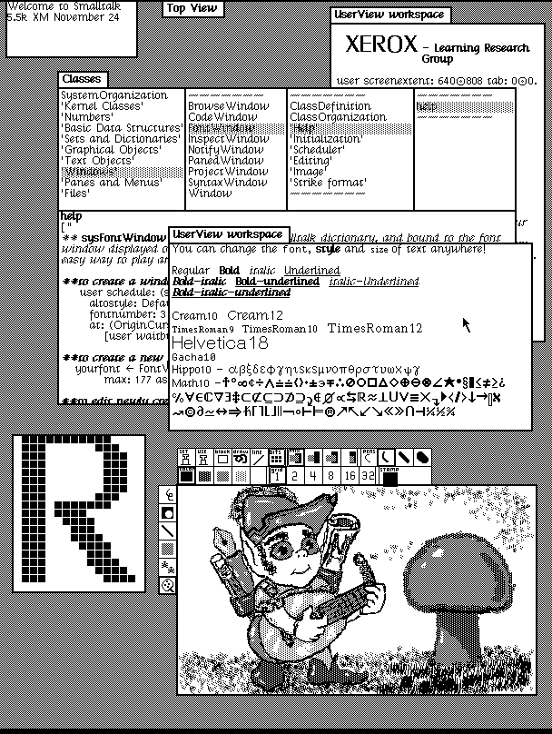
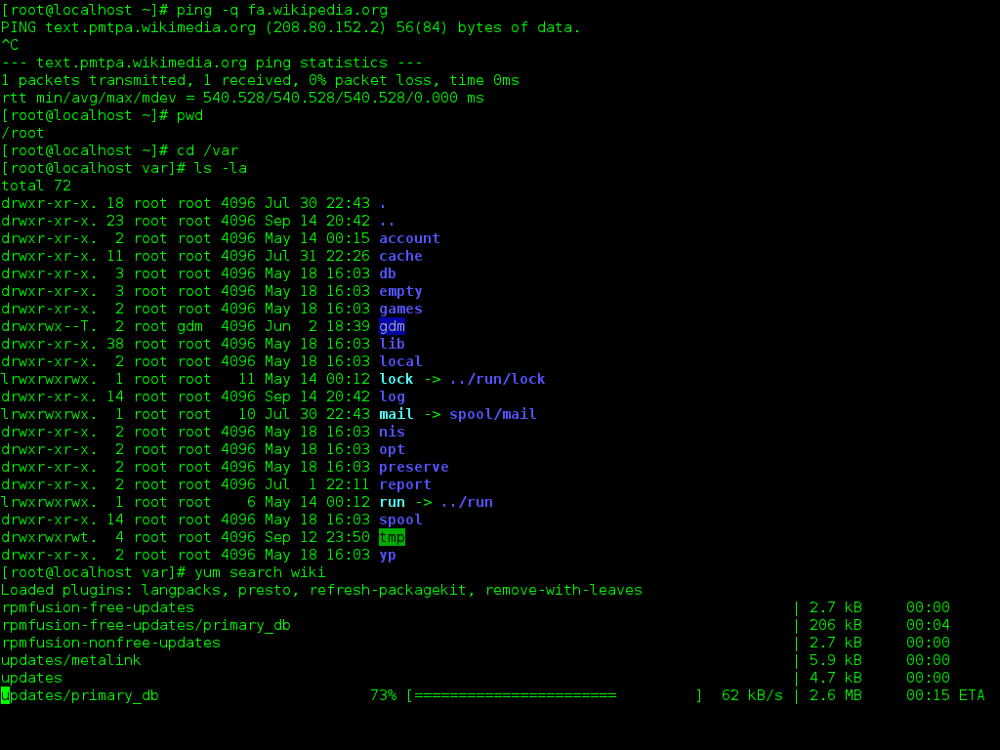

The **[Operating System](https://en.wikipedia.org/wiki/Operating_system)** (OS for short) is the most important software that runs on a computer. Without an operating system, a computer wouldn't be able to work.

Think of all the hardware as roads. The software (different applications, programs) you run at your computer are all trucks, they carry data from place to place, they have somewhere they must go to. And guess who's controlling the traffic lights, makes sure everyone gets to wherever they need to go, but in order: the OS. OS is the great conductor of this orchestra. You run different programs at the same time, and all of them work. They all use RAM and CPU and the OS makes it all happen, making sure they don't crash into each other.

An **[application program interface (API)](https://en.wikipedia.org/wiki/API)** is an interface for a software to enable interaction with other software. An API basically provides a definition of which requests can be made to that software and how. This way, you don't worry about how that specific software works, but you can focus on your interaction with it. The OS also provides a consistent and dependable API. This way, software developers can write applications that will work on every computer that has the same OS.

Not all electronic devices have an operating system. Think of a microwave oven. It has a simple hardware structure, certain buttons that do certain things, and the user decides what to do with it. Also, you make it do one thing at a time. You could write an operating system for it too, but it would be unnecessary and it would make the microwave ovens more expensive and complex than they need to be. So a single hard-wired program works for devices like that.

All computers come with a pre-installed operating system. You can either use the OS that comes with your computer (which is the most commonly used option), or you could change it to another one you like better. Modern operating systems come with a **[GUI (Graphical User Interface)](https://en.wikipedia.org/wiki/Graphical_user_interface).**

A GUI is whatever you see on the display screen of your computer when you open a program. The purpose of a GUI is to make an application easier for humans to use, but you can use an application without a GUI by using a **CLI (command-line interface)**. A **[CLI (command-line interface)](https://en.wikipedia.org/wiki/Command-line_interface)** is a very simple interface where you can use certain commands in the form of text, mainly by only using the keyboard (a GUI allows you to use the keyboard and the mouse, has buttons, looks cuter and much easier to use for humans).

_This is one of the first GUI's ever made, the Dynabook GUI (Smalltalk-76 running on the Xerox Alto)_

_By SUMIM.ST - Own work, CC BY-SA 4.0, https://commons.wikimedia.org/w/index.php?curid=61612766_

**The shell** is the actual program run by the OS to process the commands you enter into the command line. It is named shell because it is the outermost layer of an OS. Mostly, users interact with the shell using a CLI, which is a simple graphical window. In macOS, Terminal is used as a CLI, in Windows 10, it is Bash shell or Git Bash.

For example, this is how a Linux CLI (bash) looks like:

_This is a screenshot of a sample Bash session in GNOME Terminal, showing the results of ping, pwd, cd, yum and ls commands._

_Image Credit: By ZxxZxxZ - Own work, GPL, https://commons.wikimedia.org/w/index.php?curid=16485488_

The most common OSs are the Windows family (developed by Microsoft), the Macintosh family (developed by Apple), and the UNIX family (developed by a lot of individuals, corporations, and collaborators).

**Windows** was created in the 1980s by Microsoft. Many different versions of it were released in different years (Windows 10 was released in 2015, Windows 8 in 2012, Windows 7 in 2009, and Windows Vista in 2007, etc.) Windows comes preloaded on many new computers and many people use the OS's that come with their computers, so this is one of the most used OS's (Windows users account for around 70-80% of global operating systems). **macOS** (previously called OS X) is a family of OS's created by Apple. It comes preloaded on all Macs (macOS users account for around 10% of global operating systems). Some of the versions previously released are Catalina (2019), Mojave (2018), High Sierra (2017), and Sierra (2016). Linux is a family of open-source Unix-like operating systems, which means they can be modified and distributed by anyone around the world. This is different from windows and macOS, these two can only be modified by the companies that own these. Linux is free, and there are many different versions you can choose from. Linux OS is based on the Linux kernel, which was created by Linus Torvalds in 1991. [A kernel](<https://en.wikipedia.org/wiki/Kernel_(operating_system)>) is a computer program at the core of a computer's operating system with complete control over everything in the system. Although Linux users account for less than 2% of global operating systems, many devices run on Linux kernel, because it's free and customizable. For example, many servers and supercomputers run on Linux, Chromebook runs on Chrome OS, and android, which is a mobile operating system that is used in mobile phones, tablets, and wearable technologies, uses a modified version of the Linux kernel.

_In-flight entertainment system booting up displaying the Linux logo._

_Image Credit: Gdfhjjbb at English Wikipedia / CC BY-SA 4.0 <https://commons.wikimedia.org/wiki/File:In_flight_system_Linux_bootup.jpg>_

**Resources:**

1. Wikipedia - [Operating System](https://en.wikipedia.org/wiki/Operating_system), [Linux](https://en.wikipedia.org/wiki/Linux), [Application Program Interface (API)](https://en.wikipedia.org/wiki/API), GUI (Graphical User Interface)](https://en.wikipedia.org/wiki/Graphical_user_interface), [CLI (command-line interface)](https://en.wikipedia.org/wiki/Command-line_interface), [Kernel](<https://en.wikipedia.org/wiki/Kernel_(operating_system)>)
2. "But How Do It Know" by [J. Clark Scott](http://www.buthowdoitknow.com/index.html)
3. Jeff Tyson "How Operating Systems Work",
   HowStuffWorks.com. <https://computer.howstuffworks.com/operating-system.htm>
4. "From Nand to Tetris" Part1 & Part2 by [Hebrew University of Jerusalem](https://www.nand2tetris.org/)
5. http://linuxcommand.org/lc3_lts0010.php
