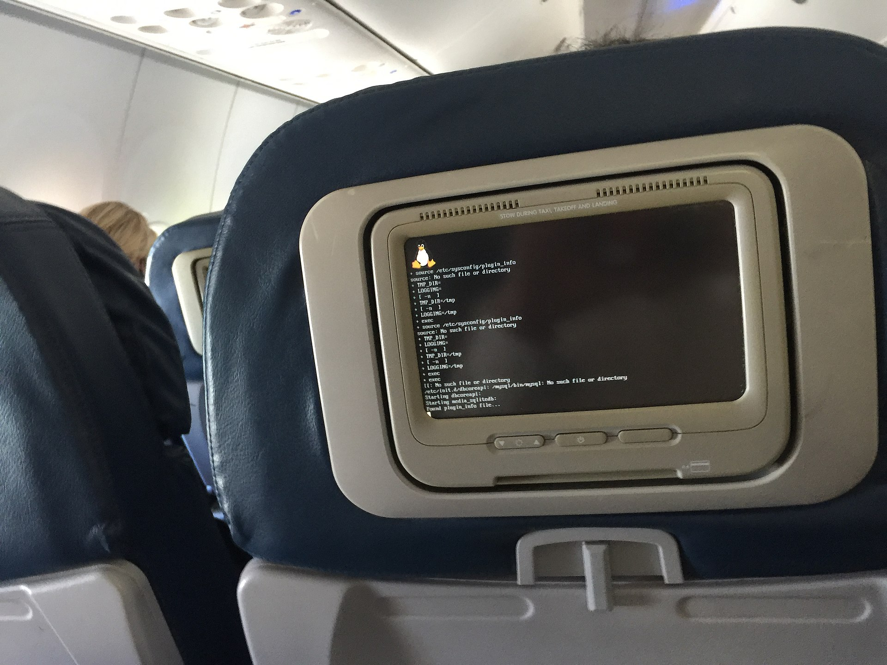

The operating system (OS for short) is the most important software that runs on a computer. Without an opearting system, a computer wouldn't be able to work.

Think of all the hardware as roads. The softwares (different applications, programs) you run at your computer are all trucks, they carry data from place to place, they have somewhere they must go to. And guess who's controlling the traffic lights, makes sure everyone gets to wherever they need to go, but in order: the OS. OS is the great conductor of this orchestra. You run different programs at the same time, and all of them works. They all use RAM and CPU and the OS makes it all happen, making sure they don't crash into each other.

An API is an interface for a software to enable interaction with other softwares. An API basically provides a definition of which requests can be made to that software and how. This way, you don't worry about how that specific software works, but you can focus on your interaction with it. The OS also provides a consistent and dependable **[application program interface (API)](https://en.wikipedia.org/wiki/API)**. This way, software developers can write applications that will work on every computer that has the same OS.

Not all electronic devices have an operating system. Think of a microvawe oven. It has a simple hardware structure, certain buttons that do certain things, and the user decides what to do with it. Also you make it do one thing at a time. You could write an operating system for it too, but it would be unnecessary and it would make the microwave ovens more expensive and complex than they need to be. So a single hard-wired program works for devices like that.

All computers come with a pre-installed operating system. You can either use the OS that comes with your computer (which is the most commonly used option), or you could change it to another one you like better. Modern opertaing systems come with a **GUI (Graphical User Interface).** A GUI whatever you see on the display screen of your computer when you open a program, that let's you do stuff with using buttons etc. The purpose of a GUI is to make a software easier for humans to use, but yes you can use a software without a GUI.

The most common OS's are the Windows family (developed by Microsoft), the Macintosh family (developed by Apple) and the UNIX family (developed by a lot of individuals, corporations and collaborators).

**Windows** was created in the 1980s by Microsoft. Many different versions of it was released in different years (Windows 10 was released in 2015, Windows 8 in 2012, Windows 7 in 2009, and Windows Vista in 2007, etc.) Windows comes preloaded on many new computers and many people use the OS's that come with their computers, so this is one of the most used OS's (Windows users account for around 70-80% of global operating systems). **macOS** (previously called OS X) is a family of OS's created by Apple. It comes preloaded on all Macs (macOS users account for around 10% of global operating systems). Some of the versions previously released are Catalina (2019), Mojave (2018), High Sierra (2017), and Sierra (2016). Linux is a family of open-source Unix-like operating systems, which means they can be modified and distributed by anyone around the world. This is different from windows and macOS, these two can only be modified by the companies that own these. Linux is free, and there are many different versions you can choose from. Linux OS is based on the Linux kernel, which was created by Linus Torvalds in 1991. [A kernel](<https://en.wikipedia.org/wiki/Kernel_(operating_system)>) is a computer program at the core of a computer's operating system with complete control over everything in the system. Although Linux users account for less than 2% of global operating systems, many devices run on Linux kernel, because it's free and customizable. For example, many servers ans supercomputers run on Linux, also android, which is a mobile operating system (that is used in mobile phones, tablets and wearable technologies) uses a modified version of the Linux kernel.

_In-flight entertainment system booting up displaying the Linux logo._

_Image Credit: Gdfhjjbb at English Wikipedia / CC BY-SA 4.0 <https://commons.wikimedia.org/wiki/File:In_flight_system_Linux_bootup.jpg>_

**Resources:**

1. Wikipedia - [Operating Systems]()
2. "But How Do It Know" by [J. Clark Scott](http://www.buthowdoitknow.com/index.html)
3. Jeff Tyson "How Operating Systems Work",
   HowStuffWorks.com. <https://computer.howstuffworks.com/operating-system.htm>
4. "From Nand to Tetris" Part1 & Part2 by [Hebrew University of Jerusalem](https://www.nand2tetris.org/)
5.
