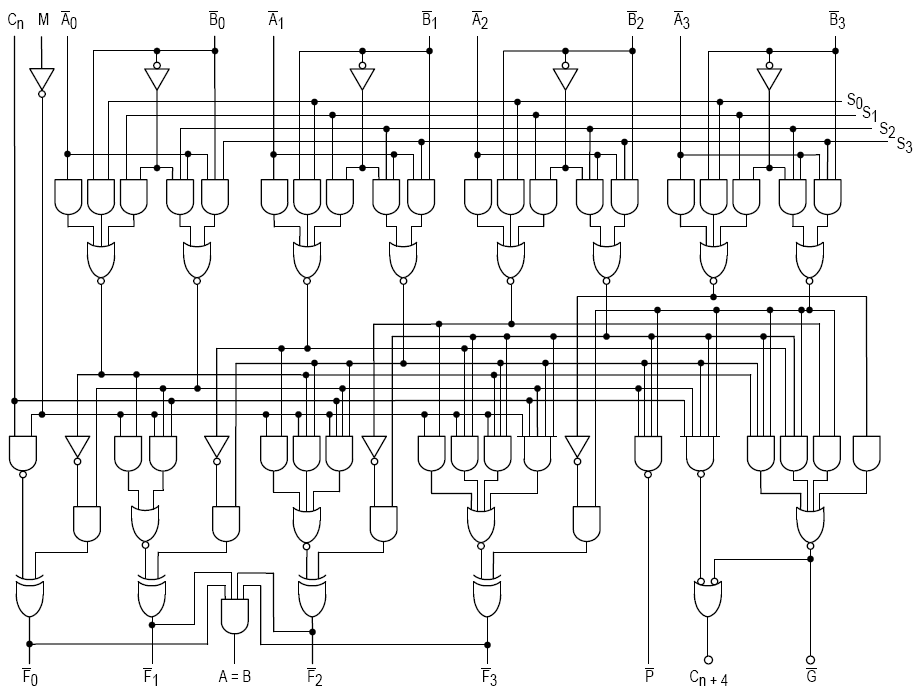
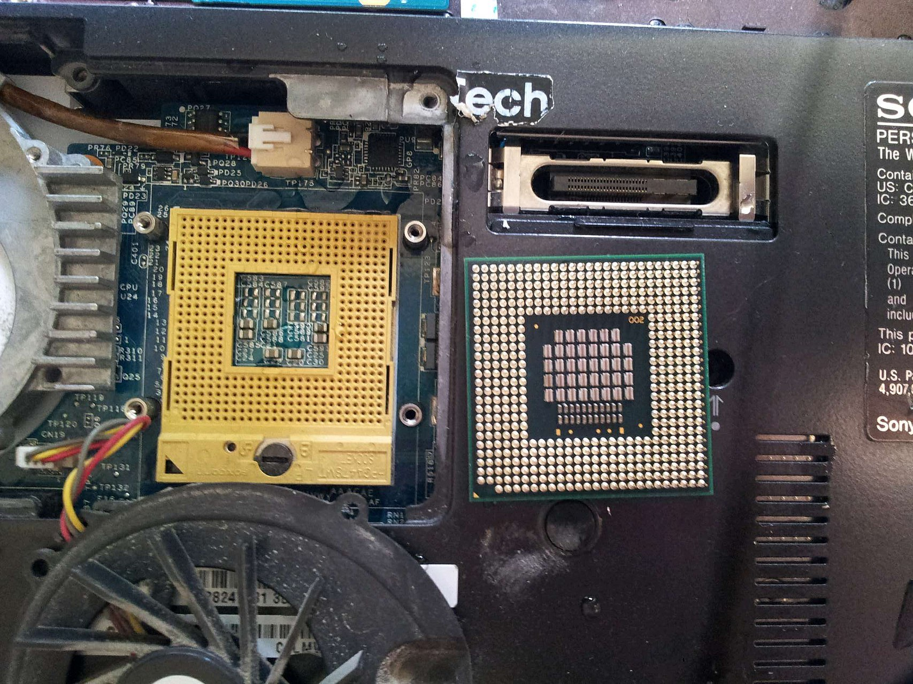
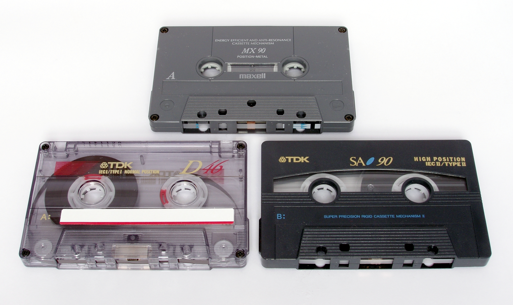
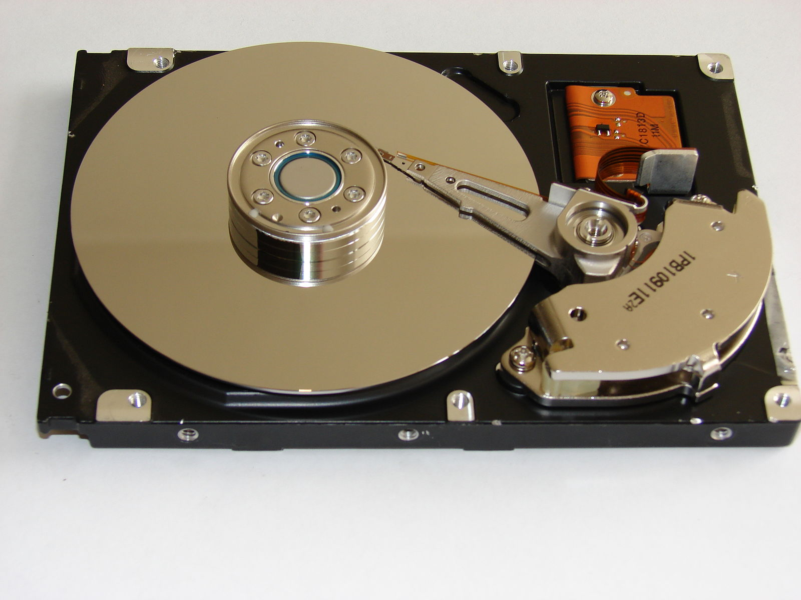

This article aims to explain what [Arithmetic Logic Unit (ALU)](https://en.wikipedia.org/wiki/Arithmetic_logic_unit), [Central Processing Unit (CPU)](https://en.wikipedia.org/wiki/Central_processing_unit), [Random Access Memory (RAM)](https://en.wikipedia.org/wiki/Random-access_memory), [Read-Only Memory (ROM)](https://en.wikipedia.org/wiki/Read-only_memory) and the [hard disk](https://en.wikipedia.org/wiki/Hard_disk_drive) are, in a very simple manner. If you have heard some of these terms before and you don't really understand what they are, then you are in luck. This article is for you.

These are the electrical circuits that many of the electronic devices we use daily have, but we rarely know what they do, let alone how they work.

The story starts with tiny cables that carry electricity. It has two states it can be in, either there is electricity on a wire, or there is not. We can call these states on/off, 1/0, white/black, yes/no or James/Emma. What we call them doesn't matter, not actually, but they are more commonly called 1/0. Each 1 or 0 is called a "bit".

Now, a bit can hold literally a single information, it can be an answer to a yes/no question. Think of it as a sign on your hand, with 2 sides, on one side there is "yes", on the other side there is "no". For example, if somebody asks you "have you eaten lunch?", you can answer with a bit. If you have eaten your lunch, you can show the side with 1, if you haven't, you can show 0. In this case, you got away with your tiny bit.

But what if you are being asked something else, like your name? You have a single bit, how are you going to answer the question?

Here comes the concept of "byte". A byte is 8 bits (0's or 1's) stuck together. As a bit can either be 1 or 0, there is 2⁸ possible information it can hold! Thankfully somebody encoded the alphabeth already, so each letter has a byte representing it. And your parents wrote down the bytes that encode your name to a paper and you always carry it in your pocket. This has been your name since the day you were born, your manufacturers have given it to you.

Now, what if you were asked how many calories you would get from 3 fried eggs. Gosh, now you have to take the calorie of one single egg, multiply it by 3, keep the result of the multiplication and add the calories of the oil, keep the final result somewhere. It just became really cumbersome, right?

### ALU and CPU

**Arithmetic Logic Unit (ALU)**

There are tiny circuits made from basic logic gates that do certain operations. Simplified version: You have input wires, and you have an output wire. These circuits are wires that are connected in such ways that they create a certain output. With the same inputs they always create the same output, they are consistent and reliable. All the basic operations (the building blocks of bigger operations) have their own circuit. If we go back to the fired eggs example, there is addition and there is multiplication, and these are the simple operations that will lead you to your final answer.

If you combine all the wires that do basic arithmetic operations that a computer can do on a single chip, it becomes an [Arithmetic Logic Unit](https://en.wikipedia.org/wiki/Arithmetic_logic_unit). Now you can combine simple operations to find answers to life's complicated problems.

_This is how the circuitry of a simple four-bit ALU looks like on logic gate level. Don't be scared, some very cool people are working on this stuff and making sure everything works just fine._

_Image Credit: CC BY-SA 3.0, https://commons.wikimedia.org/w/index.php?curid=168473_

**Central Processing Unit (CPU)**

CPU is the part that executes instructions of a program.

CPU has 3 important parts:

1. ALU that does the arithmetic and logic operations
2. Control Unit
3. Registers

We have talked about ALU, but what the heck are other two? Well, the control unit is the part that says, "multiply this with that and than add this to the result of that". Which means it controls which operations are going to be done in which order.

Registers are byte sized memory cells, which contain the results of different operations. Back to the fried egg example, you need to multiply the calories of a single egg with 3, then add the calorie of the oil to get to the final amount of calories. To do that, you need to store the result of the multiplication first, so you dump that value to a register, and for the final addition you take that value as an input.

Now, if you have ever bought a laptop by yourself in the last 5 years, you have probably seen 2/4/6/8-core processors. Processor is the name of the chip that is responsible for executing instructions, but it can contain multiple CPU's, that are called "cores". So If you are working with a 6-core processor, this means your processor has 6 CPU's, which means you can calculate the calorie amounts of 6 dishes at the same time.

_This is what a real life CPU looks like when it is removed from the motherboard (right side). The socket is on the left side._

_Image Credit: https://en.wikipedia.org/wiki/Central_processing_unit#/media/File:Laptop-intel-core2duo-t5500.jpg_

### Computer Memory Basics

Let's define RAM, ROM and hard disc first, and then talk about why we need all these different ways of keeping data.

**Random Access Memory (RAM)**

Random Access Memory is basically a collection of registers. It is also called by other names, such as "read write memory", or "primary memory". When we are running a program, CPU requires certain data to run it properly and this is where that data is kept. It is volatile (temporary), meaning the data will get lost when the power is off.

_This is what a real life RAM looks like._

_Image Credit: By An-d - Own work, CC BY-SA 3.0, https://commons.wikimedia.org/w/index.php?curid=27224495_

**Read-Only Memory (ROM)**

ROM stores crucial information that is essential for the computer to work properly, such as a program essential to boot the computer. It is nonvolatile (permanent), meaning the data kept in ROM is not lost when the power source is gone. The data ROM holds is either unchangable or requires a special operation to change.

**Hard disk**

Hard disks were invented around 1950's and their working principles are very similar to a casette tape. Both use the same magnetic recording techniques to store and retrieve digital data, as well as other older technologies such as CDs, VCRs, floppy disks.

Let's start with a cassette tape and then compare it to hard disks.

If you look inside a casette tape, you'll see a very simple device. There is a looong piece of tape (in fact, for a recording that's 90 minutes long, the tape is 443 feet -135 meters- long), there are 2 rollers that help you roll that long tape, two halves of plastic outer shell to keep everything together, and a small felt pad that acts as a backstop for the playback head.

_If you're fairly new to earth, here is what a casette tape looks like. Also, go check out the birds, they are very cool. Image Credit: CC BY-SA 3.0, https://commons.wikimedia.org/w/index.php?curid=256864_

Now, this long tape is actually a thin plastic coated with ferric oxide (Fe₂O₃) powder that was mixed with a binder for it to attach to the plastic base. (Yes it is like iron oxide, but still a different material, as iron oxide is FeO.) Ferric oxide is a ferromagnetic material, if you expose it to a magnetic field it will be permanently magnetized by the magnetic field. Still, you can erase the tape, or make a recording top of it, so it is pretty much reusable. To record an audio, you use something called "a tape recorder" which basically has a very tiny, rounded electromagnet that applies magnetic flux to the ferrix oxide on the tape. It also has an iron core wrapped with a wire, and this is where the audio signal is sent to create the magnetic field. And when you are playing a recorded tape, the motion of the tape creates a varying magnetic field that becomes a signal in the coil, and this signal is amplified for the speakers.

Now we can go back to the hard disk. In a hard disk, the material used for the magnetic recording is not a plastic tape, but an aluminum or glass disk. The information encoded in a hard disk takes a much smaller space when compared to a casette tape, this allows to store a lot more information in a smaller space. The read/write head of the hard disk never touches the disk (in a cassette, the head touches the tape directly), but mainly flies over it, and it moves way faster. Moreover, the aluminum/glass disk stands on top of a platter that can spin, so the information can be accessed a lot faster.

_This is a hard disk with its cover removed._

_Image Credit: https://commons.wikimedia.org/wiki/File:01b-hard-drive-cover-removed.JPG_

_**Important Note: Don't do this to your working hard disks, removing their cover destroys them.** If you already have one that's broken and not working, you can go for it._

### How everything works together

Now that we know what these things are and what they are responsible for, let's try to understand how they work together.

You need your CPU to do the simple tasks you need. In order to do that, CPU needs to use some memory, but it if it constantly reached out to permenant storage for every bit of information, it would be a slow process. So to make it faster, people who designed computers made temporary storage areas like RAM, and caches. They are positioned closer to the CPU and it is faster to retrieve information from them.

_This is a memory pyramid diagram. The higher it you go in the pyramid, the smaller the amount of data you can keep. For example, CPU Register is the smallest, and Level 1 of the cache is smaller than the Level 2. And many computers today have a Level 3 cache, which is bigger than Level 2._

_Image Credit: Jeff Tyson "How Computer Memory Works" 23 August 2000. HowStuffWorks.com. <https://computer.howstuffworks.com/computer-memory.htm>_

1. You turn your computer on.
2. After you turn your computer on, the computer loads data from ROM, and tests all the major components of the computer to determine if they are working properly.
3. The computer loads the basic input/output system (BIOS) from ROM. This system performs the low-level routines of different hardwares (keyboard, screen, ports, hard disks, etc.), which means it kind of makes them ready to perform their jobs.
4. The computer loads operating system (OS) from the hard drive into the RAM. As long as the computer is on, critical functions of the operating system stay copied in the RAM, so that CPU will have fast access to those.
5. When any application is opened, the essential parts of it are also copied to RAM. Non essential features are loaded when they are needed. (As you might be using some features of a software but not others, and RAM is a limited resource.)
6. When you save the file you're working on, and close the application, the file is written to the specified storage device. Also, as the application is no longer in use, it is purged from RAM. (Again, RAM is a limited resource, so it must make room for the new data.)
7. Every time a file is loaded or an application is opened, the essential parts of it are copied into RAM. RAM is the temporary memory that is always in touch with CPU. When CPU needs something, it first checks level 1 cache, if it's not there, it checks level 2 cache, after that level 3 cache, and if it's not in the cache, it checks RAM. If an application is working with a file, it also is copied to RAM, then after CPU works on it and makes the changes the user wants, it is re-written to RAM. Shuffling data between CPU and RAM can happen million times in a second!
8. If data gets purged from RAM before it is encoded in a permanent storage (like a hard disk), it will get lost, as nothing in RAM is permanent.

### Why we need so many types of memory systems working together

### Comparison: Human Memory vs. Computer Memory

**Resources:**

1. Wikipedia - [Hard disk](https://en.wikipedia.org/wiki/Hard_disk_drive), [Casette Tape](https://en.wikipedia.org/wiki/Cassette_tape), [RAM](https://en.wikipedia.org/wiki/Random-access_memory), [ROM](https://en.wikipedia.org/wiki/Read-only_memory), [CPU](https://en.wikipedia.org/wiki/Central_processing_unit), [ALU](https://en.wikipedia.org/wiki/Arithmetic_logic_unit)
2. "But How Do It Know" by [J. Clark Scott](http://www.buthowdoitknow.com/index.html)
3. Jeff Tyson "How Computer Memory Works",
   HowStuffWorks.com. <https://computer.howstuffworks.com/computer-memory.htm>
4. "From Nand to Tetris" Part1 & Part2 by [Hebrew University of Jerusalem](https://www.nand2tetris.org/)
