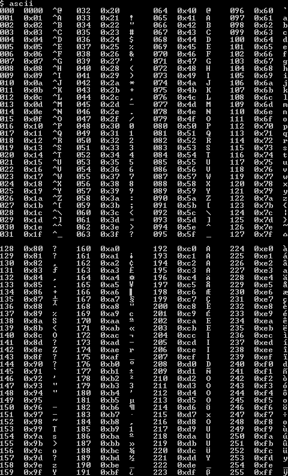

**How ASCII was born**

Every data inside a computer has to be kept as 0's and 1's. And when I say everything, it means everything, from the numbers, symbols, and letters to the images and sounds. Everything inside a computer is 1's and 0's.

When the digital computer was first invented (1945, [ENIAC](https://en.wikipedia.org/wiki/ENIAC)), computer scientists inventing these computers mainly spoke
English, so they were only interested in representing the English letters, symbols, and numbers.

They used 8 bits to represent all the characters in written language. Earlier computers worked by grouping 8 bits, which is also known as a byte. This could hold 256 possible combinations of 1's and 0's, and each of these combinations could be assigned to a unique character. This first system to represent characters is called **[ASCII (American Standard Code for Information Interchange)](https://en.wikipedia.org/wiki/ASCII).** ASCII only used the first 128 of these possible combinations and there were 128 bits left to use, and this provided space for other letters or symbols from other languages.

These modifiable 128 bits was called **[the extended ASCII character set](https://en.wikipedia.org/wiki/Extended_ASCII).** This became a problem, as different organizations such as HP, Adobe, Apple, Microsoft, etc, were all using this extended character set to do their own thing. The same binary code meant different things in different platforms, and sharing data between these platforms became a problem.

This is an example extended ASCII table:

**How Unicode was born**

When the [world wide web](https://en.wikipedia.org/wiki/World_Wide_Web) came along (around the 1990s), computers actively started to share data. To parse the data correctly, computers needed to support all these conflicting character sets from different platforms. And if they didn't, the data could be corrupted when it was shared. Of course, nobody wanted that.

In 1991, the **Unicode Consortium** published the **Unicode standard.** Members of this consortium include many major organizations like Apple, Microsoft, Adobe, Google, IBM, Netflix, Facebook, and more. So basically, people representing all these platforms with extended character sets came together and decided that they would create a single system that everybody was going to use.

The main aim of the Unicode Consortium was to create a single, unified, standard character set in which every possible character was represented by a unique number, no matter what platform/device/application was using it. Unicode also had to have backward compatibility with ASCII (because everything until this point used ASCII, converting all the data would be cumbersome for everybody), and it also had to be space efficient.

Now, why is space efficiency important? A capital letter K is represented in 8 bits in ASCII, so if you describe it in 32 bits, the letter K would take up 4 times more space in memory than it previously did (even if you kept the old ASCII binary code, it would have a lot of unnecessary 0's at the beginning of it, and even if everything is 0's, you are going to store it), it would take 4 times more space when saved to disk, and 4 times longer to move from one place to another. Also, many of the existing computer systems recognized a string of 8 bits as a signal that there is no more data on the way, so if more bytes were used to represent the symbols, computers would get confused when interpreting the streams of characters. This was why the **[Unicode Transformation Format (UTF-8)](https://en.wikipedia.org/wiki/UTF-8)** was created. Instead of encoding each character with the same number of bits, UTF-8 allowed the usage of 1,2,3 or 4 bytes depending on the character. Old style ASCII characters still use the same set of 8 bits (backward compatibility, check). The binary codes that belong to these characters start with a 0, and this is an indicator to the software that is processing it, it means this is a character with only 8 bits. By convention, a Unicode value is written with 4 hexadecimal digits with a capital U and a plus sign at the start (A is U+0041).

The characters in Arabic Hebrew and most European languages are encoded with 2 bytes. The first byte of these two bytes begins with the control bits 110, a flag that says the character is encoded with 2 bytes. The second byte of this 2-byte character begins with the control bits 10, indicating that this byte is a continuation and it's encoding for the same character.

3-byte characters include characters for almost all modern languages, which is called the [Basic Multilingual Plane (BMP)](<https://en.wikipedia.org/wiki/Plane_(Unicode)#Basic_Multilingual_Plane>). Most of the assigned code points in the BMP are used to encode Chinese, Japanese, and Korean (CJK) characters. For a 3 byte character, the first byte begins with the control bits 1110, the second one 10, the third one 10.

Unicode is universally supported by all operating systems, search engines, browsers, laptops, smartphones, and the world wide web. It is great to have standards!

**Resources:**

1. Unicode Official Webpage - https://home.unicode.org/
2. Wikipedia - [ASCII (American Standard Code for Information Interchange)](https://en.wikipedia.org/wiki/ASCII), [The extended ASCII character set](https://en.wikipedia.org/wiki/Extended_ASCII), [Unicode Transformation Format (UTF-8)](https://en.wikipedia.org/wiki/UTF-8), [world wide web](https://en.wikipedia.org/wiki/World_Wide_Web), [Unicode](https://en.wikipedia.org/wiki/Unicode)
3. "Computer Science" channel by [Kevin Drumm](https://www.youtube.com/c/KevinDrumm/videos)
4. "But How Do It Know" by [J. Clark Scott](http://www.buthowdoitknow.com/index.html)
